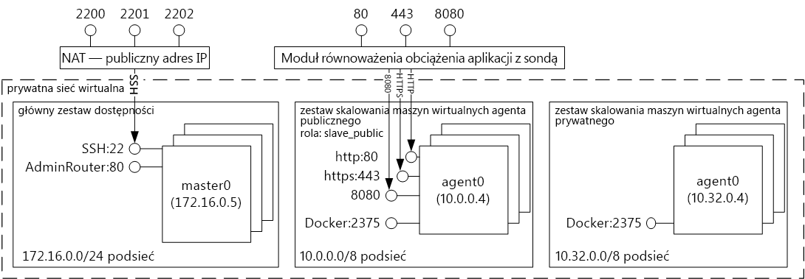
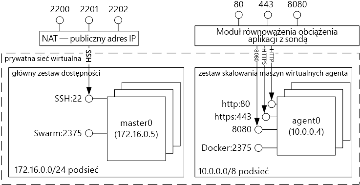

# Wprowadzenie do rozwiązań hostingu kontenera przy użyciu usługi Azure Container Service 
Usługa Azure Container Service upraszcza tworzenie, konfigurację i zarządzanie klastrem maszyn wirtualnych, które są wstępnie skonfigurowane do uruchamiania konteneryzowanych aplikacji. Używa ona zoptymalizowanej konfiguracji popularnych narzędzi do planowania i aranżacji typu open source. Umożliwia to używanie posiadanych umiejętności lub sięganie po duży i rosnący zasób wiedzy społeczności w celu wdrażania opartych na kontenerze aplikacji platformy Microsoft Azure i zarządzania nimi.

Usługa Azure Container Service korzysta z formatu kontenera Docker do zapewnienia, że kontenery Twojej aplikacji są w pełni przenośne. Obsługuje ona również wybrany koordynator Marathon i DC/OS, Docker Swarm lub Kubernetes, dzięki czemu możesz skalować te aplikacje do tysięcy, a nawet dziesiątków tysięcy kontenerów.

Za pomocą usługi Azure Container Service możesz korzystać z funkcji klasy korporacyjnej platformy Azure, zachowując jednocześnie przenośność aplikacji — w tym przenośność w warstwach aranżacji.

## Korzystanie z usługi Azure Container Service
Za pomocą usługi Azure Container Service chcemy zapewnić środowisko hostingu kontenerów za pomocą narzędzi i technologii typu open source, które już dziś są popularne wśród naszych klientów. W tym celu możemy uwidocznić standardowe punkty końcowe interfejsu API dla wybranego koordynatora (DC/OS, Docker Swarm lub Kubernetes). Za pomocą tych punktów końcowych można wykorzystać dowolne oprogramowanie, które jest w stanie komunikować się z tymi punktami końcowymi. Na przykład w przypadku punktu końcowego Docker Swarm można użyć interfejsu wiersza polecenia (CLI) platformy Docker. Dla platformy DC/OS można wybrać interfejs wiersza polecenia DCOS. W przypadku rozwiązania Kubernetes można wybrać narzędzie `kubectl`.

## Tworzenie klastra platformy Docker za pomocą usługi Azure Container Service
Aby rozpocząć korzystanie z usługi Azure Container Service, musisz wdrożyć klaster usługi Azure Container Service za pośrednictwem portalu (wyszukaj w witrynie Marketplace termin **Azure Container Service**) przy użyciu szablonu usługi Azure Resource Manager ([Docker Swarm](https://github.com/Azure/azure-quickstart-templates/tree/master/101-acs-swarm), [DC/OS](https://github.com/Azure/azure-quickstart-templates/tree/master/101-acs-dcos) lub [Kubernetes](https://github.com/Azure/azure-quickstart-templates/tree/master/101-acs-kubernetes)) albo za pomocą [interfejsu wiersza polecenia platformy Azure w wersji 2.0](container-service-create-acs-cluster-cli.md). Udostępnione szablony szybkiego startu można modyfikować w celu włączenia dodatkowej lub zaawansowanej konfiguracji platformy Azure. Aby uzyskać więcej informacji, zobacz [Wdrażanie klastra usługi Azure Container Service](container-service-deployment.md).

## Wdrażanie aplikacji
Usługa Azure Container Service umożliwia wybranie do aranżacji koordynatora Docker Swarm, DC/OS lub Kubernetes. Sposób wdrażania aplikacji zależy od wybranego programu koordynatora.

### Za pomocą koordynatora DC/OS
Koordynator DC/OS to rozproszony system operacyjny oparty na jądrze systemów rozproszonych Apache Mesos. System Apache Mesos jest przechowywany w Apache Software Foundation, a wśród użytkowników i współautorów wymienia niektóre z [największych firm w branży IT](http://mesos.apache.org/documentation/latest/powered-by-mesos/).

Systemy DC/OS i Apache Mesos zawierają imponujący zestaw funkcji:

* Sprawdzoną skalowalność
* Zreplikowane przy użyciu usługi Apache ZooKeeper odporne na uszkodzenia elementy główne i podrzędne
* Obsługę kontenerów w formacie aparatu Docker
* Natywną izolację między zadaniami przy użyciu kontenerów systemu Linux
* Planowanie wielu zasobów (pamięci, procesora CPU, dysku i portów)
* Interfejsy API języka Java, Python i C++ do tworzenia nowych aplikacji równoległych
* Interfejs użytkownika sieci Web do wyświetlania stanu klastra

Domyślnie koordynator DC/OS działający w usłudze Azure Container Service zawiera platformę koordynacji Marathon do planowania obciążeń. Jednak do wdrożenia usługi ACS koordynatora DC/OS jest dołączone uniwersum mezosfery usług, które można dodać do swojej usługi. Należą do nich usługi Spark, Hadoop, Cassandra i wiele więcej.

#### Przy użyciu platformy Marathon
Platforma Marathon to obejmujący cały klaster system inicjowania i kontroli dla usług w cgroup — lub, w przypadku usługi Azure Container Service, kontenerów w formacie aparatu Docker. Platforma Marathon udostępnia interfejs sieci Web, z którego można wdrażać aplikacje. Możesz uzyskać do niej dostęp pod adresem URL, który wygląda podobnie do `http://DNS_PREFIX.REGION.cloudapp.azure.com`, gdzie DNS\_PREFIX i REGION są definiowane w czasie wdrażania. Oczywiście można również podać własną nazwę DNS. Aby uzyskać więcej informacji na temat uruchamiania kontenera za pomocą interfejsu użytkownika sieci Web platformy Marathon, zobacz [DC/OS container management through the Marathon web UI](container-service-mesos-marathon-ui.md) (Zarządzanie kontenerem DC/OS za pomocą interfejsu użytkownika sieci Web platformy Marathon).

Do komunikowania się z platformą Marathon możesz też użyć interfejsów API REST. Istnieje wiele bibliotek klienckich, które są dostępne dla każdego narzędzia. Obejmują one różne języki — i w dowolnym języku możesz oczywiście użyć protokołu HTTP. Ponadto wiele popularnych narzędzi DevOps zapewnia obsługę platformy Marathon. Daje to zespołowi operacyjnemu maksymalną elastyczność podczas pracy z klastrem usługi Azure Container Service. Aby uzyskać więcej informacji na temat uruchamiania kontenera za pomocą interfejsu API REST platformy Marathon, zobacz [DC/OS container management through the Marathon REST API](container-service-mesos-marathon-rest.md) (Zarządzanie kontenerem DC/OS za pomocą interfejsu API REST platformy Marathon).

### Korzystanie z koordynatora Docker Swarm
Koordynator Docker Swarm zapewnia natywne klastrowanie dla platformy Docker. Ponieważ koordynator Docker Swarm obsługuje standardowy interfejs API Docker, dowolne narzędzie, które już komunikuje się z demonem Docker, może użyć koordynatora Swarm do niewidocznego skalowania na wielu hostach w usłudze Azure Container Service.

[!INCLUDE [container-service-swarm-mode-note](../../../includes/container-service-swarm-mode-note.md)]

Do narzędzi do zarządzania kontenerami w klastrze Swarm należą, między innymi, następujące narzędzia:

* Dokku
* Interfejs CLI platformy Docker i narzędzie Docker Compose
* Krane
* Jenkins

### Korzystanie z rozwiązania Kubernetes
Kubernetes to popularne narzędzie koordynatora kontenera na poziomie produkcji typu open source. Narzędzie Kubernetes automatyzuje proces wdrażania i skalowania aplikacji konteneryzowanych oraz zarządzania nimi. Ponieważ jest to rozwiązanie typu „open source” rozwijane przez społeczność związaną z technologiami tego rodzaju, działa ono bezproblemowo w usłudze Azure Container Service i może służyć do wdrażania kontenerów w odpowiedniej skali w usłudze Azure Container Service.

Narzędzie to obejmuje bogaty zestaw funkcji, m.in.:
* skalowanie w poziomie,
* odnajdywanie usług i równoważenie obciążenia,
* klucze tajne i zarządzanie konfiguracją,
* oparte na interfejsie API zautomatyzowane wprowadzanie i wycofywanie zmian,
* mechanizm samonaprawiania

## Filmy wideo
Wprowadzenie do korzystania z usługi Azure Container Service (podstawy):  

> [!VIDEO https://channel9.msdn.com/Shows/Azure-Friday/Azure-Container-Service-101/player]
>
>

Tworzenie aplikacji za pomocą usługi Azure Container Service (kompilacja 2016)

> [!VIDEO https://channel9.msdn.com/Events/Build/2016/B822/player]
>
>

## Następne kroki

Wdrażanie klastra usługi kontenera przy użyciu [portalu](container-service-deployment.md) lub [interfejsu wiersza polecenia platformy Azure w wersji 2.0](container-service-create-acs-cluster-cli.md).
