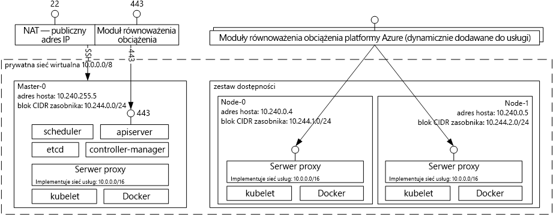

# Wprowadzenie do usługi Azure Container Service dla rozwiązania Kubernetes

[!INCLUDE [aks-preview-redirect.md](../../../includes/aks-preview-redirect.md)]

Usługa Azure Container Service dla rozwiązania Kubernetes upraszcza tworzenie i konfigurację klastra maszyn wirtualnych, które są wstępnie skonfigurowane do uruchamiania konteneryzowanych aplikacji, oraz zarządzanie nim. Umożliwia to używanie posiadanych umiejętności lub sięganie po duży i rosnący zasób wiedzy społeczności w celu wdrażania opartych na kontenerze aplikacji platformy Microsoft Azure i zarządzania nimi.

Za pomocą usługi Azure Container Service możesz korzystać z funkcji klasy korporacyjnej platformy Azure, zachowując jednocześnie przenośność aplikacji dzięki usłudze Kubernetes i formatowi obrazów Docker.

## Używanie usługi Azure Container Service ma potrzeby rozwiązania Kubernetes
Za pomocą usługi Azure Container Service chcemy zapewnić środowisko hostingu kontenerów za pomocą narzędzi i technologii typu open source, które już dziś są popularne wśród naszych klientów. W tym celu uwidaczniamy standardowe punkty końcowe interfejsu API rozwiązania Kubernetes. Za pomocą tych standardowych punktów końcowych można wykorzystać dowolne oprogramowanie, które jest w stanie komunikować się z klastrem usługi Kubernetes. Możesz wybrać narzędzie [kubectl](https://kubernetes.io/docs/user-guide/kubectl-overview/), [helm](https://helm.sh/) lub [draft](https://github.com/Azure/draft).

## Tworzenie klastra Kubernetes przy użyciu usługi Azure Container Service
Aby rozpocząć korzystanie z usługi Azure Container Service, musisz wdrożyć klaster usługi Azure Container Service przy użyciu [interfejsu wiersza polecenia platformy Azure 2.0](container-service-kubernetes-walkthrough.md) lub za pośrednictwem portalu (wyszukaj w witrynie Marketplace termin **Azure Container Service**). Jeśli jesteś użytkownikiem zaawansowanym, który musi mieć większą kontrolę nad szablonami usługi Azure Resource Manager, możesz użyć projektu [acs-engine](https://github.com/Azure/acs-engine) typu open source do kompilowania własnego niestandardowego klastra Kubernetes i wdrażania go za pomocą interfejsu wiersza polecenia `az`.

### Korzystanie z rozwiązania Kubernetes
Narzędzie Kubernetes automatyzuje proces wdrażania i skalowania aplikacji konteneryzowanych oraz zarządzania nimi. Narzędzie to obejmuje bogaty zestaw funkcji, m.in.:
* automatyczne pakowanie pudełek,
* mechanizm samonaprawiania
* skalowanie w poziomie,
* odnajdywanie usług i równoważenie obciążenia,
* zautomatyzowane wprowadzanie i wycofywanie zmian,
* zarządzanie kluczami tajnymi i konfiguracją,
* aranżacja magazynu,
* wykonywanie partii zadań.

Diagram architektury rozwiązania Kubernetes wdrażanej za pomocą usługi Azure Container Service:

## Filmy wideo

Obsługa klastra Kubernetes w usłudze Azure Container Service (Azure Friday, styczeń 2017 r.):

> [!VIDEO https://channel9.msdn.com/Shows/Azure-Friday/Kubernetes-Support-in-Azure-Container-Services/player]
>
>

Narzędzia do tworzenia i wdrażania aplikacji w systemie Kubernetes (Azure OpenDev, czerwiec 2017 r.):

> [!VIDEO https://channel9.msdn.com/Events/AzureOpenDev/June2017/Tools-for-Developing-and-Deploying-Applications-on-Kubernetes/player]
>
>

## Następne kroki

Zapoznaj się z [przewodnikiem Szybki start dotyczącym rozwiązania Kubernetes](container-service-kubernetes-walkthrough.md), aby rozpocząć eksplorowanie usługi Azure Container Service już dziś.