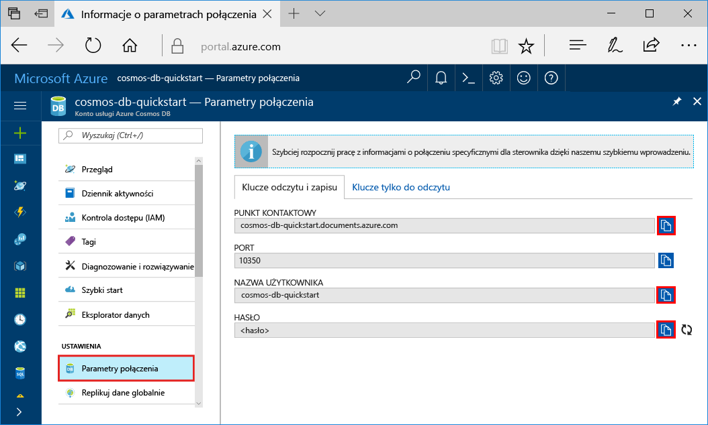
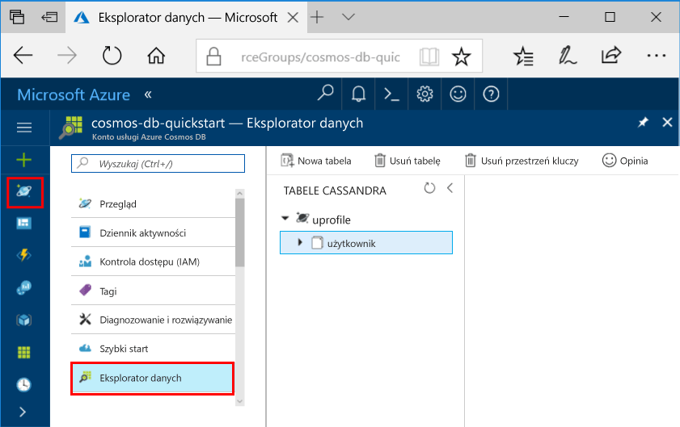

# <a name="quickstart-build-a-cassandra-app-with-python-and-azure-cosmos-db"></a>Szybki Start: Tworzenie aplikacji Cassandra Python i Azure rozwiązania Cosmos bazy danych

Ta opcja szybkiego startu przedstawia sposób użycia języka Python i usłudze Azure DB rozwiązania Cosmos [Cassandra API](cassandra-introduction.md) do tworzenia aplikacji profil w klonowania przykład z usługi GitHub. Ta opcja szybkiego startu również przeprowadzi Cię przez tworzenie konta bazy danych rozwiązania Cosmos Azure przy użyciu portalu Azure opartej na sieci web.

Azure DB rozwiązania Cosmos jest usługa globalnie rozproszone wielu modelu bazy danych firmy Microsoft. Można szybko tworzyć i kwerend dokumentu, tabeli, klucz wartość i baz danych wykresu, które korzystają z globalnego dystrybucji i skalowanie w poziomie możliwości fundament bazy danych Azure rozwiązania Cosmos.   

## <a name="prerequisites"></a>Wymagania wstępne

[!INCLUDE [quickstarts-free-trial-note](../../includes/quickstarts-free-trial-note.md)]Można też [bezpłatnie spróbuj Azure DB rozwiązania Cosmos](https://azure.microsoft.com/try/cosmosdb/) bez subskrypcji platformy Azure, bez opłat ani zobowiązań.

Dostęp do interfejsu API Azure rozwiązania Cosmos DB Cassandra program w wersji zapoznawczej. Jeśli nie zostały zastosowane do dostępu jeszcze [Zamów teraz](cassandra-introduction.md#sign-up-now).

Ponadto:
* [Python](https://www.python.org/downloads/) v2.7.14 wersji
* [Git](http://git-scm.com/)
* [Sterownik Python Apache Cassandra](https://github.com/datastax/python-driver)

## <a name="create-a-database-account"></a>Tworzenie konta bazy danych

Przed utworzeniem bazy danych dokumentów, musisz utworzyć konto Cassandra z bazy danych Azure rozwiązania Cosmos.

[!INCLUDE [cosmos-db-create-dbaccount-cassandra](../../includes/cosmos-db-create-dbaccount-cassandra.md)]

## <a name="clone-the-sample-application"></a>Klonowanie przykładowej aplikacji

Teraz załóżmy aplikacji w klonowania Cassandra API z serwisu github, Ustaw ciąg połączenia i uruchom go. Zobaczysz, jak łatwo jest pracować programowo z danymi. 

1. Otwórz okno terminala git, np. git bash i użyj `cd` polecenie, aby przejść do folderu instalacji aplikacji przykładowej. 

    ```bash
    cd "C:\git-samples"
    ```

2. Uruchom następujące polecenie w celu sklonowania przykładowego repozytorium. To polecenie tworzy kopię przykładowej aplikacji na komputerze. 

    ```bash
    git clone https://github.com/Azure-Samples/azure-cosmos-db-cassandra-python-getting-started.git
    ```

## <a name="review-the-code"></a>Przeglądanie kodu

Ten krok jest opcjonalny. Jeśli chcesz się dowiedzieć, jak zasoby bazy danych są tworzone w kodzie, można przejrzeć poniższe fragmenty kodu. Fragmenty kodu są pobierane z `pyquickstart.py` pliku. W przeciwnym razie możesz przejść od razu do [zaktualizować parametry połączenia](#update-your-connection-string). 

* Nazwa użytkownika i hasła jest ustawiona, za pomocą strony ciągu połączenia w portalu Azure. Zastąp path\to\cert ze ścieżką do X509 Twojego certyfikatu.

   ```python
    ssl_opts = {
            'ca_certs': 'path\to\cert',
            'ssl_version': ssl.PROTOCOL_TLSv1_2
            }
    auth_provider = PlainTextAuthProvider( username=cfg.config['username'], password=cfg.config['password'])
    cluster = Cluster([cfg.config['contactPoint']], port = cfg.config['port'], auth_provider=auth_provider, ssl_options=ssl_opts)
    session = cluster.connect()
   
   ```

* `cluster` Jest inicjowany z contactPoint informacji. ContactPoint są pobierane z portalu Azure.

    ```python
   cluster = Cluster([cfg.config['contactPoint']], port = cfg.config['port'], auth_provider=auth_provider)
    ```

* `cluster` Łączy do interfejsu API Azure rozwiązania Cosmos DB Cassandra.

    ```python
    session = cluster.connect()
    ```

* Tworzony jest nowy przestrzeni kluczy.

    ```python
   session.execute('CREATE KEYSPACE IF NOT EXISTS uprofile WITH replication = {\'class\': \'NetworkTopologyStrategy\', \'datacenter1\' : \'1\' }')
    ```

* Nowa tabela została utworzona.

   ```
   session.execute('CREATE TABLE IF NOT EXISTS uprofile.user (user_id int PRIMARY KEY, user_name text, user_bcity text)');
   ```

* Dodaje się klucza i wartości jednostki.

    ```Python
    insert_data = session.prepare("INSERT INTO  uprofile.user  (user_id, user_name , user_bcity) VALUES (?,?,?)")
    batch = BatchStatement()
    batch.add(insert_data, (1, 'LyubovK', 'Dubai'))
    batch.add(insert_data, (2, 'JiriK', 'Toronto'))
    batch.add(insert_data, (3, 'IvanH', 'Mumbai'))
    batch.add(insert_data, (4, 'YuliaT', 'Seattle'))
    ....
    session.execute(batch)
    ```

* Zapytanie, aby uzyskać Pobierz wszystkie wartości klucza.

    ```Python
    rows = session.execute('SELECT * FROM uprofile.user')
    ```  
    
* Zapytanie, aby uzyskać klucz wartość.

    ```Python
    
    rows = session.execute('SELECT * FROM uprofile.user where user_id=1')
    ```  

## <a name="update-your-connection-string"></a>Aktualizowanie parametrów połączenia

Teraz wróć do witryny Azure Portal, aby uzyskać informacje o parametrach połączenia i skopiować je do aplikacji. Dzięki temu aplikacja do komunikacji z bazą danych hostowanej.

1. W [portalu Azure](http://portal.azure.com/), kliknij przycisk **ciąg połączenia**. 

    Użyj  przycisk po prawej stronie ekranu, aby skopiować wartość górnego punktu kontaktu.

    

2. Otwórz plik `config.py`. 

3. Wklej wartość punktu kontaktu z portalu za pośrednictwem `<FILLME>` w wierszu 10.

    Teraz powinien wyglądać podobnie do wiersza 10 

    `'contactPoint': 'cosmos-db-quickstarts.documents.azure.com:10350'`

4. Skopiuj wartości nazwy użytkownika z portalu i wklej go za pośrednictwem `<FILLME>` w wierszu 6.

    Wiersz 6 powinna wyglądać podobnie do 

    `'username': 'cosmos-db-quickstart',`
    
5. Skopiuj wartość HASŁA z portalu i wklej go za pośrednictwem `<FILLME>` w wierszu 8.

    Wiersz 8 powinna wyglądać podobnie do

    `'password' = '2Ggkr662ifxz2Mg==`';`

6. Zapisz plik config.py.
    
## <a name="use-the-x509-certificate"></a>Użyj X509 certyfikatu

1. Jeśli konieczne jest dodanie Baltimore CyberTrust Root, ma numer seryjny 02:00:00:b9 i c d4🇩🇪20:d0:5e:66:fc:53:fe:1a:50:88:2 odcisk palca SHA1: 78:db:28:52:ca:e4:74. Można go pobrać z https://cacert.omniroot.com/bc2025.crt zapisywane w lokalnym pliku z rozszerzeniem cer

2. Otwórz pyquickstart.py i zmień "path\to\cert" aby wskazywały nowy certyfikat.

3. Zapisz pyquickstart.py.

## <a name="run-the-app"></a>Uruchomienie aplikacji

1. Należy użyć polecenia cd w terminalu git, aby zmienić do folderu azure-cosmos-db-cassandra-python-getting-started. 

2. Uruchom następujące polecenia, aby zainstalować wymagane moduły:

    ```python
    python -m pip install cassandra-driver
    python -m pip install prettytable
    python -m pip install requests
    python -m pip install pyopenssl
    ```

2. Uruchom następujące polecenie, aby uruchomić aplikację węzła:

    ```
    python pyquickstart.py
    ```

3. Sprawdź wyniki, zgodnie z oczekiwaniami w wierszu polecenia.

    Naciśnij klawisze CTRL + C, aby zatrzymać exection program i zamknąć okno konsoli. 

    
    
    Teraz możesz otworzyć Eksploratora danych w portalu Azure, aby wyświetlić zapytania, modyfikować i pracy z tym nowych danych. 

    

## <a name="review-slas-in-the-azure-portal"></a>Przeglądanie umów SLA w witrynie Azure Portal

[!INCLUDE [cosmosdb-tutorial-review-slas](../../includes/cosmos-db-tutorial-review-slas.md)]

## <a name="clean-up-resources"></a>Oczyszczanie zasobów

[!INCLUDE [cosmosdb-delete-resource-group](../../includes/cosmos-db-delete-resource-group.md)]

## <a name="next-steps"></a>Następne kroki

W tym przewodniku Szybki start wyjaśniono sposób tworzenia konta usługi Azure Cosmos DB, tworzenia kolekcji za pomocą Eksploratora danych i uruchamiania aplikacji. Teraz możesz zaimportować dodatkowe dane do swojego konta usługi Cosmos DB. 

> [!div class="nextstepaction"]
> [Importowanie danych Cassandra do bazy danych Azure rozwiązania Cosmos](cassandra-import-data.md)

