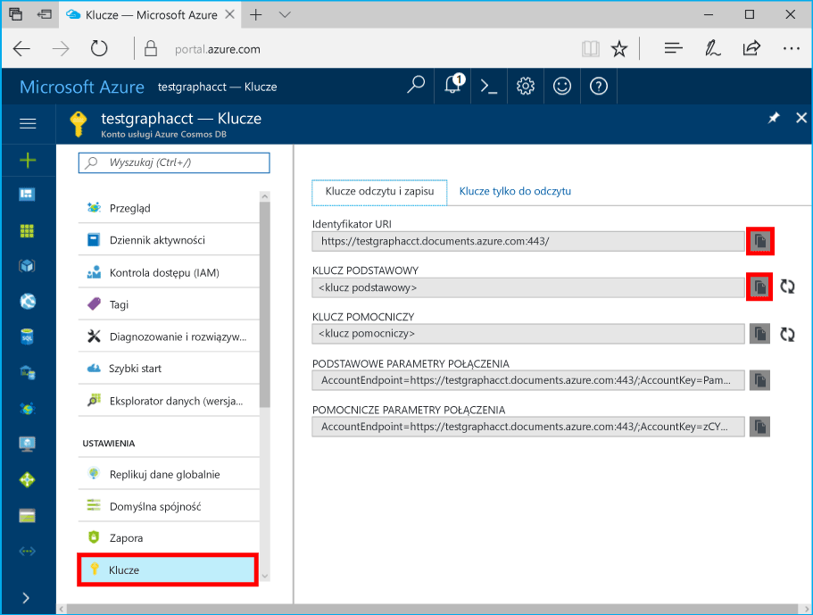

<a id="azure-cosmos-db-build-a-nodejs-application-by-using-graph-api" class="xliff"></a>

# Azure Cosmos DB: Tworzenie aplikacji Node.js za pomocą interfejsu API programu Graph

Azure Cosmos DB to rozproszona globalnie wielomodelowa usługa bazy danych firmy Microsoft. Dzięki wykorzystaniu dystrybucji globalnej i możliwości skalowania poziomego opartego na usłudze Azure Cosmos DB, można szybko tworzyć i za pomocą zapytań badać bazy danych dokumentów, par klucz/wartość i grafów. 

Ten artykuł Szybki start przedstawia sposób tworzenia konta usługi Azure Cosmos DB dla interfejsu API programu Graph (wersja zapoznawcza), bazy danych i grafu przy użyciu witryny Azure Portal. Następnie przy użyciu sterownika open source [Node.js Gremlin](https://www.npmjs.com/package/gremlin-secure) zostanie utworzona i uruchomiona aplikacja konsoli.  

> [!NOTE]
> Moduł npm `gremlin-secure` to zmodyfikowana wersja modułu `gremlin` z obsługą SSL i SASL wymaganych do łączenia się z bazą danych Azure Cosmos DB. Kod źródłowy jest dostępny w usłudze [GitHub](https://github.com/CosmosDB/gremlin-javascript).
>

<a id="prerequisites" class="xliff"></a>

## Wymagania wstępne

Przed uruchomieniem tego przykładu muszą być spełnione następujące wymagania wstępne:
* [Node.js](https://nodejs.org/en/) w wersji 0.10.29 lub nowszej
* [Git](http://git-scm.com/)

[!INCLUDE [quickstarts-free-trial-note](../../includes/quickstarts-free-trial-note.md)]

<a id="create-a-database-account" class="xliff"></a>

## Tworzenie konta bazy danych

[!INCLUDE [cosmos-db-create-dbaccount-graph](../../includes/cosmos-db-create-dbaccount-graph.md)]

<a id="add-a-graph" class="xliff"></a>

## Dodawanie grafu

[!INCLUDE [cosmos-db-create-graph](../../includes/cosmos-db-create-graph.md)]

<a id="clone-the-sample-application" class="xliff"></a>

## Klonowanie przykładowej aplikacji

Teraz sklonujemy aplikację interfejsu API programu Graph z repozytorium GitHub, ustawimy parametry połączenia i uruchomimy ją. Zobaczysz, jak łatwo jest pracować programowo z danymi. 

1. Otwórz okno terminala usługi Git, na przykład Git Bash, i za pomocą polecenia `cd` przejdź do katalogu roboczego.  

2. Uruchom następujące polecenie w celu sklonowania przykładowego repozytorium. 

    ```bash
    git clone https://github.com/Azure-Samples/azure-cosmos-db-graph-nodejs-getting-started.git
    ```

3. Otwórz plik rozwiązania w programie Visual Studio. 

<a id="review-the-code" class="xliff"></a>

## Przeglądanie kodu

Dokonajmy szybkiego przeglądu działań wykonywanych w aplikacji. Otwórz plik `app.js`, w którym znajdziesz następujące wiersze kodu. 

* Tworzenie klienta języka Gremlin.

    ```nodejs
    const client = Gremlin.createClient(
        443, 
        config.endpoint, 
        { 
            "session": false, 
            "ssl": true, 
            "user": `/dbs/${config.database}/colls/${config.collection}`,
            "password": config.primaryKey
        });
    ```

  Wszystkie konfiguracje są w pliku `config.js`, który będziemy edytować w następnej sekcji.

* Seria kroków języka Gremlin jest wykonywana przy użyciu metody `client.execute`.

    ```nodejs
    console.log('Running Count'); 
    client.execute("g.V().count()", { }, (err, results) => {
        if (err) return console.error(err);
        console.log(JSON.stringify(results));
        console.log();
    });
    ```

<a id="update-your-connection-string" class="xliff"></a>

## Aktualizowanie parametrów połączenia

Teraz wróć do witryny Azure Portal, aby uzyskać informacje o parametrach połączenia i skopiować je do aplikacji.

1. W witrynie [Azure Portal](http://portal.azure.com/), korzystając ze swojego konta usługi Azure Cosmos DB, kliknij w lewym menu nawigacyjnym pozycję **Klucze**, a następnie pozycję **Klucze odczytu i zapisu**. W następnym kroku, korzystając z przycisków kopiowania po prawej stronie, skopiujesz identyfikator URI i klucz podstawowy do pliku `app.js`.

    

2. Skopiuj wartość identyfikatora URI języka Gremlin z portalu (przy użyciu przycisku kopiowania) i przypisz ją do klucza `config.endpoint` w pliku config.js. Punkt końcowy Gremlin musi być samą nazwą hosta, bez protokołu/numeru portu, czyli powinien mieć postać `mygraphdb.graphs.azure.com` (a nie `https://mygraphdb.graphs.azure.com` lub `mygraphdb.graphs.azure.com:433`).

    `config.endpoint = "GRAPHENDPOINT";`

3. Skopiuj wartość klucza podstawowego z portalu i przypisz ją do klucza config.primaryKey w pliku config.js. Aplikacja została zaktualizowana i zawiera teraz wszystkie informacje potrzebne do nawiązania komunikacji z usługą Azure Cosmos DB. 

    `config.primaryKey = "PRIMARYKEY";`

4. Wprowadź nazwę bazy danych i nazwę grafu (kontenera) dla wartości parametrów config.database i config.collection. 

Oto przykład wypełnionego pliku config.js:

```nodejs
var config = {}

// Note that this must not have HTTPS or the port number
config.endpoint = "mygraphdb.graphs.azure.com";
config.primaryKey = "OjlhK6tjxfSXyKtrmCiM9O6gQQgu5DmgAoauzD1PdPIq1LZJmILTarHvrolyUYOB0whGQ4j21rdAFwoYep7Kkw==";
config.database = "graphdb"
config.collection = "Persons"

module.exports = config;
```

<a id="run-the-console-app" class="xliff"></a>

## Uruchamianie aplikacji konsolowej

1. Otwórz okno terminala i za pomocą polecenia `cd` przejdź do katalogu instalacyjnego pliku package.json uwzględnionego w projekcie.  

2. Uruchom polecenie `npm install`, aby zainstalować wymagane moduły npm, w tym `gremlin-secure`.

3. Uruchom polecenie `node app.js` w terminalu, aby uruchomić aplikację Node.

<a id="browse-with-data-explorer" class="xliff"></a>

## Przeglądanie w Eksploratorze danych

Teraz możesz wrócić do Eksploratora danych w witrynie Azure Portal, aby wyświetlać nowe dane grafu, wykonywać o nie zapytania, modyfikować je i pracować z nimi.

W Eksploratorze danych nowa baza danych jest wyświetlana w okienku **Kolekcje**. Rozwiń węzeł **graphdb** i **graphcoll**, a następnie kliknij pozycję **Graf**.

Dane wygenerowane przez przykładową aplikację zostaną wyświetlone w okienku **Grafy**.

<a id="review-slas-in-the-azure-portal" class="xliff"></a>

## Przeglądanie umów SLA w witrynie Azure Portal

[!INCLUDE [cosmosdb-tutorial-review-slas](../../includes/cosmos-db-tutorial-review-slas.md)]

<a id="clean-up-your-resources" class="xliff"></a>

## Czyszczenie zasobów

Jeśli nie planujesz dalszego korzystania z tej aplikacji, usuń wszystkie zasoby utworzone zgodnie z tym artykułem, wykonując następujące czynności: 

1. W menu nawigacji po lewej stronie w witrynie Azure Portal kliknij pozycję **Grupy zasobów**, a następnie kliknij nazwę utworzonego zasobu. 
2. Na stronie grupy zasobów kliknij pozycję **Usuń**, wpisz nazwę zasobu do usunięcia, a następnie kliknij pozycję **Usuń**.

<a id="next-steps" class="xliff"></a>

## Następne kroki

W tym artykule wyjaśniono sposób tworzenia konta usługi Azure Cosmos DB, tworzenia grafu za pomocą Eksploratora danych i uruchamiania aplikacji. Teraz możesz tworzyć bardziej złożone zapytania i implementować zaawansowaną logikę przechodzenia grafu za pomocą języka Gremlin. 

> [!div class="nextstepaction"]
> [Wykonywanie zapytań przy użyciu języka Gremlin](tutorial-query-graph.md)

