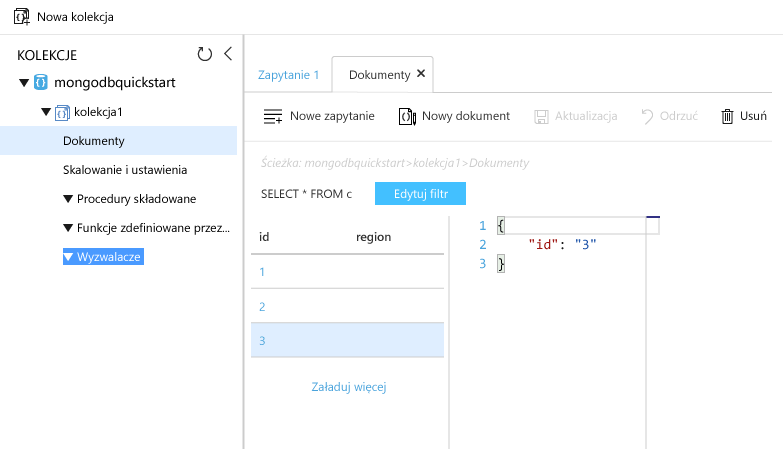

# <a name="azure-cosmos-db-migrate-an-existing-nodejs-mongodb-web-app"></a>Azure Cosmos DB: migracja istniejącej aplikacji sieci Web MongoDB w środowisku Node.js 

Azure Cosmos DB to rozproszona globalnie wielomodelowa usługa bazy danych firmy Microsoft. Dzięki wykorzystaniu dystrybucji globalnej i możliwości skalowania poziomego opartego na usłudze Azure Cosmos DB, możesz szybko tworzyć i za pomocą zapytań badać bazy danych dokumentów, par klucz/wartość oraz grafów. 

Ten przewodnik Szybki Start wyjaśnia, jak użyć istniejącej aplikacji [MongoDB](../documentdb/documentdb-protocol-mongodb.md) napisanej w języku Node.js i połączyć ją z bazą danych usługi Azure Cosmos DB obsługującą połączenia klientów MongoDB. Innymi słowy, aplikacja Node.js wie jedynie, że łączy się z bazą danych przy użyciu interfejsów API MongoDB. Aplikacja nie wie, że dane są przechowywane w bazie danych usługi Azure Cosmos DB.

Gdy wszystko będzie gotowe, aplikacja MEAN (MongoDB, Express, AngularJS i Node.js) będzie uruchomiona dla bazy danych [Azure Cosmos DB](https://azure.microsoft.com/services/documentdb/). 


## <a name="prerequisites"></a>Wymagania wstępne 

Przed rozpoczęciem tego przewodnika Szybki start upewnij się, że masz na komputerze [zainstalowany interfejs wiersza polecenia platformy Azure](https://docs.microsoft.com/cli/azure/install-azure-cli). Ponadto niezbędne są środowiska [Node.js](https://nodejs.org/) i [Git](http://www.git-scm.com/downloads). Zostaną uruchomione polecenia `az`, `npm` i `git`.

Niezbędna jest praktyczna wiedza na temat Node.js. Ten przewodnik Szybki start nie służy do wyjaśnienia ogólnych zasad tworzenia aplikacji w języku Node.js.

## <a name="clone-the-sample-application"></a>Klonowanie przykładowej aplikacji

Otwórz okno terminalu usługi Git, na przykład git bash, i za pomocą polecenia `cd` przejdź do katalogu roboczego.  

Uruchom następujące polecenia w celu sklonowania przykładowego repozytorium. To przykładowe repozytorium zawiera domyślną aplikację [MEAN.js](http://meanjs.org/). 

```bash
git clone https://github.com/prashanthmadi/mean
```

## <a name="run-the-application"></a>Uruchamianie aplikacji

Zainstaluj wymagane pakiety i uruchom aplikację.

```bash
cd mean
npm install
npm start
```

## <a name="log-in-to-azure"></a>Zaloguj się do platformy Azure.

Teraz użyjemy interfejsu wiersza polecenia platformy Azure 2.0 w oknie terminalu do utworzenia zasobów wymaganych do hostowania tej aplikacji w języku Node.js w usłudze Azure App Service.  Zaloguj się do subskrypcji platformy Azure za pomocą polecenia [az login](/cli/azure/#login) i postępuj zgodnie z instrukcjami wyświetlanymi na ekranie. 

```azurecli 
az login 
``` 
   
### <a name="add-the-azure-cosmos-db-module"></a>Dodawanie modułu Azure Cosmos DB

Aby użyć poleceń Azure Cosmos DB, dodaj moduł Azure Cosmos DB. 

```azurecli
az component update --add cosmosdb
```

## <a name="create-a-resource-group"></a>Tworzenie grupy zasobów

Utwórz [grupę zasobów](../azure-resource-manager/resource-group-overview.md) za pomocą polecenia [az group create](/cli/azure/group#create). Grupa zasobów platformy Azure to logiczny kontener przeznaczony do wdrażania zasobów platformy Azure, takich jak aplikacje sieci Web, bazy danych i konta magazynu, oraz zarządzania nimi. 

Poniższy przykład obejmuje tworzenie grupy zasobów w regionie Europa Zachodnia. Wybierz unikatową nazwę grupy zasobów.

```azurecli
az group create --name myResourceGroup --location "West Europe"
```

## <a name="create-an-azure-cosmos-db-account"></a>Tworzenie konta usługi Azure Cosmos DB

Utwórz konto usługi Azure Cosmos DB za pomocą polecenia [az cosmosdb create](/cli/azure/cosmosdb#create).

W poniższym poleceniu w miejsce symbolu zastępczego `<cosmosdb_name>` wstaw swoją unikatową nazwę konta usługi Azure Cosmos DB. Ta nazwa będzie służyć jako część Twojego punktu końcowego usługi Azure Cosmos DB (`https://<cosmosdb_name>.documents.azure.com/`), tak więc musi być unikatowa we wszystkich kontach usługi Azure Cosmos DB na platformie Azure. 

```azurecli
az cosmosdb create --name <cosmosdb_name> --resource-group myResourceGroup --kind MongoDB
```

Parametr `--kind MongoDB` umożliwia tworzenie połączeń klienckich MongoDB.

Po utworzeniu konta usługi Azure Cosmos DB w interfejsie wiersza polecenia platformy Azure zostaną wyświetlone informacje podobne do następujących. 

```json
{
  "databaseAccountOfferType": "Standard",
  "documentEndpoint": "https://<cosmosdb_name>.documents.azure.com:443/",
  "id": "/subscriptions/00000000-0000-0000-0000-000000000000/resourceGroups/myResourceGroup/providers/Microsoft.Document
DB/databaseAccounts/<cosmosdb_name>",
  "kind": "MongoDB",
  "location": "West Europe",
  "name": "<cosmosdb_name>",
  "readLocations": [
    {
      "documentEndpoint": "https://<cosmosdb_name>-westeurope.documents.azure.com:443/",
      "failoverPriority": 0,
      "id": "<cosmosdb_name>-westeurope",
      "locationName": "West Europe",
      "provisioningState": "Succeeded"
    }
  ],
  "resourceGroup": "myResourceGroup",
  "type": "Microsoft.DocumentDB/databaseAccounts",
  "writeLocations": [
    {
      "documentEndpoint": "https://<cosmosdb_name>-westeurope.documents.azure.com:443/",
      "failoverPriority": 0,
      "id": "<cosmosdb_name>-westeurope",
      "locationName": "West Europe",
      "provisioningState": "Succeeded"
    }
  ]
} 
```

## <a name="connect-your-nodejs-application-to-the-database"></a>Połączenie aplikacji Node.js z bazą danych

W tym kroku połączysz swoją przykładową aplikację MEAN.js z nowo utworzoną bazą danych usługi Azure Cosmos DB przy użyciu parametrów połączenia MongoDB. 

## <a name="retrieve-the-key"></a>Pobieranie klucza

Aby połączyć się z bazą danych usługi Azure Cosmos DB, niezbędny jest klucz bazy danych. Użyj polecenia [az documentdb list-keys](/cli/azure/documentdb#list-keys) do pobrania klucza podstawowego.

```azurecli
az cosmosdb list-keys --name <cosmosdb_name> --resource-group myResourceGroup
```

W interfejsie wiersza polecenia platformy Azure zostaną wyświetlone informacje podobne do następującego przykładu. 

```json
{
  "primaryMasterKey": "RUayjYjixJDWG5xTqIiXjC...",
  "primaryReadonlyMasterKey": "...",
  "secondaryMasterKey": "...",
  "secondaryReadonlyMasterKey": "..."
}
```

Skopiuj wartość `primaryMasterKey` do edytora tekstu. Ta informacja będzie potrzebna w następnym kroku.

<a name="devconfig"></a>
## <a name="configure-the-connection-string-in-your-nodejs-application"></a>Konfigurowanie parametrów połączenia w aplikacji Node.js

W repozytorium MEAN.js otwórz plik `config/env/local-development.js`.

Zastąp zawartość tego pliku następującym kodem. Należy również zastąpić dwa symbole zastępcze `<cosmosdb_name>` nazwą konta usługi Azure Cosmos DB, a symbol zastępczy `<primary_master_key>` — kluczem skopiowanym w poprzednim kroku.

```javascript
'use strict';

module.exports = {
  db: {
    uri: 'mongodb://<cosmosdb_name>:<primary_master_key>@<cosmosdb_name>.documents.azure.com:10250/mean-dev?ssl=true&sslverifycertificate=false'
  }
};
```

> [!NOTE] 
> Opcja `ssl=true` jest ważna, ponieważ [usługa Azure Cosmos DB wymaga protokołu SSL](../documentdb/documentdb-connect-mongodb-account.md#connection-string-requirements). 
>
>

Zapisz zmiany.

### <a name="run-the-application-again"></a>Uruchom ponownie aplikację.

Uruchom ponownie polecenie `npm start`. 

```bash
npm start
```

Komunikat na konsoli powinien stwierdzać, że środowisko programistyczne jest uruchomione i gotowe do pracy. 

W przeglądarce przejdź do adresu `http://localhost:3000`. Kliknij przycisk **Zarejestruj się** w górnym menu i spróbuj utworzyć dwóch fikcyjnych użytkowników. 

Przykładowa aplikacja MEAN.js przechowuje dane użytkowników w bazie danych. Jeśli wszystko przebiega poprawnie i aplikacja MEAN.js automatycznie zaloguje się do utworzonego użytkownika, oznacza to, że połączenie z usługą Azure Cosmos DB działa. 


## <a name="view-data-in-data-explorer"></a>Wyświetlanie danych w Eksploratorze danych

Dane przechowywane przez usługę Azure Cosmos DB są dostępne na potrzeby przeglądania, zapytań i uruchamiania logiki biznesowej w witrynie Azure Portal.

Aby wyświetlać dane użytkownika utworzone w poprzednim kroku, a także pracować z nimi i wykonywać na nich zapytania, zaloguj się do witryny [Azure Portal](https://portal.azure.com) w przeglądarce sieci Web.

W polu wyszukiwania u góry wpisz Azure Cosmos DB. Po otwarciu bloku konta usługi Cosmos DB wybierz swoje konto usługi Cosmos DB. W lewym panelu nawigacyjnym kliknij pozycję Eksplorator danych. Rozwiń kolekcję w okienku Kolekcje. Następnie możesz wyświetlić dokumenty w kolekcji, wysłać zapytanie dotyczące danych, a nawet tworzyć i uruchamiać procedury składowane, wyzwalacze i funkcje definiowane przez użytkownika (UDF). 




## <a name="deploy-the-nodejs-application-to-azure"></a>Wdrażanie aplikacji Node.js na platformie Azure

W tym kroku należy wdrożyć aplikację w języku Node.js połączoną z bazą danych MongoDB w usłudze Azure Cosmos DB.

Można było zauważyć, że plik konfiguracji, który został zmodyfikowany wcześniej, jest przeznaczony dla środowiska programistycznego (`/config/env/local-development.js`). Po wdrożeniu aplikacji w usłudze App Service domyślnie będzie ona uruchamiana w środowisku produkcyjnym. Teraz musisz wprowadzić tę samą zmianę w odpowiednim pliku konfiguracji.

W repozytorium MEAN.js otwórz plik `config/env/production.js`.

W obiekcie `db` zastąp wartość `uri` tak jak pokazano w poniższym przykładzie. Pamiętaj, aby zamienić symbole zastępcze tak jak poprzednio.

```javascript
'mongodb://<cosmosdb_name>:<primary_master_key>@<cosmosdb_name>.documents.azure.com:10250/mean?ssl=true&sslverifycertificate=false',
```

Na terminalu zatwierdź wszystkie zmiany w środowisku Git. Możesz skopiować oba polecenia, aby uruchomić je razem.

```bash
git add .
git commit -m "configured MongoDB connection string"
```
## <a name="clean-up-resources"></a>Oczyszczanie zasobów

Jeśli nie zamierzasz w przyszłości korzystać z tej aplikacji, wykonaj następujące czynności, aby usunąć wszystkie zasoby utworzone w witrynie Azure Portal w ramach tego przewodnika Szybki start:

1. W menu znajdującym się po lewej stronie w witrynie Azure Portal kliknij pozycję **Grupy zasobów**, a następnie kliknij nazwę utworzonego zasobu. 
2. Na stronie grupy zasobów kliknij pozycję **Usuń**, wpisz w polu tekstowym nazwę usuwanego zasobu, a następnie kliknij pozycję **Usuń**.

## <a name="next-steps"></a>Następne kroki

W tym przewodniku Szybki start wyjaśniono sposób tworzenia konta usługi Azure Cosmos DB oraz tworzenia kolekcji MongoDB za pomocą Eksploratora danych. Teraz można migrować dane z bazy danych MongoDB do usługi Azure Cosmos DB.  

> [!div class="nextstepaction"]
> [Importowanie danych z bazy danych MongoDB do usługi Azure Cosmos DB](../documentdb/documentdb-mongodb-migrate.md)

