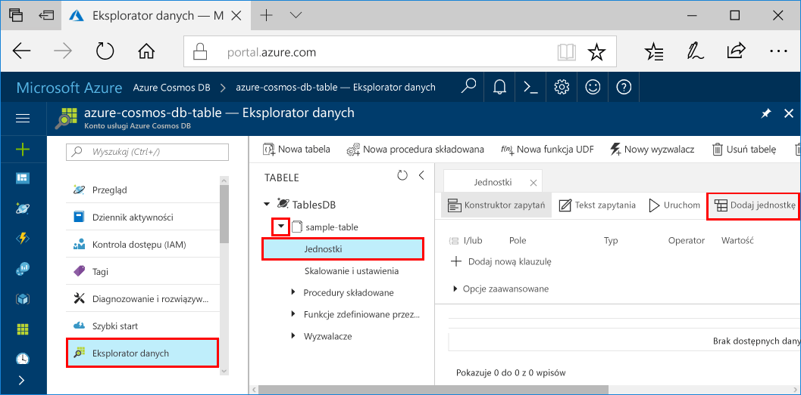
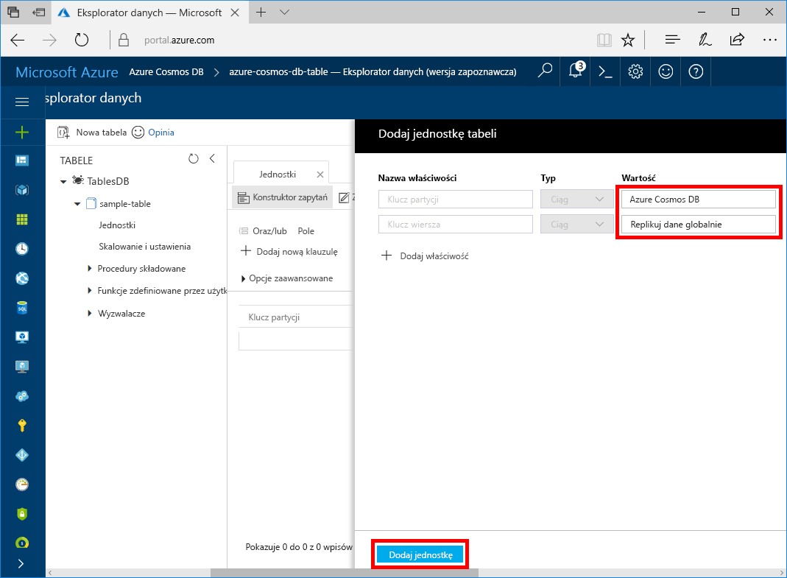

# <a name="quickstart-build-a-table-api-app-with-net-and-azure-cosmos-db"></a>Szybki start: tworzenie aplikacji interfejsu API tabeli przy użyciu platformy .NET i usługi Azure Cosmos DB 

Ten przewodnik szybkiego startu pokazuje, jak używać programu .NET i [interfejsu API tabeli](table-introduction.md) usługi Azure Cosmos DB do tworzenia aplikacji przez sklonowanie przykładu z usługi GitHub. Ten przewodnik Szybki start pokazuje również, jak utworzyć konto usługi Azure Cosmos DB i jak korzystać z Eksploratora danych do tworzenia tabel i jednostek w witrynie internetowej Azure Portal.

Azure Cosmos DB to rozproszona globalnie wielomodelowa usługa bazy danych firmy Microsoft. Dzięki wykorzystaniu dystrybucji globalnej i możliwości skalowania poziomego opartego na usłudze Azure Cosmos DB, można szybko tworzyć i za pomocą zapytań badać bazy danych dokumentów, par klucz/wartość i grafów. 

## <a name="prerequisites"></a>Wymagania wstępne

Jeśli nie masz jeszcze zainstalowanego programu Visual Studio 2017, możesz pobrać program [Visual Studio 2017 Community Edition](https://www.visualstudio.com/downloads/) i używać go **bezpłatnie**. Podczas instalacji programu Visual Studio upewnij się, że jest włączona opcja **Programowanie na platformie Azure**.

[!INCLUDE [quickstarts-free-trial-note](../../includes/quickstarts-free-trial-note.md)]

## <a name="create-a-database-account"></a>Tworzenie konta bazy danych

> [!IMPORTANT] 
> Musisz utworzyć nowe konto interfejsu API tabeli, aby pracować z ogólnie dostępnymi zestawami SDK interfejsu API tabeli. Konta interfejsu API tabeli utworzone w okresie obowiązywania wersji zapoznawczej nie są obsługiwane przez ogólnie dostępne zestawy SDK.
>

[!INCLUDE [cosmos-db-create-dbaccount-table](../../includes/cosmos-db-create-dbaccount-table.md)]

## <a name="add-a-table"></a>Dodawanie tabeli

[!INCLUDE [cosmos-db-create-table](../../includes/cosmos-db-create-table.md)]

## <a name="add-sample-data"></a>Dodawanie danych przykładowych

Teraz możesz dodać dane do swojej nowej tabeli za pomocą Eksploratora danych.

1. W Eksploratorze danych rozwiń węzeł **sample-table**, kliknij pozycję **Jednostki**, a następnie kliknij przycisk **Dodaj jednostkę**.

   
2. Teraz dodaj dane do pól wartości PartitionKey i RowKey, a następnie kliknij przycisk **Dodaj jednostkę**.

   
  
    Teraz możesz dodać więcej jednostek do swojej tabeli, edytować jednostki lub przeszukiwać dane w Eksploratorze danych. W Eksploratorze danych możesz również skalować przepływność oraz dodawać do tabeli procedury składowane, funkcje zdefiniowane przez użytkownika i wyzwalacze.

## <a name="clone-the-sample-application"></a>Klonowanie przykładowej aplikacji

Teraz sklonujemy aplikację Tabela z repozytorium GitHub, ustawimy parametry połączenia i uruchomimy ją. Zobaczysz, jak łatwo jest pracować programowo z danymi. 

1. Otwórz okno terminala usługi Git, na przykład git bash, i użyj polecenia `cd`, aby przejść do folderu instalacji aplikacji przykładowej. 

    ```bash
    cd "C:\git-samples"
    ```

2. Uruchom następujące polecenie w celu sklonowania przykładowego repozytorium. To polecenie tworzy kopię przykładowej aplikacji na komputerze. 

    ```bash
    git clone https://github.com/Azure-Samples/storage-table-dotnet-getting-started.git
    ```

3. Następnie otwórz plik rozwiązania TableStorage w programie Visual Studio. 

## <a name="update-your-connection-string"></a>Aktualizowanie parametrów połączenia

Teraz wróć do witryny Azure Portal, aby uzyskać informacje o parametrach połączenia i skopiować je do aplikacji. Umożliwia to aplikacji komunikację z hostowaną bazą danych. 

1. W witrynie [Azure Portal](http://portal.azure.com/) kliknij pozycję **Parametry połączenia**. 

    Użyj przycisków kopiowania po prawej stronie ekranu, aby skopiować PODSTAWOWE PARAMETRY POŁĄCZENIA.

    

2. W programie Visual Studio otwórz plik App.config. 

3. Usuń znaczniki komentarza dla ciągu StorageConnectionString w wierszu 8 i wstaw znaczniki komentarza dla ciągu StorageConnectionString w wierszu 7, ponieważ ten samouczek nie korzysta z emulatora pamięci. Wiersze 7 i 8 powinny teraz wyglądać następująco:

    ```
    <!--key="StorageConnectionString" value="UseDevelopmentStorage=true;" />-->
    <add key="StorageConnectionString" value="DefaultEndpointsProtocol=https;AccountName=[AccountName];AccountKey=[AccountKey]" />
    ```

4. Wklej PODSTAWOWE PARAMETRY POŁĄCZENIA z portalu do wartości StorageConnectionString w wierszu 8. Wklej parametry wewnątrz cudzysłowów. 

    > [!IMPORTANT]
    > Jeśli dany punkt końcowy korzysta z adresu documents.azure.com, oznacza to, że masz konto w wersji zapoznawczej i musisz utworzyć [nowe konto interfejsu API tabeli](#create-a-database-account), aby korzystać z dostępnego ogólnie zestawu SDK API tabeli. 
    > 

    Wiersz 8 powinien teraz wyglądać podobnie do:

    ```
    <add key="StorageConnectionString" value="DefaultEndpointsProtocol=https;AccountName=<account name>;AccountKey=txZACN9f...==;TableEndpoint=https://<account name>.table.cosmosdb.azure.com;" />
    ```

5. Zapisz plik App.config.

Aplikacja została zaktualizowana i zawiera teraz wszystkie informacje potrzebne do nawiązania komunikacji z usługą Azure Cosmos DB. 

## <a name="build-and-deploy-the-app"></a>Kompilowanie i wdrażanie aplikacji

1. W programie Visual Studio kliknij projekt **TableStorage** prawym przyciskiem myszy w **Eksploratorze rozwiązań**, a następnie kliknij polecenie **Zarządzaj pakietami NuGet**. 

2. W polu **Przeglądaj** obszaru pakietów NuGet wpisz ciąg *Microsoft.Azure.CosmosDB.Table*.

3. Korzystając z wyników, zainstaluj bibliotekę **Microsoft.Azure.CosmosDB.Table**. Spowoduje to zainstalowanie pakietu interfejsu API tabeli usługi Azure Cosmos DB oraz wszystkich zależności.

4. Otwórz plik BasicSamples.cs i dodaj punkt przerwania do wierszy 30 i 52.

5. Naciśnij klawisze CTRL + F5, aby uruchomić aplikację.

    W oknie konsoli zostaną wyświetlone dane tabeli dodawane do nowej bazy danych tabel w usłudze Azure Cosmos DB. 
    
    W przypadku wystąpienia błędu dotyczącego zależności zobacz [Rozwiązywanie problemów](table-sdk-dotnet.md#troubleshooting).

    Po dotarciu do pierwszego punktu przerwania wróć do Eksploratora danych w witrynie Azure Portal, rozwiń tabelę demo* i kliknij pozycję **Jednostki**. Karta **Jednostki** po prawej stronie zawiera nową dodaną jednostkę. Zwróć uwagę, że numer telefonu użytkownika to 425-555-0101.
    
6. Zamknij kartę Jednostki w Eksploratorze danych.
    
7. Kontynuuj pracę aplikację do następnego punktu przerwania.

    Po dotarciu do punktu przerwania wróć do portalu, kliknij ponownie pozycję Jednostki w celu otwarcia karty Jednostki i zwróć uwagę, że numer telefonu został zaktualizowany do 425-555-0105.

8. W oknie konsoli naciśnij klawisze CTRL + C, aby zakończyć wykonywanie aplikacji. 

    Teraz możesz wrócić do Eksploratora danych i dodać lub zmodyfikować jednostki oraz wykonać zapytanie o dane.

## <a name="review-slas-in-the-azure-portal"></a>Przeglądanie umów SLA w witrynie Azure Portal

[!INCLUDE [cosmosdb-tutorial-review-slas](../../includes/cosmos-db-tutorial-review-slas.md)]

## <a name="clean-up-resources"></a>Oczyszczanie zasobów

[!INCLUDE [cosmosdb-delete-resource-group](../../includes/cosmos-db-delete-resource-group.md)]

## <a name="next-steps"></a>Następne kroki

W tym przewodniku Szybki start wyjaśniono sposób tworzenia konta usługi Azure Cosmos DB, tworzenia tabeli za pomocą Eksploratora danych i uruchamiania aplikacji.  Teraz można tworzyć zapytania do danych przy użyciu interfejsu API tabel.  

> [!div class="nextstepaction"]
> [Importowanie danych tabeli do interfejsu API tabeli](table-import.md)

