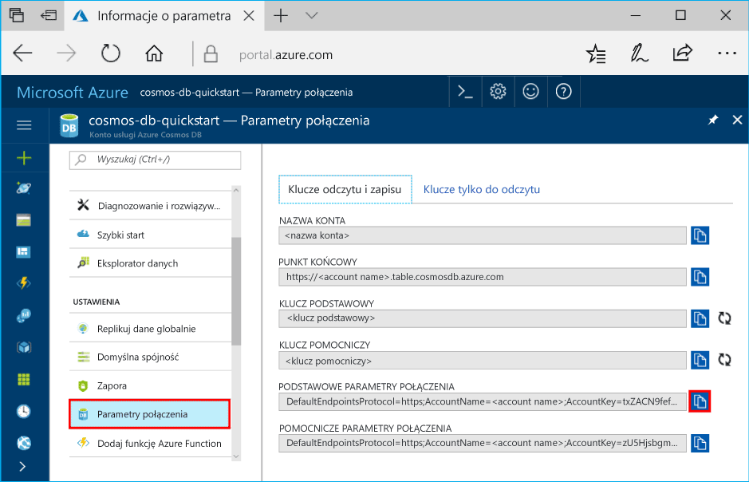

# <a name="quickstart-build-a-table-api-app-with-nodejs-and-azure-cosmos-db"></a>Szybki start: tworzenie aplikacji interfejsu API tabeli przy użyciu platformy Node.js i usługi Azure Cosmos DB

Ten przewodnik szybkiego startu pokazuje, jak używać platformy Node.js i [interfejsu API tabeli](table-introduction.md) usługi Azure Cosmos DB do tworzenia aplikacji przez sklonowanie przykładu z serwisu GitHub. Ten przewodnik Szybki start pokazuje również, jak utworzyć konto usługi Azure Cosmos DB i jak korzystać z Eksploratora danych do tworzenia tabel i jednostek w witrynie internetowej Azure Portal.

Azure Cosmos DB to rozproszona globalnie wielomodelowa usługa bazy danych firmy Microsoft. Dzięki wykorzystaniu dystrybucji globalnej i możliwości skalowania poziomego opartego na usłudze Azure Cosmos DB można szybko tworzyć i za pomocą zapytań badać bazy danych dokumentów, par klucz/wartość, szerokokolumnowe i grafowe. 

## <a name="prerequisites"></a>Wymagania wstępne

[!INCLUDE [quickstarts-free-trial-note](../../includes/quickstarts-free-trial-note.md)]
[!INCLUDE [cosmos-db-emulator-docdb-api](../../includes/cosmos-db-emulator-docdb-api.md)]

Ponadto:

* [Node.js](https://nodejs.org/en/) w wersji 0.10.29 lub nowszej
* [Git](http://git-scm.com/)

## <a name="create-a-database-account"></a>Tworzenie konta bazy danych

> [!IMPORTANT] 
> Musisz utworzyć nowe konto interfejsu API tabeli, aby pracować z ogólnie dostępnymi zestawami SDK interfejsu API tabeli. Konta interfejsu API tabeli utworzone w okresie obowiązywania wersji zapoznawczej nie są obsługiwane przez ogólnie dostępne zestawy SDK.
>

[!INCLUDE [cosmos-db-create-dbaccount-table](../../includes/cosmos-db-create-dbaccount-table.md)]

## <a name="add-a-table"></a>Dodawanie tabeli

[!INCLUDE [cosmos-db-create-table](../../includes/cosmos-db-create-table.md)]

## <a name="add-sample-data"></a>Dodawanie danych przykładowych

Teraz możesz dodać dane do swojej nowej tabeli za pomocą Eksploratora danych.

1. W Eksploratorze danych rozwiń węzeł **sample-table**, kliknij pozycję **Jednostki**, a następnie kliknij przycisk **Dodaj jednostkę**.

   
2. Teraz dodaj dane do pól wartości PartitionKey i RowKey, a następnie kliknij przycisk **Dodaj jednostkę**.

   
  
    Teraz możesz dodać więcej jednostek do swojej tabeli, edytować jednostki lub przeszukiwać dane w Eksploratorze danych. W Eksploratorze danych możesz również skalować przepływność oraz dodawać do tabeli procedury składowane, funkcje zdefiniowane przez użytkownika i wyzwalacze.

## <a name="clone-the-sample-application"></a>Klonowanie przykładowej aplikacji

Teraz sklonujemy aplikację Tabela z repozytorium GitHub, ustawimy parametry połączenia i uruchomimy ją. Zobaczysz, jak łatwo jest pracować programowo z danymi. 

1. Otwórz okno terminala usługi Git, na przykład git bash, i użyj polecenia `cd`, aby przejść do folderu instalacji aplikacji przykładowej. 

    ```bash
    cd "C:\git-samples"
    ```

2. Uruchom następujące polecenie w celu sklonowania przykładowego repozytorium. To polecenie tworzy kopię przykładowej aplikacji na komputerze. 

    ```bash
    git clone https://github.com/Azure-Samples/storage-table-node-getting-started.git
    ```

## <a name="update-your-connection-string"></a>Aktualizowanie parametrów połączenia

Teraz wróć do witryny Azure Portal, aby uzyskać informacje o parametrach połączenia i skopiować je do aplikacji. Umożliwia to aplikacji komunikację z hostowaną bazą danych. 

1. W witrynie [Azure Portal](http://portal.azure.com/) kliknij pozycję **Parametry połączenia**. 

    

2. Skopiuj PODSTAWOWE PARAMETRY POŁĄCZENIA przy użyciu przycisku kopiowania po prawej stronie.

3. Otwórz plik app.config i wklej wartość connectionString w wierszu trzecim. 

    > [!IMPORTANT]
    > Jeśli dany punkt końcowy korzysta z adresu documents.azure.com, oznacza to, że masz konto w wersji zapoznawczej i musisz utworzyć [nowe konto interfejsu API tabeli](#create-a-database-account), aby korzystać z dostępnego ogólnie zestawu SDK API tabeli.
    >

3. Zapisz plik app.config.

Aplikacja została zaktualizowana i zawiera teraz wszystkie informacje potrzebne do nawiązania komunikacji z usługą Azure Cosmos DB. 

## <a name="run-the-app"></a>Uruchomienie aplikacji

1. W oknie terminala usługi Git za pomocą polecenia `cd` przejdź do folderu storage-table-java-getting-started.

    ```
    cd "C:\git-samples\storage-table-node-getting-started"
    ```

2. Uruchom następujące polecenie, aby zainstalować lokalnie moduły [azure], [node-uuid], [nconf] i [async], a także zapisać ich pozycje w pliku package.json

   ```
   npm install azure-storage node-uuid async nconf --save
   ```

2. W oknie terminala usługi Git uruchom następujące polecenia, aby uruchomić aplikację Node.

    ```
    node ./tableSample.js 
    ```

    W oknie konsoli zostaną wyświetlone dane tabeli dodawane do nowej bazy danych tabel w usłudze Azure Cosmos DB.

    Teraz można wrócić do Eksploratora danych i zobaczyć, jak się pracuje z nowymi danymi, modyfikuje je i tworzy zapytania o nie. 

## <a name="review-slas-in-the-azure-portal"></a>Przeglądanie umów SLA w witrynie Azure Portal

[!INCLUDE [cosmosdb-tutorial-review-slas](../../includes/cosmos-db-tutorial-review-slas.md)]

## <a name="clean-up-resources"></a>Oczyszczanie zasobów

[!INCLUDE [cosmosdb-delete-resource-group](../../includes/cosmos-db-delete-resource-group.md)]

## <a name="next-steps"></a>Następne kroki

W tym przewodniku Szybki start wyjaśniono sposób tworzenia konta usługi Azure Cosmos DB, tworzenia tabeli za pomocą Eksploratora danych i uruchamiania aplikacji.  Teraz można tworzyć zapytania do danych przy użyciu interfejsu API tabel.  

> [!div class="nextstepaction"]
> [Importowanie danych tabeli do interfejsu API tabeli](table-import.md)
