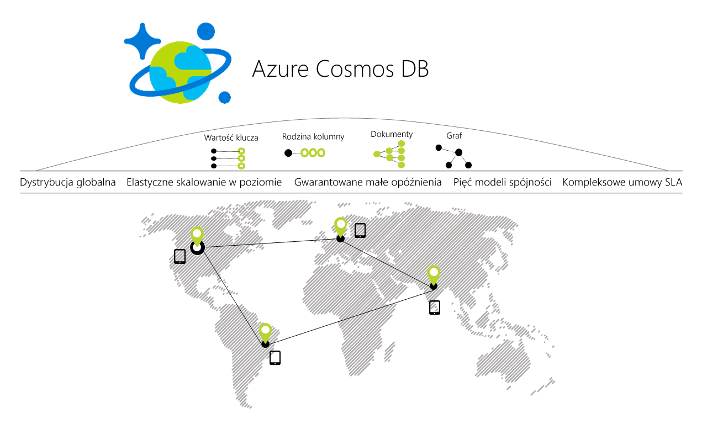

# Azure Cosmos DB — Zapraszamy!

Azure Cosmos DB to dostępna w skali światowej, wielomodelowa baza danych firmy Microsoft. Usługa Azure Cosmos DB umożliwia elastyczne i niezależne skalowanie przepływności i przestrzeni dyskowej dla dowolnej liczby regionów geograficznych platformy Azure za pomocą jednego kliknięcia przycisku. W odróżnieniu od wszelkich innych usług baz danych, oferuje ona gwarancje dotyczące przepływności, opóźnienia, dostępności i spójności dzięki kompleksowym [umowom dotyczącym poziomu usług](https://aka.ms/acdbsla) (SLA, Service Level Agreement). Możesz [bezpłatnie spróbuj Azure DB rozwiązania Cosmos](https://azure.microsoft.com/try/cosmosdb/) bez subskrypcji platformy Azure, bez opłat ani zobowiązań.

> [!div class="nextstepaction"]
> [Spróbuj bezpłatnej bazy danych Azure rozwiązania Cosmos](https://azure.microsoft.com/try/cosmosdb/)

## Najważniejsze możliwości
Jako dostępna w skali światowej usługa bazy danych Azure Cosmos DB zapewnia następujące możliwości ułatwiające tworzenie skalowalnych i szybko reagujących aplikacji:

* **Gotowa do użytku dystrybucja globalna**
    * Możesz [dystrybuować dane](distribute-data-globally.md) w dowolnej liczbie [regionów platformy Azure](https://azure.microsoft.com/regions/) [jednym kliknięciem przycisku](tutorial-global-distribution-documentdb.md). Umożliwia to używanie Twoich danych tam, gdzie znajdują się użytkownicy, co zapewnia najniższe możliwe opóźnienie Twoim klientom. 
    * Za pomocą usługi Azure rozwiązania Cosmos DB wielu interfejsów API aplikacji zawsze wie, gdzie najbliższy region jest i wysyła żądania do najbliższego centrum danych. Wszystko to jest możliwe bez zmian konfiguracji. Ustaw obszar zapisu mają tyle regionów odczytu podczas i pozostałe jest już obsługiwane.

* **Wiele modeli danych i popularnych interfejsów API na potrzeby uzyskiwania dostępu do danych i wykonywania względem nich zapytań**
    * Model danych oparty na technologii atom-rekord-sekwencja (ARS, atom-record-sequence), na podstawie którego zbudowana jest usługi Azure Cosmos DB, natywnie obsługuje wiele modeli danych, między innymi te oparte na dokumentach, grafach, parach klucz-wartość i kolumnach.
    * Interfejsy API dla następujących modeli danych są obsługiwane przez zestawy SDK dostępne w wielu językach:
        * [Interfejs API usługi DocumentDB](documentdb-introduction.md): aparatu bazy danych bez schematu JSON z możliwości zapytań SQL.
        * [Interfejs API bazy danych MongoDB](mongodb-introduction.md): Usługa bazy danych A MongoDB wbudowane DB rozwiązania Cosmos. Zgodny z istniejącej bazy danych MongoDB bibliotek, sterowniki, narzędzia i aplikacje.
        * [Tabela interfejsu API](table-introduction.md): Usługa bazy danych magazynu kluczy i wartości, utworzone w celu zapewnienia możliwości premium aplikacji magazynem tabel Azure.
        * [(Gremlin) interfejsu API programu Graph](graph-introduction.md): następujące wbudowane usługi bazy danych wykresu [specyfikacji Apache TinkerPop](http://tinkerpop.apache.org/).
        * Dodatkowe dane modeli wkrótce!

* **Elastycznie skalowana przepływność i przestrzeń dyskowa na żądanie, na całym świecie**
    * Łatwo skalować przepływność baz danych w [na sekundę](request-units.md) szczegółowości i w dowolnym momencie chcesz ją zmienić. 
    * Skalowanie rozmiaru magazynu w sposób [przejrzysty i automatyczny](partition-data.md) w celu obsługi wymagań dotyczących rozmiaru teraz i w każdym innym momencie.

* **Tworzenie szybko reagujących aplikacji o kluczowym znaczeniu**
    * Usługa Azure Cosmos DB gwarantuje klientom całościowe małe opóźnienia na poziomie 99 percentyla. 
    * Dla typowego elementu o wielkości 1 KB usługa Cosmos DB gwarantuje całościowe opóźnienie operacji odczytu poniżej 10 ms oraz indeksowanego zapisu poniżej 15 ms na poziomie 99 percentyla, w obrębie tego samego regionu świadczenia usługi Azure. Średnie opóźnienia są znacznie niższe (poniżej 5 ms).

* **Zapewnienie dostępności na poziomie „zawsze włączona”**
    * Dostępność na poziomie 99,99% w obrębie jednego regionu.
    * Możliwość wdrażania w dowolnej liczbie [regionów świadczenia usługi Azure](https://azure.microsoft.com/regions), aby uzyskać większą dostępność.
    * [Symulowanie awarii](regional-failover.md) co najmniej jednego regionu z gwarancją, że nie nastąpi utrata żadnych danych. 

* **Tworzenie aplikacji dystrybuowanych globalnie w odpowiedni sposób**
    * Pięć [modeli spójności](consistency-levels.md) zapewnia silną spójność, podobną do spójności SQL, oraz spójność ostateczną, podobną do spójności NoSQL (i wszystko pomiędzy nimi). 
  
* **Gwarancja zwrotu pieniędzy**
    * Szybkie dostarczanie danych lub zwrot pieniędzy. 
    * [Umowy dotyczące poziomu usług](https://aka.ms/acdbsla) obejmujące dostępność, opóźnienie, przepływność i spójność. 

* **Brak potrzeby zarządzania schematami i indeksami bazy danych**
    * Nie musisz już martwić się o synchronizowanie indeksów i schematu bazy danych ze schematem aplikacji. U nas nie ma schematów. 
    * Aparat bazy danych usługi Azure Cosmos DB jest w pełni niezależny od schematów — automatycznie indeksuje wszystkie dane, które pozyska, bez wymagania żadnych schematów ani indeksów, a także umożliwia wykonywanie błyskawicznych zapytań. 

* **Niski koszt posiadania**
    * Pięciu do 10 razy [bardziej ekonomiczne](https://aka.ms/cosmos-db-tco-paper) niż rozwiązania niezarządzanego.
    * Trzy razy taniej niż w przypadku usługi DynamoDB.

## Porównanie możliwości

Usługa Azure Cosmos DB zapewnia najlepsze możliwości relacyjnych i nierelacyjnych baz danych.

| Możliwości | Relacyjne bazy danych   | Nierelacyjne bazy danych (NoSQL) |    Azure Cosmos DB |
| --- | --- | --- | --- |
| Dystrybucja globalna | Nie | Nie | Tak, gotowa do użycia dystrybucja w ponad 30 regionach z międzyregionalnymi interfejsami API|
| Skalowanie w poziomie | Nie | Tak | Tak, możliwe jest niezależne skalowanie magazynu i przepływności | 
| Gwarancje dot. opóźnienia | Nie | Tak | Tak, 99% odczytów trwa poniżej 10 ms, a 99% zapisów poniżej 15 ms | 
| Wysoka dostępność | Nie | Tak | Tak, usługa Cosmos DB jest zawsze włączona, umożliwia wymiany zgodne z modelem PACELC oraz udostępnia opcje automatycznego i ręcznego przechodzenia w tryb failover|
| Model danych + interfejs API | Relacyjny + SQL | Wiele modeli + OSS API | Wiele modeli + SQL + OSS API (więcej wkrótce) |
| Umowy SLA | Tak | Nie | Tak, kompleksowe umowy SLA dotyczące opóźnienia, przepływności, spójności i dostępności |

## Rozwiązania, które korzystają z zalet usługi Azure Cosmos DB

Wszystkie [aplikacje internetowe, IoT i mobilne oraz gry](use-cases.md) wymagające obsługi ogromnych ilości operacji odczytu i zapisuje w skali [globalnej](distribute-data-globally.md) z krótkim czasem odpowiedzi dla różnych danych będą korzystać z zalet związanych z [gwarantowaną](https://azure.microsoft.com/support/legal/sla/cosmos-db/) dostępnością, wysoką przepływnością, małymi opóźnieniami i możliwościami dostosowania spójności, które są zapewniane przez usługę Azure Cosmos DB. Więcej informacji na temat sposobu CosmosDB można zastosować do [IoT i telematyki](use-cases.md#iot-and-telematics), [sieci sprzedaży i marketingu](use-cases.md#retail-and-marketing), [gry](use-cases.md#gaming) i [sieci Web i aplikacji dla urządzeń przenośnych](use-cases.md#web-and-mobile-applications) .

## Następne kroki
Rozpocznij pracę z usługą Azure Cosmos DB, korzystając z jednego z naszych przewodników:

* [Rozpoczynanie pracy z interfejsem API DocumentDB usługi Azure Cosmos DB](create-documentdb-dotnet.md)
* [Rozpoczynanie pracy z interfejsem API MongoDB usługi Azure Cosmos DB](create-mongodb-nodejs.md)
* [Rozpoczynanie pracy z interfejsem API Graph usługi Azure Cosmos DB](create-graph-dotnet.md)
* [Rozpoczynanie pracy z interfejsem API tabeli usługi Azure Cosmos DB](create-table-dotnet.md)

> [!div class="nextstepaction"]
> [Spróbuj bezpłatnej bazy danych Azure rozwiązania Cosmos](https://azure.microsoft.com/try/cosmosdb/)
