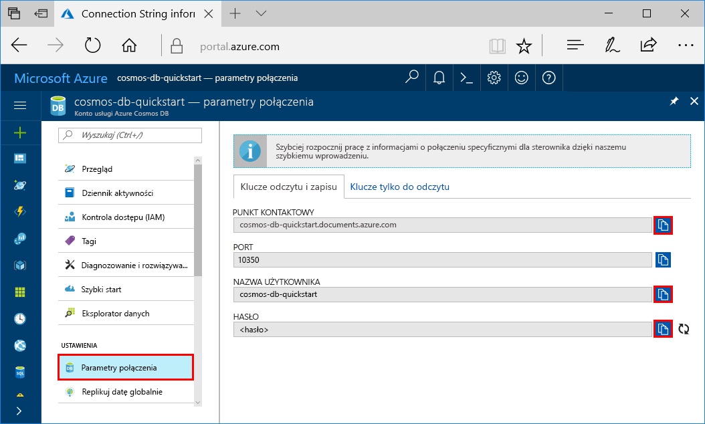

# <a name="azure-cosmosdb-develop-with-the-cassandra-api-in-java"></a>Azure CosmosDB: Opracowywania Cassandra interfejsu API w języku Java

Azure DB rozwiązania Cosmos jest usługa globalnie rozproszone wielu modelu bazy danych firmy Microsoft. Dzięki wykorzystaniu dystrybucji globalnej i możliwości skalowania poziomego opartego na usłudze Azure Cosmos DB, można szybko tworzyć i za pomocą zapytań badać bazy danych dokumentów, par klucz/wartość i grafów. 

Ten samouczek pokazuje, jak utworzyć konto bazy danych rozwiązania Cosmos Azure przy użyciu portalu Azure, a następnie utwórz Cassandra Table(documentdb-partition-data.md#partition-keys) przy użyciu [Cassandra API](cassandra-introduction.md). Definiując klucza podstawowego, podczas tworzenia tabeli, aplikacji są przygotowane do łatwego skalowania wraz z rozwojem danych. 

Ten samouczek obejmuje następujące zadania przy użyciu interfejsu API Cassandra:

> [!div class="checklist"]
> * Tworzenie konta usługi Azure Cosmos DB
> * Tworzenie przestrzeni kluczy i tabeli przy użyciu klucza podstawowego
> * Wstawianie danych
> * Zapytania o dane
> * Przejrzyj umowy SLA

## <a name="prerequisites"></a>Wymagania wstępne

Dostęp do interfejsu API Azure rozwiązania Cosmos DB Cassandra program w wersji zapoznawczej. Jeśli nie zostały zastosowane do dostępu jeszcze [Zamów teraz](https://aka.ms/cosmosdb-cassandra-signup).

[!INCLUDE [quickstarts-free-trial-note](../../includes/quickstarts-free-trial-note.md)]Można też [bezpłatnie spróbuj Azure DB rozwiązania Cosmos](https://azure.microsoft.com/try/cosmosdb/) bez subskrypcji platformy Azure, bez opłat ani zobowiązań.

Ponadto: 

* [Zestaw Java Development Kit (JDK) 1.7+](http://www.oracle.com/technetwork/java/javase/downloads/jdk8-downloads-2133151.html)
    * W systemie Ubuntu uruchom polecenie `apt-get install default-jdk`, aby zainstalować zestaw JDK.
    * Upewnij się, że zmienna środowiskowa JAVA_HOME wskazuje folder, w którym zainstalowano zestaw JDK.
* [Pobierz](http://maven.apache.org/download.cgi) i [zainstaluj](http://maven.apache.org/install.html) archiwum binarne [Maven](http://maven.apache.org/)
    * W systemie Ubuntu możesz uruchomić polecenie `apt-get install maven`, aby zainstalować narzędzie Maven.
* [Git](https://www.git-scm.com/)
    * W systemie Ubuntu możesz uruchomić polecenie `sudo apt-get install git`, aby zainstalować usługę Git.

## <a name="create-a-database-account"></a>Tworzenie konta bazy danych

Przed utworzeniem bazy danych dokumentów, musisz utworzyć konto Cassandra z bazy danych Azure rozwiązania Cosmos.

[!INCLUDE [cosmos-db-create-dbaccount-cassandra](../../includes/cosmos-db-create-dbaccount-cassandra.md)]

## <a name="clone-the-sample-application"></a>Klonowanie przykładowej aplikacji

Teraz przejdźmy do pracy z kodem. Załóżmy sklonować Cassandra aplikacji z serwisu GitHub, Ustaw ciąg połączenia i uruchom go. Zobaczysz, jak łatwo jest pracować programowo z danymi. 

1. Otwórz okno terminala git, np. git bash i użyj `cd` polecenie, aby przejść do folderu instalacji aplikacji przykładowej. 

    ```bash
    cd "C:\git-samples"
    ```

2. Uruchom następujące polecenie w celu sklonowania przykładowego repozytorium. To polecenie tworzy kopię przykładowej aplikacji na komputerze.

    ```bash
    git clone https://github.com/Azure-Samples/azure-cosmos-db-cassandra-java-getting-started.git
    ```

## <a name="review-the-code"></a>Przeglądanie kodu

Ten krok jest opcjonalny. Jeśli chcesz się dowiedzieć, jak zasoby bazy danych są tworzone w kodzie, można przejrzeć poniższe fragmenty kodu. W przeciwnym razie możesz przejść od razu do [zaktualizować parametry połączenia](#update-your-connection-string). Te fragmenty kodu są pobierane z src/main/java/com/azure/cosmosdb/cassandra/util/CassandraUtils.java.  

* Ustawiono Cassandra hosta, port, nazwę użytkownika, hasło i opcje protokołu SSL. Informacje o parametrach połączenia pochodzi ze strony ciągu połączenia w portalu Azure.

   ```java
   cluster = Cluster.builder().addContactPoint(cassandraHost).withPort(cassandraPort).withCredentials(cassandraUsername, cassandraPassword).withSSL(sslOptions).build();
   ```

* `cluster` Łączy do interfejsu API Azure rozwiązania Cosmos DB Cassandra i zwraca sesji do uzyskania dostępu.

    ```java
    return cluster.connect();
    ```

Poniższe fragmenty kodu są z pliku src/main/java/com/azure/cosmosdb/cassandra/repository/UserRepository.java.

* Utwórz nowy przestrzeni kluczy.

    ```java
    public void createKeyspace() {
        final String query = "CREATE KEYSPACE IF NOT EXISTS uprofile WITH replication = {'class': 'SimpleStrategy', 'replication_factor': '3' } ";
        session.execute(query);
        LOGGER.info("Created keyspace 'uprofile'");
    }
    ```

* Utwórz nową tabelę.

   ```java
   public void createTable() {
        final String query = "CREATE TABLE IF NOT EXISTS uprofile.user (user_id int PRIMARY KEY, user_name text, user_bcity text)";
        session.execute(query);
        LOGGER.info("Created table 'user'");
   }
   ```

* Wstaw jednostkami użytkownika przy użyciu obiektu przygotowanej instrukcji.

    ```java
    public PreparedStatement prepareInsertStatement() {
        final String insertStatement = "INSERT INTO  uprofile.user (user_id, user_name , user_bcity) VALUES (?,?,?)";
        return session.prepare(insertStatement);
    }

    public void insertUser(PreparedStatement statement, int id, String name, String city) {
        BoundStatement boundStatement = new BoundStatement(statement);
        session.execute(boundStatement.bind(id, name, city));
    }
    ```

* Zapytanie, aby uzyskać wszystkie informacje o użytkowniku.

    ```java
   public void selectAllUsers() {
        final String query = "SELECT * FROM uprofile.user";
        List<Row> rows = session.execute(query).all();

        for (Row row : rows) {
            LOGGER.info("Obtained row: {} | {} | {} ", row.getInt("user_id"), row.getString("user_name"), row.getString("user_bcity"));
        }
    }
    ```

* Zapytanie, aby uzyskać informacje dotyczące jednego użytkownika.

    ```java
    public void selectUser(int id) {
        final String query = "SELECT * FROM uprofile.user where user_id = 3";
        Row row = session.execute(query).one();

        LOGGER.info("Obtained row: {} | {} | {} ", row.getInt("user_id"), row.getString("user_name"), row.getString("user_bcity"));
    }
    ```

## <a name="update-your-connection-string"></a>Aktualizowanie parametrów połączenia

Teraz wróć do witryny Azure Portal, aby uzyskać informacje o parametrach połączenia i skopiować je do aplikacji. Dzięki temu aplikacja do komunikacji z bazą danych hostowanej.

1. W [portalu Azure](http://portal.azure.com/), kliknij przycisk **ciąg połączenia**. 

    

2. Użyj  przycisk po prawej stronie ekranu, aby skopiować wartość punktu kontaktu.

3. Otwórz `config.properties` plik z folderu C:\git-samples\azure-cosmosdb-cassandra-java-getting-started\java-examples\src\main\resources. 

3. Wklej wartość punktu kontaktu z portalu za pośrednictwem `<Cassandra endpoint host>` na wiersz 2.

    Wiersz 2 config.properties powinna wyglądać podobnie do 

    `cassandra_host=cosmos-db-quickstarts.documents.azure.com`

3. Wróć do portalu i skopiuj wartość nazwy użytkownika. Poza wartości nazwy użytkownika z portalu za pośrednictwem `<cassandra endpoint username>` w wierszu 4.

    Wiersz 4 config.properties powinna wyglądać podobnie do 

    `cassandra_username=cosmos-db-quickstart`

4. Wróć do portalu i skopiuj wartość HASŁA. Wklej wartość HASŁA z portalu za pośrednictwem `<cassandra endpoint password>` w wierszu 5.

    Wiersz 5 config.properties powinna wyglądać podobnie do 

    `cassandra_password=2Ggkr662ifxz2Mg...==`

5. W wierszu 6, jeśli chcesz użyć określonego certyfikatu SSL, następnie zastąp `<SSL key store file location>` z lokalizacją certyfikatu SSL. Jeśli wartość nie zostanie podana, jest używany certyfikat JDK zainstalowanych w < JAVA_HOME >/środowiska jre/lib/zabezpieczeń/cacerts. 

6. Jeśli zmienisz wiersz 6 do używania określonego certyfikatu SSL, zaktualizować wiersz 7, aby użyć hasła dla tego certyfikatu. 

7. Zapisz plik config.properties.

## <a name="run-the-app"></a>Uruchomienie aplikacji

1. W oknie terminalu git `cd` do folderu azure-cosmosdb-cassandra-java-getting-started\java-examples.

    ```git
    cd "C:\git-samples\azure-cosmosdb-cassandra-java-getting-started\java-examples"
    ```

2. W oknie terminalu git Użyj następującego polecenia, aby wygenerować plik cosmosdb-cassandra-examples.jar.

    ```git
    mvn clean install
    ```

3. W oknie terminalu git uruchom następujące polecenie, aby uruchomić aplikację Java.

    ```git
    java -cp target/cosmosdb-cassandra-examples.jar com.azure.cosmosdb.cassandra.examples.UserProfile
    ```

    Okno terminalu Wyświetla powiadomienia przestrzeni kluczy i tabeli są tworzone. Następnie wybiera i zwraca wszystkich użytkowników w tabeli i wyświetla dane wyjściowe i następnie wybiera wiersz według identyfikatora i wyświetla wartość.  
    
    Teraz można wrócić do Eksploratora danych i zobaczyć, jak się pracuje z nowymi danymi, modyfikuje je i tworzy zapytania o nie. 

## <a name="review-slas-in-the-azure-portal"></a>Przeglądanie umów SLA w witrynie Azure Portal

[!INCLUDE [cosmosdb-tutorial-review-slas](../../includes/cosmos-db-tutorial-review-slas.md)]

## <a name="clean-up-resources"></a>Oczyszczanie zasobów

[!INCLUDE [cosmosdb-delete-resource-group](../../includes/cosmos-db-delete-resource-group.md)]

## <a name="next-steps"></a>Następne kroki

W tym szybkiego startu kiedy znasz już jak wykonywać następujące czynności:

> [!div class="checklist"]
> * Tworzenie konta usługi Azure Cosmos DB
> * Tworzenie przestrzeni kluczy i tabeli przy użyciu klucza podstawowego
> * Wstawianie danych
> * Zapytania o dane
> * Monitującymi umowy SLA

Teraz możesz zaimportować dane dodatkowe kolekcji bazy danych Azure rozwiązania Cosmos. 

> [!div class="nextstepaction"]
> [Importowanie danych Cassandra do bazy danych Azure rozwiązania Cosmos](cassandra-import-data.md)
