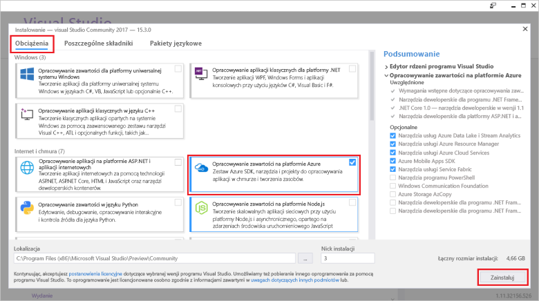

# <a name="create-an-azure-functions-http-trigger-with-an-azure-cosmos-db-input-binding"></a>Utwórz wyzwalacz Azure funkcje HTTP z powiązaniem wejściowych bazy danych Azure rozwiązania Cosmos

Azure DB rozwiązania Cosmos jest globalnie rozproszone i wiele modeli bazy danych jest zarówno schematu, jak i bez serwera. Funkcja Azure to usługa niekorzystającą obliczeń, która umożliwia uruchamianie kodu na żądanie. Pary te dwie usługi Azure i mają podstawę niekorzystającą architekturę, która pozwala skupić się na tworzeniu atrakcyjnych aplikacji i nie martw się o inicjowania obsługi administracyjnej i konserwację serwerów dla obliczeniowych i wymaga bazy danych.

W tym samouczku opiera się na kod, który został utworzony w [szybkiego startu interfejsu API Graph dla platformy .NET](create-graph-dotnet.md). W tym samouczku dodaje funkcję platformy Azure, która zawiera [wyzwalacza HTTP](https://github.com/MicrosoftDocs/azure-docs-pr/azure-functions/functions-bindings-http-webhook.md#http-trigger). Wyzwalacza HTTP używa bazy danych Azure rozwiązania Cosmos [wejściowych powiązania](https://github.com/MicrosoftDocs/azure-docs-pr/azure-functions/functions-triggers-bindings.md) do pobierania danych z bazy danych wykresu utworzone z opcją szybkiego startu. Ten konkretnych HTTP wyzwalacza kwerend bazy danych rozwiązania Cosmos Azure dla danych, ale powiązania wejściowe z bazy danych usługi Azure rozwiązania Cosmos może służyć do pobierania danych wartości wejściowej niezależnie od wymaga funkcji.

Ten samouczek obejmuje następujące zadania:

> [!div class="checklist"]
> * Tworzenie projektu funkcji platformy Azure 
> * Utwórz wyzwalacz protokołu HTTP
> * Publikowanie funkcji platformy Azure
> * Połączenie funkcji platformy Azure z bazą danych Azure DB rozwiązania Cosmos

## <a name="prerequisites"></a>Wymagania wstępne

- [Program Visual Studio 2017 w wersji 15.3](https://www.visualstudio.com/vs/preview/) zawierający obciążenie **Programowanie na platformie Azure**.

    
    
- Po instalacji lub uaktualnienia do programu Visual Studio 2017 wersji 15 ustęp 3, należy ręcznie zaktualizować narzędzi Visual Studio 2017 dla usługi Azure Functions. Można aktualizować narzędzi z **narzędzia** menu w obszarze **rozszerzenia i aktualizacje...**   >  **Aktualizacje** > **programu Visual Studio Marketplace** > **sieci Web i usługę Azure Functions zadania narzędzia** > **aktualizacji**.

- Zakończenie [tworzenia aplikacji platformy .NET przy użyciu interfejsu API programu Graph](tutorial-develop-graph-dotnet.md) samouczek lub get przykładu kodu z [azure-cosmos-db-graph-dotnet-getting-started](https://github.com/Azure-Samples/azure-cosmos-db-graph-dotnet-getting-started) repozytorium GitHub i skompilować projekt.
 
## <a name="build-a-function-in-visual-studio"></a>Tworzenie funkcji w programie Visual Studio

1. Dodaj **usługi Azure Functions** projektu do rozwiązania, klikając prawym przyciskiem myszy w węźle rozwiązania **Eksploratora rozwiązań**, wybierz **Dodaj**  >   **Nowy projekt**. Wybierz **usługi Azure Functions** w oknie dialogowym wpisz i nadaj mu nazwę **PeopleDataFunctions**.

   

2. Po utworzenia projektu usługi Azure Functions, istnieje kilka NuGet dotyczące aktualizacji i instaluje do wykonania. 

    a. Aby upewnić się, że zainstalowano najnowszy zestaw SDK funkcji, użyj Menedżera NuGet, aby zaktualizować **Microsoft.NET.Sdk.Functions** pakietu. W **Eksploratora rozwiązań**, kliknij prawym przyciskiem myszy projekt i wybierz **Zarządzaj pakietami NuGet**. W **zainstalowana** , wybierz Microsoft.NET.Sdk.Functions, a następnie kliknij **aktualizacji**.

   

    b. W **Przeglądaj** wprowadź **azure.graphs** można znaleźć **Microsoft.Azure.Graphs** pakietu, a następnie kliknij przycisk **zainstalować**. Ten pakiet zawiera SDK klienta .NET interfejsu API Graph.

   

    c. W **Przeglądaj** wprowadź **mono.csharp** można znaleźć **Mono.CSharp** pakietu, a następnie kliknij przycisk **zainstalować**.

   

3. Z Eksploratora rozwiązań teraz powinna zawierać pakiety, który został zainstalowany, jak pokazano poniżej. 
   
   Następnie należy napisać kod, więc zostanie dodany nowy **funkcji platformy Azure** elementu do projektu. 

    a. Kliknij prawym przyciskiem myszy węzeł projektu w **Eksploratorze rozwiązań**, a następnie wybierz pozycję **Dodaj** > **Nowy element**.   
    b. W **Dodaj nowy element** okno dialogowe, wybierz opcję **Visual C# elementów**, wybierz pozycję **funkcji platformy Azure**, typ **wyszukiwania** jako nazwę projektu, a następnie Kliknij przycisk **Dodaj**.  
 
   

4. Funkcji platformy Azure będzie odpowiadać na żądania HTTP, więc szablonu wyzwalacza Http jest odpowiednia w tym miejscu.
   
   W **nową funkcję Azure** wybierz opcję **wyzwalacza Http**. Chcemy tej funkcji platformy Azure, jako "całego otwarty,", więc ustawiliśmy **praw dostępu** do **anonimowe**, co pozwala wszystkim za pośrednictwem. Kliknij przycisk **OK**.

   

5. Po dodaniu Search.cs do projektu funkcji platformy Azure, skopiuj je **przy użyciu** instrukcje przez istniejące instrukcje using:

   ```csharp
   using Microsoft.Azure.Documents;
   using Microsoft.Azure.Documents.Client;
   using Microsoft.Azure.Documents.Linq;
   using Microsoft.Azure.Graphs;
   using Microsoft.Azure.WebJobs;
   using Microsoft.Azure.WebJobs.Extensions.Http;
   using Microsoft.Azure.WebJobs.Host;
   using System;
   using System.Collections.Generic;
   using System.Configuration;
   using System.Linq;
   using System.Net;
   using System.Net.Http;
   using System.Threading.Tasks;
   ```

6. Następnie Zastąp kod klasy funkcji platformy Azure przy użyciu poniższego kodu. Kod przeszukiwania bazy danych DB rozwiązania Cosmos Azure przy użyciu interfejsu API programu Graph, albo wszystkich użytkowników lub dla określonej osoby identyfikowane przez `name` parametr ciągu zapytania.

   ```csharp
   public static class Search
   {
       static string endpoint = ConfigurationManager.AppSettings["Endpoint"];
       static string authKey = ConfigurationManager.AppSettings["AuthKey"];

       [FunctionName("Search")]
       public static async Task<HttpResponseMessage> Run(
           [HttpTrigger(AuthorizationLevel.Anonymous, "get", "post", Route = null)]HttpRequestMessage req,
           TraceWriter log)
       {
           log.Info("C# HTTP trigger function processed a request.");

           // the person objects are free-form in structure
           List<dynamic> results = new List<dynamic>();

           // open the client's connection
           using (DocumentClient client = new DocumentClient(
               new Uri(endpoint),
               authKey,
               new ConnectionPolicy
               {
                   ConnectionMode = ConnectionMode.Direct,
                   ConnectionProtocol = Protocol.Tcp
               }))
           {
               // get a reference to the database the console app created
               Database database = await client.CreateDatabaseIfNotExistsAsync(
                   new Database
                   {
                       Id = "graphdb"
                   });

               // get an instance of the database's graph
               DocumentCollection graph = await client.CreateDocumentCollectionIfNotExistsAsync(
                   UriFactory.CreateDatabaseUri("graphdb"),
                   new DocumentCollection { Id = "graphcollz" },
                   new RequestOptions { OfferThroughput = 1000 });

               // build a gremlin query based on the existence of a name parameter
               string name = req.GetQueryNameValuePairs()
                   .FirstOrDefault(q => string.Compare(q.Key, "name", true) == 0)
                   .Value;

               IDocumentQuery<dynamic> query = (!String.IsNullOrEmpty(name))
                   ? client.CreateGremlinQuery<dynamic>(graph, string.Format("g.V('{0}')", name))
                   : client.CreateGremlinQuery<dynamic>(graph, "g.V()");

               // iterate over all the results and add them to the list
               while (query.HasMoreResults)
                   foreach (dynamic result in await query.ExecuteNextAsync())
                       results.Add(result);
           }

           // return the list with an OK response
           return req.CreateResponse<List<dynamic>>(HttpStatusCode.OK, results);
       }
   }
   ```

   Kod jest zasadniczo tej samej logiki połączenia, jak oryginalna aplikacja konsolowa, która rozpoczęta bazy danych, z prostego zapytania w celu pobrania pasujących rekordów.

## <a name="debug-the-azure-function-locally"></a>Debugowanie funkcji Azure lokalnie

Teraz, że kod jest pełny, można użyć lokalnego narzędzia debugowania funkcji platformy Azure i emulatora do uruchomienia kodu lokalnie, aby przetestować go.

1. Aby kod działa prawidłowo, należy go skonfigurować dla lokalnych wykonań z informacjami połączenia bazy danych Azure rozwiązania Cosmos. Plik local.settings.json umożliwia konfigurowanie funkcji Azure dla lokalnych wykonań znacznie w taki sam sposób, jak pliku App.config konfigurowania oryginalnej aplikacji konsoli do wykonania.

    Aby to zrobić, Dodaj następujące wiersze kodu do local.settings.json, a następnie skopiuj punktu końcowego i AuthKey z pliku App.Config w projekcie GraphGetStarted, jak pokazano na poniższej ilustracji.

   ```json
    "Endpoint": "",
    "AuthKey": ""
    ```

   

2. Zmień projekt startowy w nowej aplikacji funkcji. W **Eksploratora rozwiązań**, kliknij prawym przyciskiem myszy **PeopleDataFunctions**i wybierz **Ustaw jako projekt startowy**.

3. W **Eksploratora rozwiązań**, kliknij prawym przyciskiem myszy **zależności** w **PeopleDataFunctions** projektu, a następnie kliknij przycisk **Dodaj odwołanie**. Z listy wybierz System.Configuration, a następnie kliknij przycisk **OK**.

3. Teraz załóżmy Uruchom aplikację. Naciśnij klawisz F5, aby uruchomić lokalnej narzędzia debugowania func.exe z kodem funkcji platformy Azure hostowanej i gotowa do użycia.

   Po zakończeniu początkowej dane wyjściowe z func.exe widzimy, czy funkcja Azure znajduje się on w localhost:7071. Jest to przydatne przetestować go na kliencie.

   

4. Aby przetestować funkcji platformy Azure, użyj [Visual Studio Code](http://code.visualstudio.com/) z rozszerzeniem Huachao Mao [klienta REST](https://marketplace.visualstudio.com/items?itemName=humao.rest-client). Klient REST oferuje lokalnego lub zdalnego możliwości żądania HTTP w jednym kliknij prawym przyciskiem myszy. 

    W tym celu należy utworzyć nowy plik o nazwie test funkcja locally.http i Dodaj następujący kod:

    ```http
    get http://localhost:7071/api/Search

    get http://localhost:7071/api/Search?name=ben
   ```

    Teraz kliknij prawym przyciskiem myszy pierwszy wiersz kodu, a następnie wybierz **Wyślij żądanie** jak pokazano na poniższej ilustracji.

   

   Dostępne są nieprzetworzone odpowiedzi HTTP z nagłówków funkcji platformy Azure działa lokalnie, zawartość treści JSON, wszystko.

   

5. Teraz wybierz drugi wiersz kodu, a następnie wybierz **Wyślij żądanie**. Dodając `name` parametru ciągu zapytania z wartością jest w bazie danych, firma Microsoft można filtrować wyniki zwraca funkcji platformy Azure.

   

Po funkcji platformy Azure jest sprawdzana i wydaje się być działa prawidłowo, ostatnim krokiem jest opublikowania go w usłudze Azure App Service i skonfigurować go do uruchamiania w chmurze.

## <a name="publish-the-azure-function"></a>Publikowanie funkcji platformy Azure

1. W **Eksploratora rozwiązań**, kliknij prawym przyciskiem myszy projekt, a następnie wybierz **publikowania**.

   

2. Już wszystko gotowe do opublikowania ta chmury w celu przetestować go w scenariuszu publicznie dostępne. W **publikowania** wybierz opcję **aplikacji funkcji Azure**, wybierz pozycję **Utwórz nowy** aby tworzenie funkcji platformy Azure w ramach subskrypcji platformy Azure, a następnie przycisk **publikowania** .

   

3. W **publikowania** okna dialogowego, wykonaj następujące czynności:
   
    a. W **Nazwa aplikacji**, nadaj unikatową nazwę funkcji.

    b. W **subskrypcji**, wybierz subskrypcję platformy Azure do użycia.
   
    c. W **grupy zasobów**, Utwórz nową grupę zasobów i użyj takiej samej nazwie jak nazwa aplikacji.
   
    d. Dla **planu usługi App Service**, kliknij przycisk **nowy** do tworzenia nowych na podstawie zużycia planu usługi App Service, ponieważ mają metodą płatności użycia rozliczeń niekorzystającą funkcji platformy Azure. Użyj ustawień domyślnych na **Konfigurowanie planu usługi App Service** , a następnie kliknij przycisk **OK**.
   
    e. Dla **konta magazynu**, również kliknąć pozycję **nowy** Aby utworzyć nowe konto magazynu do korzystania z funkcji platformy Azure, w razie potrzeby firma Microsoft nigdy obsługę obiektów blob, tabel lub kolejek wyzwolić wykonywanie innych funkcji. Użyj ustawień domyślnych na **konta magazynu** , a następnie kliknij przycisk **OK**.

    f. Następnie kliknij przycisk **Utwórz** przycisk w oknie dialogowym, aby utworzyć wszystkich zasobów w Twojej subskrypcji platformy Azure. Program Visual Studio pobiera profil publikowania (prosty plik XML), który używa przy następnym publikowania kodu funkcji platformy Azure.

   

    Visual Studio. następnie wyświetla strony publikowania, którego można użyć, jeśli wprowadzono zmiany do funkcji i należy ją opublikować ponownie. Nie trzeba podejmować żadnych działań na tej stronie teraz.

4. Po opublikowaniu funkcji platformy Azure, możesz przejść do [portalu Azure](https://portal.azure.com/) strony dla funkcji platformy Azure. Istnieje, zobaczysz link do funkcji platformy Azure **ustawienia aplikacji**. Otwórz ten link, aby skonfigurować funkcję Azure na żywo dla łączność z bazą danych Azure DB rozwiązania Cosmos z danymi osoby.

   

5. Podobnie jak wcześniej w pliku App.config aplikacji konsolowej i w pliku local.settings.json aplikacji funkcji platformy Azure, należy dodać punktu końcowego i AuthKey do bazy danych Azure DB rozwiązania Cosmos opublikowanej funkcji. Dzięki temu nie trzeba sprawdzić w kodzie konfiguracji, która zawiera klucze — można je skonfigurować w portalu i upewnij się, że nie są przechowywane w kontroli źródła. Aby dodać wartości, kliknij przycisk **Dodaj nowe ustawienie** przycisku, Dodaj **punktu końcowego** i wartość z pliku app.config, następnie kliknij przycisk **Dodaj nowe ustawienie** ponownie i Dodaj **AuthKey**  i wartość niestandardowego. Po dodany i zapisać wartości, ustawienia powinna wyglądać następująco.

   

6. Gdy funkcja Azure jest prawidłowo skonfigurowany w ramach subskrypcji platformy Azure, ponownie umożliwia rozszerzenie klienta REST kodu programu Visual Studio zapytania publicznie dostępny adres URL funkcji Azure. Dodaj następujące dwa wiersze kodu do locally.http funkcja testu, a następnie uruchom każdego wiersza, aby przetestować tę funkcję. Zamień nazwę funkcji w adresie URL nazwę funkcji.

    ```json
    get https://peoplesearchfunction.azurewebsites.net/api/Search

    get https://peoplesearchfunction.azurewebsites.net/api/Search?name=thomas
    ```

    Funkcja odpowiada dane pobrane z bazy danych Azure rozwiązania Cosmos.

    


## <a name="next-steps"></a>Następne kroki

W tym samouczku wykonaniu następujących czynności:

> [!div class="checklist"]
> * Utworzony projekt funkcji platformy Azure 
> * Utworzony wyzwalacza HTTP
> * Opublikowane funkcji platformy Azure
> * Połączona funkcja bazą danych Azure DB rozwiązania Cosmos

Możesz teraz przejść do sekcji pojęcia, aby uzyskać więcej informacji na temat rozwiązania Cosmos bazy danych.

> [!div class="nextstepaction"]
> [Dystrybucja globalna](distribute-data-globally.md) 

Ten artykuł jest oparty na blogu z [Schemaless & Serverless powinieneś Gaster](http://www.bradygaster.com/category/%20Serverless%20&%20Schemaless) cyklu blogów. Odwiedź stronę jego blogu dodatkowe wpisów w serii.
