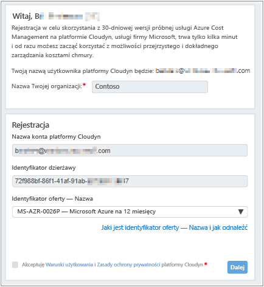
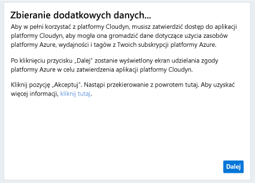
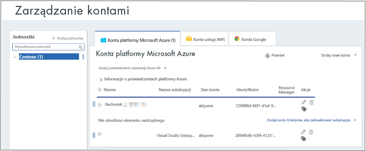

# Rejestrowanie indywidualnej subskrypcji platformy Azure i wyświetlanie informacji o koszcie

Do rejestrowania w usłudze Azure Cost Management służy subskrypcja platformy Azure. Rejestracja zapewnia dostęp do portalu firmy Cloudyn. W tym przewodniku Szybki start opisano szczegółowo proces rejestracji niezbędny do utworzenia subskrypcji wersji próbnej rozwiązania Cloudyn i zalogowania w portalu Cloudyn. Przedstawiono w nim także, jak od razu rozpocząć wyświetlanie danych kosztów.

## Zaloguj się do platformy Azure.

- Zaloguj się w witrynie Azure Portal pod adresem http://portal.azure.com.

## Tworzenie rejestracji wersji próbnej

1. W witrynie Azure Portal kliknij pozycję **Zarządzanie kosztami i rozliczenia** na liście usług.
2. W obszarze **Przegląd** kliknij pozycję **Zarządzanie kosztami**  
    
3. Na stronie **Zarządzanie kosztami** kliknij pozycję **Przejdź do zarządzania kosztami**, aby otworzyć stronę rejestracji rozwiązania Cloudyn w nowym oknie.
4. Na stronie rejestracji wersji próbnej rozwiązania Cloudyn wpisz nazwę swojej firmy i wybierz pozycję **Azure Individual Subscription Owner** (Posiadacz indywidualnej subskrypcji platformy Azure), a następnie kliknij przycisk **Next** (Dalej). Nazwa konta i identyfikator dzierżawy są automatycznie dodawane do formularza.  
    
5. Wybierz wartość **Offer ID - Name** (Identyfikator oferty —Nazwa) skojarzoną z Twoją subskrypcją. Jeśli nie masz pewności co do identyfikatora stawki dla swojej subskrypcji, możesz sprawdzić rachunek za platformę Azure i wyszukać pozycję **Offer ID** (Identyfikator oferty).
6. Zaakceptuj warunki użytkowania, zweryfikuj swoje informacje i kliknij przycisk **Next** (Dalej).
7. Na stronie **Gather additional data** (Zbierz dodatkowe dane) kliknij przycisk **Next** (Dalej), aby autoryzować rozwiązanie Cloudyn do zbierania danych zasobów platformy Azure. Te dane obejmują dane dotyczące użycia, wydajności, rozliczeń i tagów z Twoich subskrypcji.  
    
8. Przeglądarka przeniesie Cię do strony logowania w usłudze Cloudyn. Zaloguj się przy użyciu poświadczeń subskrypcji platformy Azure.
9. Kliknij pozycję **Go to Cloudyn** (Przejdź do rozwiązania Cloudyn), aby otworzyć portal Cloudyn, a następnie na stronie **Accounts Management** (Zarządzanie kontami) powinny zostać wyświetlone dane Twojego konta subskrypcji platformy Azure.  
    

Aby wyświetlić film wideo z samouczkiem dotyczącym rejestrowania subskrypcji platformy Azure, zobacz [Finding your Directory GUID and Rate ID for use in Azure Cost Management](https://youtu.be/PaRjnyaNGMI) (Wyszukiwanie identyfikatora GUID katalogu i identyfikatora stawki do korzystania z rozwiązaniem Azure Cost Management).

[!INCLUDE [cost-management-create-account-view-data](../../includes/cost-management-create-account-view-data.md)]

## Następne kroki

W tym przewodniku Szybki start opisano rejestrację w usłudze Cost Management przy użyciu danych subskrypcji platformy Azure. Przedstawiono także logowanie się do portalu Cloudyn i rozpoczęcie wyświetlania danych kosztów. Aby dowiedzieć się więcej na temat usługi Azure Cost Management, przejdź do samouczka usługi Cost Management.

> [!div class="nextstepaction"]
> [Przeglądanie użycia i kosztów](./tutorial-review-usage.md)
