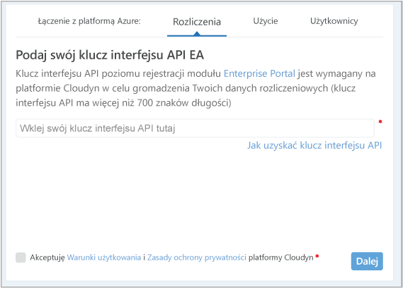
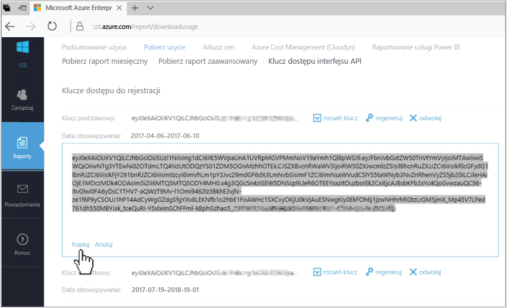
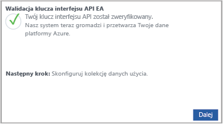

# Zarejestruj Azure Enterprise Agreement i widok danych kosztów

Umowy Enterprise Agreement Azure jest używany do rejestrowania usługi Azure Management koszt przez Cloudyn. Rejestracja umożliwia dostęp do portalu Cloudyn. Szczegóły tego szybkiego startu procesu rejestracji potrzebne do tworzenia subskrypcji wersji próbnej Cloudyn i zaloguj się do portalu Cloudyn. On również pokazano, jak zacząć od razu wyświetlanie danych kosztów.

## Zaloguj się do platformy Azure.

- Zaloguj się w witrynie Azure Portal pod adresem http://portal.azure.com.

## Tworzenie wersji próbnej rejestracji

1. W portalu Azure kliknij **kosztów zarządzania + rozliczeń** na liście usług.
2. W obszarze **omówienie**, kliknij przycisk **koszt zarządzania**  
    
3. Na **kosztów zarządzania** strony, **przejdź do zarządzania koszt** aby otworzyć stronę rejestracji Cloudyn w nowym oknie.
4. Na stronie portalu rejestracji wersji próbnej Cloudyn wpisz nazwę firmy, a następnie wybierz **administratora rejestracji Enterprise Azure**.  
    
5. Wprowadź klucz interfejsu API rejestracji Enterprise Portal. Jeśli nie masz pod ręką klucz, kliknij przycisk [Enterprise Portal](https://ea.azure.com) łącze i wykonaj następujące czynności:
  1. Zaloguj się do witryny sieci Web Azure Enterprise, a następnie kliknij przycisk **raporty**, kliknij przycisk **klucz dostępu do interfejsu API** , a następnie skopiuj klucz podstawowy.  
    
  3. Wróć do strony rejestracji i Wklej klucz interfejsu API.
6. Akceptuję warunki użytkowania, a następnie sprawdź poprawność klucza. Kliknij przycisk **dalej** do autoryzacji Cloudyn zbierać dane zasobów platformy Azure. Zbierane dane obejmują użycia i wydajności, rozliczeń i dane znacznika z subskrypcji.  
    
7. W obszarze **zapraszanie innych uczestników**, możesz dodać użytkowników, wpisując ich adresów e-mail. Po zakończeniu kliknij przycisk **dalej**. Trwa około dwie godziny dla wszystkich danych rozliczeń do zostaną dodane do Cloudyn.
8. Kliknij przycisk **przejdź do Cloudyn** aby otworzyć Cloudyn portal, a następnie na **Zarządzanie kontami chmury** strony, powinny pojawić się zarejestrowanych EA informacje o Twoim koncie.

Aby obejrzeć film samouczek dotyczący rejestrowania umowy Enterprise Agreement, zobacz [jak znaleźć swój identyfikator rejestracji EA i klucz interfejsu API do użycia w Azure koszt zarządzania, Cloudyn](https://youtu.be/u_phLs_udig).

[!INCLUDE [cost-management-create-account-view-data](../../includes/cost-management-create-account-view-data.md)]

## Następne kroki

W tego przewodnika Szybki Start Azure Enterprise Agreement informacji jest używane do rejestrowania przy kosztów zarządzania. Również zalogowaniem się do portalu Cloudyn i uruchomić, wyświetlanie danych kosztów. Aby dowiedzieć się więcej na temat zarządzania koszt Azure przez Cloudyn, nadal samouczka kosztów zarządzania.

> [!div class="nextstepaction"]
> [Przejrzyj użycia i kosztów](./tutorial-review-usage.md)
