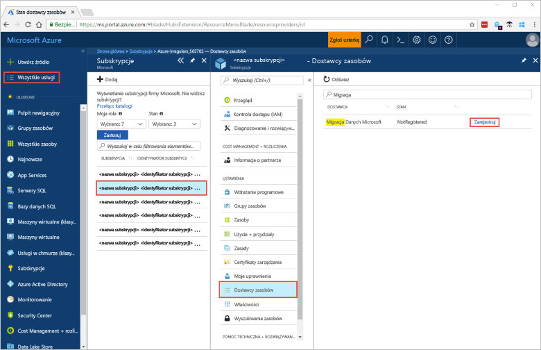
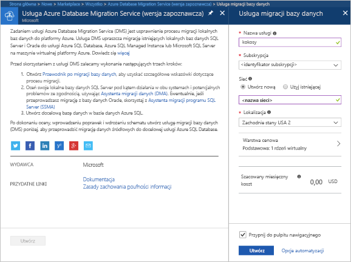
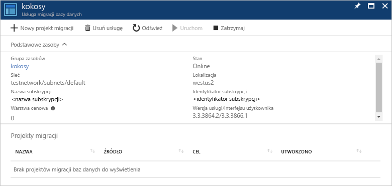

# Tworzenie wystąpienia usługi Azure Database Migration Service przy użyciu witryny Azure Portal
W tym przewodniku Szybki start utworzysz wystąpienie usługi Azure Database Migration Service przy użyciu witryny Azure Portal.  Po utworzeniu usługi możesz jej użyć do migracji danych z lokalnego programu SQL Server do bazy danych Azure SQL.

Jeśli nie masz subskrypcji platformy Azure, przed rozpoczęciem utwórz [bezpłatne](https://azure.microsoft.com/free/) konto.

## Logowanie do witryny Azure Portal
Otwórz przeglądarkę internetową, przejdź do witryny [Microsoft Azure Portal](https://portal.azure.com/), a następnie wprowadź swoje poświadczenia, aby zalogować się w portalu.

Widok domyślny to pulpit nawigacyjny usług.

## Rejestrowanie dostawcy zasobów
Przed utworzeniem pierwszego wystąpienia usługi Database Migration Service zarejestruj dostawcę zasobów Microsoft.DataMigration.

1. W witrynie Azure Portal wybierz pozycję **Wszystkie usługi**, a następnie wybierz pozycję **Subskrypcje**.

2. Wybierz subskrypcję, w której chcesz utworzyć wystąpienie usługi Azure Database Migration Service, a następnie wybierz pozycję **Dostawcy zasobów**.

3. Wyszukaj pozycję dotyczącą migracji, a następnie po prawej stronie pozycji Microsoft.DataMigration wybierz pozycję **Zarejestruj**.

## Tworzenie wystąpienia usługi
1. Kliknij pozycję **+ Utwórz zasób**, aby utworzyć wystąpienie usługi Azure Database Migration Service, która jest obecnie w wersji zapoznawczej.

2. Wyszukaj w witrynie Marketplace hasło „migration”, wybierz pozycję **Azure Database Migration Service**, a następnie na ekranie **Azure Database Migration Service (wersja zapoznawcza)** kliknij pozycję **Utwórz**.

3. Na ekranie **Database Migration Service**: 

    - Wybierz wartość **Nazwa usługi**, która jest łatwa do zapamiętania i unikatowo identyfikuje Twoje wystąpienie usługi Azure Database Migration Service.
    - Wybierz **subskrypcję** platformy Azure, w której chcesz utworzyć wystąpienie.
    - Utwórz nową pozycję **Sieć** o unikatowej nazwie.
    - Wybierz pozycję **Lokalizacja** położoną najbliżej Twojego serwera źródłowego lub docelowego.
    - Wybierz opcję Podstawowa: 1 rdzeń wirtualny dla pozycji **Warstwa cenowa**.

    
4. Wybierz pozycję **Utwórz**.

Po kilku chwilach wystąpienie usługi Azure Database Migration Service zostanie utworzone i będzie gotowe do użycia. Usługa Database Migration Service jest wyświetlana tak jak pokazano na poniższej ilustracji:

## Oczyszczanie zasobów
Możesz wyczyścić zasoby utworzone w tym przewodniku Szybki start, usuwając [grupę zasobów platformy Azure](../azure-resource-manager/resource-group-overview.md).  Aby usunąć grupę zasobów, przejdź do utworzonego wystąpienia usługi Azure Database Migration Service. Wybierz nazwę w obszarze **Grupa zasobów**, a następnie wybierz pozycję **Usuń grupę zasobów**.  Ta akcja spowoduje usunięcie wszystkich zasobów w grupie zasobów, a także usunięcie samej grupy.

## Następne kroki
> [!div class="nextstepaction"]
> [Migrowanie lokalnego programu SQL Server do usługi Azure SQL Database](tutorial-sql-server-to-azure-sql.md)