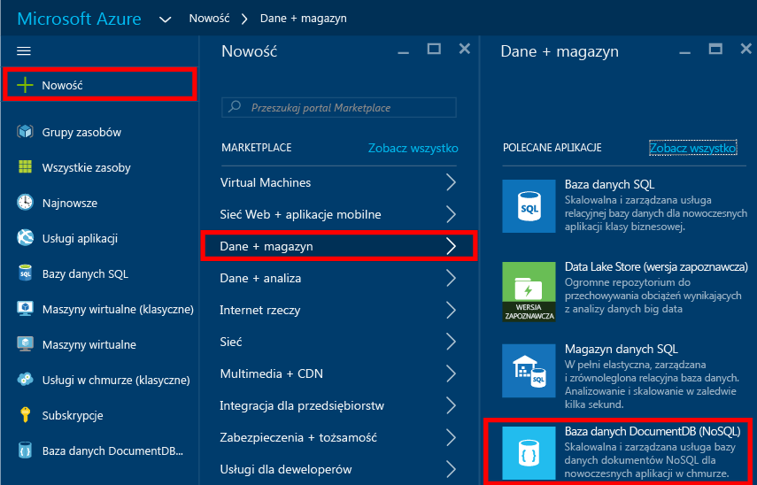
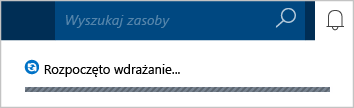
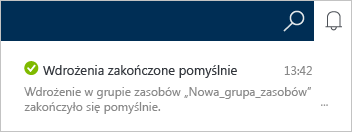
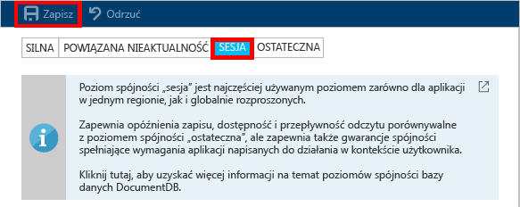

# Jak utworzyć konto usługi DocumentDB NoSQL przy użyciu witryny Azure Portal
> [!div class="op_single_selector"]
> * [Azure Portal](documentdb-create-account.md)
> * [Interfejs wiersza polecenia platformy Azure i usługa Azure Resource Manager](documentdb-automation-resource-manager-cli.md)
> 
> 

Aby utworzyć bazę danych przy użyciu usługi Microsoft Azure DocumentDB, są potrzebne:

* Konto platformy Azure. Jeśli go jeszcze nie masz, możesz utworzyć [bezpłatne konto platformy Azure](https://azure.microsoft.com/free). 
* Konto usługi DocumentDB.  

Konto usługi DocumentDB można utworzyć za pomocą witryny Azure Portal, szablonów usługi Azure Resource Manager lub interfejsu wiersza polecenia platformy Azure. W tym artykule przedstawiono, jak utworzyć konto usługi DocumentDB przy użyciu witryny Azure Portal. Aby utworzyć konto przy użyciu usługi Azure Resource Manager lub interfejsu wiersza polecenia platformy Azure, zobacz artykuł [Automate DocumentDB database account creation](documentdb-automation-resource-manager-cli.md) (Automatyzacja tworzenia konta bazy danych usługi DocumentDB).

Dopiero zaczynasz korzystać z usługi DocumentDB? Obejrzyj [to](https://azure.microsoft.com/documentation/videos/create-documentdb-on-azure/) czterominutowe nagranie, w którym Scott Hanselman pokazuje, jak wykonać typowe zadania w portalu online.

1. Zaloguj się w witrynie [Azure Portal](https://portal.azure.com/).
2. Na pasku dostępu kliknij pozycje **Nowy** i **Dane i magazyn**, a następnie kliknij pozycję **DocumentDB (NoSQL)**.
   
     
3. W bloku **Nowe konto** określ odpowiednią konfigurację konta usługi DocumentDB.
   
    
   
   * W polu **Identyfikator** wprowadź nazwę, aby zidentyfikować konto usługi DocumentDB.  Po zweryfikowaniu wartości pola **Identyfikator** w polu tym zostanie wyświetlony zielony znacznik wyboru.**** Wartość pola **Identyfikator** jest używana jako nazwa hosta w identyfikatorze URI. Pole **Identyfikator** może zawierać tylko małe litery, cyfry i znak „-” w liczbie od 3 do 50 znaków. Pamiętaj, że ciąg *documents.azure.com* jest dołączany do wybranej nazwy punktu końcowego, by utworzyć punkt końcowy konta usługi DocumentDB.
   * W polu **Interfejs API usługi NoSQL** wybierz model programowania, który ma zostać użyty:
     
     * **DocumentDB**: interfejs API usługi DocumentDB jest dostępny za pośrednictwem [zestawów SDK](documentdb-sdk-dotnet.md) .NET, Java, Node.js, Python i JavaScript, a także w środowisku HTTP [REST](https://msdn.microsoft.com/library/azure/dn781481.aspx) i umożliwia dostęp programowy do wszystkich funkcji usługi DocumentDB. 
     * **MongoDB**: usługa DocumentDB zapewnia także [obsługę na poziomie protokołu](documentdb-protocol-mongodb.md) interfejsów API usługi **MongoDB**. Po wybraniu opcji interfejsu API usługi MongoDB można używać istniejących zestawów SDK oraz [narzędzi](documentdb-mongodb-mongochef.md) usługi MongoDB do komunikacji z usługą DocumentDB. Istniejące aplikacje usługi MongoDB można [przenieść](documentdb-import-data.md) do środowiska DocumentDB [bez zmian kodu](documentdb-connect-mongodb-account.md), by używać w pełni zarządzanej bazy danych działającej jako usługa z obsługą nieograniczonego skalowania, globalnej replikacji i innych funkcji.
   * W polu **Subskrypcja** wybierz subskrypcję platformy Azure, która ma być używana dla konta usługi DocumentDB. Jeśli konto ma tylko jedną subskrypcję, jest wybierane jako domyślne.
   * W polu **Grupa zasobów** wybierz lub utwórz grupę zasobów dla konta usługi DocumentDB.  Domyślnie zostanie utworzona nowa grupa zasobów. Aby uzyskać więcej informacji, zobacz temat [Using the Azure portal to manage your Azure resources](../azure-portal/resource-group-portal.md) (Korzystanie z witryny Azure Portal do zarządzania zasobami Azure).
   * Użyj opcji **Lokalizacja**, aby określić lokalizację geograficzną, w której będzie hostowane konto usługi DocumentDB. 
4. Po skonfigurowaniu opcji nowego konta usługi DocumentDB kliknij przycisk **Utwórz**. Aby sprawdzić stan wdrożenia, przejdź do centrum powiadomień.  
   
     
   
   
5. Utworzone konto usługi DocumentDB jest gotowe do użycia z ustawieniami domyślnymi. Domyślna spójność konta usługi DocumentDB jest ustawiona na wartość **Sesja**.  Można ją dostosować, klikając pozycję **Domyślna spójność** w menu zasobów. Aby dowiedzieć się więcej na temat poziomów spójności oferowanych przez usługę DocumentDB, zobacz temat [Consistency levels in DocumentDB](documentdb-consistency-levels.md) (Poziomy spójności w usłudze DocumentDB).
   
     
   
     

[Porady: tworzenie konta usługi DocumentDB]: #Howto
[Następne kroki]: #NextSteps
[documentdb-manage]:../articles/documentdb/documentdb-manage.md

## Następne kroki
Gdy masz już konto usługi DocumentDB, następnym krokiem jest utworzenie bazy danych usługi DocumentDB. 

Nową bazę danych można utworzyć, korzystając z jednego z następujących zasobów:

* witryny Azure Portal, zgodnie z opisem w artykule [Create a DocumentDB database using the Azure portal](documentdb-create-database.md) (Tworzenie bazy danych usługi DocumentDB za pomocą witryny Azure Portal);
* kompleksowych samouczków z przykładowymi danymi, dotyczących technologii [.NET](documentdb-get-started.md), [.NET MVC](documentdb-dotnet-application.md), [Java](documentdb-java-application.md), [Node.js](documentdb-nodejs-application.md) lub [Python](documentdb-python-application.md);
* przykładowego kodu w języku [.NET](documentdb-dotnet-samples.md#database-examples), [Node.js](documentdb-nodejs-samples.md#database-examples) lub [Python](documentdb-python-samples.md#database-examples) dostępnego w witrynie GitHub;
* zestawów SDK środowisk [.NET](documentdb-sdk-dotnet.md), [Node.js](documentdb-sdk-node.md), [Java](documentdb-sdk-java.md), [Python](documentdb-sdk-python.md) i [REST](https://msdn.microsoft.com/library/azure/mt489072.aspx).

Po utworzeniu bazy danych należy do niej [dodać co najmniej jedną kolekcję](documentdb-create-collection.md), a następnie [dodać dokumenty](documentdb-view-json-document-explorer.md) do kolekcji.

Gdy dokumenty znajdą się w kolekcji, można użyć [bazy danych SQL usługi DocumentDB](documentdb-sql-query.md) do [wykonywania zapytań](documentdb-sql-query.md#executing-queries) dotyczących tych dokumentów. Zapytania można wykonywać za pomocą narzędzia [Eksplorator zapytań](documentdb-query-collections-query-explorer.md) w witrynie Azure Portal, [interfejsu API REST](https://msdn.microsoft.com/library/azure/dn781481.aspx) lub jednego z [zestawów SDK](documentdb-sdk-dotnet.md).

### Dowiedz się więcej
Aby dowiedzieć się więcej na temat usługi DocumentDB, zapoznaj się z tymi zasobami:

* [Ścieżka szkoleniowa dotycząca usługi DocumentDB](https://azure.microsoft.com/documentation/learning-paths/documentdb/)
* [Pojęcia i hierarchiczny model zasobów bazy danych DocumentDB](documentdb-resources.md)

<!--HONumber=Oct16_HO1-->

