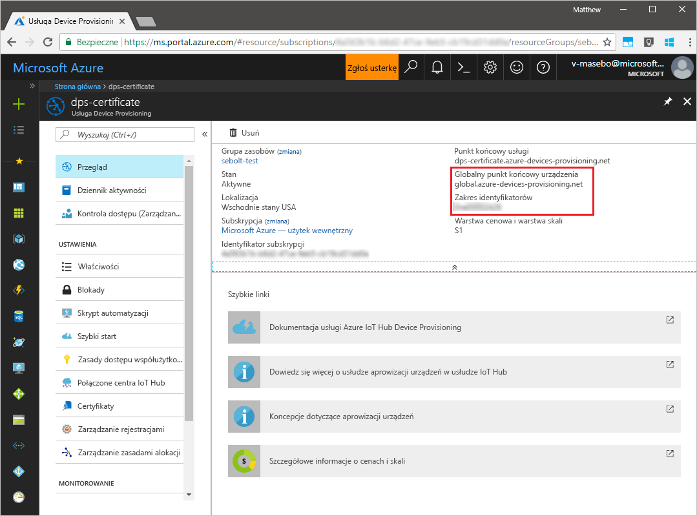
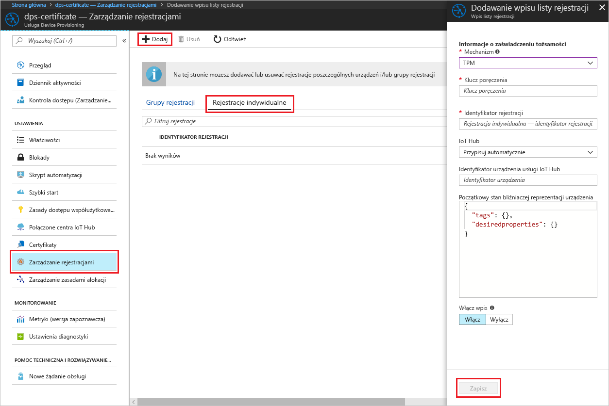
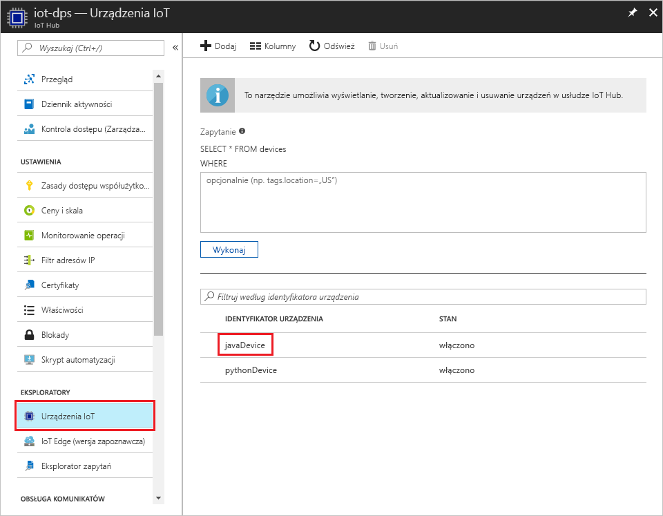

# <a name="create-and-provision-a-simulated-tpm-device-using-java-device-sdk-for-azure-iot-hub-device-provisioning-service"></a>Tworzenie i aprowizowanie symulowanego urządzenia TPM za pomocą zestawu SDK języka Java dla usługi Azure IoT Hub Device Provisioning

[!INCLUDE [iot-dps-selector-quick-create-simulated-device-tpm](../../includes/iot-dps-selector-quick-create-simulated-device-tpm.md)]

Te kroki pokazują, jak utworzyć symulowane urządzenie na maszynie deweloperskiej z systemem operacyjnym Windows OS, uruchomić symulator modułu Windows TPM jako [sprzętowy moduł zabezpieczeń (HSM)](https://azure.microsoft.com/blog/azure-iot-supports-new-security-hardware-to-strengthen-iot-security/) urządzenia i użyć przykładowego kodu do połączenia tego symulowanego urządzenia z usługą Device Provisioning Service i Twoim centrum IoT. 

Pamiętaj, aby wcześniej wykonać kroki przedstawione w części [Konfigurowanie usługi IoT Hub Device Provisioning za pomocą witryny Azure Portal](./quick-setup-auto-provision.md).


## <a name="prepare-the-environment"></a>Przygotowywanie środowiska 

1. Upewnij się, że na maszynie zainstalowano środowisko [Java SE Development Kit 8](http://www.oracle.com/technetwork/java/javase/downloads/jdk8-downloads-2133151.html).

1. Pobierz i zainstaluj pakiet [Maven](https://maven.apache.org/install.html).

1. Upewnij się, że na swojej maszynie masz zainstalowane oprogramowanie `git` i że jest ono dodane do zmiennych środowiskowych dostępnych z okna poleceń. Zobacz stronę z [narzędziami klienckimi Git organizacji Software Freedom Conservancy](https://git-scm.com/download/), aby uzyskać najnowszą wersję narzędzi `git` do zainstalowania, które obejmują powłokę **Git Bash**, czyli aplikację wiersza polecenia, która może służyć do interakcji z lokalnym repozytorium Git. 

1. Otwórz wiersz polecenia. Sklonuj repozytorium GitHub dla przykładu kodu symulacji urządzenia.
    
    ```cmd/sh
    git clone https://github.com/Azure/azure-iot-sdk-java.git --recursive
    ```

1. Uruchom symulator [TPM](https://docs.microsoft.com/windows/device-security/tpm/trusted-platform-module-overview). Kliknij pozycję **Zezwól na dostęp**, aby zezwolić na wprowadzanie zmian ustawień _Zapory systemu Windows_. Nasłuchuje on przez gniazdo na portach 2321 i 2322. Nie zamykaj tego okna; będzie ono potrzebne, aby ten symulator działał do czasu zakończenia tego przewodnika Szybki start. 

    ```cmd/sh
    .\azure-iot-sdk-java\provisioning\provisioning-tools\tpm-simulator\Simulator.exe
    ```

    

1. W osobnym wierszu polecenia przejdź do folderu głównego i skompiluj przykładowe zależności.

    ```cmd/sh
    cd azure-iot-sdk-java
    mvn install -DskipTests=true
    ```

1. Przejdź do folderu przykładów.

    ```cmd/sh
    cd provisioning/provisioning-samples/provisioning-tpm-sample
    ```

1. Zaloguj się w witrynie Azure Portal, kliknij przycisk **Wszystkie zasoby** w menu po lewej stronie i otwórz swoją usługę Device Provisioning Service. Zanotuj wartości _Zakres identyfikatorów_ i _Globalny punkt końcowy usługi Provisioning Service_.

    

1. Edytuj plik `src/main/java/samples/com/microsoft/azure/sdk/iot/ProvisioningTpmSample.java`, aby uwzględnić w nim wspomniane wcześniej wartości _Identyfikatora zakresu_ i _Globalnego punktu końcowego usługi aprowizacji_.  

    ```java
    private static final String idScope = "[Your ID scope here]";
    private static final String globalEndpoint = "[Your Provisioning Service Global Endpoint here]";
    private static final ProvisioningDeviceClientTransportProtocol PROVISIONING_DEVICE_CLIENT_TRANSPORT_PROTOCOL = ProvisioningDeviceClientTransportProtocol.HTTPS;
    ```

1. Skompiluj projekt. Przejdź do folderu docelowego i wykonaj utworzony plik jar.

    ```cmd/sh
    mvn clean install
    cd target
    java -jar ./provisioning-tpm-sample-{version}-with-deps.jar
    ```

1. Rozpocznie się działanie programu. Zanotuj _klucz poręczenia_ i _identyfikator rejestracji_ na potrzeby następnej sekcji i pozostaw uruchomiony program.

    
    

## <a name="create-a-device-enrollment-entry"></a>Tworzenie wpisu rejestracji urządzenia

1. Zaloguj się w witrynie Azure Portal, kliknij przycisk **Wszystkie zasoby** w menu po lewej stronie i otwórz swoją usługę Device Provisioning Service.

1. W bloku podsumowania usługi Device Provisioning Service wybierz pozycję **Zarządzaj rejestracjami**. Wybierz kartę **Indywidualne rejestracje** i kliknij u góry przycisk **Dodaj**. 

1. W obszarze **Dodaj wpis listy rejestracji** wprowadź następujące informacje:
    - Wybierz opcję **TPM** jako *Mechanizm* poświadczania tożsamości.
    - Wprowadź dane w polach *Identyfikator rejestracji* i *Klucz poręczenia* dla urządzenia TPM, używając poprzednio zanotowanych wartości. 
    - Wybierz centrum IoT połączone z Twoją usługą aprowizacji.
    - Wprowadź unikatowy identyfikator urządzenia. Nadając nazwę urządzeniu, unikaj korzystania z danych poufnych.
    - Zaktualizuj pole **Początkowy stan bliźniaczej reprezentacji urządzenia** za pomocą wybranej konfiguracji początkowej dla urządzenia.
    - Gdy skończysz, kliknij przycisk **Zapisz**. 

      

   Po pomyślnej rejestracji *Identyfikator rejestracji* Twojego urządzenia pojawia się na liście na karcie *Indywidualne rejestracje*. 


## <a name="simulate-the-device"></a>Symulowanie urządzenia

1. W oknie polecenia z uruchomionym przykładowym kodem języka Java na maszynie naciśnij klawisz Enter, aby kontynuować uruchamianie aplikacji. Zwróć uwagę na komunikaty symulujące uruchamianie urządzenia i łączenie z usługą Device Provisioning Service w celu pobrania informacji z Twojego centrum IoT.  

    

1. Po pomyślnej aprowizacji symulowanego urządzenia w centrum IoT powiązanym z Twoją usługą aprowizacji identyfikator urządzenia będzie widoczny w centrum w bloku **Eksplorator urządzeń**.

     

    Jeśli zmienisz wartość w polu *Początkowy stan bliźniaczej reprezentacji urządzenia* z domyślnej na inną we wpisie rejestracji dla Twojego urządzenia, może to spowodować pobranie z centrum żądanego stanu reprezentacji bliźniaczej i odpowiednie do niego działanie. Aby uzyskać więcej informacji, zobacz [Opis bliźniaczej reprezentacji urządzenia w usłudze IoT Hub oraz sposoby jej używania](../iot-hub/iot-hub-devguide-device-twins.md)


## <a name="clean-up-resources"></a>Oczyszczanie zasobów

Jeśli planujesz dalszą pracę z przykładem klienta urządzenia i eksplorowanie go, nie czyść zasobów utworzonych w ramach tego przewodnika Szybki start. Jeśli nie planujesz kontynuować pracy, wykonaj poniższe kroki, aby usunąć wszystkie zasoby utworzone w ramach tego przewodnika Szybki start.

1. Zamknij okno danych wyjściowych przykładu klienta urządzenia na swojej maszynie.
1. Zamknij okno symulatora modułu TPM na swojej maszynie.
1. W witrynie Azure Portal w menu po lewej stronie kliknij pozycję **Wszystkie zasoby**, a następnie wybierz swoją usługę Device Provisioning Service. Otwórz blok **Zarządzanie rejestracjami** dla usługi, a następnie kliknij kartę **Rejestracje indywidualne**. Wybierz *IDENTYFIKATOR REJESTRACJI* urządzenia zarejestrowanego w ramach tego przewodnika Szybki start i kliknij przycisk **Usuń** u góry. 
1. W witrynie Azure Portal w menu po lewej stronie kliknij pozycję **Wszystkie zasoby**, a następnie wybierz swoje centrum IoT. Otwórz blok **Urządzenia IoT** Twojego centrum, wybierz *IDENTYFIKATOR URZĄDZENIA* zarejestrowanego w ramach tego przewodnika Szybki start, a następnie kliknij przycisk **Usuń** u góry.

## <a name="next-steps"></a>Następne kroki

W tym przewodniku Szybki start na Twojej maszynie zostało utworzone symulowane urządzenie TPM, które zostało zaaprowizowane do Twojego centrum IoT przy użyciu usługi IoT Hub Device Provisioning. Aby dowiedzieć się, jak zarejestrować urządzenie TPM programowo, przejdź do przewodnika Szybki start dotyczącego programowej rejestracji urządzenia TPM. 

> [!div class="nextstepaction"]
> [Przewodnik Szybki start platformy Azure — rejestrowanie urządzenia TPM w usłudze Azure IoT Hub Device Provisioning](quick-enroll-device-tpm-java.md)
