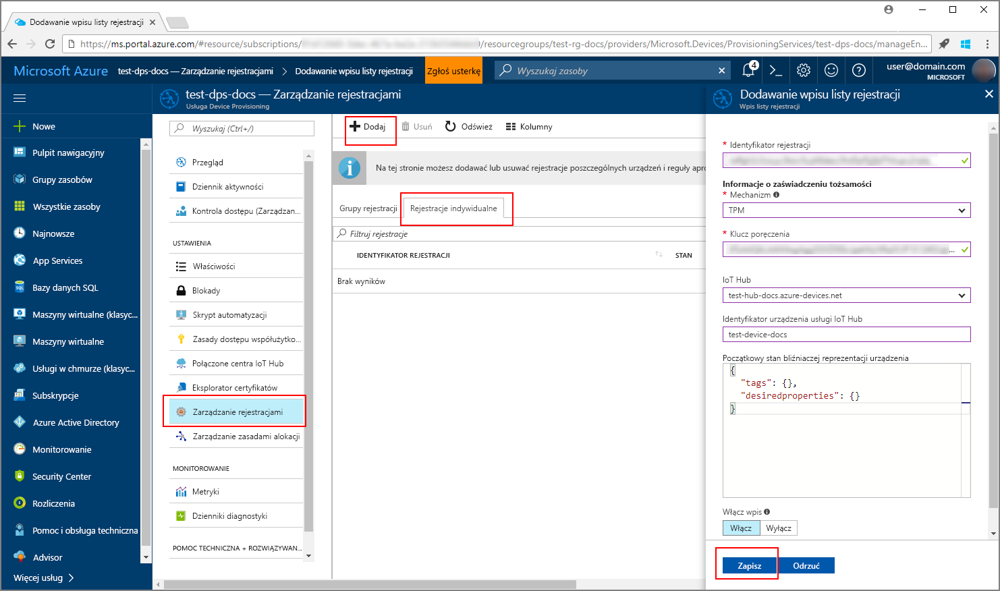
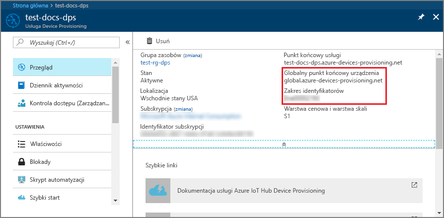
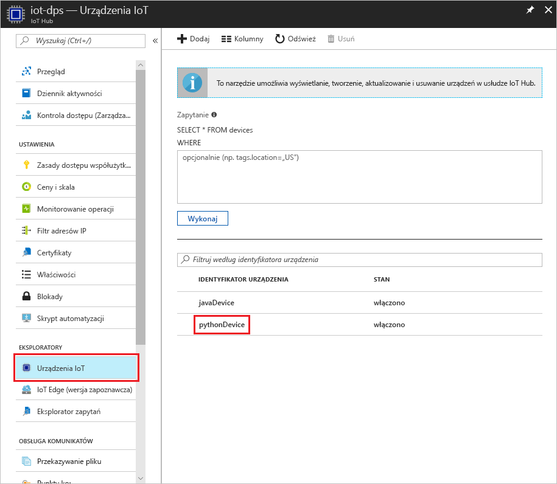

# <a name="create-and-provision-a-simulated-tpm-device-using-java-device-sdk-for-iot-hub-device-provisioning-service"></a>Tworzenie i aprowizowanie symulowanego urządzenia TPM za pomocą zestawu SDK urządzenia Java dla usługi IoT Hub Device Provisioning
> [!div class="op_single_selector"]
> * [C](quick-create-simulated-device.md)
> * [Java](quick-create-simulated-device-tpm-java.md)
> * [C#](quick-create-simulated-device-tpm-csharp.md)
> * [Python](quick-create-simulated-device-tpm-python.md)

Te kroki pokazują, jak utworzyć symulowane urządzenie na maszynie deweloperskiej z systemem operacyjnym Windows, uruchomić symulator modułu Windows TPM jako [sprzętowy moduł zabezpieczeń (HSM)](https://azure.microsoft.com/blog/azure-iot-supports-new-security-hardware-to-strengthen-iot-security/) urządzenia i użyć przykładowego kodu Python do połączenia tego symulowanego urządzenia z usługą Device Provisioning i Twoim centrum IoT. 

Pamiętaj, aby wcześniej wykonać kroki przedstawione w części [Konfigurowanie usługi IoT Hub Device Provisioning Service za pomocą witryny Azure Portal](./quick-setup-auto-provision.md).


## <a name="prepare-the-environment"></a>Przygotowywanie środowiska 

1. Upewnij się, że masz na swojej maszynie zainstalowany program [Visual Studio 2015](https://www.visualstudio.com/vs/older-downloads/) lub [Visual Studio 2017](https://www.visualstudio.com/vs/). Musisz mieć włączony pakiet roboczy „Programowanie aplikacji klasycznych w języku C++” dla instalacji programu Visual Studio.

1. Pobierz i zainstaluj [system kompilacji CMake](https://cmake.org/download/).

1. Upewnij się, że na swojej maszynie masz zainstalowane oprogramowanie `git` i że jest ono dodane do zmiennych środowiskowych dostępnych z okna poleceń. Zobacz stronę z [narzędziami klienckimi Git organizacji Software Freedom Conservancy](https://git-scm.com/download/), aby uzyskać najnowszą wersję narzędzi `git` do zainstalowania, które obejmują powłokę **Git Bash**, czyli aplikację wiersza polecenia, która może służyć do interakcji z lokalnym repozytorium Git. 

1. Otwórz wiersz polecenia lub powłokę Git Bash. Sklonuj repozytorium GitHub dla przykładu kodu symulacji urządzenia:
    
    ```cmd/sh
    git clone https://github.com/Azure/azure-iot-sdk-python.git --recursive
    ```

1. Utwórz folder w swojej lokalnej kopii tego repozytorium GitHub dla procesu kompilacji CMake. 

    ```cmd/sh
    cd azure-iot-sdk-python/c
    mkdir cmake
    cd cmake
    ```

1. Przykład kodu korzysta z symulatora modułu Windows TPM. Uruchom następujące polecenie, aby włączyć uwierzytelnianie tokenu sygnatury dostępu współdzielonego. Polecenie to generuje także rozwiązanie programu Visual Studio dla symulowanego urządzenia.

    ```cmd/sh
    cmake -Duse_prov_client:BOOL=ON -Duse_tpm_simulator:BOOL=ON ..
    ```

1. W osobnym wierszu polecenia przejdź do folderu symulatora modułu TPM i uruchom symulator [modułu TPM](https://docs.microsoft.com/windows/device-security/tpm/trusted-platform-module-overview). Kliknij pozycję **Zezwól na dostęp**. Nasłuchuje on przez gniazdo na portach 2321 i 2322. Nie zamykaj tego okna polecenia; będzie ono potrzebne, aby ten symulator działał do czasu zakończenia tego przewodnika Szybki start. 

    ```cmd/sh
    .\azure-iot-sdk-python\c\provisioning_client\deps\utpm\tools\tpm_simulator\Simulator.exe
    ```

    


## <a name="create-a-device-enrollment-entry"></a>Tworzenie wpisu rejestracji urządzenia

1. Otwórz rozwiązanie wygenerowane w folderze programu *cmake* o nazwie `azure_iot_sdks.sln` i skompiluj je w programie Visual Studio.

1. Kliknij prawym przyciskiem myszy projekt **tpm_device_provision** i wybierz pozycję **Ustaw jako projekt startowy**. Uruchom rozwiązanie. W oknie danych wyjściowych zostaną wyświetlone wartości **_Klucz poręczenia_** i **_Identyfikator rejestracji_** potrzebne do zarejestrowania urządzenia. Zapisz te wartości. 

    

1. Zaloguj się w witrynie Azure Portal, kliknij przycisk **Wszystkie zasoby** w menu po lewej stronie i otwórz swoją usługę Device Provisioning Service.

1. W bloku podsumowania usługi Device Provisioning Service wybierz pozycję **Zarządzaj rejestracjami**. Wybierz kartę **Indywidualne rejestracje** i kliknij u góry przycisk **Dodaj**. 

1. W obszarze **Dodaj wpis listy rejestracji** wprowadź następujące informacje:
    - Wybierz opcję **TPM** jako *Mechanizm* poświadczania tożsamości.
    - Wprowadź dane w polach *Identyfikator rejestracji* i *Klucz poręczenia* dla urządzenia TPM. 
    - Wybierz centrum IoT połączone z Twoją usługą aprowizacji.
    - Wprowadź unikatowy identyfikator urządzenia. Nadając nazwę urządzeniu, unikaj korzystania z danych poufnych.
    - Zaktualizuj pole **Początkowy stan bliźniaczej reprezentacji urządzenia** za pomocą wybranej konfiguracji początkowej dla urządzenia.
    - Gdy skończysz, kliknij przycisk **Zapisz**. 

      

   Po pomyślnej rejestracji *Identyfikator rejestracji* Twojego urządzenia pojawi się na liście na karcie *Indywidualne rejestracje*. 


## <a name="simulate-the-device"></a>Symulowanie urządzenia

1. Pobierz i zainstaluj środowisko [Python 2.x lub 3.x](https://www.python.org/downloads/). Upewnij się, że używasz 32-bitowej lub 64-bitowej instalacji zgodnie z wymaganiami konfiguracji. Po wyświetleniu monitu podczas instalacji upewnij się, że język Python został dodany do zmiennych środowiskowych specyficznych dla platformy.
    - Zainstaluj [Pakiet redystrybucyjny języka Visual C++](http://www.microsoft.com/download/confirmation.aspx?id=48145) (jeśli używasz systemu operacyjnego Windows) umożliwiający korzystanie z natywnych bibliotek DLL języka Python.

1. Postępuj zgodnie z [tymi instrukcjami](https://github.com/Azure/azure-iot-sdk-python/blob/master/doc/python-devbox-setup.md), aby skompilować pakiety języka Python.

    > [!NOTE]
        > W przypadku korzystania ze skryptu `build_client.cmd` pamiętaj, aby użyć flagi `--use-tpm-simulator`.

    > [!NOTE]
        > Jeśli korzystasz z systemu `pip`, zainstaluj również pakiet `azure-iot-provisioning-device-client`. Pamiętaj, że wydane pakiety PIP korzystają z rzeczywistych modułów TPM, a nie z symulatora. Aby użyć symulatora, należy przeprowadzić kompilowanie ze źródła przy użyciu flagi `--use-tpm-simulator`.

1. Przejdź do folderu z przykładami.

    ```cmd/sh
    cd azure-iot-sdk-python/provisioning_device_client/samples
    ```

1. Korzystając ze zintegrowanego środowiska projektowego Python, poddaj edycji skrypt python o nazwie **provisioning\_device\_client\_sample.py**. Zmodyfikuj zmienne _GLOBAL\_PROV\_URI_ i _ID\_SCOPE_, ustawiając dla nich podane wcześniej wartości.

    ```python
    GLOBAL_PROV_URI = "{globalServiceEndpoint}"
    ID_SCOPE = "{idScope}"
    SECURITY_DEVICE_TYPE = ProvisioningSecurityDeviceType.TPM
    PROTOCOL = ProvisioningTransportProvider.HTTP
    ```

    

1. Uruchom przykład. 

    ```cmd/sh
    python provisioning_device_client_sample.py
    ```

1. Zwróć uwagę na komunikaty symulujące uruchamianie urządzenia i łączenie z usługą Device Provisioning Service w celu pobrania informacji z Twojego centrum IoT. 

    

1. Po pomyślnej aprowizacji symulowanego urządzenia w centrum IoT powiązanym z Twoją usługą aprowizacji identyfikator urządzenia będzie widoczny w centrum w bloku **Eksplorator urządzeń**.

     

    Jeśli zmienisz wartość w polu *Początkowy stan bliźniaczej reprezentacji urządzenia* z domyślnej na inną we wpisie rejestracji dla Twojego urządzenia, może to spowodować pobranie z centrum żądanego stanu reprezentacji bliźniaczej i odpowiednie do niego działanie. Aby uzyskać więcej informacji, zobacz [Opis bliźniaczej reprezentacji urządzenia w usłudze IoT Hub oraz sposoby jej używania](../iot-hub/iot-hub-devguide-device-twins.md)


## <a name="clean-up-resources"></a>Oczyszczanie zasobów

Jeśli planujesz dalszą pracę z przykładem klienta urządzenia i eksplorowanie go, nie czyść zasobów utworzonych w ramach tego przewodnika Szybki start. Jeśli nie planujesz kontynuować pracy, wykonaj poniższe kroki, aby usunąć wszystkie zasoby utworzone w ramach tego przewodnika Szybki start.

1. Zamknij okno danych wyjściowych przykładu klienta urządzenia na swojej maszynie.
1. Zamknij okno symulatora modułu TPM na swojej maszynie.
1. W witrynie Azure Portal w menu po lewej stronie kliknij pozycję **Wszystkie zasoby**, a następnie wybierz swoją usługę Device Provisioning Service. Otwórz blok **Zarządzanie rejestracjami** dla usługi, a następnie kliknij kartę **Rejestracje indywidualne**. Wybierz *IDENTYFIKATOR REJESTRACJI* urządzenia zarejestrowanego w ramach tego przewodnika Szybki start i kliknij przycisk **Usuń** u góry. 
1. W witrynie Azure Portal w menu po lewej stronie kliknij pozycję **Wszystkie zasoby**, a następnie wybierz swoje centrum IoT. Otwórz blok **Urządzenia IoT** Twojego centrum, wybierz *IDENTYFIKATOR URZĄDZENIA* zarejestrowanego w ramach tego przewodnika Szybki start, a następnie kliknij przycisk **Usuń** u góry.

## <a name="next-steps"></a>Następne kroki

W tym przewodniku Szybki start na Twojej maszynie zostało utworzone symulowane urządzenie TPM, które zostało zaaprowizowane do Twojego centrum IoT przy użyciu usługi IoT Hub Device Provisioning. Aby dowiedzieć się, jak zarejestrować urządzenie TPM programowo, przejdź do przewodnika Szybki start dotyczącego programowej rejestracji urządzenia TPM. 

> [!div class="nextstepaction"]
> [Przewodnik Szybki start platformy Azure — rejestrowanie urządzenia TPM w usłudze Azure IoT Hub Device Provisioning](quick-enroll-device-tpm-java.md)
