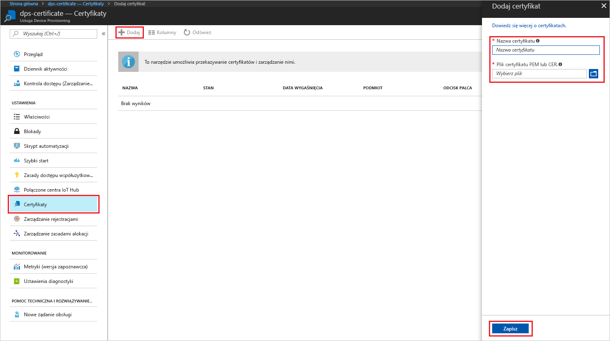

# <a name="create-and-provision-an-x509-simulated-device-using-nodejs-device-sdk-for-iot-hub-device-provisioning-service"></a>Tworzenie i aprowizowanie symulowanego urządzenia X.509 za pomocą zestawu SDK urządzenia środowiska Node.js dla usługi IoT Hub Device Provisioning
[!INCLUDE [iot-dps-selector-quick-create-simulated-device-x509](../../includes/iot-dps-selector-quick-create-simulated-device-x509.md)]

Usługa IoT Hub Device Provisioning to usługa pomocnika usługi IoT Hub zapewniająca bezobsługowe aprowizowanie urządzeń w centrum IoT. Usługa Device Provisioning umożliwia udostępnianie milionów urządzeń w bezpieczny i skalowalny sposób.

Aprowizowanie urządzeń składa się z dwóch kroków. Pierwszym krokiem jest utworzenie odpowiedniego wpisu rejestracji w usłudze Device Provisioning na podstawie określonych wymagań rozwiązania.  Drugim krokiem jest nawiązanie połączenia między urządzeniem i usługą Device Provisioning oraz zarejestrowanie urządzenia w centrum IoT. Po wykonaniu obu kroków urządzenie jest uznawane za w pełni aprowizowane. Usługa Device Provisioning automatyzuje oba kroki, aby zapewnić bezproblemowe środowisko aprowizowania dla urządzenia. Aby uzyskać więcej informacji, zobacz [Device Provisioning Service concepts (Pojęcia dotyczące usługi Device Provisioning)](https://docs.microsoft.com/en-us/azure/iot-dps/concepts-service).

W poniższych krokach pokazano, jak utworzyć wpis rejestracji w usłudze Device Provisioning, symulować urządzenie X.509 na maszynie deweloperskiej, połączyć symulowane urządzenie z usługą Device Provisioning oraz zarejestrować urządzenie w centrum IoT przy użyciu [zestawu SDK urządzenia środowiska Node.js dla usługi Azure IoT Hub](https://github.com/Azure/azure-iot-sdk-node).


## <a name="prepare-the-environment"></a>Przygotowywanie środowiska 

1. Zanim przejdziesz dalej, wykonaj kroki przedstawione w artykule [Konfigurowanie usługi IoT Hub Device Provisioning w witrynie Azure Portal](./quick-setup-auto-provision.md).

1. Upewnij się, że na komputerze jest zainstalowane [środowisko Node.js w wersji 4.0 lub nowszej](https://nodejs.org).

1. Upewnij się, że na Twojej maszynie jest zainstalowane oprogramowanie [Git](https://git-scm.com/download/) i że jest ono dodane do zmiennych środowiskowych dostępnych z okna poleceń. 

1. Upewnij się, że na Twojej maszynie jest zainstalowana biblioteka [OpenSSL](https://www.openssl.org/) i że jest ona dodana do zmiennych środowiskowych dostępnych z okna poleceń. Ta biblioteka może zostać skompilowana i zainstalowana ze źródła lub pobrana i zainstalowana od [innego podmiotu](https://wiki.openssl.org/index.php/Binaries), takiego jak [ten](https://sourceforge.net/projects/openssl/). 

    > [!NOTE]
    > Jeśli masz już utworzony certyfikat _główny_, _pośredni_ i/lub _liścia_ X.509, możesz pominąć ten krok i wszystkie następne czynności dotyczące generowania certyfikatów.
    >


## <a name="create-an-enrollment-entry"></a>Tworzenie wpisu rejestracji

Rejestracja to rekord urządzeń lub grup urządzeń, które można w pewnym momencie zarejestrować, przechowywany w usłudze Device Provisioning. Rekord rejestracji zawiera informacje o urządzeniu lub grupie urządzeń, między innymi szczegóły certyfikatu X.509 oraz dodatkowe informacje dotyczące rejestracji. Istnieją dwa rodzaje rejestracji obsługiwane przez usługę Device Provisioning: _Rejestracja indywidualna_ i _Grupa rejestracji_. Aby uzyskać więcej informacji, zobacz [Enrollment concepts (Pojęcia dotyczące rejestracji)](https://docs.microsoft.com/en-us/azure/iot-dps/concepts-service#enrollment).

Jeśli tworzysz własne certyfikaty testowe X.509, zapoznaj się z sekcją [Security concepts (Pojęcia dotyczące zabezpieczeń)](https://docs.microsoft.com/en-us/azure/iot-dps/concepts-security#x509-certificates), aby uzyskać informacje na temat certyfikatów, które są niezbędne dla danego rozwiązania, oraz z artykułem [Tools for the Azure IoT Device Provisioning Device SDK for Node.js (Narzędzia zestawu SDK urządzenia usługi Azure IoT Device Provisioning dla środowiska Node.js)](https://github.com/azure/azure-iot-sdk-node/tree/master/provisioning/tools), aby uzyskać szczegóły implementacji.

1. Otwórz wiersz polecenia. Sklonuj repozytorium GitHub, aby uzyskać przykłady kodu:
    
    ```cmd/sh
    git clone https://github.com/Azure/azure-iot-sdk-node.git --recursive
    ```

1. Przejdź do skryptu generatora certyfikatu i skompiluj projekt. 

    ```cmd/sh
    cd azure-iot-sdk-node/provisioning/tools
    npm install
    ```

1. Utwórz informacje o rejestracji w sposób zgodny z konfiguracją:

    - **Rejestracja indywidualna**:

        1. Utwórz certyfikat _liścia_, uruchamiając skrypt z użyciem Twojego parametru _certificate-name_. Pamiętaj, że nazwa pospolita certyfikatu liścia staje się [identyfikatorem rejestracji](https://docs.microsoft.com/en-us/azure/iot-dps/concepts-device#registration-id), dlatego używaj tylko małych znaków alfanumerycznych i łączników.

        ```cmd/sh
        node create_test_cert.js device {certificate-name}
        ```
         
        1. W witrynie **Azure Portal** otwórz blok podsumowania **usługi Device Provisioning**. Wybierz pozycję **Zarządzaj rejestracjami**, następnie kartę **Indywidualne rejestracje** i kliknij u góry przycisk **Dodaj**. 

        1. W obszarze **Dodaj wpis listy rejestracji** wprowadź następujące informacje:
            - Wybierz opcję **X.509** jako *Mechanizm* poświadczania tożsamości.
            - W obszarze *Plik PEM lub CER certyfikatu* wybierz plik certyfikatu **_{certificate-name}\_cert.cer_** utworzony w poprzednich krokach za pomocą widżetu *Eksplorator plików*.
            - Opcjonalnie można podać następujące informacje:
                - Wybierz centrum IoT połączone z Twoją usługą aprowizacji.
                - Wprowadź unikatowy identyfikator urządzenia. Nadając nazwę urządzeniu, unikaj korzystania z danych poufnych. 
                - Zaktualizuj pole **Początkowy stan bliźniaczej reprezentacji urządzenia** za pomocą wybranej konfiguracji początkowej dla urządzenia.
            - Gdy skończysz, kliknij przycisk **Zapisz**. 

          

    Po pomyślnej rejestracji urządzenie X.509 jest wyświetlane jako **{certificatename}** w kolumnie *Identyfikator rejestracji* na karcie *Indywidualne rejestracje*. Zanotuj tę wartość na później.

    - **Grupy rejestracji**: 

        1. Utwórz certyfikat _główny_, uruchamiając skrypt z użyciem Twojego parametru _root-name_.

        ```cmd/sh
        node create_test_cert.js root {root-name}
        ```

        1. W witrynie **Azure Portal** otwórz blok podsumowania **usługi Device Provisioning**. Wybierz pozycję **Certyfikaty** i kliknij u góry przycisk **Dodaj**.

        1. W obszarze **Dodawanie certyfikatu** wprowadź następujące informacje:
            - Wprowadź unikatową nazwę certyfikatu.
            - Wybierz utworzony wcześniej plik **_{root-name}\_cert.pem_**.
            - Gdy skończysz, kliknij przycisk **Zapisz**.

        

        1. Wybierz nowo utworzony certyfikat:
            - Kliknij pozycję **Generuj kod weryfikacyjny**. Skopiuj wygenerowany kod.
            - Utwórz certyfikat _weryfikacji_. Wprowadź _kod weryfikacyjny_ lub kliknij prawym przyciskiem myszy, aby wkleić w oknie działającego skryptu Node następujące polecenie:

                ```cmd/sh
                node create_test_cert.js verification {rootname_cert} {verification code}
                ```

            - W obszarze *Plik certyfikatu weryfikacji PEM lub CER* wybierz plik certyfikatu **_verification_cert.pem_** utworzony w poprzednich krokach za pomocą widżetu *Eksplorator plików*. Kliknij pozycję **Zweryfikuj**.

            

        1. Wybierz pozycję **Zarządzanie rejestracjami**. Wybierz kartę **Grupy rejestracji** i kliknij u góry przycisk **Dodaj**.
            - Wprowadź unikatową nazwę grupy.
            - Wybierz utworzoną wcześniej unikatową nazwę certyfikatu.
            - Opcjonalnie można podać następujące informacje:
                - Wybierz centrum IoT połączone z Twoją usługą aprowizacji.
                - Zaktualizuj pole **Początkowy stan bliźniaczej reprezentacji urządzenia** za pomocą wybranej konfiguracji początkowej dla urządzenia.

        

        Po pomyślnej rejestracji grupa urządzeń X.509 jest wyświetlana w kolumnie *Nazwa grupy* na karcie *Grupy rejestracji*. Zanotuj tę wartość na później.

        1. Utwórz certyfikat _liścia_, uruchamiając skrypt z użyciem Twoich parametrów _certificate-name_ i _root-name_, które zostały użyte wcześniej. Nazwa pospolita certyfikatu liścia staje się [identyfikatorem rejestracji](https://docs.microsoft.com/en-us/azure/iot-dps/concepts-device#registration-id), dlatego używaj tylko małych znaków alfanumerycznych i łączników.

            ```cmd/sh
            node create_test_cert.js device {certificate-name} {root-name}
            ```

        > [!NOTE]
        > Możesz również tworzyć certyfikaty _pośrednie_, używając polecenia `node create_test_cert.js intermediate {certificate-name} {parent-name}`. Upewnij się tylko, że certyfikat _liścia_ tworzysz w ostatnim kroku, używając ostatniego certyfikatu _pośredniego_ jako jego certyfikatu głównego/nadrzędnego. Aby uzyskać więcej informacji, zobacz [Controlling device access (Kontrolowanie dostępu urządzeń)](https://docs.microsoft.com/en-us/azure/iot-dps/concepts-security#controlling-device-access-to-the-provisioning-service-with-x509-certificates).
        >


## <a name="simulate-the-device"></a>Symulowanie urządzenia

[Zestaw SDK urządzenia środowiska Node.js usługi Azure IoT Hub](https://github.com/Azure/azure-iot-sdk-node) zapewnia prosty sposób symulowania urządzenia. Aby przeczytać więcej, zobacz [Device concepts (Pojęcia dotyczące urządzeń)](https://docs.microsoft.com/en-us/azure/iot-dps/concepts-device).

1. W witrynie Azure Portal wybierz blok **Przegląd** dla swojej usługi Device Provisioning i zapisz wartości **_Globalny punkt końcowy urządzenia_** oraz **_Zakres identyfikatorów_**.

     

1. Skopiuj _certyfikat_ i _klucz_ do przykładowego folderu.

    ```cmd/sh
    copy .\{certificate-name}_cert.pem ..\device\samples\{certificate-name}_cert.pem
    copy .\{certificate-name}_key.pem ..\device\samples\{certificate-name}_key.pem
    ```

1. Przejdź do skryptu testowego urządzenia i skompiluj projekt. 

    ```cmd/sh
    cd ..\device\samples
    npm install
    ```

1. Przeprowadź edycję pliku **register\_x509.js**. Po wprowadzeniu poniższych zmian zapisz plik.
    - Zastąp wartość `provisioning host` **_globalnym punktem końcowym urządzenia_** zanotowanym w **kroku 1** powyżej.
    - Zastąp wartość `id scope` **_zakresem identyfikatorów_** zanotowanym w **kroku 1** powyżej. 
    - Zastąp wartość `reigstration id` **_identyfikatorem rejestracji_** lub **_nazwą grupy_** zanotowaną w poprzedniej sekcji.
    - Zastąp wartości `cert filename` i `key filename` plikami skopiowanymi w **kroku 2** powyżej. 

1. Uruchom skrypt i sprawdź, czy urządzenie zostało pomyślnie aprowizowane.

    ```cmd/sh
    node register_x509.js
    ```   

1. W portalu przejdź do centrum IoT połączonego z usługą aprowizacji, a następnie otwórz blok **Urządzenia IoT**. Po pomyślnej aprowizacji symulowanego urządzenia X.509 w centrum identyfikator urządzenia jest wyświetlany w bloku **Urządzenia IoT** z pozycją *STATUS* (stan) ustawioną na wartość **enabled** (włączone). Jeśli blok został otwarty przed uruchomieniem przykładowej aplikacji urządzenia, konieczne może być kliknięcie przycisku **Odśwież** znajdującego się u góry. 

     

    Jeśli zmienisz wartość w polu *Początkowy stan bliźniaczej reprezentacji urządzenia* z domyślnej na inną we wpisie rejestracji dla Twojego urządzenia, może to spowodować pobranie z centrum żądanego stanu reprezentacji bliźniaczej i odpowiednie do niego działanie. Aby uzyskać więcej informacji, zobacz [Opis bliźniaczej reprezentacji urządzenia w usłudze IoT Hub oraz sposoby jej używania](../iot-hub/iot-hub-devguide-device-twins.md).


## <a name="clean-up-resources"></a>Oczyszczanie zasobów

Jeśli planujesz dalszą pracę z przykładem klienta urządzenia i eksplorowanie go, nie czyść zasobów utworzonych w ramach tego przewodnika Szybki start. Jeśli nie planujesz kontynuować pracy, wykonaj poniższe kroki, aby usunąć wszystkie zasoby utworzone w ramach tego przewodnika Szybki start.

1. Zamknij okno danych wyjściowych przykładu klienta urządzenia na swojej maszynie.
1. W witrynie Azure Portal w menu po lewej stronie kliknij pozycję **Wszystkie zasoby**, a następnie wybierz swoją usługę Device Provisioning Service. Otwórz blok **Zarządzanie rejestracjami** dla usługi, a następnie kliknij kartę **Rejestracje indywidualne** lub **Grupy rejestracji**. Wybierz *IDENTYFIKATOR REJESTRACJI* lub *NAZWĘ GRUPY* urządzenia zarejestrowanego w ramach tego przewodnika Szybki start i kliknij u góry przycisk **Usuń**. 
1. W witrynie Azure Portal w menu po lewej stronie kliknij pozycję **Wszystkie zasoby**, a następnie wybierz swoje centrum IoT. Otwórz blok **Urządzenia IoT** Twojego centrum, wybierz *IDENTYFIKATOR URZĄDZENIA* zarejestrowanego w ramach tego przewodnika Szybki start, a następnie kliknij przycisk **Usuń** u góry.


## <a name="next-steps"></a>Następne kroki

W tym przewodniku Szybki start utworzono symulowane urządzenie X.509, które zostało następnie aprowizowane w Twoim centrum IoT Hub przy użyciu usługi Azure IoT Hub Device Provisioning i portalu. Aby dowiedzieć się, jak zarejestrować urządzenie X.509 programowo, przejdź do przewodnika Szybki start dotyczącego programowej rejestracji urządzeń X.509. 

> [!div class="nextstepaction"]
> [Przewodnik Szybki start platformy Azure — Rejestrowanie urządzenia X.509 w usłudze Azure IoT Hub Device Provisioning](quick-enroll-device-x509-node.md)
