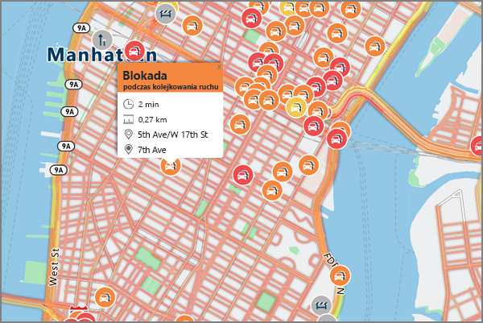

# <a name="an-introduction-to-azure-location-based-services-preview"></a>Wprowadzenie do usługi na podstawie lokalizacji platformy Azure (wersja zapoznawcza)
Usługi platformy Azure na podstawie lokalizacji jest portfolio usług dane geograficzne, które obejmują interfejsów API usługi mapy, wyszukiwania, routingu, ruchu i stref czasowych. Wchodzących w skład zestawu usługi zgodne z Azure OneAPI umożliwia przy użyciu narzędzia dla deweloperów znanych szybkiego tworzenia i skalowania rozwiązania, które zintegrować informacji o lokalizacji rozwiązań platformy Azure. Usługi platformy Azure na podstawie lokalizacji udostępnia deweloperom z wszystkich branżach geograficzne zaawansowanych możliwości mnóstwo świeże mapowanie danych staje się niezbędna dla dostarczanie geograficzne kontekst do sieci web i aplikacji dla urządzeń przenośnych. Usługi platformy Azure na podstawie lokalizacji jest zestawem zgodne jednego interfejsu API Azure interfejsów API REST wraz z formantem JavaScript opartych na sieci web aby programowanie bardzo łatwe, elastyczne i przenośnych przez wiele nośników. 

Usług Azure na podstawie lokalizacji składa się z pięciu podstawowe usługi możliwość niemal Azure aplikacji wymagających geograficzne kontekstu. Każdy z nich omówiono szczegółowo poniżej.

**Renderowanie usługi** — usługa renderowania jest przeznaczony dla deweloperów do tworzenia sieci web i aplikacji dla urządzeń przenośnych wokół mapowania. Usługa używa graficzne obrazy rastrowe wysokiej jakości, dostępne na poziomach powiększenia 19 lub można swobodnie dostosowywać wektor format mapy obrazów.


**Trasy usługi** — usługa trasy został skompilowany za obliczenia geometrii niezawodną infrastrukturę rzeczywistych i wieloma instrukcjami trybu transportu. Usługa umożliwia deweloperom obliczenia kierunki liczba tryby podróży, takie jak samochód ciężarówka, rowerów albo przejście; Podobnie jak, liczbę wejść, takie jak warunki ruchu, ograniczenia wagi lub niebezpiecznych materiału transportu.


**Usługa wyszukiwania** — Usługa wyszukiwania jest przeznaczony dla deweloperów wyszukać adresy, miejsca, business listy według nazwy lub kategorii i innych informacji geograficznych. Usługa wyszukiwania może również [wstecznego geocode](https://en.wikipedia.org/wiki/Reverse_geocoding) adresy i krzyżowego streets oparte na współrzędne/długości. 


**Usługa strefy czasowej** — usługa strefy czasowej pozwala na informacje o strefie czasowej bieżącego historycznych i przyszłych zapytania przy użyciu pary albo współrzędne geograficzne lub [identyfikator IANA](http://www.iana.org/). Usługa strefy czasowej umożliwia również konwertowanie Microsoft Windows strefy czasowej ID ze strefami czasowymi IANA, pobieranie przesunięcia strefy czasowej UTC i pobieranie bieżącego czasu w odpowiedniej strefy czasowej. Typowy odpowiedź w formacie JSON dla zapytania do usługi strefy czasowej wygląda następująco:

```JSON
{
    "Version": "2017c",
    "ReferenceUtcTimestamp": "2017-11-20T23:09:48.686173Z",
    "TimeZones": [{
        "Id": "America/Los_Angeles",
        "ReferenceTime": {
            "Tag": "PST",
            "StandardOffset": "-08:00:00",
            "DaylightSavings": "00:00:00",
            "WallTime": "2017-11-20T15:09:48.686173-08:00",
            "PosixTzValidYear": 2017,
            "PosixTz": "PST+8PDT,M3.2.0,M11.1.0"
        }
    }]
}
```

**Ruch usługi** — ruch usługa to zestaw usług sieci web przeznaczone dla deweloperów do tworzenia sieci web i aplikacji dla urządzeń przenośnych wymagające ruchu. Oferta jest podzielony na następujące czynności:
1. Przepływu ruchu - zapewnia szybkości obserwowanych w czasie rzeczywistym i podróży razy dla wszystkich drogi klucza w sieci. a 
2. Ruch zdarzenia - zapewnia dokładnego widoku o blokada ruch i zdarzenia wokół sieci drogowej.



Usługi platformy Azure na podstawie lokalizacji zaprojektowano pod kątem mobilności i można włączenie aplikacji dla wielu platform, ponieważ model programowania jest niezależny i obsługuje dane wyjściowe JSON za pośrednictwem interfejsów API REST. Ponadto kg Azure oferuje wygodny formantu mapy JavaScript z prosty model programowania do szybkiego ułatwiający projektowanie sieci web i aplikacji dla urządzeń przenośnych. 

Schemat uwierzytelniania opartego na kluczach korzysta z usług Azure na podstawie lokalizacji, więc dostęp do usług jest przejście do sprawę [portalu Azure](http://portal.azure.com) i tworzenia konta usługi na podstawie lokalizacji platformy Azure. Twoje konto ma dwa klucze wstępnie wygenerowane automatycznie. Rozpocząć integrowanie tych możliwości lokalizacji bezpośrednio do aplikacji przy użyciu kluczy w żądaniach wysyłanych do usługi Azure usług lokalizacji.

Zaloguj się do [usługi na podstawie lokalizacji Azure konto już dziś!](http://aka.ms/azurelbsportal)

## <a name="next-steps"></a>Następne kroki

Masz teraz omówienie lokalizacji na podstawie usług Azure (wersja zapoznawcza). Następnym krokiem jest wypróbowanie przykładowej aplikacji prezentacji usługi na podstawie lokalizacji, a także utworzyć scenariusz end-to-end w aplikacji sieci web.

> [!div class="nextstepaction"]
> [Uruchamianie interaktywnego mapy pokaz wyszukiwanie przy użyciu usługi na podstawie lokalizacji platformy Azure (wersja zapoznawcza)](quick-demo-map-app.md)
> [wyszukiwania w pobliżu z interesujących przy użyciu usługi na podstawie lokalizacji platformy Azure](tutorial-search-location.md)