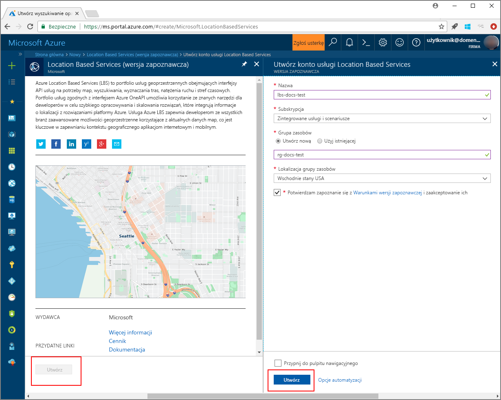

# Uruchamianie demonstracyjnego wyszukiwania na mapie za pomocą usług Azure Location Based Services (wersja zapoznawcza)

W tym artykule przedstawiono możliwości usług Azure Location Based Services (LBS) w zakresie korzystania z interakcyjnego wyszukiwania przy użyciu usługi Azure Maps. W tym artykule zawarto również podstawowe kroki tworzenia własnego konta usług LBS i uzyskiwania klucza konta na potrzeby korzystania z demonstracyjnej aplikacji internetowej. 

Jeśli nie masz subskrypcji platformy Azure, przed rozpoczęciem utwórz [bezpłatne konto](https://azure.microsoft.com/free/?WT.mc_id=A261C142F).

## Logowanie do witryny Azure Portal

Zaloguj się do witryny [Azure Portal](https://portal.azure.com/).

## Tworzenie konta usług Location Based Services i uzyskiwanie klucza konta

1. W lewym górnym rogu witryny [Azure Portal](https://portal.azure.com) kliknij przycisk **Utwórz zasób**.
2. W polu *Wyszukaj w portalu Marketplace* wpisz **location based services**.
3. Na liście *Wyniki* kliknij pozycję **Usługi oparte na lokalizacji (preview)**. Kliknij przycisk **Utwórz** znajdujący się poniżej mapy. 
4. Na stronie **Utwórz konto usług Location Based Services** wprowadź *nazwę* dla nowego konta, wybierz *subskrypcję*, która będzie używana, a następnie wprowadź nazwę nowej lub istniejącej *Grupy zasobów*. Wybierz lokalizację grupy zasobów, zaakceptuj *Warunki dotyczące wersji zapoznawczej* i kliknij przycisk **Utwórz**.

    

5. Po pomyślnym utworzeniu konta otwórz je i przejdź do sekcji **USTAWIENIA** konta. Kliknij pozycję **Klucze**, aby uzyskać klucz podstawowy i klucz pomocniczy dla swojego konta usług Azure Location Based Services. Skopiuj wartość pola **Klucz podstawowy** do lokalnego schowka do użycia w następnej sekcji. 

## Pobieranie aplikacji demonstracyjnej dla usługi Azure Maps

1. Pobierz lub skopiuj zawartość pliku [interactiveSearch.html](https://github.com/Azure-Samples/location-based-services-samples/blob/master/src/interactiveSearch.html).
2. Zapisz lokalnie zawartość tego pliku jako **AzureMapDemo.html** i otwórz go w edytorze tekstów.
3. Wyszukaj ciąg `<insert-key>` i zamień go na wartość pola **Klucz podstawowy** uzyskaną w poprzedniej sekcji. 

## Uruchamianie aplikacji demonstracyjnej dla usługi Azure Maps

1. Otwórz plik **AzureMapDemo.html** w wybranej przeglądarce.
2. Spójrz na mapę Los Angeles. To miasto jest określone przy użyciu pary wartości `[longitude, latitude]` przekazywanych do zmiennej JavaScript o nazwie **center** w pliku *AzureMapDemo.html*. Możesz zmienić te współrzędne na dowolne inne miasto. Na przykład współrzędne Nowego Jorku to *[-74.0060, 40.7128]*.
3. W polu wyszukiwania w lewym górnym rogu demonstracyjnej aplikacji internetowej wprowadź dowolny typ lokalizacji lub adres do wyszukania. 
4. Przesuń wskaźnik myszy na listę adresów/lokalizacji wyświetlonych poniżej pola wyszukiwania i zaobserwuj, jak odpowiedni punkt na mapie wyświetla informacje o konkretnej lokalizacji. Na przykład przykładowe uruchomienie aplikacji internetowej i wyszukanie *restauracji* prowadzi do następujących wyników. Należy pamiętać, że ze względu na ochronę danych prywatnych firm wyświetlono fikcyjne nazwy i adresy. 

    

## Oczyszczanie zasobów

W tych samouczkach opisano szczegółowo sposób użycia i konfigurowania usług Azure Location Based Services dla konta. Jeśli planujesz kontynuować pracę z kolejnymi samouczkami, nie usuwaj zasobów utworzonych w tym przewodniku Szybki start. Jeśli nie planujesz kontynuować pracy, wykonaj poniższe kroki, aby usunąć wszystkie zasoby utworzone w ramach tego przewodnika Szybki start.

1. Zamknij przeglądarkę z uruchomioną aplikacją internetową **AzureMapDemo.html**.
2. W witrynie Azure Portal w menu po lewej stronie kliknij pozycję **Wszystkie zasoby**, a następnie wybierz swoje konto usług LBS. U góry bloku **Wszystkie zasoby** kliknij pozycję **Usuń**.

## Następne kroki

W tym przewodniku Szybki start utworzyliśmy konto usług Azure LBS i przy użyciu tego konta uruchomiliśmy demonstracyjną aplikację. Aby się dowiedzieć, jak utworzyć własną aplikację przy użyciu interfejsu API usług Azure Location Based Services, przejdź do następnego samouczka.

> [!div class="nextstepaction"]
> [Samouczek korzystania z usług Azure Map i Search](./tutorial-search-location.md)
