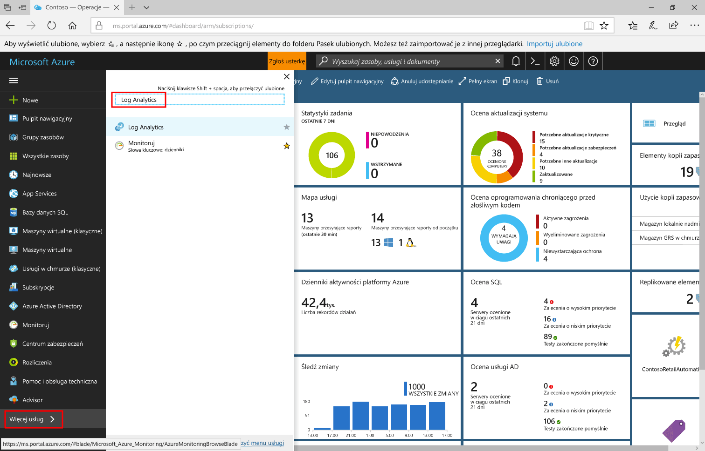
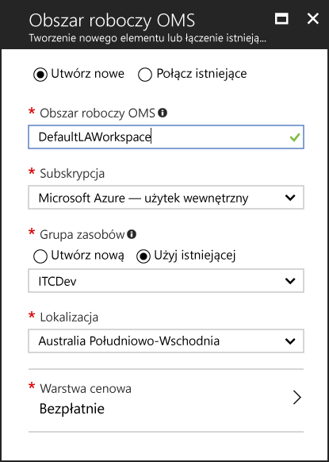
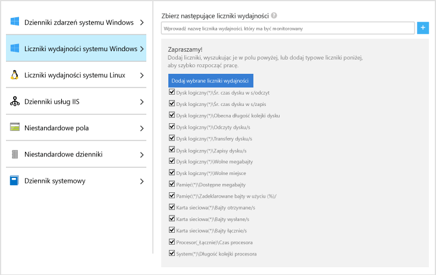
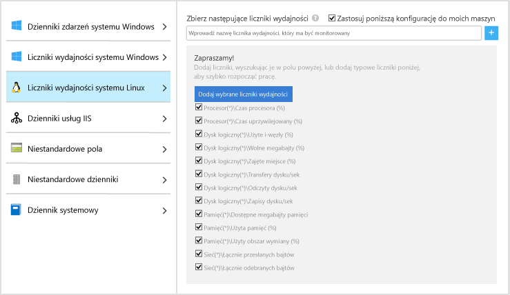
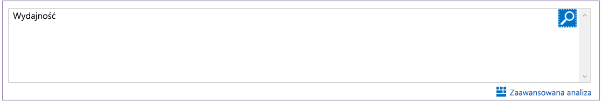
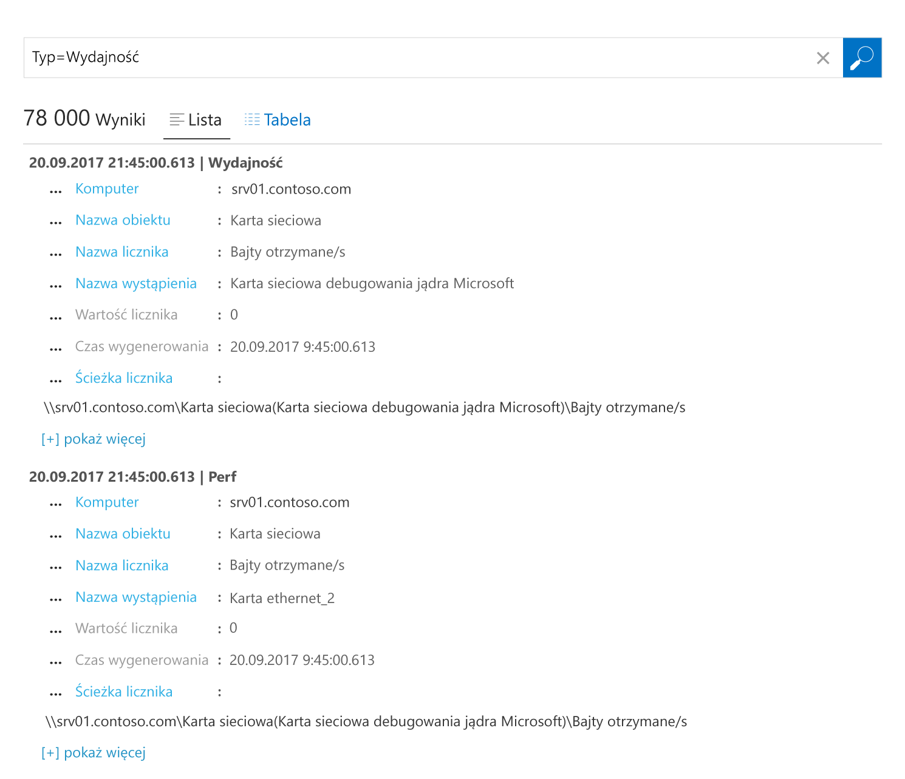
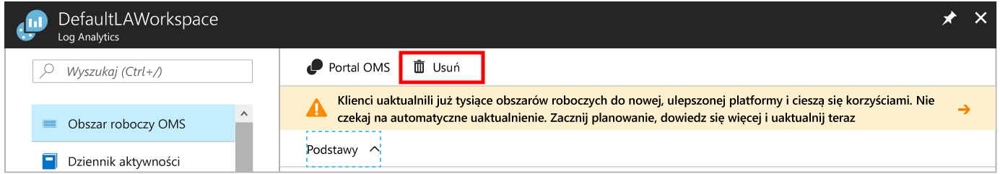

# Zbieranie danych dotyczących infrastruktury Azure Virtual Machines
Usługa [Azure Log Analytics](log-analytics-overview.md) umożliwia zbieranie danych bezpośrednio z maszyn wirtualnych platformy Azure i innych zasobów w środowisku do pojedynczego repozytorium na potrzeby szczegółowej analizy i korelacji.  W tym przewodniku Szybki start opisano, jak w kilku krokach skonfigurować i rozpocząć zbieranie danych z maszyn wirtualnych platformy Azure z systemem Linux lub Windows.  
 
W tym przewodniku Szybki start przyjęto założenie, że masz już maszynę wirtualną platformy Azure. Jeśli jeszcze jej nie masz, możesz [utworzyć maszynę wirtualną z systemem Windows](../virtual-machines/windows/quick-create-portal.md) lub [utworzyć maszynę wirtualną z systemem Linux](../virtual-machines/linux/quick-create-cli.md), wykonując czynności opisane w przewodnikach Szybki start dotyczących maszyn wirtualnych.

## Logowanie do witryny Azure Portal
Zaloguj się do witryny Azure Portal pod adresem [https://portal.azure.com](https://portal.azure.com). 

## Tworzenie obszaru roboczego
1. W witrynie Azure Portal kliknij pozycję **Wszystkie usługi**. Na liście zasobów wpisz **Log Analytics**. Po rozpoczęciu pisania zawartość listy jest filtrowana w oparciu o wpisywane dane. Wybierz pozycję **Log Analytics**.     
2. Kliknij pozycję **Utwórz**, a następnie wybierz opcje dla następujących elementów:

  * Podaj nazwę dla nowego **obszaru roboczego OMS**, na przykład *DefaultLAWorkspace*. 
  * Wybierz **Subskrypcję** do połączenia poprzez wybór subskrypcji z listy rozwijanej, jeśli domyślnie wybrana subskrypcja jest niewłaściwa.
  * W obszarze **Grupa zasobów** wybierz istniejącą grupę zasobów, która zawiera co najmniej jedną maszynę wirtualną platformy Azure.  
  * W polu **Lokalizacja** wybierz lokalizację, w której wdrożono maszyny wirtualne.  Aby uzyskać dodatkowe informacje, sprawdź, w których [regionach jest dostępna usługa Log Analytics](https://azure.microsoft.com/regions/services/).
  * Usługa Log Analytics oferuje do wyboru trzy różne **warstwy cenowe**, ale na potrzeby tego przewodnika Szybki start wybierz warstwę **bezpłatną**.  Aby uzyskać dodatkowe informacje dotyczące konkretnej warstwy, zobacz [Log Analytics — cennik](https://azure.microsoft.com/pricing/details/log-analytics/).

           
3. Po podaniu wymaganych informacji w okienku **Obszar roboczy OMS** kliknij przycisk **OK**.  

Podczas weryfikowania informacji i tworzenia obszaru roboczego możesz śledzić postęp w sekcji **Powiadomienia** z poziomu menu. 

## Włączanie rozszerzenia Log Analytics VM Extension
W przypadku wdrożonych już na platformie Azure maszyn wirtualnych z systemem Windows i Linux agent usługi Log Analytics jest instalowany za pomocą rozszerzenia Log Analytics VM Extension.  Użycie tego rozszerzenia upraszcza proces instalacji i automatycznie konfiguruje agenta do przesyłania danych do określonego obszaru roboczego usługi Log Analytics. Agent jest również automatycznie uaktualniany, co zapewnia, że posiadane funkcje i poprawki są zawsze najnowsze.

>[!NOTE]
>Agenta pakietu OMS dla systemu Linux nie można skonfigurować w taki sposób, aby przesyłał raporty do więcej niż jednego obszaru roboczego usługi Log Analytics. 

Jeśli obszar roboczy utworzono w chmurze na platformie Azure dla instytucji rządowych, w górnej części strony zasobów usługi Log Analytics w portalu może zostać wyświetlony baner z zaproszeniem do uaktualnienia.  Uaktualnienie nie jest wymagane na potrzeby tego przewodnika Szybki start. 

.    
1. W witrynie Azure Portal kliknij pozycję **Więcej usług** w lewym dolnym rogu. Na liście zasobów wpisz **Log Analytics**. Po rozpoczęciu pisania zawartość listy jest filtrowana w oparciu o wpisywane dane. Wybierz pozycję **Log Analytics**.
2. Na liście obszarów roboczych usługi Log Analytics wybierz utworzony wcześniej obszar *DefaultLAWorkspace*.
3. W menu po lewej stronie w obszarze Źródła danych obszaru roboczego kliknij pozycję **Maszyny wirtualne**.  
4. Z listy **Maszyny wirtualne** wybierz maszynę wirtualną, na której chcesz zainstalować agenta. Zwróć uwagę, że **Stan połączenia pakietu OMS** dla maszyny wirtualnej wskazuje, że jest ona **Niepołączona**.
5. W szczegółach dotyczących maszyny wirtualnej wybierz pozycję **Połącz**. Agent jest automatycznie instalowany i konfigurowany na potrzeby obszaru roboczego usługi Log Analytics. Ten proces trwa kilka minut. W tym czasie w obszarze **Stan** jest wyświetlana wartość **Łączenie**.
6. Po zainstalowaniu i połączeniu agenta **Stan połączenia pakietu OMS** zostanie zaktualizowany do wartości **Ten obszar roboczy**.

## Zbieranie danych zdarzeń i wydajności
Usługa Log Analytics może zbierać zdarzenia z dzienników zdarzeń systemu Windows lub dzienników Syslog systemu Linux oraz z liczników wydajności określonych na potrzeby analizy i raportowania w dłuższym okresie po wykryciu określonego warunku.  Wykonaj następujące kroki, aby skonfigurować zbieranie zdarzeń z dziennika zdarzeń systemu Windows i dziennika Syslog systemu Linux oraz na początek z kilku typowych liczników wydajności.  

### Zbieranie danych z maszyny wirtualnej z systemem Windows
1. Wybierz pozycję **Ustawienia zaawansowane**.    
3. Wybierz pozycję **Dane**, a następnie pozycję **Dzienniki zdarzeń systemu Windows**.  
4. Dziennik zdarzeń dodaje się przez wpisanie nazwy dziennika.  Wpisz **System**, a następnie kliknij znak plus **+**.  
5. W tabeli zaznacz ważności **Błąd** i **Ostrzeżenie**.   
6. Kliknij przycisk **Zapisz** znajdujący się u góry strony, aby zapisać konfigurację.
7. Wybierz pozycję **Dane wydajności systemu Windows**, aby włączyć zbieranie liczników wydajności na komputerze z systemem Windows. 
8. Podczas pierwszej konfiguracji liczników wydajności systemu Windows dla nowego obszaru roboczego usługi Log Analytics można szybko utworzyć kilka typowych liczników. Na liście obok każdego z nich znajduje się pole wyboru.  .  Kliknij pozycję **Dodaj wybrane liczniki wydajności**.  Są one dodawane i ustawiane wstępnie z dziesięciosekundowym interwałem próbkowania kolekcji.  
9. Kliknij przycisk **Zapisz** znajdujący się u góry strony, aby zapisać konfigurację.

### Zbieranie danych z maszyny wirtualnej z systemem Linux

1. Wybierz dziennik **Syslog**.  
2. Dziennik zdarzeń dodaje się przez wpisanie nazwy dziennika.  Wpisz **Syslog**, a następnie kliknij znak plus **+**.  
3. W tabeli usuń zaznaczenie ważności **Informacja**, **Powiadomienie** i **Debugowanie**. 
4. Kliknij przycisk **Zapisz** znajdujący się u góry strony, aby zapisać konfigurację.
5. Wybierz pozycję **Dane wydajności systemu Linux**, aby włączyć zbieranie liczników wydajności na komputerze z systemem Windows. 
6. Podczas pierwszej konfiguracji liczników wydajności systemu Linux dla nowego obszaru roboczego usługi Log Analytics można szybko utworzyć kilka typowych liczników. Na liście obok każdego z nich znajduje się pole wyboru.  .  Kliknij pozycję **Dodaj wybrane liczniki wydajności**.  Są one dodawane i ustawiane wstępnie z dziesięciosekundowym interwałem próbkowania kolekcji.  
7. Kliknij przycisk **Zapisz** znajdujący się u góry strony, aby zapisać konfigurację.

## Wyświetlanie zebranych danych
Teraz, po włączeniu zbierania danych, uruchomimy proste przykładowe wyszukiwanie w dziennikach, aby wyświetlić dane z docelowych maszyn wirtualnych.  

1. W witrynie Azure Portal przejdź do usługi Log Analytics i wybierz utworzony wcześniej obszar roboczy.
2. Kliknij kafelek **Przeszukiwanie dzienników** i w okienku Przeszukiwanie dzienników w polu zapytania wpisz `Perf`, a następnie naciśnij klawisz Enter lub kliknij przycisk wyszukiwania z prawej strony pola zapytania.    

   >[!NOTE]
   >Jeśli obszar roboczy jest tworzony w chmurze na platformie Azure dla instytucji rządowych, zostanie użyte zapytanie `Type=Perf`.  
   >

Na przykład zapytanie na poniższej ilustracji zwróciło 78 000 rekordów wydajności.  W Twoim przypadku wyników będzie znacznie mniej.  

## Oczyszczanie zasobów
Obszar roboczy usługi Log Analytics można usunąć, gdy nie jest już potrzebny. W tym celu wybierz utworzony wcześniej obszar roboczy usługi Log Analytics i na stronie zasobów kliknij przycisk **Usuń**.  

## Następne kroki
Teraz, kiedy są zbierane dane operacyjne i dane wydajności z maszyn wirtualnych z systemem Windows lub Linux, możesz w prosty sposób rozpocząć eksplorowanie i analizowanie danych oraz wykonywanie działań na *bezpłatnie* zebranych danych.  

Aby dowiedzieć się, jak wyświetlać i analizować dane, przejdź do następnego samouczka.   

> [!div class="nextstepaction"]
> [Wyświetlanie i analizowanie danych w usłudze Log Analytics](log-analytics-tutorial-viewdata.md)
