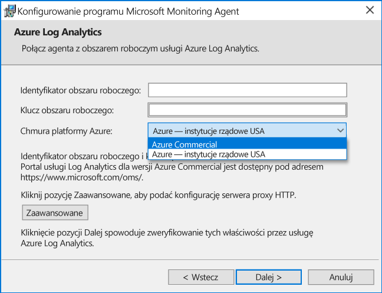
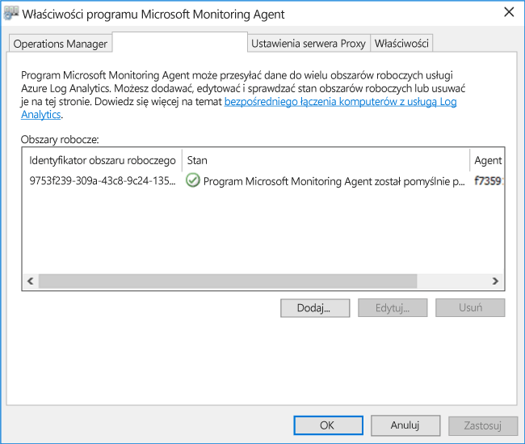

# Zbieranie danych z komputerów z systemem Windows hostowanych w danym środowisku
Usługa [Azure Log Analytics](log-analytics-overview.md) umożliwia zbieranie danych bezpośrednio z fizycznych i wirtualnych komputerów z systemem Windows i innych zasobów w środowisku do pojedynczego repozytorium na potrzeby szczegółowej analizy i korelacji.  W tym przewodniku Szybki start opisano, jak w kilku prostych krokach skonfigurować i rozpocząć zbieranie danych z komputera z systemem Windows.  Aby uzyskać informacje dotyczące maszyn wirtualnych platformy Azure z systemem Windows, zobacz następujący temat [Zbieranie danych dotyczących infrastruktury Azure Virtual Machines](log-analytics-quick-collect-azurevm.md).  

Aby poznać wymagania sieci i systemu dotyczące wdrożenia agenta systemu Windows, zobacz [Zbieranie danych ze środowiska za pomocą usługi Azure Log Analytics](log-analytics-concept-hybrid.md#prerequisites).
 
Jeśli nie masz subskrypcji platformy Azure, przed rozpoczęciem utwórz [bezpłatne konto](https://azure.microsoft.com/free/?WT.mc_id=A261C142F).

## Logowanie do witryny Azure Portal
Zaloguj się do witryny Azure Portal pod adresem [https://portal.azure.com](https://portal.azure.com). 

## Tworzenie obszaru roboczego
1. W witrynie Azure Portal kliknij pozycję **Wszystkie usługi**. Na liście zasobów wpisz **Log Analytics**. Po rozpoczęciu pisania zawartość listy jest filtrowana w oparciu o wpisywane dane. Wybierz pozycję **Log Analytics**.       
2. Kliknij pozycję **Utwórz**, a następnie wybierz opcje dla następujących elementów:

  * Podaj nazwę dla nowego **obszaru roboczego OMS**, na przykład *DefaultLAWorkspace*. 
  * Wybierz **Subskrypcję** do połączenia poprzez wybór subskrypcji z listy rozwijanej, jeśli domyślnie wybrana subskrypcja jest niewłaściwa.
  * W obszarze **Grupa zasobów** wybierz istniejącą grupę zasobów, która zawiera co najmniej jedną maszynę wirtualną platformy Azure.  
  * W polu **Lokalizacja** wybierz lokalizację, w której wdrożono maszyny wirtualne.  Aby uzyskać dodatkowe informacje, sprawdź, w których [regionach jest dostępna usługa Log Analytics](https://azure.microsoft.com/regions/services/).
  * Usługa Log Analytics oferuje do wyboru trzy różne **warstwy cenowe**, ale na potrzeby tego przewodnika Szybki start wybierz warstwę **bezpłatną**.  Aby uzyskać dodatkowe informacje dotyczące konkretnej warstwy, zobacz [Log Analytics — cennik](https://azure.microsoft.com/pricing/details/log-analytics/).

           
3. Po podaniu wymaganych informacji w okienku **Obszar roboczy OMS** kliknij przycisk **OK**.  

Podczas weryfikowania informacji i tworzenia obszaru roboczego możesz śledzić postęp w sekcji **Powiadomienia** z poziomu menu. 

## Uzyskiwanie identyfikatora i klucza obszaru roboczego
Przed zainstalowaniem programu Microsoft Monitoring Agent dla systemu Windows potrzebne są identyfikator i klucz obszaru roboczego usługi Log Analytics.  Tych informacji wymaga kreator instalacji w celu poprawnego skonfigurowania agenta i upewnienia się, że może się skutecznie komunikować z usługą Log Analytics.  

1. W witrynie Azure Portal kliknij pozycję **Wszystkie usługi**. Na liście zasobów wpisz **Log Analytics**. Po rozpoczęciu pisania zawartość listy jest filtrowana w oparciu o wpisywane dane. Wybierz pozycję **Log Analytics**.
2. Na liście obszarów roboczych usługi Log Analytics wybierz utworzony wcześniej obszar *DefaultLAWorkspace*.
3. Wybierz pozycję **Ustawienia zaawansowane**.       
4. Wybierz **Połączone źródła**, a następnie **Serwery Windows**.   
5. Wartość z prawej strony **identyfikatora obszaru roboczego** i **klucza podstawowego**. Skopiuj i wklej obie wartości do ulubionego edytora.   

## Instalacja agenta dla systemu Windows
Wykonaj poniższe kroki, aby zainstalować i skonfigurować na swoim komputerze agenta dla usługi Log Analytics na platformie Azure i w chmurze Azure Government przy użyciu Instalatora programu Microsoft Monitoring Agent.  

1. Na stronie **Serwery z systemem Windows** wybierz odpowiednią wersję pozycji **Pobierz agenta systemu Windows** do pobrania w zależności od architektury procesora systemu operacyjnego Windows.
2. Uruchom Instalatora, aby zainstalować agenta na komputerze.
2. Na **stronie powitalnej** kliknij przycisk **Dalej**.
3. Na stronie **Postanowienia licencyjne** zapoznaj się z postanowieniami licencyjnymi, a następnie kliknij przycisk **Zgadzam się**.
4. Na stronie **Folder docelowy** zmień lub pozostaw domyślny folder instalacji, a następnie kliknij przycisk **Dalej**.
5. Na stronie **Opcje instalacji agenta** wybierz połączenie agenta z usługą Azure Log Analytics (OMS), a następnie kliknij przycisk **Dalej**.   
6. Na stronie **Azure Log Analytics** wykonaj następujące czynności:
   1. Wklej skopiowany wcześniej **identyfikator obszaru roboczego** i **klucz obszaru roboczego (klucz podstawowy)**.  Jeśli komputer powinien wysyłać raporty do obszaru roboczego usługi Log Analytics w chmurze Azure dla instytucji rządowych, wybierz **Wersja platformy Azure dla administracji USA** z listy rozwijanej **Azure Cloud**.  
   2. Jeśli komputer musi komunikować się z usługą Log Analytics za pośrednictwem serwera proxy, kliknij pozycję **Zaawansowane** i podaj adres URL i numer portu serwera proxy.  Jeśli Twój serwer proxy wymaga uwierzytelniania, wpisz nazwę użytkownika i hasło, aby uwierzytelnić się na serwerze proxy, a następnie kliknij przycisk **Dalej**.  
7. Po zakończeniu podawania niezbędnych ustawień konfiguracji kliknij przycisk **Dalej**.     
8. Na stronie **Gotowe do zainstalowania** przejrzyj wybrane opcje, a następnie kliknij pozycję **Zainstaluj**.
9. Na stronie **Konfiguracja została zakończona pomyślnie** kliknij przycisk **Zakończ**.

Po ukończeniu instalacji program **Microsoft Monitoring Agent** będzie wyświetlany w **Panelu sterowania**. Możesz przejrzeć konfigurację i sprawdzić, czy agent jest połączony z usługą Log Analytics. Po nawiązaniu połączenia na karcie **Azure Log Analytics (OMS)** agent wyświetla komunikat z następującą informacją: **Program Microsoft Monitoring Agent pomyślnie połączył się z usługą Microsoft Operations Management Suite**.   

## Zbieranie danych zdarzeń i wydajności
Usługa Log Analytics może zbierać zdarzenia z dziennika zdarzeń systemu Windows oraz z liczników wydajności określonych na potrzeby analizy i raportowania w dłuższym okresie po wykryciu określonego warunku.  Wykonaj następujące kroki, aby skonfigurować zbieranie zdarzeń z dziennika zdarzeń systemu Windows oraz, na początek, z kilku typowych liczników wydajności.  

1. W witrynie Azure Portal kliknij pozycję **Wszystkie usługi**. Na liście zasobów wpisz **Log Analytics**. Po rozpoczęciu pisania zawartość listy jest filtrowana w oparciu o wpisywane dane. Wybierz pozycję **Log Analytics**.
2. Wybierz pozycję **Ustawienia zaawansowane**.      
3. Wybierz pozycję **Dane**, a następnie pozycję **Dzienniki zdarzeń systemu Windows**.  
4. Dziennik zdarzeń dodaje się przez wpisanie nazwy dziennika.  Wpisz **System**, a następnie kliknij znak plus **+**.  
5. W tabeli zaznacz ważności **Błąd** i **Ostrzeżenie**.   
6. Kliknij przycisk **Zapisz** znajdujący się u góry strony, aby zapisać konfigurację.
7. Wybierz pozycję **Dane wydajności systemu Windows**, aby włączyć zbieranie liczników wydajności na komputerze z systemem Windows. 
8. Podczas pierwszej konfiguracji liczników wydajności systemu Windows dla nowego obszaru roboczego usługi Log Analytics można szybko utworzyć kilka typowych liczników. Na liście obok każdego z nich znajduje się pole wyboru.  .  Kliknij pozycję **Dodaj wybrane liczniki wydajności**.  Są one dodawane i ustawiane wstępnie z dziesięciosekundowym interwałem próbkowania kolekcji.  
9. Kliknij przycisk **Zapisz** znajdujący się u góry strony, aby zapisać konfigurację.

## Wyświetlanie zebranych danych
Teraz, po włączeniu zbierania danych, uruchomimy proste przykładowe wyszukiwanie w dziennikach, aby wyświetlić dane z docelowego komputera.  

1. W portalu Azure w ramach wybranego obszaru roboczego kliknij kafelek **Przeszukiwanie dzienników**.  
2. W okienku Przeszukiwanie dzienników wpisz `Perf` w polu zapytania, a następnie naciśnij klawisz Enter lub kliknij przycisk wyszukiwania z prawej strony pola zapytania.      Na przykład zapytanie na poniższej ilustracji zwróciło 735 rekordów wydajności.   

## Oczyszczanie zasobów
Gdy nie jest już potrzebny, można usunąć agenta z komputera z systemem Windows i usunąć obszar roboczy usługi Log Analytics.  

Aby usunąć agenta, wykonaj poniższe kroki.

1. Otwórz **Panel sterowania**.
2. Otwórz aplet **Programy i funkcje**.
3. W obszarze **Programy i funkcje** wybierz pozycję **Microsoft Monitoring Agent** i kliknij przycisk **Odinstaluj**.

Aby usunąć obszar roboczy, wybierz utworzony wcześniej obszar roboczy usługi Log Analytics i na stronie zasobów kliknij przycisk **Usuń**.   

## Następne kroki
Teraz, kiedy są zbierane dane operacyjne i dane wydajności z lokalnego komputera z systemem Linux, możesz w prosty sposób rozpocząć eksplorowanie i analizowanie danych oraz wykonywanie działań na *bezpłatnie* zebranych danych.  

Aby dowiedzieć się, jak wyświetlać i analizować dane, przejdź do następnego samouczka.   

> [!div class="nextstepaction"]
> [Wyświetlanie i analizowanie danych w usłudze Log Analytics](log-analytics-tutorial-viewdata.md)
