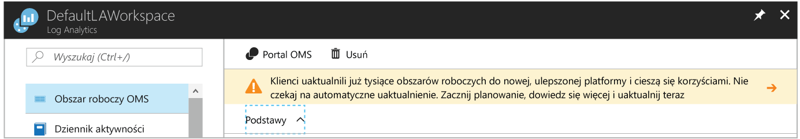

# <a name="view-or-analyze-data-collected-with-log-analytics-log-search"></a>Wyświetlanie i analizowanie zebranych danych za pomocą wyszukiwania w dziennikach usługi Log Analytics

W usłudze Log Analytics można korzystać z wyszukiwań w dziennikach, tworząc zapytania służące do analizowania zebranych danych, a także używać już istniejących pulpitów nawigacyjnych, które można dostosować za pomocą widoków graficznych dotyczących najbardziej wartościowych wyszukiwań.  Zdefiniowano już zbieranie danych operacyjnych z maszyn wirtualnych platformy Azure i dzienników aktywności, natomiast w tym samouczku omawiane są następujące czynności:

> [!div class="checklist"]
> * Uaktualnianie zasobu usługi Azure Log Analytics do nowego języka zapytań 
> * Wykonywanie prostego wyszukiwania danych dotyczących zdarzeń i modyfikowanie oraz filtrowanie wyników za pomocą funkcji 
> * Informacje o pracy z danymi wydajności

Do utworzenia przykładu przedstawionego w tym samouczku potrzebna jest istniejąca maszyna wirtualna [połączona z obszarem roboczym usługi Log Analytics](log-analytics-quick-collect-azurevm.md).  

Istnieją dwa sposoby na tworzenie i edytowanie zapytań oraz interakcyjną pracę z danymi zwrotnymi.  W przypadku zapytań podstawowych używaj strony Wyszukiwanie w dziennikach w witrynie Azure Portal, a w przypadku zapytań zaawansowanych możesz używać portalu analizy zaawansowanej. Aby dowiedzieć się więcej na temat różnic w funkcjach tych dwóch portali, zobacz [Portals for creating and editing log queries in Azure Log Analytics](log-analytics-log-search-portals.md) (Portale do tworzenia i edytowania zapytań dzienników w usłudze Azure Log Analytics).

W tym samouczku będziemy używać strony Wyszukiwanie w dziennikach w witrynie Azure Portal. 

## <a name="log-in-to-azure-portal"></a>Logowanie do witryny Azure Portal
Zaloguj się do witryny Azure Portal pod adresem [https://portal.azure.com](https://portal.azure.com). 

## <a name="open-the-log-search-portal"></a>Otwieranie portalu do wyszukiwania w dziennikach 
Zacznij od otwarcia portalu do wyszukiwania w dziennikach.   

1. W witrynie Azure Portal kliknij pozycję **Wszystkie usługi**. Na liście zasobów wpisz **Log Analytics**. Po rozpoczęciu pisania zawartość listy jest filtrowana w oparciu o wpisywane dane. Wybierz pozycję **Log Analytics**.
2. Wybierz obszar roboczy w okienku subskrypcji usługi Log Analytics, a następnie wybierz kafelek **Wyszukiwanie w dziennikach**.<br> 

W górnej części strony zasobów usługi Log Analytics w portalu może zostać wyświetlony transparent z zaproszeniem do uaktualnienia.<br> 

W usłudze Log Analytics wprowadzono niedawno nowy język zapytań ułatwiający konstruowanie zapytań, korelowanie danych z różnych źródeł i analizowanie w celu szybkiego identyfikowania trendów lub problemów.

Uaktualnienie jest proste.  Rozpocznij proces, klikając transparent **Dowiedz się więcej i uaktualnij**.  Przeczytaj dodatkowe informacje na temat uaktualniania na stronie informacji o uaktualnianiu, a następnie kliknij pozycję **Uaktualnij teraz**.

Ten proces może potrwać kilka minut, a w jego trakcie możesz śledzić postęp w obszarze **Powiadomienia** z poziomu menu. Możesz dowiedzieć się więcej o [zaletach nowego języka zapytań](log-analytics-log-search-upgrade.md#why-the-new-language).

## <a name="create-a-simple-search"></a>Tworzenie prostego wyszukiwania
Najszybszym sposobem pobrania danych do pracy jest użycie prostego zapytania zwracającego wszystkie rekordy w tabeli.  Jeśli z obszarem roboczym są połączeni jacyś klienci z systemem Windows lub Linux, istnieją dane w tabeli Event („Zdarzenie”, system Windows) lub Syslog („Dziennik systemu”, system Linux).

Wpisz jedno z następujących zapytań w polu wyszukiwania, a następnie kliknij przycisk wyszukiwania.  

```
Event
```
```
Syslog
```

Dane są zwracane w domyślnym widoku listy i widać, ile zwrócono wszystkich rekordów.


Wyświetlanych jest tylko kilka pierwszych właściwości każdego rekordu.  Kliknij pozycję **Pokaż więcej** w celu wyświetlenia wszystkich właściwości dla określonego rekordu.

## <a name="filter-results-of-the-query"></a>Filtrowanie wyników zapytania
Po lewej stronie ekranu znajduje się okienko filtrowania, które pozwala dodać filtrowanie do zapytania bez modyfikowania go bezpośrednio.  Wyświetlanych jest kilka właściwości rekordu dla danego typu rekordu i można wybrać jedną lub więcej wartości właściwości, aby zawęzić wyniki wyszukiwania.

Jeśli pracujesz z tabelą **Event** (Zdarzenie), zaznacz pole wyboru obok pozycji **Error** (Błąd) w obszarze **EVENTLEVELNAME** (Nazwa zdarzenia).   Jeśli pracujesz z tabelą **Syslog** (Dziennik systemu), zaznacz pole wyboru obok pozycji **err** (Błąd) w obszarze **SEVERITYLEVEL** (Poziom ważności).  Spowoduje to zmianę zapytania na jedno z następujących w celu ograniczenia wyników do zdarzeń błędów.

```
Event | where (EventLevelName == "Error")
```
```
Syslog | where (SeverityLevel == "err")
```


Dodaj właściwości do okienka filtrowania, wybierając pozycję **Dodaj do filtrów** z menu właściwości jednego z rekordów.


Ten sam filtr można ustawić, wybierając pozycję **Filtruj** z menu właściwości rekordu z wartością do odfiltrowania.  

Opcja **Filtruj** istnieje tylko dla właściwości, których nazwy są oznaczone kolorem niebieskim po umieszczeniu na nich wskaźnika.  Są to pola *z możliwością wyszukiwania*, które są indeksowane na potrzeby warunków wyszukiwania.  Pola oznaczone kolorem szarym są polami *wyszukiwania dowolnego tekstu*, dla których jest dostępna tylko opcja **Pokaż odwołania**.  Ta opcja zwraca rekordy, dla których ta wartość istnieje w dowolnej właściwości.

Wyniki można grupować według pojedynczej właściwości, wybierając opcję **Grupuj według** z menu rekordu.  Spowoduje to dodanie do zapytania operatora [summarize](https://docs.loganalytics.io/docs/Language-Reference/Tabular-operators/summarize-operator) wyświetlającego wyniki na wykresie.  Można grupować według więcej niż jednej właściwości, ale w tym celu trzeba edytować zapytanie bezpośrednio.  Wybierz menu rekordu obok właściwości **Computer** (Komputer) i wybierz pozycję **Grupuj według „Computer”**.  


## <a name="work-with-results"></a>Praca z wynikami
Portal do wyszukiwania w dziennikach udostępnia wiele funkcji do pracy z wynikami zapytania.  Można sortować, filtrować i grupować wyniki w celu analizowania danych bez modyfikowania samego zapytania.  Domyślnie wyniki zapytania nie są sortowane.

Aby wyświetlić dane w postaci tabeli, która zapewnia dodatkowe opcje filtrowania i sortowania, kliknij pozycję **Tabela**.  


Kliknij strzałkę obok rekordu, aby wyświetlić szczegóły dla tego rekordu.


Sortuj według dowolnego pola, klikając nagłówek kolumny.


Filtruj wyniki według określonej wartości w kolumnie, klikając przycisk filtru i podając warunek filtru.


Grupuj według kolumny przez przeciągnięcie nagłówka kolumny do góry listy wyników.  Można grupować według wielu pól, przeciągając wiele kolumn do góry.


## <a name="work-with-performance-data"></a>Praca z danymi wydajności
Dane wydajności dla agentów systemów Windows i Linux są przechowywane w obszarze roboczym usługi Log Analytics w tabeli **Perf**.  Rekordy wydajności wyglądają jak dowolne inne rekordy i napiszemy proste zapytanie, które zwraca wszystkie rekordy wydajności, podobnie jak miało to miejsce w przypadku zdarzeń.

```
Perf
```


Jednak zwracanie milionów rekordów wszystkich obiektów i liczników wydajności nie jest bardzo przydatne.  Za pomocą tych samych metod, które zostały użyte powyżej, można przefiltrować dane, a można też po prostu wpisać poniższe zapytanie bezpośrednio w polu wyszukiwania w dziennikach.  Zostaną zwrócone tylko rekordy użycia procesorów dla komputerów z systemem zarówno Windows, jak i Linux.

```
Perf | where (ObjectName == "Processor")  | where (CounterName == "% Processor Time")
```


To ogranicza dane do określonego licznika, ale nadal nie udostępnia ich w szczególnie przydatnej postaci.  Można wyświetlić dane na wykresie liniowym, ale najpierw należy je zgrupować według właściwości Computer (Komputer) i TimeGenerated (Godzina wygenerowania).  Aby zgrupować według wielu pól, należy bezpośrednio zmodyfikować zapytanie. Zmodyfikuj je więc do następującej postaci.  Wykorzystywana jest tu funkcja [avg](https://docs.loganalytics.io/docs/Language-Reference/Aggregation-functions/avg()) działająca na właściwości **CounterValue** w celu obliczania średniej wartości dla każdej godziny.

```
Perf  | where (ObjectName == "Processor")  | where (CounterName == "% Processor Time") | summarize avg(CounterValue) by Computer, TimeGenerated
```


Dane są już odpowiednio zgrupowane, można je więc wyświetlić na wykresie przez dodanie operatora [render](https://docs.loganalytics.io/docs/Language-Reference/Tabular-operators/render-operator).  

```
Perf  | where (ObjectName == "Processor")  | where (CounterName == "% Processor Time") | summarize avg(CounterValue) by Computer, TimeGenerated | render timechart
```


## <a name="next-steps"></a>Następne kroki
W tym samouczku przedstawiono sposób tworzenia podstawowych wyszukiwań w dziennikach w celu analizowania danych zdarzeń i wydajności.  Przejdź do następnego samouczka, aby dowiedzieć się, jak zwizualizować dane przez utworzenie pulpitu nawigacyjnego.

> [!div class="nextstepaction"]
> [Tworzenie i udostępnianie pulpitów nawigacyjnych usługi Log Analytics](log-analytics-tutorial-dashboards.md)