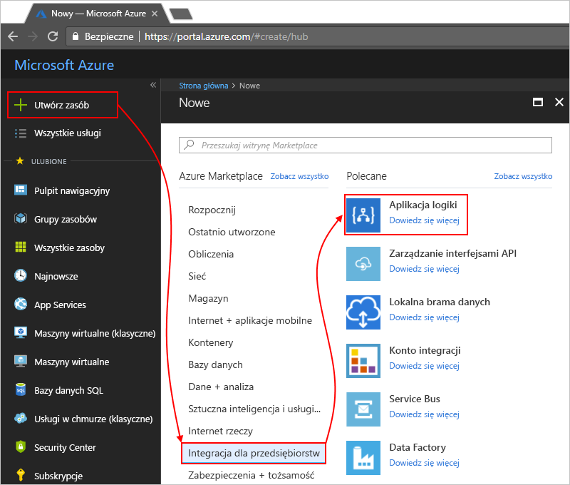

# Monitorowanie i uzyskiwanie szczegółowych informacji o uruchomieniu aplikacji logiki Operations Management Suite (OMS) i analizy dzienników

Do monitorowania i bardziej rozbudowane informacje debugowania można włączyć analizy dzienników w tym samym czasie, podczas tworzenia aplikacji logiki. Analiza dzienników zapewnia diagnostyki rejestrowania i monitorowania aplikacji logiki uruchamia się za pośrednictwem portalu Operations Management Suite (OMS). Po dodaniu rozwiązania do zarządzania aplikacji logiki do OMS otrzymasz zagregowany stan logiki aplikacji działa i konkretne szczegółowe informacje, takie jak stan, czas wykonywania, stan ponownego wysyłania i identyfikatorów korelacji.

W tym temacie przedstawiono sposób włączania analizy dzienników lub zainstalować rozwiązania do zarządzania aplikacji logiki w OMS, aby wyświetlić zdarzenia środowiska uruchomieniowego i dane aplikacji logiki Uruchom.

 > [!TIP]
 > Aby monitorować istniejących aplikacji logiki, wykonaj następujące kroki, aby [włączyć rejestrowania diagnostycznego i wysyłać dane środowiska uruchomieniowego aplikacji logiki do OMS](../logic-apps/logic-apps-monitor-your-logic-apps.md#azure-diagnostics).

## Wymagania

Przed rozpoczęciem, musisz mieć obszarem roboczym pakietu OMS. Dowiedz się [jak Utwórz obszar roboczy OMS](../log-analytics/log-analytics-get-started.md). 

## Włącz rejestrowanie danych diagnostycznych podczas tworzenia aplikacji logiki

1. W [portalu Azure](https://portal.azure.com), tworzenie aplikacji logiki. Wybierz **nowe** > **integracji przedsiębiorstwa** > **aplikacji logiki** > **utworzyć**.

   

2. W **tworzenie aplikacji logiki** wykonaj te zadania, jak pokazano:

   1. Podaj nazwę aplikacji logiki, a następnie wybierz subskrypcję platformy Azure. 
   2. Utwórz lub wybierz grupę zasobów platformy Azure.
   3. Ustaw **dziennika analizy** do **na**. 
   Wybierz obszar roboczy OMS, gdy chcesz wysyłać dane dotyczące aplikacji logiki uruchamia. 
   4. Gdy wszystko jest gotowe, wybierz pozycję **Przypnij do pulpitu nawigacyjnego** > **Utwórz**.

      

      Po zakończeniu tego kroku, platforma Azure tworzy aplikację logiki, który jest obecnie skojarzony z obszarem roboczym pakietu OMS. 
      Ponadto ten krok również automatycznie instaluje rozwiązanie do zarządzania aplikacji logiki w obszarze roboczym pakietu OMS.

3. Aby wyświetlić logiki aplikacja jest uruchamiana w OMS, [wykonaj te czynności](#view-logic-app-runs-oms).

## Instalowanie rozwiązania do zarządzania aplikacji logiki w OMS

Jeśli już włączone analizy dzienników, podczas tworzenia aplikacji logiki, Pomiń ten krok. Masz już zainstalowany w OMS rozwiązania do zarządzania aplikacji logiki.

1. W [portalu Azure](https://portal.azure.com), wybierz **więcej usług**. Wyszukaj "analizy dzienników" jako filtr, a następnie wybierz pozycję **analizy dzienników** pokazany:

   

2. W obszarze **analizy dzienników**, Znajdź i wybierz obszar roboczy OMS. 

   

3. W obszarze **zarządzania**, wybierz **portalu OMS**.

   

4. Na stronie głównej OMS transparent uaktualnienia jest wyświetlany, jeśli transparentu tak, aby najpierw uaktualnić obszar roboczy OMS. Następnie wybierz pozycję **galerii rozwiązań**.

   

5. W obszarze **wszystkie rozwiązania**, Znajdź i wybierz Kafelek **zarządzania aplikacje logiki** rozwiązania.

   

6. Aby zainstalować rozwiązania, w obszarze roboczym pakietu OMS, wybierz **Dodaj**.

   

## Widok, który uruchamia aplikację logiki w obszarze roboczym pakietu OMS

1. Aby wyświetlić liczbę i stan sekwencji aplikacji logiki, przejdź do strony Przegląd obszaru roboczego OMS. Przejrzyj szczegóły na **zarządzania aplikacje logiki** kafelka.

   

   > [!Note]
   > Jeśli transparent uaktualnienia pojawia się zamiast kafelka zarządzania aplikacji logiki, wybierz transparentu, tak, aby najpierw uaktualnić obszar roboczy OMS.
  
   > 

2. Aby wyświetlić podsumowanie z bardziej szczegółowymi informacjami na temat sekwencji aplikacji logiki, wybierz **zarządzania aplikacje logiki** kafelka.

   W tym miejscu że aplikacja działa logiki są pogrupowane według nazwy lub stan wykonania. Można również wyświetlić szczegółowe informacje o niepowodzeniach w akcji lub wyzwalaczy dla przebiegów aplikacji logiki.

   
   
3. Aby wyświetlić wszystkie elementy dla konkretnej logiki aplikacji lub stanu, wybierz wiersz dla aplikacji logiki lub stanu.

   Oto przykład pokazujący wszystkie elementy aplikacji logika charakterystyczna dla:

   

   Dostępne są dwie opcje zaawansowane na tej stronie:
   * **Śledzone właściwości:** ta kolumna zawiera śledzonych właściwości, które są pogrupowane według akcje dotyczące aplikacji logiki. Aby wyświetlić właściwości śledzonych, wybierz **widoku**. Można przeszukiwać właściwości śledzonych przy użyciu filtru kolumny.
   
     

     Wszystkie nowo dodanych właściwości śledzonych może potrwać 10 – 15 minut, zanim pojawią się po raz pierwszy. Dowiedz się [sposobu dodawania właściwości śledzonych do aplikacji logiki](logic-apps-monitor-your-logic-apps.md#azure-diagnostics-event-settings-and-details).

   * **Prześlij ponownie:** można ponownie prześlij co najmniej jeden przebieg aplikacji logiki, których nie powiodła się, zakończyło się pomyślnie, lub nadal są uruchomione. Zaznacz pola wyboru dla przebiegów, które chcesz przesłać ponownie, a następnie wybierz pozycję **ponownie prześlij**. 

     

4. Aby filtrować wyniki, można wykonać filtrowania zarówno po stronie klienta i po stronie serwera.

   * Filtr po stronie klienta: dla każdej kolumny wybierz filtry, które mają. 
   Oto kilka przykładów:

     

   * Filtr po stronie serwera: okna, określony czas lub Ogranicz liczbę uruchomień, które są wyświetlane, należy użyć kontrola zakresu, w górnej części strony. 
   Domyślnie są wyświetlane tylko 1000 rekordów jednocześnie. 
   
     
 
5. Aby wyświetlić wszystkie akcje i ich szczegóły dla określonego przebiegu, wybierz wiersz dla uruchamiania aplikacji logiki.

   Oto przykład pokazujący wszystkie akcje dla aplikacji logiki określonej Uruchom:

   
   
6. Na każdej stronie wyników, aby wyświetlić kwerendy w trakcie wyników lub aby wyświetlić wszystkie wyniki, wybierz **Zobacz wszystkie**, który otwiera stronę wyszukiwania dziennika.
   
   
   
   Na stronie dziennik wyszukiwania
   * Aby wyświetlić wyniki zapytania w tabeli, wybierz **tabeli**.
   * Aby zmienić kwerendy, można edytować ciągu zapytania w pasku wyszukiwania. 
   Aby lepiej wykorzystać możliwości wybierz **zaawansowane analizy**.

     
     
     W tym miejscu na stronie usługi Analiza dzienników Azure można aktualizować zapytania i wyświetlić wyniki z tabeli. 
     To zapytanie używa [język zapytań Kusto](https://docs.loganalytics.io/docs/Language-Reference), który można edytować, jeśli chcesz wyświetlić różne wyniki. 

     

## Następne kroki

* [Monitorowanie komunikatów B2B](../logic-apps/logic-apps-monitor-b2b-message.md)

