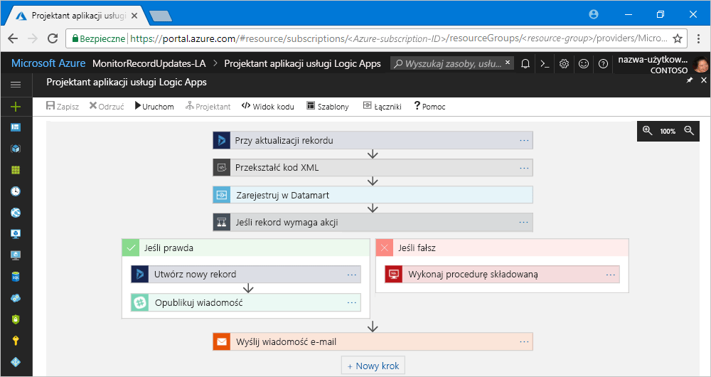

# Co to jest usługa Azure Logic Apps?

Usługa [Logic Apps](https://azure.microsoft.com/services/logic-apps) ułatwia tworzenie, planowanie i automatyzowanie procesów jako [przepływów pracy](#logic-app-concepts), aby można było integrować aplikacje, dane, systemy i usługi między przedsiębiorstwami i organizacjami. Usługa Logic Apps ułatwia projektowanie i tworzenie skalowalnych rozwiązań na potrzeby integracji aplikacji, integracji danych, integracji systemów, usług Enterprise Application Integration (EAI) i komunikacji między firmami (B2B), zarówno w chmurze, jak i lokalnie.

Poniżej przedstawiono kilka przykładowych obciążeń, które można zautomatyzować za pomocą aplikacji logiki:

* Przetwarzanie i kierowanie zamówień w systemach lokalnych i usługach w chmurze.
* Przenoszenie przekazywanych plików z serwera FTP do usługi Azure Storage. 
* Monitorowanie tweetów dotyczących określonego tematu, analizowanie tonacji i tworzenie alertów lub zadań dla elementów, które wymagają przeglądu.

Tworzenie rozwiązań integracji za pomocą aplikacji logiki wspomaga ciągle rosnąca galeria [około 200 łączników](../connectors/apis-list.md), takich jak usługa SQL Database, usługi platformy Azure, Office 365, Salesforce, Google i inne. Te [łączniki](#logic-app-concepts) udostępniają [wyzwalacze](#logic-app-concepts) i [akcje](#logic-app-concepts) na potrzeby tworzenia aplikacji logiki umożliwiających uzyskiwanie bezpiecznego dostępu do danych i ich przetwarzania w czasie rzeczywistym.

> [!VIDEO https://channel9.msdn.com/Blogs/Azure/Introducing-Azure-Logic-Apps/player]

## Jak działa usługa Logic Apps? 

Każdy przepływ pracy aplikacji logiki rozpoczyna się od wyzwalacza, który jest aktywowany, gdy zajdzie określone zdarzenie lub gdy nowe dostępne dane spełniają określone kryteria. Wiele wyzwalaczy oferuje podstawowe możliwości planowania, dzięki czemu można określić regularność uruchamiania obciążeń. W przypadku wielu niestandardowych scenariuszy planowania przepływy pracy należy uruchomiać za pomocą wyzwalacza harmonogramu. Dowiedz się więcej o [sposobach tworzenia przepływów pracy opartych na harmonogramach](../logic-apps/tutorial-build-schedule-recurring-logic-app-workflow.md).

Po każdym aktywowaniu wyzwalacza aparat usługi Logic Apps tworzy wystąpienie aplikacji logiki, które uruchamia akcje przepływu pracy. Te akcje mogą również obejmować konwersje danych i kontrole przepływów, na przykład instrukcje warunkowe, instrukcje switch, pętle i rozgałęziania. Ta aplikacja logiki rozpoczyna się na przykład od wyzwalacza usług Dynamics 365 z wbudowanymi kryteriami „Gdy rekord zostanie zaktualizowany”. Jeśli wyzwalacz wykryje zdarzenie zgodne z tymi kryteriami, aktywuje się i uruchamia akcje przepływu pracy. W tym przypadku akcje obejmują transformacje XML, aktualizacje danych, rozgałęzienia decyzji i powiadomienia e-mail.

Aplikacje logiki można tworzyć wizualnie za pomocą Projektanta aplikacji usługi Logic Apps dostępnego w witrynie Azure Portal za pośrednictwem przeglądarki i w programie Visual Studio. W przypadku większości niestandardowych aplikacji logiki można tworzyć lub edytować definicje aplikacji logiki w formacie JavaScript Object Notation (JSON) w trybie „widoku kodu”. Na potrzeby wybierania zadań można również użyć poleceń programu Azure PowerShell i szablonów usługi Azure Resource Manager. Aplikacje logiki są wdrażane i uruchamiane w chmurze na platformie Azure. Aby uzyskać bardziej szczegółowe wprowadzenie, obejrzyj film [Use Azure Enterprise Integration Services to run cloud apps at scale](https://channel9.msdn.com/Events/Connect/2017/T119/) (Korzystanie z usług Enterprise Integration Services platformy Azure na potrzeby uruchamiania aplikacji w chmurze na dużą skalę).

## Po co korzystać z usługi Logic Apps?

W firmach przechodzących na platformy cyfrowe aplikacje logiki ułatwiają i przyspieszają łączenie starszych systemów z nowoczesnymi, oferując wbudowane interfejsy API działające jako łączniki zarządzane przez firmę Microsoft. Dzięki temu można skoncentrować się na logice biznesowej i funkcjach swoich aplikacji. Nie trzeba się martwić o tworzenie, hostowanie, skalowanie, monitorowanie i konserwowanie aplikacji ani o zarządzanie nimi. Usługa Logic Apps wykonuje wszystkie te działania za Ciebie. Ponadto płacisz wyłącznie za rzeczywiste użycie według [modelu cen](../logic-apps/logic-apps-pricing.md) zużycia. 

W wielu przypadkach nie będzie trzeba nawet pisać kodu. Jeśli zajdzie jednak potrzeba napisania kodu, fragmenty kodu można utworzyć, korzystając z rozwiązania [Azure Functions](../azure-functions/functions-overview.md), a następnie uruchomić ten kod na żądanie z poziomu aplikacji logiki. Ponadto jeśli aplikacje logiki muszą wchodzić w interakcje ze zdarzeniami usług platformy Azure, aplikacji niestandardowych lub rozwiązań innych firm, możesz użyć usługi [Azure Event Grid](../event-grid/overview.md) razem z aplikacjami logiki na potrzeby monitorowania, routingu i publikowania zdarzeń.

Usługi Logic Apps, Functions i Event Grid są w pełni zarządzane za pośrednictwem platformy Microsoft Azure, dzięki czemu nie musisz się martwić o tworzenie, hostowanie, skalowanie, monitorowanie i konserwowanie swoich rozwiązań ani o zarządzanie nimi. Dzięki możliwości tworzenia [„bezserwerowych” aplikacji i rozwiązań](../logic-apps/logic-apps-serverless-overview.md) możesz po prostu skoncentrować się na logice biznesowej. Te usługi są automatycznie skalowane do Twoich potrzeb, przyspieszają integracje i ułatwiają tworzenie niezawodnych aplikacji w chmurze z minimalną ilością kodu. Ponadto płacisz wyłącznie za rzeczywiste użycie według [modelu cen](../logic-apps/logic-apps-pricing.md) zużycia. 

Aby dowiedzieć się, jak firmy zwiększyły swoją elastyczność i poprawiły koncentrację na swoich podstawowych zadaniach biznesowych, kiedy połączyły usługę Logic Apps z innymi usługami platformy Azure i produktami firmy Microsoft, zapoznaj się z tymi [historiami klientów](https://aka.ms/logic-apps-customer-stories).

Poniżej przedstawiono szczegółowe informacje o możliwościach i korzyściach wynikających z korzystania z usługi Logic Apps:

* **Wizualne tworzenie przepływów pracy za pomocą łatwych w użyciu narzędzi**

  Oszczędzaj czas i upraszczaj złożone procesy przy użyciu narzędzi do projektowania wizualnego. 
  Twórz aplikacje logiki od początku do końca przy użyciu Projektanta aplikacji usługi Logic Apps w przeglądarce w witrynie Azure Portal lub w programie Visual Studio. Uruchamiaj przepływy pracy z wyzwalaczem i dodawaj dowolną liczbę akcji z [galerii łączników](../connectors/apis-list.md).

* **Szybsze rozpoczynanie pracy dzięki użyciu szablonów aplikacji logiki**

  Szybciej twórz często używane rozwiązania po wybraniu wstępnie zdefiniowanych przepływów pracy z [galerii szablonów](../logic-apps/logic-apps-create-logic-apps-from-templates.md). 
  Wybierać można spośród różnych szablonów: od prostej łączności z aplikacjami typu oprogramowanie jako usługa (SaaS) do zaawansowanych rozwiązań B2B oraz szablonów „tylko do zabawy”. Dowiedz się, jak [tworzyć aplikacje logiki na podstawie wbudowanych szablonów](../logic-apps/logic-apps-create-logic-apps-from-templates.md).

* **Łączenie różnych systemów w różnych środowiskach**

  Niektóre wzorce i przepływy pracy łatwo opisać, ale trudno zaimplementować w postaci kodu. 
  Aplikacje logiki ułatwiają bezproblemowe łączenie różnych systemów w środowiskach lokalnych i w chmurze. Na przykład można połączyć rozwiązanie marketingowe w chmurze z lokalnym systemem rozliczeniowym lub scentralizować przesyłanie komunikatów przez interfejsy API i systemy przy użyciu usługi Enterprise Service Bus. Aplikacje logiki udostępniają szybką, niezawodną i spójną metodę dostarczania możliwych do ponownego skonfigurowania rozwiązań wielokrotnego użytku dla tych scenariuszy.

* **Obsługa na najwyższym poziomie na potrzeby integracji dla przedsiębiorstw i scenariuszy B2B**

  Firmy i organizacje komunikują się ze sobą elektronicznie przy użyciu różnych branżowych protokołów przesyłania komunikatów i formatów, takich jak EDIFACT AS2 i X12. 
  Korzystając z funkcji dostępnych w [Pakiecie integracyjnym dla przedsiębiorstw (EIP)](../logic-apps/logic-apps-enterprise-integration-overview.md), można tworzyć aplikacje logiki, które przekształcają formaty przesyłania komunikatów używane przez partnerów w formaty, które mogą być interpretowane i przetwarzane przez systemy w organizacji. Aplikacje logiki sprawnie obsługują te przekształcenia, zabezpieczając je dodatkowo przy użyciu szyfrowania i podpisów cyfrowych.

  Rozpocznij, korzystając ze swoich bieżących systemów oraz usług, i stopniowo powiększaj rozwiązania we własnym tempie. W odpowiednim czasie usługa Logic Apps i pakiet EIP ułatwią Ci wdrożenie bardziej dojrzałych scenariuszy integracji i skalowanie ich przez udostępnienie następujących możliwości i innych funkcji:

  * Tworzenie na podstawie następujących produktów i usług: 
    * [Microsoft BizTalk Server](https://docs.microsoft.com/biztalk/core/introducing-biztalk-server) 
    * [API Management](../api-management/api-management-key-concepts.md) 
    * [Azure Functions](../azure-functions/functions-overview.md) 
    * [Azure Service Bus](../service-bus-messaging/service-bus-messaging-overview.md)
  * Przetwarzanie [wiadomości XML](../logic-apps/logic-apps-enterprise-integration-xml.md)
  * Przetwarzanie [plików prostych](../logic-apps/logic-apps-enterprise-integration-flatfile.md)
  * Wymienianie komunikatów za pomocą protokołów [EDIFACT](../logic-apps/logic-apps-enterprise-integration-edifact.md), [AS2](../logic-apps/logic-apps-enterprise-integration-as2.md) i [X12](../logic-apps/logic-apps-enterprise-integration-x12.md)
  * Przechowywanie artefaktów B2B i innych elementów (oraz zarządzanie nimi) w jednym miejscu dzięki korzystaniu z [kont integracji](../logic-apps/logic-apps-enterprise-integration-accounts.md):
    * [Partnerzy](../logic-apps/logic-apps-enterprise-integration-partners.md)
    * [Umowy](../logic-apps/logic-apps-enterprise-integration-agreements.md) 
    * [Mapy na potrzeby przekształceń danych XML](../logic-apps/logic-apps-enterprise-integration-maps.md)
    * [Schematy na potrzeby weryfikacji danych XML](../logic-apps/logic-apps-enterprise-integration-schemas.md)

* **Jednokrotny zapis, częste ponowne używanie**

  Twórz aplikacje logiki jako szablony, aby móc [wdrażać i konfigurować ponownie swoje aplikacje](../logic-apps/logic-apps-create-deploy-template.md) w wielu środowiskach i regionach.

* **Wbudowana rozszerzalność**

  Jeśli nie znajdziesz pożądanego łącznika lub musisz uruchomić kod niestandardowy, możesz rozszerzyć aplikacje logiki przez utworzenie i wywoływanie na żądanie własnych fragmentów kodu za pośrednictwem usługi [Azure Functions](../azure-functions/functions-overview.md). 
  Utwórz swoje własne [interfejsy API](../logic-apps/logic-apps-create-api-app.md) i [łączniki niestandardowe](../logic-apps/custom-connector-overview.md), które można wywoływać z aplikacji logiki.

* **Płatność wyłącznie za rzeczywiste użycie**
  
  Usługa Logic Apps używa [cennika i mechanizmu pomiarów](../logic-apps/logic-apps-pricing.md) opartych na użyciu, chyba że masz aplikacje logiki utworzone wcześniej w oparciu o plany usługi App Service.

Dowiedz się więcej o usłudze Logic Apps z tych klipów wideo z wprowadzeniem:
* [Integration with Logic Apps - Go from zero to hero](https://channel9.msdn.com/Events/Build/2017/C9R17) (Integracja z usługą Logic Apps — od zera do bohatera)
* [Enterprise integration with Microsoft Azure Logic Apps](https://channel9.msdn.com/Events/Ignite/Microsoft-Ignite-Orlando-2017/BRK2188) (Integracja dla przedsiębiorstw w usłudze Microsoft Azure Logic Apps)
* [Building advanced business processes with Logic Apps](https://channel9.msdn.com/Events/Ignite/Microsoft-Ignite-Orlando-2017/BRK3179) (Budowanie zaawansowanych procesów biznesowych dzięki usłudze Logic Apps)

## Kluczowe terminy

* **Przepływ pracy**: wizualizowanie, projektowanie, tworzenie, automatyzowanie i wdrażanie procesów biznesowych w postaci serii kroków.

* **Zarządzane łączniki**: aplikacje logiki muszą mieć dostęp do danych, usług i systemów. Możesz użyć wbudowanych łączników zarządzanych przez firmę Microsoft, zaprojektowanych w celu nawiązywania połączeń z danymi, uzyskiwania do nich dostępu i pracowania z nimi. Zobacz [Łączniki dla usługi Azure Logic Apps](../connectors/apis-list.md)

* **Wyzwalacze**: wiele łączników zarządzanych przez firmę Microsoft udostępnia wyzwalacze, które są aktywowane, kiedy zdarzenia lub nowe dane spełniają określone warunki. Na przykład zdarzenie może odbierać wiadomość e-mail lub wykrywać zmiany na koncie usługi Azure Storage. Po każdym aktywowaniu wyzwalacza aparat usługi Logic Apps tworzy nowe wystąpienie aplikacji logiki, które uruchamia przepływ pracy.

* **Akcje**: akcje to wszystkie kroki wykonywane po aktywowaniu wyzwalacza. Każda akcja jest zwykle zmapowana na operację, która jest definiowana za pomocą łącznika zarządzanego, niestandardowego interfejsu API lub niestandardowego łącznika.

* **Pakiet integracyjny dla przedsiębiorstw**: w przypadku bardziej zaawansowanych scenariuszy integracji usługa Logic Apps oferuje możliwości platformy BizTalk Server. Pakiet integracyjny dla przedsiębiorstw udostępnia łączniki, które ułatwiają wykonywanie sprawdzania poprawności, przekształcania i innych akcji przez aplikacje logiki.

## Jaka jest różnica między usługą Logic Apps a usługami Functions, WebJobs i Flow?

Wszystkie te usługi pomagają „skleić” i połączyć ze sobą różne systemy. Każda z tych usług ma swoje zalety i korzyści, dlatego połączenie ich możliwości jest najlepszym sposobem na szybkie tworzenie skalowalnego, w pełni funkcjonalnego systemu integracji. Aby uzyskać więcej informacji, zobacz [Wybieranie między przepływem, aplikacjami logiki, funkcjami a zadaniami WebJob](../azure-functions/functions-compare-logic-apps-ms-flow-webjobs.md).

## Rozpoczęcie pracy 

Logic Apps to jedna z wielu usług hostowanych na platformie Microsoft Azure. Dlatego przed rozpoczęciem należy uzyskać subskrypcję Azure. Jeśli nie masz subskrypcji, <a href="https://azure.microsoft.com/free/" target="_blank">zarejestruj się w celu założenia bezpłatnego konta platformy Azure</a>. 

Jeśli masz subskrypcję platformy Azure, wypróbuj ten [przewodnik Szybki start, aby utworzyć pierwszą aplikację logiki](../logic-apps/quickstart-create-first-logic-app-workflow.md), która za pośrednictwem kanału informacyjnego RSS monitoruje witryną internetową pod kątem nowej zawartości i jeśli się taka pojawi, wysyła wiadomość e-mail.

## Pomoc techniczna i opinie

* Jeśli masz pytania, odwiedź [forum usługi Azure Logic Apps](https://social.msdn.microsoft.com/Forums/en-US/home?forum=azurelogicapps).
* Aby przesłać pomysły dotyczące funkcji lub zagłosować na nie, odwiedź [witrynę opinii użytkowników usługi Logic Apps](http://aka.ms/logicapps-wish).

## Następne kroki

* [Sprawdzanie ruchu za pomocą aplikacji logiki opartej na harmonogramie](../logic-apps/tutorial-build-schedule-recurring-logic-app-workflow.md)
* Dowiedz się więcej o [rozwiązaniach nieużywających serwera na platformie Azure](../logic-apps/logic-apps-serverless-overview.md)
* Dowiedz się więcej o [integracji B2B z Pakietem integracyjnym dla przedsiębiorstw](../logic-apps/logic-apps-enterprise-integration-overview.md)