# <a name="quickstart-build-your-first-logic-app-workflow---azure-portal"></a>Szybki start: Tworzenie pierwszego przepływu pracy aplikacji logiki — Azure Portal

W tym przewodniku Szybki start wyjaśniono, jak utworzyć pierwszy zautomatyzowany przepływ pracy za pomocą usługi [Azure Logic Apps](../logic-apps/logic-apps-overview.md). W tym artykule opisano, jak utworzyć aplikację logiki regularnie sprawdzającą kanał informacyjny RSS witryny internetowej pod kątem nowych elementów. Jeśli istnieją nowe elementy, aplikacja logiki wysyła wiadomość e-mail dotyczącą każdego elementu. Po ukończeniu aplikacja logiki będzie ogólnie wyglądać jak ten przepływ pracy:


Aby użyć tego przewodnika Szybki start, potrzebne jest konto e-mail od dostawcy, który jest obsługiwany przez usługę Logic Apps, na przykład Office 365 Outlook, Outlook.com lub Gmail. W przypadku innych dostawców [przejrzyj tę listę łączników](https://docs.microsoft.com/connectors/). Ta aplikacja logiki korzysta z konta Office 365 Outlook. Jeśli korzystasz z innego konta e-mail, ogólne kroki będą takie same, ale interfejs użytkownika może się trochę różnić. 

Jeśli nie masz subskrypcji platformy Azure, <a href="https://azure.microsoft.com/free/" target="_blank">zarejestruj się w celu założenia bezpłatnego konta platformy Azure</a>.

## <a name="sign-in-to-the-azure-portal"></a>Logowanie się do witryny Azure Portal

Zaloguj się do <a href="https://portal.azure.com" target="_blank">witryny Azure Portal</a> przy użyciu poświadczeń konta Azure.

## <a name="create-your-logic-app"></a>Tworzenie aplikacji logiki 

1. Z głównego menu platformy Azure wybierz pozycję **Utwórz zasób** > **Integracja dla przedsiębiorstw** > **Aplikacja logiki**.

   

3. W obszarze **Tworzenie aplikacji logiki** podaj szczegółowe informacje o aplikacji logiki, jak pokazano poniżej. Po zakończeniu wybierz pozycję **Przypnij do pulpitu nawigacyjnego** > **Utwórz**.

   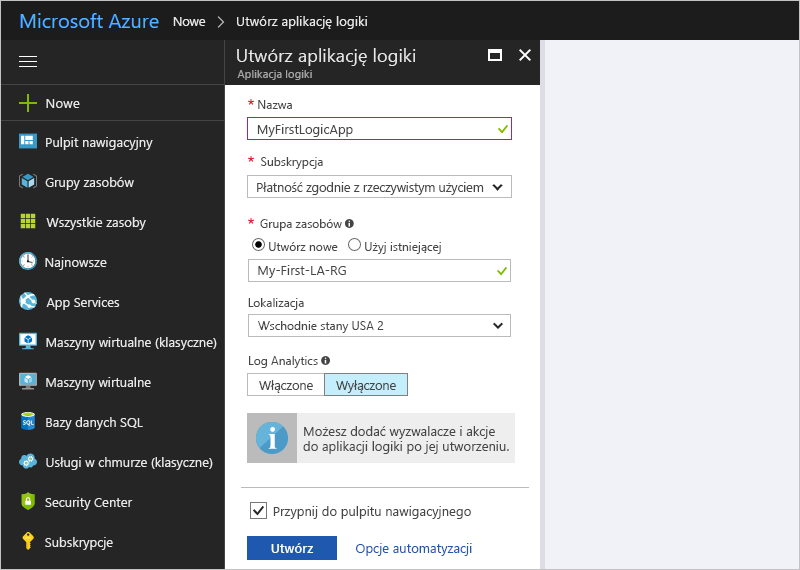

   | Ustawienie | Wartość | Opis | 
   | ------- | ----- | ----------- | 
   | **Nazwa** | MyFirstLogicApp | Nazwa aplikacji logiki | 
   | **Subskrypcja** | <*your-Azure-subscription-name*> | Nazwa subskrypcji platformy Azure | 
   | **Grupa zasobów** | My-First-LA-RG | Nazwa [grupy zasobów platformy Azure](../azure-resource-manager/resource-group-overview.md) używanej do organizowania powiązanych zasobów | 
   | **Lokalizacja** | Wschodnie stany USA 2 | Region, w którym będą przechowywane informacje o aplikacji logiki | 
   | **Log Analytics** | Wyłączone | Ustawienie **Wyłączone** umożliwia rejestrowanie w celach diagnostycznych. | 
   |||| 

3. Gdy platforma Azure wdroży aplikację, zostanie otwarty Projektant aplikacji usługi Logic Apps wyświetlający stronę z wprowadzającym wideo i najczęściej używanymi wyzwalaczami. W obszarze **Szablony** wybierz pozycję **Pusta aplikacja logiki**.

   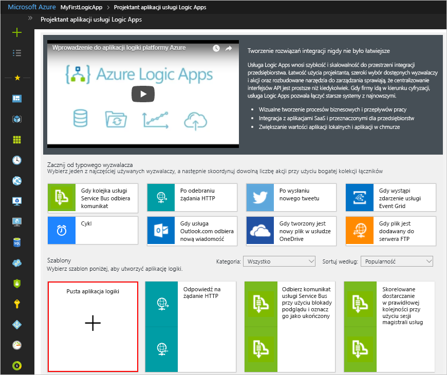

Następnie dodaj [wyzwalacz](../logic-apps/logic-apps-overview.md#logic-app-concepts), który będzie aktywowany po pojawieniu się nowego elementu w kanale informacyjnym RSS. Każda aplikacja logiki musi rozpoczynać się od wyzwalacza, który jest aktywowany w momencie wystąpienia konkretnego zdarzenia lub spełnienia określonego warunku. Po każdym aktywowaniu wyzwalacza aparat usługi Logic Apps tworzy wystąpienie aplikacji logiki uruchamiającej i wykonującej przepływ pracy.

## <a name="check-rss-feed-with-a-trigger"></a>Sprawdzanie kanału informacyjnego RSS za pomocą wyzwalacza

1. W projektancie wprowadź ciąg „rss” w polu wyszukiwania. Wybierz następujący wyzwalacz: **RSS — Gdy element kanału informacyjnego jest publikowany**

   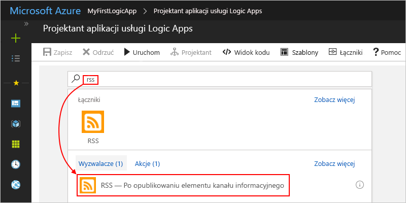

2. Podaj następujące informacje dotyczące wyzwalacza, jak pokazano i opisano: 

   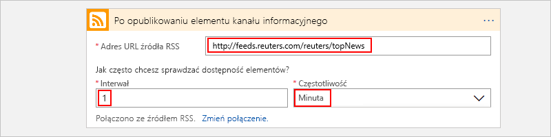

   | Ustawienie | Wartość | Opis | 
   | ------- | ----- | ----------- | 
   | **Adres URL źródła danych RSS** | ```http://feeds.reuters.com/reuters/topNews``` | Link do źródła danych RSS, które chcesz monitorować | 
   | **Interwał** | 1 | Liczba interwałów do odczekania między sprawdzaniami | 
   | **Częstotliwość** | Minuta | Jednostka czasu dla każdego interwału między sprawdzaniami  | 
   |  |  |  | 

   Interwał i częstotliwość określają harmonogram wyzwalacza aplikacji logiki. 
   Ta aplikacja logiki sprawdza kanał informacyjny co minutę.

3. Aby na razie ukryć szczegóły wyzwalacza, kliknij wewnątrz jego paska tytułu.

   

4. Zapisz aplikację logiki. Na pasku narzędzi projektanta wybierz pozycję **Zapisz**. 

Twoja aplikacja logiki jest już aktywna, ale nie robi niczego poza sprawdzaniem źródła danych RSS. Dodaj więc akcję reagującą na aktywowanie wyzwalacza.

## <a name="send-email-with-an-action"></a>Wysyłanie wiadomości e-mail za pomocą akcji

Teraz dodaj [akcję](../logic-apps/logic-apps-overview.md#logic-app-concepts), która wysyła wiadomość e-mail, gdy pojawi się nowy element w kanale informacyjnym RSS. 

1. W obszarze wyzwalacza **Gdy element kanału informacyjnego jest publikowany** wybierz pozycję **+ Nowy krok** > **Dodaj akcję**.

   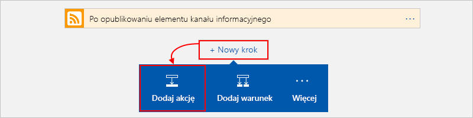

2. W obszarze **Wybierz akcję** wyszukaj ciąg „wyślij wiadomość e-mail”, a następnie wybierz akcję „wyślij wiadomość e-mail” dla wybranego dostawcy poczty e-mail. Aby na liście akcji wyświetlić tylko konkretną usługę, można najpierw wybrać łącznik w obszarze **Łączniki**.

   

   * Dla kont służbowych platformy Azure wybierz pozycję Office 365 Outlook. 
   * Dla osobistych kont Microsoft wybierz pozycję Outlook.com.

3. Jeśli pojawi się prośba o podanie poświadczeń, zaloguj się do swojego konta e-mail, aby usługa Logic Apps utworzyła połączenie z tym kontem e-mail.

4. W obszarze akcji **Wyślij wiadomość e-mail** podaj dane, które powinny znaleźć się w wiadomości e-mail. 

   1. W polu **Do** wprowadź adres e-mail adresata. 
   Do celów testowych możesz użyć własnego adresu e-mail.

      Jeśli zostanie wyświetlona lista parametrów lub lista **Dodaj zawartość dynamiczną**, na razie zignoruj ją. 
      Ta lista pojawia się po kliknięciu wewnątrz niektórych pól edycji. Znajdują się na niej wszelkie dostępne parametry z poprzedniego kroku, które można dołączyć jako dane wejściowe w przepływie pracy.
      Rodzaj wyświetlanej listy jest określany przez szerokość okna przeglądarki.

   2. W polu **Temat** wprowadź następujący tekst ze spacją na końcu: ```New RSS item: ```

      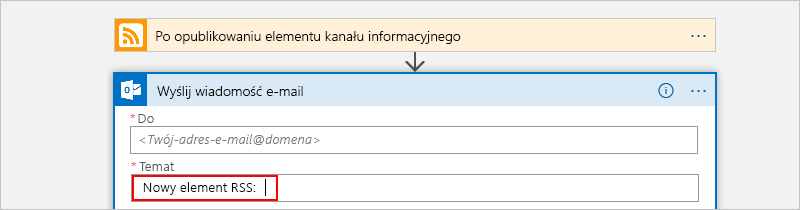
 
   3. Z listy parametrów lub z listy **Dodaj zawartość dynamiczną** wybierz pozycję **Tytuł źródła danych**, aby uwzględnić tytuł elementu kanału RSS.

      W poniższym przykładzie przedstawiono listę parametrów:

      

      A tu widać listę zawartości dynamicznej:

      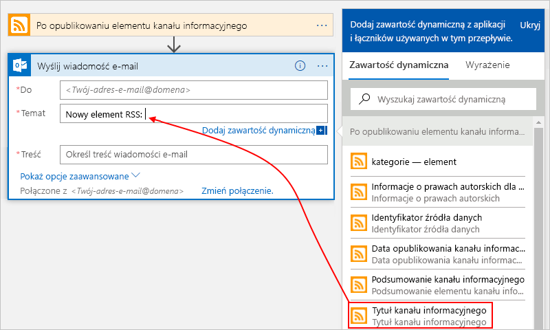

      Gdy wszystko będzie gotowe, temat wiadomości e-mail będzie wyglądać następująco:

      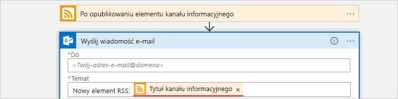

      Jeśli w projektancie pojawi się pętla „For each”, oznacza to, że wybrano pole zawierające tablicę, na przykład pole **categories-item**. 
      W przypadku takiego typu pól projektant automatycznie dodaje pętlę do akcji, która odwołuje się do tego pola. 
      W ten sposób Twoja aplikacja logiki wykonuje tę samą akcję dla każdego elementu tablicy. 
      Aby usunąć pętlę, wybierz **wielokropek** (**...**) na pasku tytułu pętli, a następnie wybierz pozycję **Usuń**.

   4. W polu **Treść** wprowadź następujący tekst i wybierz widoczne pola dla treści wiadomości e-mail. 
   Aby dodać puste wiersze w polu edycji, naciśnij klawisze Shift + Enter. 

      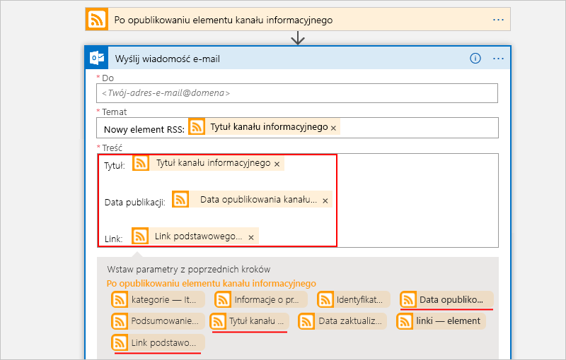

      | Ustawienie | Opis | 
      | ----- | ----------- | 
      | **Tytuł źródła danych** | Tytuł elementu | 
      | **Data opublikowania kanału informacyjnego** | Data i godzina opublikowania elementu | 
      | **Link podstawowego źródła danych** | Adres URL elementu | 
      ||| 
   
5. Zapisz aplikację logiki.

Następnie przeprowadź testowanie aplikacji logiki.

## <a name="run-your-logic-app"></a>Uruchamianie aplikacji logiki

Aby ręcznie uruchomić swoją aplikację logiki, na pasku narzędzi projektanta wybierz pozycję **Uruchom**. Możesz też poczekać, aż aplikacja logiki zostanie uruchomiona zgodnie z określonym harmonogramem (co minutę). Jeśli źródło danych RSS będzie zawierać nowe elementy, aplikacja logiki wyśle wiadomość e-mail dla każdego nowego elementu. Jednak jeśli źródło danych nie będzie zawierać żadnych nowych elementów, aplikacja logiki pominie aktywowanie wyzwalacza i przeczeka kolejny odstęp czasu przed ponownym sprawdzeniem. 

Oto przykładowa wiadomość e-mail wysłana przez tę aplikację logiki:

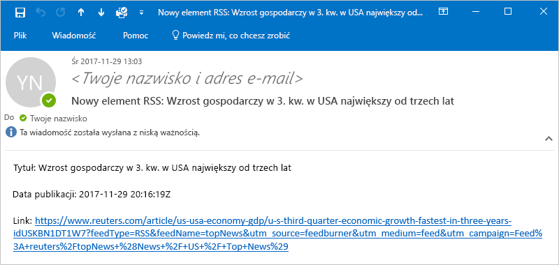

Jeśli nie dostaniesz żadnych wiadomości e-mail, sprawdź folder wiadomości-śmieci. Filtr wiadomości-śmieci Twojej poczty e-mail może przekierowywać tego rodzaju wiadomości. 

Gratulacje, udało Ci się utworzyć i uruchomić pierwszą aplikację logiki.

## <a name="clean-up-resources"></a>Oczyszczanie zasobów

Gdy grupa zasobów zawierająca aplikację logiki i powiązane zasoby nie będzie już potrzebna, usuń ją. W menu głównym platformy Azure przejdź do pozycji **Grupy zasobów** i wybierz grupę zasobów aplikacji logiki. Wybierz pozycję **Usuń grupę zasobów**. Aby potwierdzić, wprowadź nazwę grupy zasobów, a następnie wybierz pozycję **Usuń**.

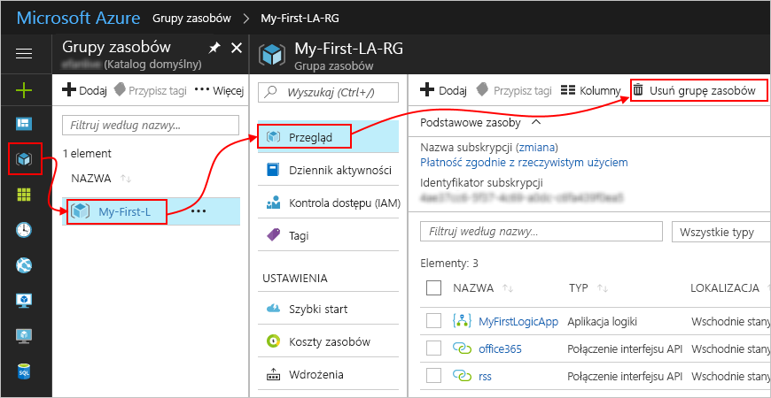

## <a name="get-support"></a>Uzyskiwanie pomocy technicznej

* Jeśli masz pytania, odwiedź [forum usługi Azure Logic Apps](https://social.msdn.microsoft.com/Forums/en-US/home?forum=azurelogicapps).
* Aby przesłać pomysły dotyczące funkcji lub zagłosować na nie, odwiedź [witrynę opinii użytkowników usługi Logic Apps](http://aka.ms/logicapps-wish).

## <a name="next-steps"></a>Następne kroki

W tym przewodniku Szybki start utworzono pierwszą aplikację logiki, która sprawdza aktualizacje kanału informacyjnego RSS według określonego harmonogramu (co minutę) i jeśli istnieją aktualizacje, wykonuje akcję (wysyła wiadomość e-mail). Aby dowiedzieć się więcej, kontynuuj pracę z tym samouczkiem nad tworzeniem bardziej zaawansowanych przepływów pracy opartych na harmonogramie:

> [!div class="nextstepaction"]
> [Sprawdzanie ruchu za pomocą aplikacji logiki opartej na harmonogramie](../logic-apps/tutorial-build-schedule-recurring-logic-app-workflow.md)