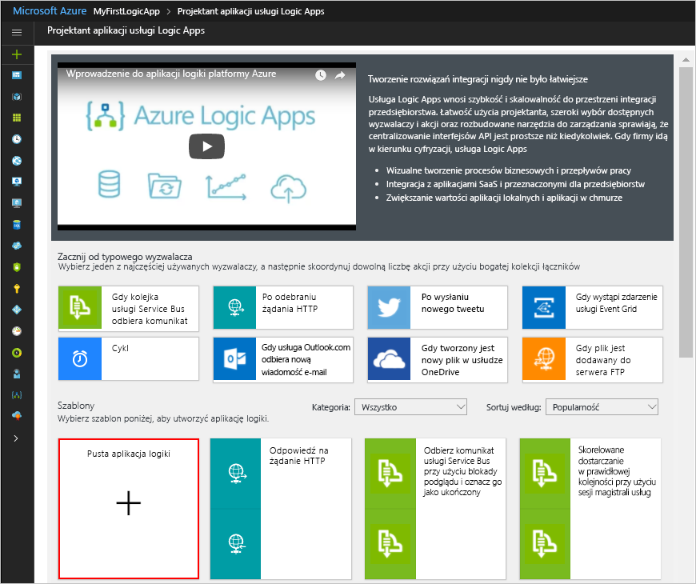

# <a name="process-emails-and-attachments-with-a-logic-app"></a>Przetwarzanie wiadomości e-mail i załączników za pomocą aplikacji logiki

Usługa Azure Logic Apps pomaga automatyzować przepływy pracy i integrować dane w usługach platformy Azure, usługach firmy Microsoft, innych aplikacjach typu oprogramowanie jako usługa (SaaS) oraz systemach lokalnych. Ten samouczek pokazuje sposób tworzenia [aplikacji logiki](../logic-apps/logic-apps-overview.md), która obsługuje przychodzące wiadomości e-mail i wszelkie załączniki. Ta aplikacja logiki przetwarza zawartość, zapisuje ją w magazynie platformy Azure oraz wysyła powiadomienia dotyczące przeglądania zawartości. 

Ten samouczek zawiera informacje na temat wykonywania następujących czynności:

> [!div class="checklist"]
> * Konfigurowania [magazynu platformy Azure](../storage/common/storage-introduction.md) i Eksploratora usługi Storage na potrzeby sprawdzania zapisanych wiadomości e-mail i załączników.
> * Tworzenia [funkcji platformy Azure](../azure-functions/functions-overview.md) usuwającej kod HTML z wiadomości e-mail. Ten samouczek zawiera kod, którego można użyć na potrzeby tej funkcji.
> * Tworzenia pustej aplikacji logiki.
> * Dodawania wyzwalacza monitorującego wiadomości e-mail pod kątem załączników.
> * Dodawania warunku sprawdzającego, czy wiadomości e-mail zawierają załączniki.
> * Dodawania akcji, która wywołuje funkcję platformy Azure, jeśli wiadomość e-mail ma załączniki.
> * Dodawania akcji, która tworzy obiekty blob magazynu dla wiadomości e-mail i załączników.
> * Dodawania akcji, która wysyła powiadomienia w wiadomościach e-mail.

Po ukończeniu aplikacja logiki będzie ogólnie wyglądać jak ten przepływ pracy:


Jeśli nie masz subskrypcji platformy Azure, przed rozpoczęciem <a href="https://azure.microsoft.com/free/" target="_blank">zarejestruj się w celu założenia bezpłatnego konta platformy Azure</a>. 

## <a name="prerequisites"></a>Wymagania wstępne

* Konto e-mail od dostawcy obsługiwanego przez usługę Logic Apps, na przykład Office 365 Outlook, Outlook.com lub Gmail. W przypadku innych dostawców [przejrzyj tę listę łączników](https://docs.microsoft.com/connectors/).

  Ta aplikacja logiki korzysta z konta Office 365 Outlook. 
  Jeśli korzystasz z innego konta e-mail, ogólne kroki pozostają takie same, ale Twój interfejs użytkownika może wyglądać trochę inaczej.

* Pobierz i zainstaluj <a href="http://storageexplorer.com/" target="_blank">bezpłatny Eksplorator usługi Microsoft Azure Storage</a>. To narzędzie ułatwia sprawdzanie, czy kontener magazynu został skonfigurowany prawidłowo.

## <a name="sign-in-to-the-azure-portal"></a>Logowanie się do witryny Azure Portal

Zaloguj się do <a href="https://portal.azure.com" target="_blank">witryny Azure Portal</a> przy użyciu poświadczeń konta Azure.

## <a name="set-up-storage-to-save-attachments"></a>Konfigurowanie magazynu na potrzeby zapisywania załączników

Możesz zapisywać przychodzące wiadomości e-mail i załączniki jako obiekty blob w [kontenerze magazynu platformy Azure](../storage/common/storage-introduction.md). 

1. Przed utworzeniem kontenera magazynu [utwórz konto magazynu](../storage/common/storage-create-storage-account.md#create-a-storage-account) przy użyciu tych ustawień:

   | Ustawienie | Wartość | Opis | 
   | ------- | ----- | ----------- | 
   | **Nazwa** | attachmentstorageacct | Nazwa konta magazynu | 
   | **Model wdrażania** | Resource Manager | [Model wdrażania](../azure-resource-manager/resource-manager-deployment-model.md) na potrzeby zarządzania wdrażaniem zasobów | 
   | **Rodzaj konta** | Zastosowania ogólne | [Typ konta magazynu](../storage/common/storage-introduction.md#types-of-storage-accounts) | 
   | **Wydajność** | Standardowa (Standard) | To ustawienie określa obsługiwane typy danych oraz nośniki do przechowywania danych. Zobacz [Typy kont magazynu](../storage/common/storage-introduction.md#types-of-storage-accounts). | 
   | **Replikacja** | Magazyn lokalnie nadmiarowy (LRS) | To ustawienie określa sposób kopiowania, przechowywania i synchronizowania danych oraz zarządzania nimi. Zobacz [Replikacja](../storage/common/storage-introduction.md#replication). | 
   | **Wymagany bezpieczny transfer** | Disabled (Wyłączony) | To ustawienie określa wymagane zabezpieczenia dla żądań z połączeń. Zobacz [Require secure transfer (Wymaganie bezpiecznego transferu)](../storage/common/storage-require-secure-transfer.md). | 
   | **Subskrypcja** | <*your-Azure-subscription-name*> | Nazwa subskrypcji platformy Azure | 
   | **Grupa zasobów** | LA-Tutorial-RG | Nazwa [grupy zasobów platformy Azure](../azure-resource-manager/resource-group-overview.md) używana do organizowania powiązanych zasobów i zarządzania nimi. <p>**Uwaga:** grupa zasobów istnieje w konkretnym regionie. Chociaż elementy w tym samouczku mogą nie być dostępne we wszystkich regionach, spróbuj używać tego samego regionu, jeśli jest to możliwe. | 
   | **Lokalizacja** | Wschodnie stany USA 2 | Region, w którym będą przechowywane informacje na temat konta magazynu | 
   | **Konfigurowanie sieci wirtualnych** | Disabled (Wyłączony) | Na potrzeby tego samouczka zachowaj ustawienie **Wyłączony**. | 
   |||| 

   Możesz też użyć programu [Azure PowerShell](../storage/common/storage-quickstart-create-storage-account-powershell.md) lub [interfejsu wiersza polecenia platformy Azure](../storage/common/storage-quickstart-create-storage-account-cli.md).
  
2. Po wdrożeniu konta magazynu przez platformę Azure pobierz klucz dostępu konta magazynu:

   1. W menu konta magazynu w sekcji **Ustawienia** wybierz opcję **Klucze dostępu**. 
   2. Znajdź klucz **key1** w sekcji **Klucze domyślne** oraz nazwę konta magazynu.

      

   Możesz też użyć programu [Azure PowerShell](https://docs.microsoft.com/powershell/module/azurerm.storage/get-azurermstorageaccountkey) lub [interfejsu wiersza polecenia platformy Azure](https://docs.microsoft.com/cli/azure/storage/account/keys?view=azure-cli-latest.md#az_storage_account_keys_list). 

3. Utwórz kontener magazynu na załączniki poczty e-mail.
   
   1. W menu konta magazynu w okienku **Omówienie** wybierz opcję **Obiekty blob** w sekcji **Usługi**, a następnie wybierz opcję **+ Kontener**.

   2. Wprowadź „attachments” jako nazwę kontenera. W sekcji **Poziom dostępu publicznego** wybierz opcję **Kontener (anonimowy dostęp do odczytu dla kontenerów i obiektów blob)**, a następnie wybierz przycisk **OK**.

   Możesz też użyć programu [Azure PowerShell](https://docs.microsoft.com/powershell/module/azure.storage/new-azurestoragecontainer) lub [interfejsu wiersza polecenia platformy Azure](https://docs.microsoft.com/cli/azure/storage/container?view=azure-cli-latest#az_storage_container_create). 
   Gdy wszystko będzie gotowe, będziesz w stanie znaleźć kontener magazynu na koncie magazynu w witrynie Azure Portal:

   

Następnie połącz Eksplorator usługi Storage z kontem magazynu.

## <a name="set-up-storage-explorer"></a>Konfiguracja Eksploratora usługi Storage

Teraz połącz Eksplorator usługi Storage z kontem magazynu, aby potwierdzić, że aplikacja logiki prawidłowo zapisuje załączniki jako obiekty blob w kontenerze magazynu.

1. Otwórz Eksplorator usługi Microsoft Azure Storage. Kiedy Eksplorator usługi Storage wyświetli monit o połączenie z magazynem platformy Azure, wybierz opcję **Użyj nazwy i klucza konta magazynu** > **Dalej**.
Jeśli nie zostanie wyświetlony monit, wybierz opcję **Dodaj konto** na pasku narzędzi eksploratora.

2. W obszarze **Dołącz przy użyciu nazwy i klucza** wprowadź zapisaną wcześniej nazwę konta magazynu oraz klucz dostępu. Wybierz opcję **Dalej** > **Połącz**.

3. Sprawdź, czy konto magazynu i kontener są prawidłowo wyświetlane w Eksploratorze usługi Storage:

   1. W obszarze **Eksplorator** rozwiń pozycję **(Lokalne i dołączone)** > 
   **Konta magazynu** > **attachmentstorageaccount** > 
   **Kontenery obiektów blob**.

   2. Upewnij się, że zostanie wyświetlony kontener „attachments”. 
   Na przykład:

      

Następnie utwórz [funkcję platformy Azure](../azure-functions/functions-overview.md), która będzie usuwać kod HTML z przychodzących wiadomości e-mail.

## <a name="create-a-function-to-clean-html"></a>Tworzenie funkcji do czyszczenia kodu HTML

Teraz użyj fragmentu kodu zapewnionego przez te kroki, aby utworzyć funkcję platformy Azure, która będzie usuwać kod HTML z przychodzących wiadomości e-mail. W ten sposób zawartość wiadomości e-mail będzie czystsza i łatwiejsza do przetworzenia. Następnie możesz wywołać tę funkcję z poziomu aplikacji logiki.

1. Aby można było utworzyć funkcję, [utwórz aplikację funkcji](../azure-functions/functions-create-function-app-portal.md) przy użyciu następujących ustawień:

   | Ustawienie | Wartość | Opis | 
   | ------- | ----- | ----------- | 
   | **Nazwa aplikacji** | CleanTextFunctionApp | Globalnie unikatowa i opisowa nazwa aplikacji funkcji | 
   | **Subskrypcja** | <*your-Azure-subscription-name*> | Ta sama subskrypcja platformy Azure, której użyto wcześniej | 
   | **Grupa zasobów** | LA-Tutorial-RG | Ta sama grupa zasobów platformy Azure, której użyto wcześniej | 
   | **Plan hostingu** | Plan zużycia | To ustawienie określa sposób przydzielania i skalowania zasobów, takich jak moc obliczeniowa, na potrzeby uruchamiania aplikacji funkcji. Zobacz [Hosting plan comparison (Porównanie planów hostingu)](../azure-functions/functions-scale.md). | 
   | **Lokalizacja** | Wschodnie stany USA 2 | Ten sam region, którego użyto wcześniej | 
   | **Storage** | cleantextfunctionstorageacct | Utwórz konto magazynu dla aplikacji funkcji. Użyj tylko małych liter i cyfr. <p>**Uwaga:** to konto magazynu zawiera aplikacje funkcji i różni się od poprzednio utworzonego konta magazynu do przechowywania załączników wiadomości e-mail. | 
   | **Application Insights** | Wyłączone | Włącza monitorowanie aplikacji za pomocą usługi [Application Insights](../application-insights/app-insights-overview.md), ale na potrzeby tego samouczka zachowaj ustawienie **Wyłączone**. | 
   |||| 

   Jeśli aplikacja funkcji nie otworzy się automatycznie po wdrożeniu, znajdź ją w witrynie <a href="https://portal.azure.com" target="_blank">Azure Portal</a>. W głównym menu platformy Azure wybierz usługę **App Services**, a następnie wybierz aplikację funkcji.

   

   Jeśli usługa **App Services** nie jest wyświetlana w menu platformy Azure, przejdź do pozycji **Więcej usług**. W polu wyszukiwania znajdź i wybierz opcję **Aplikacje funkcji**. Aby uzyskać więcej informacji, zobacz [Tworzenie funkcji](../azure-functions/functions-create-first-azure-function.md).

   Możesz też użyć [interfejsu wiersza polecenia platformy Azure](../azure-functions/functions-create-first-azure-function-azure-cli.md) lub [szablonów programu PowerShell i usługi Resource Manager](../azure-resource-manager/resource-group-template-deploy.md).

2. W sekcji **Aplikacje funkcji** rozwiń pozycję **CleanTextFunctionApp**, a następnie wybierz pozycję **Funkcje**. Na pasku narzędzi funkcji wybierz pozycję **+ Nowa funkcja**.

   

3. W obszarze **Wybierz szablon poniżej lub przejdź do szybkiego startu** wybierz szablon funkcji **HttpTrigger - C#**.

   

4. W obszarze **Nadaj nazwę funkcji** wprowadź ```RemoveHTMLFunction```. W obszarze **Wyzwalacz HTTP** > **Poziom autoryzacji** zachowaj domyślną wartość **Funkcja** i wybierz pozycję **Utwórz**.

   

5. Po otwarciu edytora zastąp kod szablonu poniższym kodem, który usuwa kod HTML i zwraca wyniki do obiektu wywołującego:

   ``` CSharp
   using System.Net;
   using System.Text.RegularExpressions;

   public static async Task<HttpResponseMessage> Run(HttpRequestMessage req, TraceWriter log)
   {
      log.Info($"HttpWebhook triggered");

      // Parse query parameter
      string emailBodyContent = await req.Content.ReadAsStringAsync();

      // Replace HTML with other characters
      string updatedBody = Regex.Replace(emailBodyContent, "<.*?>", string.Empty);
      updatedBody = updatedBody.Replace("\\r\\n", " ");
      updatedBody = updatedBody.Replace(@"&nbsp;", " ");

      // Return cleaned text
      return req.CreateResponse(HttpStatusCode.OK, new { updatedBody });

   }
   ```

6. Gdy wszystko będzie gotowe, wybierz pozycję **Zapisz**. Aby przetestować funkcję, wybierz pozycję **Test**pod ikoną strzałki (**<**) przy prawej krawędzi edytora. 

   

7. W okienku **Test** w obszarze **Treść żądania** wprowadź poniższy wiersz i wybierz pozycję **Uruchom**.

   ```json
   {"name": "<p><p>Testing my function</br></p></p>"}
   ```

   

   Okno **Dane wyjściowe** zawiera następujący wynik funkcji:

   ```json
   {"updatedBody":"{\"name\": \"Testing my function\"}"}
   ```

Po sprawdzeniu, czy funkcja działa, utwórz aplikację logiki. Chociaż ten samouczek przedstawia sposób utworzenia funkcji usuwającej kod HTML z wiadomości e-mail, usługa Logic Apps również zawiera łącznik **HTML do tekstu**.

## <a name="create-your-logic-app"></a>Tworzenie aplikacji logiki

1. W głównym menu platformy Azure wybierz kolejno pozycje **Nowy** > **Integracja dla przedsiębiorstw** > **Aplikacja logiki**.

   

2. W obszarze **Tworzenie aplikacji logiki** wprowadź następujące informacje na temat aplikacji logiki. Gdy skończysz, wybierz pozycję **Przypnij do pulpitu nawigacyjnego** > **Utwórz**.

   

   | Ustawienie | Wartość | Opis | 
   | ------- | ----- | ----------- | 
   | **Nazwa** | LA-ProcessAttachment | Nazwa aplikacji logiki | 
   | **Subskrypcja** | <*your-Azure-subscription-name*> | Ta sama subskrypcja platformy Azure, której użyto wcześniej | 
   | **Grupa zasobów** | LA-Tutorial-RG | Ta sama grupa zasobów platformy Azure, której użyto wcześniej |
   | **Lokalizacja** | Wschodnie stany USA 2 | Ten sam region, którego użyto wcześniej | 
   | **Log Analytics** | Wyłączone | Na potrzeby tego samouczka zachowaj ustawienie **Wyłączone**. | 
   |||| 

3. Po wdrożeniu aplikacji na platformie Azure zostanie otwarty Projektant aplikacji usługi Logic Apps ze stroną zawierającą wprowadzający film wideo i szablony typowych wzorców aplikacji logiki. W obszarze **Szablony** wybierz pozycję **Pusta aplikacja logiki**.

   

Następnie dodaj [wyzwalacz](../logic-apps/logic-apps-overview.md#logic-app-concepts), który będzie nasłuchiwać przychodzących wiadomości e-mail zawierających załączniki. Każda aplikacja logiki musi rozpoczynać się od wyzwalacza, który jest aktywowany w momencie wystąpienia konkretnego zdarzenia lub spełnienia określonego warunku przez nowe dane. Aby uzyskać więcej informacji, zobacz [Tworzenie pierwszej aplikacji logiki](../logic-apps/quickstart-create-first-logic-app-workflow.md).

## <a name="monitor-incoming-email"></a>Monitorowanie przychodzących wiadomości e-mail

1. W projektancie wprowadź frazę „when email arrives” (po nadejściu wiadomości e-mail) w polu wyszukiwania. Wybierz ten wyzwalacz dla dostawcy poczty e-mail: **<*Twój-dostawca-poczty-e-mail*> — Po nadejściu nowej wiadomości e-mail**, na przykład:

   

   * Dla kont służbowych platformy Azure wybierz pozycję Office 365 Outlook. 
   * Dla osobistych kont Microsoft wybierz pozycję Outlook.com. 

2. Jeśli pojawi się prośba o podanie poświadczeń, zaloguj się do swojego konta e-mail, aby usługa Logic Apps mogła utworzyć połączenie z tym kontem e-mail.

3. Teraz podaj kryteria, których wyzwalacz będzie używać do filtrowania nowych wiadomości e-mail.

   1. Określ folder, interwał i częstotliwość sprawdzania wiadomości e-mail.

      

      | Ustawienie | Wartość | Opis | 
      | ------- | ----- | ----------- | 
      | **Folder** | Skrzynka odbiorcza | Folder poczty e-mail do sprawdzania | 
      | **Interwał** | 1 | Liczba interwałów do odczekania między sprawdzaniami | 
      | **Częstotliwość** | Minuta | Jednostka czasu dla każdego interwału między sprawdzaniami | 
      |  |  |  | 
  
   2. Wybierz pozycję **Pokaż opcje zaawansowane** i określ następujące ustawienia:

      | Ustawienie | Wartość | Opis | 
      | ------- | ----- | ----------- | 
      | **Zawiera załącznik** | Yes | Pobieraj tylko wiadomości e-mail z załącznikami. <p>**Uwaga:** wyzwalacz nie usuwa żadnych wiadomości e-mail z konta; sprawdza tylko nowe wiadomości i przetwarza tylko te wiadomości, które pasują do filtru tematu. | 
      | **Uwzględnij załączniki** | Yes | Pobieraj załączniki jako dane wejściowe dla przepływu pracy, zamiast tylko sprawdzać wiadomości pod kątem istnienia załączników. | 
      | **Filtr tematu** | ```Business Analyst 2 #423501``` | Tekst do wyszukania w temacie wiadomości e-mail | 
      |  |  |  | 

4. Aby na razie ukryć szczegóły wyzwalacza, kliknij wewnątrz jego paska tytułu.

   

5. Zapisz aplikację logiki. Na pasku narzędzi projektanta wybierz pozycję **Zapisz**.

   Twoja aplikacja logiki jest już aktywna, ale nie robi niczego poza sprawdzaniem wiadomości e-mail. 
   Następnie dodaj warunek określający kryteria umożliwiające kontynuowanie przepływu pracy.

## <a name="check-for-attachments"></a>Sprawdzanie załączników

1. W obszarze wyzwalacza wybierz opcję **+ Nowy krok** > **Dodaj warunek**.

   Gdy pojawi się kształt warunku, domyślnie zostanie wyświetlona lista parametrów lub lista zawartości dynamicznej, która będzie zawierać parametry z poprzedniego kroku z możliwością uwzględnienia ich w formie danych wejściowych przepływu pracy. 
   Rodzaj wyświetlanej listy jest określany przez szerokość okna przeglądarki.

2. Zmień nazwę warunku na lepszy opis.

   1. Na pasku tytułu warunku wybierz przycisk z **wielokropkiem** (**...**) > **Zmień nazwę**.

      Na przykład jeśli okno przeglądarki jest wąskie:

      

      Jeśli okno przeglądarki jest szerokie, a lista zawartości dynamicznej blokuje dostęp do przycisku wielokropka, zamknij listę, wybierając pozycję **Dodaj zawartość dynamiczną** wewnątrz warunku. 
      
      

   2. Zmień nazwę warunku na następujący opis: ```If email has attachments and key subject phrase```

3. Opisz warunek, podając wyrażenie. 

   1. Wewnątrz kształtu warunku wybierz pozycję **Edytuj w trybie zaawansowanym**.

      

   2. W polu tekstowym wprowadź następujące wyrażenie:

      ```@equals(triggerBody()?['HasAttachment'], bool('true'))```

      To wyrażenie porównuje wartość właściwości **HasAttachment** z treści wyzwalacza, która w tym samouczku jest wiadomością e-mail, z obiektem Boolean ```True```. 
      Jeśli obie wartości są równe, wiadomość e-mail ma co najmniej jeden załącznik, warunek zostaje spełniony, a przepływ pracy jest kontynuowany.

      Teraz warunek wygląda następująco:

      

   3. Wybierz pozycję **Edytuj w trybie podstawowym**. Teraz wyrażenie będzie zapewniać następujące rozwiązanie:

      

      > [!NOTE]
      > Aby ręcznie utworzyć wyrażenie, musisz pracować w trybie podstawowym i mieć otwartą listę dynamiczną. Dzięki temu możesz pracować z konstruktorem wyrażeń. W obszarze **Wyrażenie** możesz wybrać funkcje. W obszarze **Zawartość dynamiczna** możesz wybrać pola parametrów do użycia w tych funkcjach.
      > Później w tym samouczku pokazano sposób ręcznego tworzenia wyrażeń.

4. Zapisz aplikację logiki.

### <a name="test-your-condition"></a>Testowanie warunku

Teraz należy sprawdzić, czy warunek działa prawidłowo:

1. Jeśli aplikacja logiki jeszcze nie działa, wybierz pozycję **Uruchom** na pasku narzędzi projektanta.

   Ten krok spowoduje ręczne uruchomienie aplikacji logiki bez potrzeby oczekiwania na koniec określonego interwału. 
   Niemniej jednak nic się nie stanie do momentu otrzymania wiadomości e-mail w skrzynce odbiorczej. 

2. Wyślij do siebie wiadomość e-mail spełniającą następujące kryteria:

   * Temat wiadomości ma tekst określony w pozycji **Filtr tematu** wyzwalacza: ```Business Analyst 2 #423501```

   * Wiadomość e-mail zawiera jeden załącznik. 
   Teraz po prostu utwórz pusty plik tekstowy i załącz go do wiadomości e-mail.

   Po odebraniu wiadomości e-mail aplikacja logiki sprawdzi ją pod kątem załączników oraz określonego tekstu tematu.
   Jeśli warunek zostanie spełniony, wyzwalacz spowoduje utworzenie wystąpienia aplikacji logiki przez aparat usługi Logic Apps oraz uruchomienie przepływu pracy. 

3. Aby sprawdzić, czy wyzwalacz zadziałał i aplikacja logiki została uruchomiona pomyślnie, w menu aplikacji logiki wybierz pozycję **Omówienie**.

   

   Jeśli aplikacja logiki nie została wyzwolona lub nie została uruchomiona mimo pomyślnego uruchomienia wyzwalacza, zobacz [Troubleshoot your logic app (Rozwiązywanie problemów z aplikacją logiki)](../logic-apps/logic-apps-diagnosing-failures.md).

Następnie zdefiniuj akcje do wykonania w przypadku gałęzi **W przypadku wartości true**. Aby zapisać wiadomość e-mail wraz z załącznikami, usuń kod HTML z treści wiadomości e-mail, a następnie utwórz obiekty blob w kontenerze magazynu dla wiadomości e-mail i załączników.

> [!NOTE]
> Twoja aplikacja logiki nie musi podejmować żadnych działań dla gałęzi **W przypadku wartości false**, jeśli wiadomość e-mail nie ma załączników. W ramach dodatkowego ćwiczenia po zakończeniu tego samouczka możesz dodać wszelkie odpowiednie akcje, które powinny zostać wykonane dla gałęzi **W przypadku wartości false**.

## <a name="call-the-removehtmlfunction"></a>Wywoływanie funkcji RemoveHTMLFunction

1. W menu aplikacji logiki wybierz pozycję **Projektant aplikacji logiki**. W gałęzi **W przypadku wartości true** wybierz pozycję **Dodaj akcję**.

2. Wyszukaj frazę „azure functions” i wybierz następującą akcję: **Azure Functions — wybierz funkcję platformy Azure**

   

3. Wybierz wcześniej utworzoną aplikację funkcji: **CleanTextFunctionApp**

   

4. Teraz wybierz funkcję: **RemoveHTMLFunction**

   

5. Zmień nazwę kształtu funkcji na ten opis: ```Call RemoveHTMLFunction to clean email body``` 

6. W kształcie funkcji wprowadź dane wejściowe do przetworzenia przez funkcję. Określ treść wiadomości e-mail, jak pokazano i opisano poniżej:

   

   1. W obszarze **Treść żądania** wprowadź następujący tekst: 
   
      ```{ "emailBody": ``` 

      Do momentu zakończenia wpisu w kolejnych krokach będzie pojawiać się błąd o nieprawidłowym pliku JSON.
      Podczas wcześniejszego testowania tej funkcji dane wejściowe określone dla funkcji używały formatu JavaScript Object Notation (JSON). 
      Dlatego też treść żądania musi używać tego samego formatu. 

   2. Na liście parametrów lub na liście zawartości dynamicznej wybierz pole **Treść** w obszarze **Po nadejściu nowej wiadomości e-mail**.
   Po polu **Treść** dodaj zamykający nawias klamrowy: ```}```

      

      W definicji aplikacji logiki ten wpis pojawia się w następującym formacie:

      ```{ "emailBody": "@triggerBody()?['Body']" }```

7. Zapisz aplikację logiki.

Następnie dodaj akcję, która utworzy obiekt blob w kontenerze magazynu do zapisywania treści wiadomości e-mail.

## <a name="create-blob-for-email-body"></a>Tworzenie obiektu blob na potrzeby treści wiadomości e-mail

1. W obszarze kształtu funkcji platformy Azure wybierz pozycję **Dodaj akcję**. 

2. W obszarze **wybierania akcji** wyszukaj ciąg „blob” i wybierz następującą akcję: **Azure Blob Storage — utwórz obiekt blob**

   

3. Jeśli nie masz połączenia z kontem magazynu platformy Azure, utwórz połączenie z kontem magazynu przy użyciu tych ustawień, tak jak pokazano i opisano w tym miejscu. Gdy wszystko będzie gotowe, wybierz pozycję **Utwórz**.

   

   | Ustawienie | Wartość | Opis | 
   | ------- | ----- | ----------- | 
   | **Nazwa połączenia** | AttachmentStorageConnection | Nazwa opisowa połączenia | 
   | **Konto magazynu** | attachmentstorageacct | Nazwa konta magazynu, który został utworzony wcześniej do zapisywania załączników | 
   |||| 

4. Zmień nazwę akcji **Utwórz obiekt blob** na następujący opis: ```Create blob for email body```

5. W akcji **Utwórz obiekt blob** podaj te informacje, a następnie wybierz parametry, aby utworzyć obiekt blob, tak jak pokazano i opisano w tym miejscu:

   

   | Ustawienie | Wartość | Opis | 
   | ------- | ----- | ----------- | 
   | **Ścieżka folderu** | /attachments | Ścieżka i nazwa wcześniej utworzonego kontenera. Możesz też przeglądać i wybrać kontener. | 
   | **Nazwa obiektu blob** | Pole **Od** | Przekaż nazwę nadawcy wiadomości e-mail jako nazwę obiektu blob. Na liście parametrów lub na liście zawartości dynamicznej wybierz pozycję **Od** w obszarze **Po nadejściu nowej wiadomości e-mail**. | 
   | **Zawartość obiektu blob** | Pole **Zawartość** | Przekaż treść wiadomości e-mail bez kodu HTML jako zawartość obiektu blob. Wybierz z listy parametrów lub listy zawartości dynamicznej pozycję **Treść** w obszarze **Wywołaj funkcję RemoveHTMLFunction, aby wyczyścić treść wiadomości e-mail**. |
   |||| 

6. Zapisz aplikację logiki. 

### <a name="check-attachment-handling"></a>Sprawdzanie obsługi załączników

Teraz przetestuj aplikację logiki pod kątem określonego sposobu obsługi wiadomości e-mail:

1. Jeśli aplikacja logiki jeszcze nie działa, wybierz pozycję **Uruchom** na pasku narzędzi projektanta.

2. Wyślij do siebie wiadomość e-mail spełniającą następujące kryteria:

   * Temat wiadomości ma tekst określony w pozycji **Filtr tematu** wyzwalacza: ```Business Analyst 2 #423501```

   * Wiadomość e-mail zawiera co najmniej jeden załącznik. 
   Teraz po prostu utwórz pusty plik tekstowy i załącz go do wiadomości e-mail.

   * Wiadomość e-mail ma testową zawartość w treści, na przykład: 

     ```
     Testing my logic app
     ```

   Jeśli aplikacja logiki nie została wyzwolona lub nie została uruchomiona mimo pomyślnego uruchomienia wyzwalacza, zobacz [Troubleshoot your logic app (Rozwiązywanie problemów z aplikacją logiki)](../logic-apps/logic-apps-diagnosing-failures.md).

3. Sprawdź, czy aplikacja logiki zapisała wiadomość e-mail do prawidłowego kontenera magazynu. 

   1. W Eksploratorze usługi Storage rozwiń pozycję **(Lokalne i dołączone)** > 
   **Konta magazynu** > **attachmentstorageacct (zewnętrzne)** > 
   **Kontenery obiektów blob** > **attachments**.

   2. Sprawdź kontener **attachments** pod kątem wiadomości e-mail. 

      W tym momencie w kontenerze jest wyświetlana tylko wiadomość e-mail, ponieważ aplikacja logiki nie przetwarza jeszcze załączników.

      

   3. Gdy wszystko będzie gotowe, usuń wiadomość e-mail w Eksploratorze usługi Storage.

4. Opcjonalnie, aby przetestować gałąź **W przypadku wartości false**, która obecnie nic nie robi, możesz wysłać wiadomość e-mail, która nie spełnia kryteriów.

Następnie dodaj pętlę, aby przetwarzać wszystkie załączniki poczty e-mail.

## <a name="process-attachments"></a>Przetwarzanie załączników

Ta aplikacja logiki używa pętli **for each**, aby przetwarzać wszystkie załączniki w wiadomościach e-mail.

1. W obszarze kształtu **Tworzenie obiektu blob na potrzeby treści wiadomości e-mail** wybierz pozycję **… Więcej**, a następnie wybierz to polecenie: **Dodaj pętlę for each**

   

2. Zmień nazwę pętli na następujący opis: ```For each email attachment```

3. Teraz określ dane dla pętli do przetworzenia. Kliknij wewnątrz pola **Wybierz dane wyjściowe z poprzednich kroków**. Na liście parametrów lub liście zawartości dynamicznej wybierz pozycję **Załączniki**. 

   

   Pole **Załączniki** przekazuje tablicę zawierającą wszystkie załączniki dołączone do wiadomości e-mail. 
   Pętla **For each** powtarza akcje wobec każdego elementu przekazanego w tablicy.

4. Zapisz aplikację logiki.

Następnie dodaj akcję, która zapisuje każdy załącznik jako obiekt blob w kontenerze magazynu **attachments**.

## <a name="create-blobs-for-attachments"></a>Tworzenie obiektów blob dla załączników

1. W pętli **For each** wybierz opcję **Dodaj akcję**, aby określić zadanie do wykonania wobec każdego znalezionego załącznika.

   

2. W obszarze **Wybierz akcję** wyszukaj frazę „blob”, a następnie wybierz tę akcję: **Azure Blob Storage — utwórz obiekt blob**

   

3. Zmień nazwę akcji **Utwórz obiekt blob 2** na następujący opis: ```Create blob for each email attachment```

4. W akcji **Utwórz obiekt blob dla każdego załącznika wiadomości e-mail** podaj te informacje, a następnie wybierz parametry, aby utworzyć wszystkie obiekty blob, tak jak pokazano i opisano tutaj:

   

   | Ustawienie | Wartość | Opis | 
   | ------- | ----- | ----------- | 
   | **Ścieżka folderu** | /attachments | Ścieżka i nazwa wcześniej utworzonego kontenera. Możesz też przeglądać i wybrać kontener. | 
   | **Nazwa obiektu blob** | Pole **Nazwa** | Na liście parametrów lub liście zawartości dynamicznej wybierz pozycję **Nazwa**, aby przekazać nazwę załącznika do nazwy obiektu blob. | 
   | **Zawartość obiektu blob** | Pole **Zawartość** | Na liście parametrów lub liście zawartości dynamicznej wybierz pozycję **Zawartość**, aby przekazać zawartość załącznika do zawartości obiektu blob. |
   |||| 

5. Zapisz aplikację logiki. 

### <a name="check-attachment-handling"></a>Sprawdzanie obsługi załączników

Następnie przetestuj aplikację logiki pod kątem określonego sposobu obsługi załączników:

1. Jeśli aplikacja logiki jeszcze nie działa, wybierz pozycję **Uruchom** na pasku narzędzi projektanta.

2. Wyślij do siebie wiadomość e-mail spełniającą następujące kryteria:

   * Temat wiadomości ma tekst określony w pozycji **Filtr tematu** wyzwalacza: ```Business Analyst 2 #423501```

   * Wiadomość e-mail zawiera co najmniej dwa załączniki. 
   Teraz po prostu utwórz dwa puste pliki tekstowe i załącz je do wiadomości e-mail.

   Jeśli aplikacja logiki nie została wyzwolona lub nie została uruchomiona mimo pomyślnego uruchomienia wyzwalacza, zobacz [Troubleshoot your logic app (Rozwiązywanie problemów z aplikacją logiki)](../logic-apps/logic-apps-diagnosing-failures.md).

3. Sprawdź, czy aplikacja logiki zapisała wiadomość e-mail oraz załączniki do prawidłowego kontenera magazynu. 

   1. W Eksploratorze usługi Storage rozwiń pozycję **(Lokalne i dołączone)** > 
   **Konta magazynu** > **attachmentstorageacct (zewnętrzne)** > 
   **Kontenery obiektów blob** > **attachments**.

   2. Sprawdź kontener **attachments** pod kątem wiadomości e-mail i załączników.

      

   3. Gdy wszystko będzie gotowe, usuń wiadomość e-mail i załączniki w Eksploratorze usługi Storage.

Następnie dodaj akcję, dzięki której aplikacja logiki będzie wysyłać wiadomość e-mail w celu sprawdzenia załączników.

## <a name="send-email-notifications"></a>Wysyłanie powiadomień w wiadomościach e-mail

1. W gałęzi **W przypadku wartości true** w obszarze pętli **For each dla załączników wiadomości e-mail** wybierz opcję **Dodaj akcję**. 

   

2. W obszarze **Wybierz akcję** wyszukaj ciąg „wyślij wiadomość e-mail”, a następnie wybierz akcję „wyślij wiadomość e-mail” dla wybranego dostawcy poczty e-mail. Aby na liście akcji wyświetlić tylko konkretną usługę, można najpierw wybrać łącznik w obszarze **Łączniki**.

   

   * Dla kont służbowych platformy Azure wybierz pozycję Office 365 Outlook. 
   * Dla osobistych kont Microsoft wybierz pozycję Outlook.com. 

3. Jeśli pojawi się prośba o podanie poświadczeń, zaloguj się do swojego konta e-mail, aby usługa Logic Apps utworzyła połączenie z tym kontem e-mail.

4. Zmień nazwę akcji **Wyślij wiadomość e-mail** na następujący opis: ```Send email for review```

5. Podaj informacje dotyczące tej akcji i wybierz pola, które chcesz uwzględnić w wiadomości e-mail, tak jak pokazano i opisano. Aby dodać puste wiersze w polu edycji, naciśnij klawisze Shift + Enter.  

   Jeśli na przykład pracujesz z listą zawartości dynamicznej:

   

   Jeśli nie możesz znaleźć oczekiwanego pola na liście, wybierz pozycję **Zobacz więcej** obok pozycji **Po nadejściu nowej wiadomości e-mail** na liście zawartości dynamicznej lub na końcu listy parametrów.

   | Ustawienie | Wartość | Uwagi | 
   | ------- | ----- | ----- | 
   | **Do** | <*recipient-email-address*> | Do celów testowych możesz użyć własnego adresu e-mail. | 
   | **Temat**  | ```ASAP - Review applicant for position: ``` **Temat** | Temat wiadomości e-mail, który chcesz uwzględnić. Na liście parametrów lub na liście zawartości dynamicznej wybierz pole **Temat** w obszarze **Po nadejściu nowej wiadomości e-mail**. | 
   | **Treść** | ```Please review new applicant:``` <p>```Applicant name: ``` **Od** <p>```Application file location: ``` **Ścieżka** <p>```Application email content: ``` **Treść** | Zawartość treści wiadomości e-mail. Na liście parametrów lub liście zawartości dynamicznej wybierz następujące pola: <p>– Pole **Od** w obszarze **Po nadejściu nowej wiadomości e-mail** </br>– Pole **Ścieżka** w obszarze **Utwórz obiekt blob na potrzeby treści wiadomości e-mail** </br>– Pole **Treść** w obszarze **Wywołaj funkcję RemoveHTMLFunction, aby wyczyścić treść wiadomości e-mail** | 
   |||| 

   Jeśli wybierzesz pole zawierające tablicę, takie jak **Zawartość**, które jest tablicą zawierającą załączniki, projektant automatycznie doda pętlę „For each” wokół akcji, która odwołuje się do tego pola. 
   Dzięki temu Twoja aplikacja logiki może wykonać tę akcję dla każdego elementu tablicy. 
   Aby usunąć pętlę, usuń pole dla tablicy, przenieś akcję odwołującą poza pętlę, wybierz wielokropek (**...**) na pasku tytułowym pętli, a następnie wybierz pozycję **Usuń**.
     
6. Zapisz aplikację logiki. 

Następnie przetestuj aplikację logiki, która powinna wyglądać następująco:


## <a name="run-your-logic-app"></a>Uruchamianie aplikacji logiki

1. Wyślij do siebie wiadomość e-mail spełniającą następujące kryteria:

   * Temat wiadomości ma tekst określony w pozycji **Filtr tematu** wyzwalacza: ```Business Analyst 2 #423501```

   * Wiadomość e-mail zawiera co najmniej jeden załącznik. 
   Możesz ponownie użyć pustego pliku tekstowego z poprzedniego testu. 
   Aby zrealizować bardziej realistyczny scenariusz, dołącz plik z życiorysem.

   * Treść wiadomości e-mail zawiera tekst, który możesz skopiować i wkleić:

     ```
     Name: Jamal Hartnett   
     
     Street address: 12345 Anywhere Road   
     
     City: Any Town   
     
     State or Country: Any State   
     
     Postal code: 00000   
     
     Email address: jamhartnett@outlook.com   
     
     Phone number: 000-000-0000   
     
     Position: Business Analyst 2 #423501   

     Technical skills: Dynamics CRM, MySQL, Microsoft SQL Server, JavaScript, Perl, Power BI, Tableau, Microsoft Office: Excel, Visio, Word, PowerPoint, SharePoint, and Outlook   

     Professional skills: Data, process, workflow, statistics, risk analysis, modeling; technical writing, expert communicator and presenter, logical and analytical thinker, team builder, mediator, negotiator, self-starter, self-managing  
     
     Certifications: Six Sigma Green Belt, Lean Project Management   
     
     Language skills: English, Mandarin, Spanish   
     
     Education: Master of Business Administration   
     ```

2. Uruchom aplikację logiki. W przypadku powodzenia aplikacja logiki wyśle wiadomość e-mail, która będzie wyglądać następująco:

   

   Jeśli nie dostaniesz żadnych wiadomości e-mail, sprawdź folder wiadomości-śmieci. 
   Filtr wiadomości-śmieci Twojej poczty e-mail może przekierowywać tego rodzaju wiadomości. 
   W przeciwnym razie, jeśli nie masz pewności, czy aplikacja logiki została poprawnie uruchomiona, zobacz [Troubleshoot your logic app (Rozwiązywania problemów z aplikacją logiki)](../logic-apps/logic-apps-diagnosing-failures.md).

Gratulacje. Udało Ci się utworzyć i uruchomić aplikację logiki, która automatyzuje zadania w różnych usługach platformy Azure i wywołuje niestandardowy węzeł.

## <a name="clean-up-resources"></a>Oczyszczanie zasobów

Gdy grupa zasobów zawierająca aplikację logiki i powiązane zasoby nie będzie już potrzebna, usuń ją. W menu głównym platformy Azure przejdź do pozycji **Grupy zasobów** i wybierz grupę zasobów aplikacji logiki. Wybierz pozycję **Usuń grupę zasobów**. Aby potwierdzić, wprowadź nazwę grupy zasobów, a następnie wybierz pozycję **Usuń**.


## <a name="get-support"></a>Uzyskiwanie pomocy technicznej

* Jeśli masz pytania, odwiedź [forum usługi Azure Logic Apps](https://social.msdn.microsoft.com/Forums/en-US/home?forum=azurelogicapps).
* Aby przesłać pomysły dotyczące funkcji lub zagłosować na nie, odwiedź [witrynę opinii użytkowników usługi Logic Apps](http://aka.ms/logicapps-wish).

## <a name="next-steps"></a>Następne kroki

W tym samouczku utworzono aplikację logiki, która przetwarza i przechowuje załączniki wiadomości e-mail przez integrowanie usług platformy Azure, takich jak Azure Storage i Azure Functions. Teraz dowiedz się więcej o innych łącznikach, których możesz używać do tworzenia aplikacji logiki.

> [!div class="nextstepaction"]
> [Dowiedz się więcej na temat łączników dla usługi Logic Apps](../connectors/apis-list.md)
