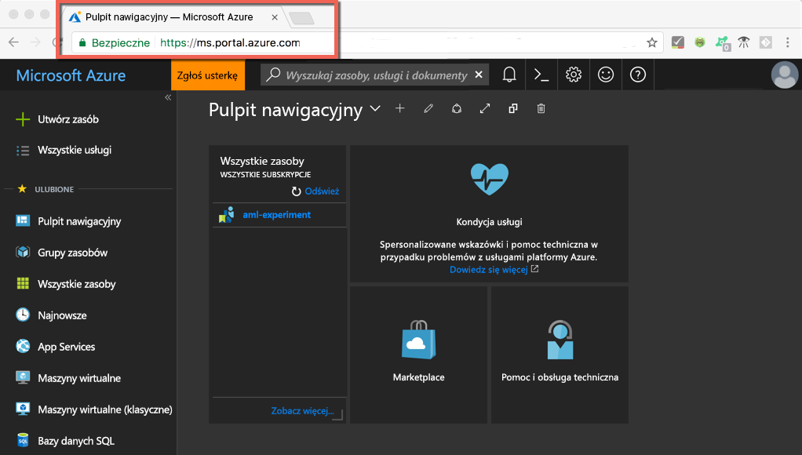
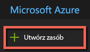
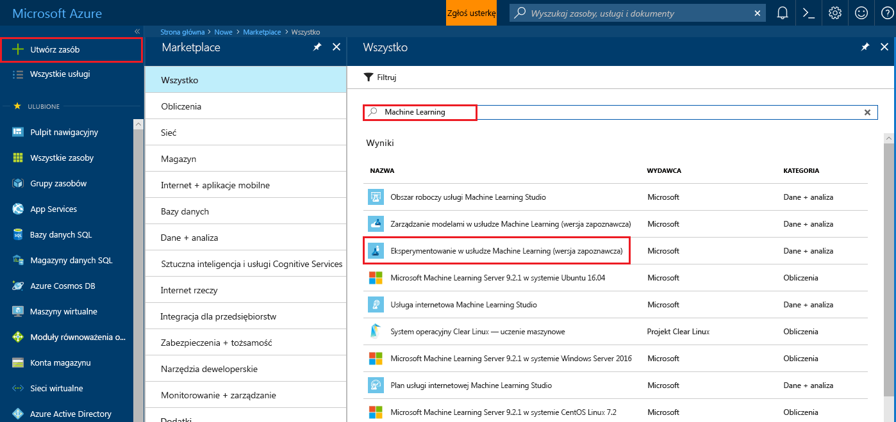
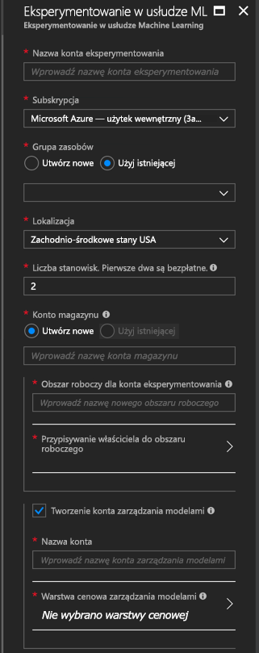
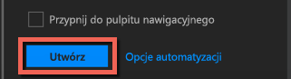
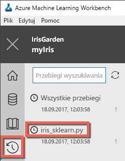

# <a name="quickstart-install-and-get-started-with-azure-machine-learning-services"></a>Szybki start: Instalowanie usług Azure Machine Learning i rozpoczynanie z nimi pracy
Usługi Azure Machine Learning (wersja zapoznawcza) to zintegrowane, kompleksowe rozwiązanie do nauki o danych i przeprowadzania zaawansowanych analiz. Pomaga ono profesjonalnym analitykom przygotowywać dane, opracowywać eksperymenty i wdrażać modele w skali chmury.

W tym przewodniku szybkiego startu przedstawiono sposób wykonywania następujących czynności:

* Tworzenie kont usługi dla usług Azure Machine Learning
* Instalowanie aplikacji Azure Machine Learning Workbench i logowanie się do niej
* Tworzenie projektu w aplikacji Workbench
* Uruchamianie skryptu w tym projekcie  
* Uzyskiwanie dostępu do interfejsu wiersza polecenia


Będące częścią portfolio platformy Microsoft Azure usługi Azure Machine Learning wymagają subskrypcji platformy Azure. Jeśli nie masz subskrypcji platformy Azure, przed rozpoczęciem utwórz [bezpłatne konto](https://azure.microsoft.com/free/?WT.mc_id=A261C142F).

Ponadto musisz mieć odpowiednie uprawnienia do tworzenia zasobów, takich jak grupy zasobów, maszyny wirtualne itd. 

<a name="prerequisites"></a>Aplikację Azure Machine Learning Workbench możesz zainstalować w następujących systemach operacyjnych:
- Windows 10 lub Windows Server 2016
- macOS Sierra lub High Sierra

## <a name="create-azure-machine-learning-services-accounts"></a>Tworzenie konta usług Azure Machine Learning
Aprowizuj swoje konta usługi Azure Machine Learning za pomocą witryny Azure Portal: 
1. Zaloguj się do witryny [Azure Portal](https://portal.azure.com/) przy użyciu poświadczeń subskrypcji platformy Azure, z której będziesz korzystać. Jeśli nie masz subskrypcji platformy Azure, utwórz teraz [bezpłatne konto](https://azure.microsoft.com/free/?WT.mc_id=A261C142F). 

   

1. Wybierz przycisk **Utwórz zasób** (+) w lewym górnym rogu portalu.

   

1. Wpisz ciąg **Machine Learning** na pasku wyszukiwania. Wybierz wynik wyszukiwania o nazwie **Eksperymentowanie w usłudze Machine Learning**. 

   

1. W okienku **Eksperymentowanie w usłudze Machine Learning** przewiń ekran do dołu i wybierz pozycję **Utwórz**, aby zacząć definiować swoje konto do eksperymentowania.  

   

1. W okienku **Eksperymentowanie w usłudze Machine Learning** skonfiguruj swoje konto Eksperymentowania w usłudze Machine Learning. 

   Ustawienie|Sugerowane wartości dla samouczka|Opis
   ---|---|---
   Nazwa konta Eksperymentowanie | _Unikatowa nazwa_ |Wprowadź unikatową nazwę, która identyfikuje Twoje konto. Możesz użyć własnej nazwy albo nazwy działu lub projektu, która najlepiej identyfikuje eksperyment. Nazwa powinna mieć od 2 do 32 znaków. Powinna ona zawierać tylko znaki alfanumeryczne i znak łącznika (-). 
   Subskrypcja | _Twoja subskrypcja_ |Wybierz subskrypcję platformy Azure, której chcesz użyć do swojego eksperymentu. Jeśli masz wiele subskrypcji, wybierz odpowiednią w ramach której są naliczane opłaty za ten zasób.
   Grupa zasobów | _Twoja grupa zasobów_ | Użyj grupy zasobów istniejącej w Twojej subskrypcji lub wprowadź nazwę, aby utworzyć nową grupę zasobów dla tego konta do eksperymentowania. 
   Lokalizacja | _Region najbliżej Twoich użytkowników_ | Wybierz lokalizację znajdującą się najbliżej Twoich użytkowników i zasobów danych.
   Liczba stanowisk | 2 | Wprowadź liczbę stanowisk. Dowiedz się, jak [liczba stanowisk przekłada się na ceny](https://azure.microsoft.com/pricing/details/machine-learning/).<br/><br/>Dla tego przewodnika Szybki start wystarczą dwa stanowiska. Stanowiska można dodawać i usuwać w miarę potrzeb w witrynie Azure Portal.
   Konto magazynu | _Unikatowa nazwa_ | Wybierz pozycję **Utwórz nowy** i podaj nazwę, aby utworzyć [konto usługi Azure Storage](https://docs.microsoft.com/en-us/azure/storage/common/storage-quickstart-create-account?tabs=portal). Lub wybierz pozycję **Użyj istniejącej**, a następnie wybierz istniejące konto magazynu z listy rozwijanej. Konto magazynu jest wymagane i jest używane do przechowywania artefaktów projektu oraz danych historii uruchamiania. 
   Obszar roboczy dla konta Eksperymentowanie | IrisGarden<br/>(nazwa używana w samouczkach) | Podaj nazwę obszaru roboczego dla tego konta. Nazwa powinna mieć od 2 do 32 znaków. Powinna ona zawierać tylko znaki alfanumeryczne i znak łącznika (-). Ten obszar roboczy zawiera narzędzia potrzebne do tworzenia i publikowania eksperymentów oraz zarządzania nimi.
   Przypisz właściciela obszaru roboczego | _Twoje konto_ | Wybierz własne konto jako właściciela obszaru roboczego.
   Tworzenie konta usługi Zarządzanie modelami | **zaznaczone** |Utwórz teraz konto Zarządzania modelami, aby ten zasób był dostępny, gdy zechcesz wdrożyć swoje modele jako usługi internetowe czasu rzeczywistego i zarządzać nimi. <br/><br/>Chociaż jest to opcjonalne, zaleca się utworzenie konta Zarządzania modelami jednocześnie z kontem Eksperymentowania.
   Nazwa konta | _Unikatowa nazwa_ | Wybierz unikatową nazwę, która identyfikuje Twoje konto Zarządzanie modelami. Możesz użyć własnej nazwy albo nazwy działu lub projektu, która najlepiej identyfikuje eksperyment. Nazwa powinna mieć od 2 do 32 znaków. Powinna ona zawierać tylko znaki alfanumeryczne i znak łącznika (-). 
   Warstwa cenowa Zarządzanie modelami | **DEVTEST** | Wybierz pozycję **Nie wybrano warstwy cenowej**, aby określić warstwę cenową dla nowego konta usługi Zarządzanie modelami. W celu uzyskania oszczędności wybierz warstwę cenową **DEVTEST**, jeśli jest dostępna w ramach Twojej subskrypcji (ograniczona dostępność). W przeciwnym razie wybierz warstwę cenową S1, aby uzyskać oszczędności. Kliknij przycisk **Wybierz**, aby zapisać wybraną warstwę cenową. 
   Przypnij do pulpitu nawigacyjnego | _zaznaczone_ | Wybierz opcję **Przypnij do pulpitu nawigacyjnego**, aby umożliwić łatwe śledzenie konta Eksperymentowanie w usłudze Machine Learning na pierwszej stronie pulpitu nawigacyjnego witryny Azure Portal.

   

5. Wybierz pozycję **Utwórz**, aby zacząć proces tworzenia konta Eksperymentowania oraz konta Zarządzania modelami.

   

   Tworzenie konta może zająć kilka minut. Stan procesu wdrażania można sprawdzić, klikając dzwonek na pasku narzędzi w witrynie Azure Portal.
   
   


## <a name="install-and-log-in-to-workbench"></a>Instalowanie aplikacji Workbench i logowanie się do niej

Aplikacja Azure Machine Learning Workbench jest dostępna dla systemów Windows i macOS. Zobacz listę [obsługiwanych platform](#prerequisites).

>[!WARNING]
>Instalacja może zająć około 30 minut. 

1. Pobierz i uruchom najnowszego instalatora aplikacji Workbench. 
   >[!IMPORTANT]
   >Pobierz instalatora w całości na dysk, a następnie uruchom go z tego miejsca. Nie uruchamiaj go bezpośrednio ze swojego widżetu pobierania w przeglądarce.

   **W systemie Windows:** 

   &nbsp;&nbsp;&nbsp;&nbsp;A. Pobierz plik [AmlWorkbenchSetup.msi](https://aka.ms/azureml-wb-msi).  <br/>
   &nbsp;&nbsp;&nbsp;&nbsp;B. Kliknij dwukrotnie pobrany plik instalatora w Eksploratorze plików.

   **W systemie macOS:** 

   &nbsp;&nbsp;&nbsp;&nbsp;A. Pobierz plik [AmlWorkbench.dmg](https://aka.ms/azureml-wb-dmg). <br/>
   &nbsp;&nbsp;&nbsp;&nbsp;B. Kliknij dwukrotnie pobrany plik instalatora w programie Finder.<br/><br/>

1. Postępuj zgodnie z wyświetlanymi na ekranie instrukcjami instalatora w celu ukończenia instalacji. 

   **Instalacja może zająć około 30 minut.**  
   
   | |Ścieżka instalacji aplikacji Azure Machine Learning Workbench|
   |--------|------------------------------------------------|
   |Windows|C:\Users\<użytkownik>\AppData\Local\AmlWorkbench|
   |macOS|/Applications/Azure ML Workbench.app|

   Instalator pobierze i skonfiguruje wszystkie niezbędne zależności, takie jak Python, Miniconda i inne powiązane biblioteki.    Ta instalacja obejmuje również wieloplatformowe narzędzie interfejsu wiersza polecenia platformy Azure lub wiersz polecenia platformy Azure.

  
1. Uruchom aplikację Workbench, wybierając przycisk **Uruchom aplikację Workbench** na ostatnim ekranie instalatora. 

   Jeśli instalator został już zamknięty, nic się nie stało. 
   + W systemie Windows aplikację uruchomisz, używając skrótu **Machine Learning Workbench** na pulpicie. 
   + W systemie macOS wybierz pozycję **Azure ML Workbench** w programie Launchpad.

1. Na pierwszym ekranie wybierz pozycję **Zaloguj się**, aby uwierzytelnić się w aplikacji Azure Machine Learning Workbench. Użyj tych samych poświadczeń, które zostały użyte w witrynie Azure Portal do utworzenia kont Eksperymentowania oraz Zarządzania modelami. 

   Gdy zalogujesz się, aplikacja Workbench użyje pierwszego konta Eksperymentowania znalezionego w Twoich subskrypcjach platformy Azure.  Aplikacja Workbench użyje pierwszego konta Eksperymentowania, które znajdzie, i wyświetli wszystkie obszary robocze oraz projekty skojarzone z tym kontem. 

   >[!TIP]
   > Możesz przełączyć się na inne konto Eksperymentowania, używając ikony w lewym dolnym rogu okna aplikacji Workbench.

## <a name="create-a-project-in-workbench"></a>Tworzenie projektu w aplikacji Workbench

W usłudze Azure Machine Learning projekt jest kontenerem logicznym dla wszystkich zadań wykonywanych w celu rozwiązania problemu. Jest on mapowany na jeden folder plików na dysku lokalnym i można do niego dodać dowolne pliki lub podfoldery. 

Tutaj tworzymy nowy projekt aplikacji Workbench, korzystając z szablonu obejmującego [zestaw danych irysów](https://en.wikipedia.org/wiki/iris_flower_data_set). Samouczki następujące po tym przewodniku Szybki start bazują na tych danych przy budowaniu modelu przewidującego typ irysa na podstawie jego niektórych cech fizycznych.  

1. W otwartej aplikacji Azure Machine Learning Workbench wybierz znak plus (+) w okienku **PROJEKTY** i wybierz pozycję **Nowy projekt**.  

   

1. Wypełnij pola formularza i wybierz przycisk **Utwórz**, aby utworzyć nowy projekt w aplikacji Workbench.

   Pole|Sugerowane wartości dla samouczka|Opis
   ---|---|---
   Project name (Nazwa projektu) | myIris |Wprowadź unikatową nazwę, która identyfikuje Twoje konto. Możesz użyć własnej nazwy albo nazwy działu lub projektu, która najlepiej identyfikuje eksperyment. Nazwa powinna mieć od 2 do 32 znaków. Powinna ona zawierać tylko znaki alfanumeryczne i znak łącznika (-). 
   Katalog projektu | c:\Temp\ | Określ katalog, w którym zostanie utworzony projekt.
   Opis projektu | _Pozostaw puste_ | Pole opcjonalne przydatne do opisywania projektów.
   Visualstudio.com |_Pozostaw puste_ | Pole opcjonalne. Projekt może być opcjonalnie skojarzony z repozytorium Git w usłudze Visual Studio Team Services na potrzeby kontroli źródła i współpracy. [Dowiedz się, jak to skonfigurować](https://docs.microsoft.com/en-us/azure/machine-learning/preview/using-git-ml-project#step-3-set-up-a-machine-learning-project-and-git-repo). 
   Obszar roboczy | IrisGarden (jeśli istnieje) | Wybierz obszar roboczy utworzony dla konta Eksperymentowania w witrynie Azure Portal. <br/>Jeśli samouczek Szybki start był wykonywany, powinien już istnieć obszar roboczy o nazwie IrisGarden. W przeciwnym razie wybierz obszar roboczy utworzony podczas tworzenia konta Eksperymentowania lub dowolny inny, którego chcesz użyć.
   Szablon projektu | Classifying Iris | Szablony zawierają skrypty i dane, których można użyć, aby zapoznać się z produktem. Ten szablon zawiera skrypty i dane potrzebne w tym samouczku Szybki start oraz innych samouczkach w tej witrynie dokumentacji. 

   
 
 Utworzony zostanie nowy projekt i otworzy się pulpit nawigacyjny projektu z tym projektem. Teraz możesz eksplorować stronę główną projektu, źródła danych, notesy i pliki kodu źródłowego. 

>[!TIP]
>Aplikację Workbench można skonfigurować do współpracy ze środowiskiem Python IDE, aby uzyskać jednolite środowisko do programowania rozwiązań nauki o danych. Następnie można prowadzić interakcje z projektem w środowisku IDE. [Dowiedz się, jak to zrobić](how-to-configure-your-IDE.md). 

## <a name="run-a-python-script"></a>Uruchamianie skryptu w języku Python

Teraz możesz uruchomić skrypt **iris_sklearn.py** na swoim komputerze lokalnym. Skrypt ten jest domyślnie częścią szablonu projektu **Classifying Iris**. Tworzy on model z algorytmem [regresji logistycznej](https://en.wikipedia.org/wiki/logistic_regression) z popularnej biblioteki [scikit-learn](http://scikit-learn.org/stable/index.html) języka Python.

1. Wybierz pozycję **lokalny** jako element docelowy wykonywania na pasku poleceń u góry strony **Pulpit nawigacyjny projektu** i wybierz skrypt **iris_sklearn.py** jako skrypt do uruchomienia. Te wartości są wstępnie wybrane domyślnie. 

   Istnieją inne pliki zawarte w przykładzie, z którymi można zapoznać się później, ale w tym przewodniku Szybki start interesuje nas tylko skrypt **iris_sklearn.py**. 

   

1. W polu tekstowym **Argumenty** wprowadź wartość **0,01**. Ta liczba jest używana w kodzie skryptu do ustawiania współczynnika uregulowania. Ta wartość służy do konfigurowania sposobu uczenia modelu regresji liniowej. 

1. Wybierz pozycję **Uruchom**, aby uruchomić wykonywanie skryptu na komputerze. Zadanie **iris_sklearn** od razu pojawi się w panelu **Zadania** po prawej stronie, aby można było monitorować wykonywanie skryptu.

   Gratulacje! Skrypt w języku Python został pomyślnie uruchomiony w aplikacji Azure Machine Learning Workbench.

1. Powtórz kroki 2 i 3 kilka razy, używając różnych wartości argumentu z zakresu od **0,001** do **10**. Każde zadanie wykonywania pojawia się w okienku **Zadania**.

1. Sprawdź historię uruchomień, wybierając widok **Uruchomienia**, a następnie pozycję **iris_sklearn.py** na liście uruchomień, aby wyświetlić historię uruchomień tego skryptu. 

   

   Zawiera on każdy przebieg skryptu **iris_sklearn.py**, który został wykonany. Pulpit nawigacyjny historii uruchamiania wyświetla również najważniejsze metryki, zestaw domyślnych grafów i listę metryk dla każdego przebiegu. 

1. Możesz dostosować ten widok, sortując, filtrując i dostosowując konfigurację przy użyciu ikon kół zębatych lub filtru.

   

3. Wybierz zakończone uruchomienie w okienku Zadania, aby zobaczyć szczegółowy widok tego określonego wykonania. Szczegółowe informacje obejmują dodatkowe metryki, pliki, które zostały wygenerowane, oraz inne potencjalnie przydatne dzienniki.

## <a name="start-the-cli"></a>Uruchamianie interfejsu wiersza polecenia

Interfejs wiersza polecenia usługi Azure Machine Learning jest także instalowany. Interfejs wiersza polecenia pozwala na dostęp do usług Azure Machine Learning i interakcję z nimi za pomocą poleceń `az` w celu wykonywania wszystkich zadań niezbędnych dla pełnego przepływu pracy nauki o danych. [Dowiedz się więcej.](tutorial-iris-azure-cli.md)

Interfejs wiersza polecenia azure-cli-ml można uruchomić z paska narzędzi aplikacji Workbench, używając pozycji **Plik --> Otwórz wiersz polecenia**.

Pomoc na temat poleceń w interfejsie wiersza polecenia azure-cli-ml można uzyskać za pomocą argumentu --help.

```az ml --help```

## <a name="clean-up-resources"></a>Oczyszczanie zasobów

[!INCLUDE [aml-delete-resource-group](../../../includes/aml-delete-resource-group.md)]

## <a name="next-steps"></a>Następne kroki
Zostały już utworzone niezbędne konta usługi Azure Machine Learning i została zainstalowana aplikacja Azure Machine Learning Workbench. W tej aplikacji został utworzony projekt, uruchomiony skrypt i zbadana historia uruchamiania tego skryptu.

Aby uzyskać więcej informacji na temat tego przepływu pracy oraz o sposobie wdrażania swojego modelu irysów w postaci usługi internetowej, wykonaj cały samouczek *Klasyfikowanie irysów*. Samouczek zawiera szczegółowe informacje na temat [przygotowywania danych](tutorial-classifying-iris-part-1.md), [eksperymentowania](tutorial-classifying-iris-part-2.md) i [zarządzania modelem](tutorial-classifying-iris-part-3.md). 

> [!div class="nextstepaction"]
> [Samouczek: Klasyfikowanie irysów (część 1)](tutorial-classifying-iris-part-1.md)

>[!NOTE]
> Masz już konto do zarządzania modelami, ale środowisko nie jest jeszcze skonfigurowane do wdrażania usług internetowych.  Dowiedz się, jak skonfigurować [środowisko wdrażania](deployment-setup-configuration.md).