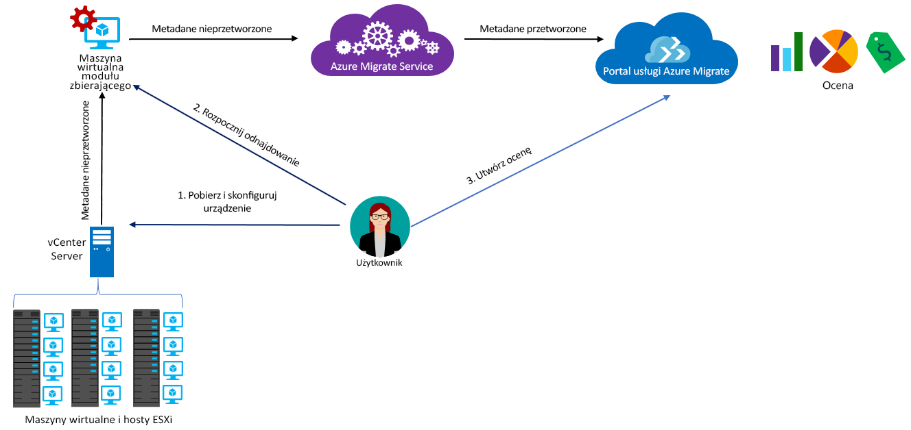

# Informacje o usłudze Azure Migrate

Usługa Azure Migrate ocenia obciążenia lokalne pod kątem migracji na platformę Azure. Obejmuje to ocenę gotowości maszyn lokalnych do migracji na platformę Azure, określenie rozmiaru odpowiedniego do wydajności oraz oszacowanie kosztów działania maszyn lokalnych na platformie Azure. Usługa ta jest przeznaczona dla osób, które zamierzają przeprowadzić migrację metodą „lift-and-shift” lub dopiero zaczęły oceniać możliwość migracji. Po dokonaniu oceny można przeprowadzić migrację maszyn na platformę Azure, korzystając z usług takich jak [Azure Site Recovery](https://docs.microsoft.com/azure/site-recovery/site-recovery-overview) i [Azure Database Migration Service](https://docs.microsoft.com/azure/dms/dms-overview).

## Dlaczego warto używać usługi Azure Migrate?

Usługa Azure Migrate ułatwia wykonywanie następujących działań:

- **Ocena gotowości na platformę Azure**: czy maszyny lokalne mogą działać na platformie Azure. 
- **Uzyskiwanie zaleceń dotyczących rozmiarów**: uzyskaj zalecenia dotyczące rozmiarów maszyn wirtualnych platformy Azure na podstawie historii wydajności lokalnych maszyn wirtualnych. 
- **Szacowanie miesięcznych kosztów**: uzyskaj szacowane koszty uruchamiania maszyn lokalnych na platformie Azure.  
- **Migrowanie z poczuciem pewności**: wizualizuj zależności maszyn lokalnych, aby tworzyć grupy maszyn, które będą oceniane i migrowane wspólnie. 

## Bieżące ograniczenia

- Aktualnie można oceniać gotowość do migracji na maszyny wirtualne platformy Azure tylko dla lokalnych maszyn wirtualnych VMware. Maszyny wirtualne VMware muszą być zarządzane przez program vCenter Server (w wersji 5.5, 6.0 lub 6.5)

> [!NOTE]
> Obsługa funkcji Hyper-V znajduje się w planach i zostanie włączona wkrótce. Na razie zaleca się planowanie migracji obciążeń funkcji Hyper-V przy użyciu narzędzia [Planista wdrażania usługi Azure Site Recovery](http://aka.ms/asr-dp-hyperv-doc). 

- Można odnajdywać maksymalnie 1000 maszyn wirtualnych w jednym odnajdywaniu i maksymalnie 1500 maszyn wirtualnych w jednym projekcie. Można oceniać maksymalnie 400 maszyn wirtualnych w ramach pojedynczej oceny. Jeśli masz więcej maszyn, możesz zwiększyć liczbę odnajdywań lub ocen. [Dowiedz się więcej](how-to-scale-assessment.md).
- Projekt usługi Azure Migrate można utworzyć tylko w regionie Zachodnio-środkowe stany USA lub Wschodnie stany USA. Nie ma to jednak wpływu na możliwość planowania migracji w innej docelowej lokalizacji platformy Azure. Lokalizacja projektu migracji służy tylko do przechowywania metadanych wykrytych w środowisku lokalnym.
- Usługa Azure Migrate obsługuje tylko dyski zarządzane na potrzeby oceny migracji.

## Za co są pobierane opłaty?

Więcej informacji o cenach usługi Azure Migrate można uzyskać [tutaj](https://azure.microsoft.com/en-in/pricing/details/azure-migrate/).

## Co obejmuje ocena?

Ocena pomaga określić, czy maszyny lokalne są odpowiednie dla platformy Azure, oraz uzyskać zalecenia dotyczące odpowiedniego rozmiaru i szacunkowy koszt działania maszyn wirtualnych na platformie Azure. Oceny można dostosować do własnych potrzeb, zmieniając właściwości oceny. Poniżej przedstawiono właściwości uwzględniane podczas tworzenia oceny. 

**Właściwość** | **Szczegóły**
--- | ---
**Lokalizacja docelowa** | Lokalizacja platformy Azure, do której chcesz przeprowadzić migrację. Domyślna lokalizacja docelowa to Zachodnie stany USA 2. 
**Nadmiarowość magazynu** | Typ [nadmiarowości magazynu](https://docs.microsoft.com/azure/storage/common/storage-redundancy), który będzie używany przez maszyny wirtualne platformy Azure po zakończeniu migracji. Ustawienie domyślne to Magazyn lokalnie nadmiarowy (LRS). Zwróć uwagę na to, że usługa Azure Migrate obsługuje tylko oceny oparte na dyskach zarządzanych, a dyski zarządzane obsługują tylko magazyn LRS, dlatego dla właściwości jest obecnie dostępna tylko opcja magazynu LRS. 
**Kryterium rozmiaru** | Kryterium do użycia przez usługę Azure Migrate w celu określenia odpowiedniego rozmiaru dla maszyn wirtualnych platformy Azure. Na potrzeby platformy Azure rozmiar można określić na podstawie *historii wydajności* lokalnych maszyn wirtualnych lub jako rozmiar *lokalnych* maszyn wirtualnych bez uwzględniania historii wydajności. Wartość domyślna to określanie rozmiaru na podstawie wydajności.
**Plany cenowe** | W ramach obliczania kosztów funkcja oceny uwzględnia posiadanie pakietu Software Assurance i uprawnienie do [korzyści użycia hybrydowego platformy Azure](https://azure.microsoft.com/pricing/hybrid-use-benefit/). Uwzględniane są również [oferty platformy Azure](https://azure.microsoft.com/support/legal/offer-details/), jeśli są dostępne. Można też wskazać dowolne procentowe zniżki skojarzone z daną subskrypcją i stosowane dodatkowo do całej oferty. 
**Warstwa cenowa** | Możesz określić [warstwę cenową (Podstawowa/Standardowa)](../virtual-machines/windows/sizes-general.md) dla docelowych maszyn wirtualnych platformy Azure. Na przykład jeśli planujesz migrację środowiska produkcyjnego, rozważ warstwę Standardowa, która udostępnia maszyny wirtualne o małych opóźnieniach, lecz które mogą kosztować więcej. Z drugiej strony w przypadku środowiska deweloperskiego i testowego rozważ warstwę Podstawowa, która udostępnia maszyny wirtualnych o większych opóźnieniach, lecz przy niższych kosztach. Domyślnie jest używana warstwa [Standardowa](../virtual-machines/windows/sizes-general.md).
**Historia wydajności** | Dotyczy tylko sytuacji, w których kryterium rozmiaru jest oparte na wydajności. Domyślnie usługa Azure Migrate ocenia wydajność maszyn lokalnych na podstawie historii wydajności obejmującej ostatni dzień, przy wartości percentylu równej 95%. Możesz zmodyfikować te wartości we właściwościach oceny. 
**Współczynnik komfortu** | Podczas oceny usługa Azure Migrate uwzględnia bufor (współczynnik komfortu). Jest on stosowany do wszystkich danych użycia maszyn wirtualnych (procesora CPU, pamięci, dysku i sieci). Współczynnik komfortu uwzględnia kwestie, takie jak okresowe użycie, krótka historia wydajności i prawdopodobne zwiększenie użycia w przyszłości.   Na przykład 10-rdzeniowa maszyna wirtualna o użyciu na poziomie 20% jest w normalnych warunkach równoważna 2-rdzeniowej maszynie wirtualnej. Jednak wynik zastosowania współczynnika komfortu o wartości 2 daje 4-rdzeniową maszynę wirtualną. Domyślne ustawienie komfortu to 1,3.

## Jak działa usługa Azure Migrate?

1.  Musisz utworzyć projekt usługi Azure Migrate.
2.  Za pomocą lokalnej maszyny wirtualnej, nazywanej urządzeniem modułu zbierającego, usługa Azure Migrate wyszukuje informacje o maszynach lokalnych. Aby utworzyć to urządzenie, pobierz plik instalacyjny w formacie Open Virtualization Appliance (ova) i zaimportuj go jako maszynę wirtualną w lokalnym programie vCenter Server.
3.  Nawiąż połączenie z maszyną wirtualną przy użyciu połączenia konsoli w programie vCenter Server, określ nowe hasło dla maszyny wirtualnej podczas nawiązywania połączenia, a następnie uruchom aplikację modułu zbierającego na maszynie wirtualnej, aby zainicjować odnajdywanie.
4.  Moduł zbierający gromadzi metadane maszyny wirtualnej przy użyciu poleceń cmdlet programu VMware PowerCLI. Odnajdywanie odbywa się bez użycia agenta ani instalowania żadnych narzędzi na hostach VMware lub maszynach wirtualnych. Zebrane metadane zawierają informacje o maszynach wirtualnych (rdzenie, pamięć, dyski, rozmiary dysków i karty sieciowe). Gromadzone są również dane dotyczące wydajności maszyn wirtualnych, w tym użycia procesora CPU i pamięci, liczby operacji we/wy na sekundę na dysku, przepływności dysku (MB/s) i przepustowości sieci (MB/s).
5.  Metadane te są wypychane do projektu usługi Azure Migrate. Można je wyświetlić w witrynie Azure Portal.
6.  Na potrzeby oceny odnalezione maszyny wirtualne należy umieścić w grupach. Na przykład możesz pogrupować maszyny wirtualne, na których jest uruchamiana ta sama aplikacja. Na potrzeby bardziej precyzyjnego grupowania możesz użyć wizualizacji zależności, aby wyświetlić zależności określonej maszyny lub wszystkich maszyn w grupie i ulepszyć grupę.
7.  Po utworzeniu grupy możesz utworzyć ocenę grupy. 
8.  Utworzoną ocenę możesz wyświetlić w portalu lub pobrać w formacie programu Excel.

  

## Jakie są wymagania dotyczące portów?

Poniższa tabela zawiera podsumowanie portów wymaganych do komunikacji usługi Azure Migrate.

|Składnik          |Element docelowy komunikacji     |Wymagany port  |Przyczyna   |
|-------------------|------------------------|---------------|---------|
|Moduł zbierający          |Usługa Azure Migrate   |TCP 443        |Moduł zbierający łączy się z usługą za pośrednictwem protokołu SSL przez port 443|
|Moduł zbierający          |Program vCenter Server          |Domyślnie: 9443   | Domyślnie moduł zbierający łączy się z programem vCenter Server przez port 9443. Jeśli serwer nasłuchuje na innym porcie, powinien on zostać skonfigurowany jako port wychodzący na maszynie wirtualnej modułu zbierającego. |
|Lokalna maszyna wirtualna     | Obszar roboczy pakietu Operations Management Suite (OMS)          |[TCP 443](../log-analytics/log-analytics-windows-agent.md) |Agent MMA łączy się z usługą Log Analytics za pośrednictwem portu TCP 443. Ten port jest potrzebny tylko wtedy, gdy używasz funkcji wizualizacji zależności i instalujesz agenta MMA (Microsoft Monitoring Agent). |

  
## Co należy zrobić po dokonaniu oceny?

Po dokonaniu oceny maszyn lokalnych pod kątem migracji przy użyciu usługi Azure Migrate można przeprowadzić migrację za pomocą wybranego narzędzia:

- **Azure Site Recovery**: migrację na platformę Azure można przeprowadzić za pomocą usługi Azure Site Recovery, wykonując następujące czynności:
  - Przygotuj zasoby platformy Azure, w tym subskrypcję platformy Azure, sieć wirtualną platformy Azure i konto magazynu.
  - Przygotuj lokalne serwery VMware do migracji. Sprawdź wymagania oprogramowania VMware dotyczące obsługi usługi Site Recovery, przygotuj serwery VMware do odnajdywania i przygotuj instalację usługi mobilności dla usługi Site Recovery na maszynach wirtualnych, które chcesz migrować. 
  - Skonfiguruj migrację. Skonfiguruj magazyn usługi Recovery Services, źródłowe i docelowe ustawienia migracji oraz zasady replikacji, a następnie włącz replikację. Aby sprawdzić, czy migracja maszyny wirtualnej na platformę Azure działa poprawnie, uruchom próbne odzyskiwanie po awarii.
  - Uruchom tryb failover, aby przeprowadzić migrację maszyn lokalnych na platformę Azure. 
  - [Więcej informacji](../site-recovery/tutorial-migrate-on-premises-to-azure.md) zawiera samouczek dotyczący migracji przy użyciu usługi Site Recovery.

- **Azure Database Migration**: aby przeprowadzić migrację maszyn lokalnych, na których jest uruchomiona baza danych, taka jak SQL Server, MySQL lub Oracle, na platformę Azure, możesz użyć usługi Azure Database Migration Service. [Dowiedz się więcej](https://azure.microsoft.com/campaigns/database-migration/).

## Następne kroki 
[Wykonaj czynności opisane w samouczku](tutorial-assessment-vmware.md) dotyczącym tworzenia oceny lokalnej maszyny wirtualnej VMware.