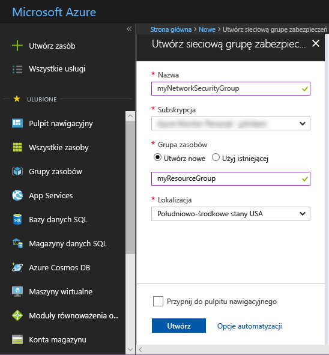
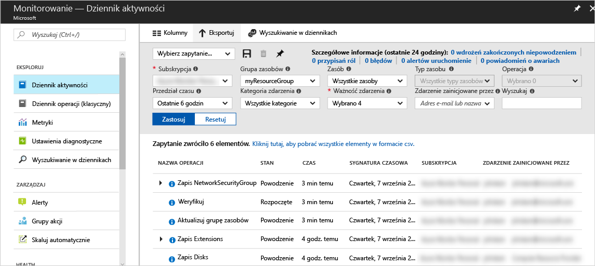
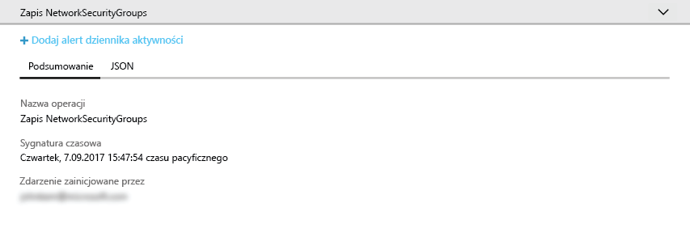
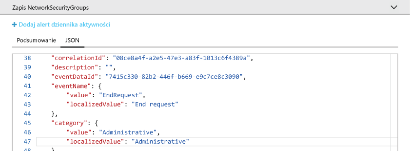
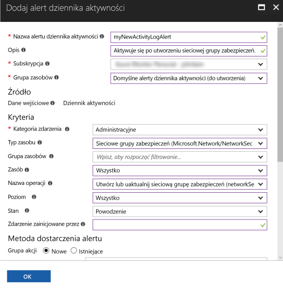
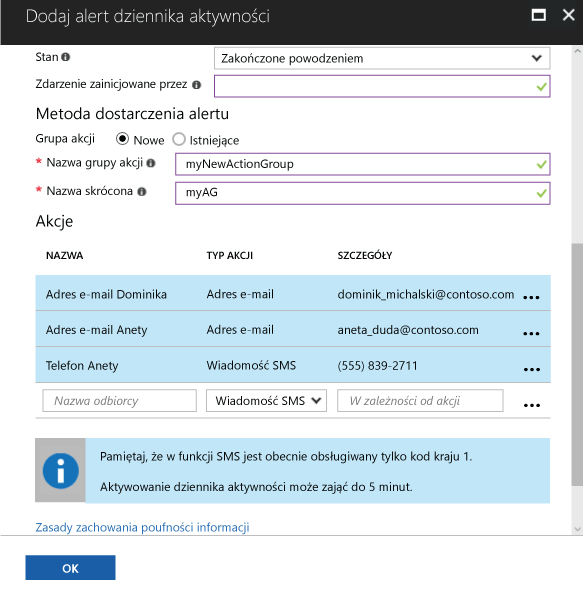

# Inspekcja i otrzymywanie powiadomień dotyczących ważnych działań związanych z subskrypcją platformy Azure

**Dziennik aktywności platformy Azure** zawiera historię zdarzeń na poziomie subskrypcji na platformie Azure. Informuje o tym, *kto* utworzył, zaktualizował lub usunął zasoby, *jakich* zasobów dotyczyło to działanie i *kiedy* miało miejsce. Możesz utworzyć **alert Dziennika aktywności**, aby otrzymywać powiadomienia o działaniach spełniających warunki alertu w formie wiadomości e-mail, SMS lub elementu webhook. W tym przewodniku Szybki start opisano kroki tworzenia prostej sieciowej grupy zabezpieczeń, przeglądania Dziennika aktywności w celu uzyskania informacji o zdarzeniu, które wystąpiło, oraz tworzenia alertu Dziennika aktywności w celu otrzymania powiadomienia o utworzeniu sieciowej grupy zabezpieczeń w przyszłości.

Jeśli nie masz subskrypcji platformy Azure, przed rozpoczęciem utwórz [bezpłatne](https://azure.microsoft.com/free/) konto.

## Logowanie do witryny Azure Portal

Zaloguj się do witryny [Azure Portal](https://portal.azure.com/).

## Tworzenie sieciowej grupy zabezpieczeń

1. Kliknij przycisk **Utwórz zasób** (+) znajdujący się w lewym górnym rogu witryny Azure Portal.

2. Wybierz kolejno pozycje **Sieć** i **Sieciowa grupa zabezpieczeń**.

3. Wprowadź ciąg „myNetworkSG” w polu **Nazwa** i utwórz nową grupę zasobów o nazwie **myResourceGroup**. Kliknij przycisk **Utwórz**.

    

## Przeglądanie Dziennika aktywności w portalu

Do Dziennika aktywności zostało właśnie dodane zdarzenie opisujące utworzenie sieciowej grupy zabezpieczeń. Skorzystaj z poniższych instrukcji, aby zidentyfikować to zdarzenie.

1. Kliknij przycisk **Monitoruj** na liście w okienku nawigacji po lewej stronie. Zostanie otwarta sekcja Dziennik aktywności. Ta sekcja zawiera historię wszystkich działań wykonanych przez użytkowników w związku z zasobami w ramach subskrypcji, z możliwością filtrowania według różnych właściwości, takich jak **Grupa zasobów**, **Przedział czasu** i **Kategoria**.

2. W sekcji **Dziennik aktywności** kliknij listę rozwijaną **Grupa zasobów** i wybierz pozycję **myResourceGroup**. Zmień wybraną wartość na liście **Przedział czasu** na **Ostatnia godzina**. Kliknij przycisk **Zastosuj**.

    

3. Kliknij zdarzenie **Write NetworkSecurityGroups** w wyświetlonej tabeli zdarzeń.

## Przeglądanie zdarzenia w Dzienniku aktywności

Wyświetlona sekcja zawiera podstawowe informacje o wykonanej operacji, w tym jej nazwę, znacznik czasu oraz wykonawcę operacji — użytkownika lub aplikację.

Kliknij kartę **JSON**, aby wyświetlić wszystkie szczegóły zdarzenia. Są to między innymi informacje o sposobie przyznania użytkownikowi lub aplikacji uprawnień do wykonania tej operacji, o kategorii i poziomie zdarzenia oraz o stanie operacji.

## Tworzenie alertu Dziennika aktywności

1. Kliknij kartę **Podsumowanie**, aby wrócić do podsumowania zdarzenia.

2. W wyświetlonej sekcji podsumowania kliknij pozycję **Dodaj alert dziennika aktywności**.

    

3. W wyświetlonej sekcji wprowadź nazwę i opis alertu Dziennika aktywności.

4. W obszarze **Kryteria** upewnij się, że w polu **Kategoria zdarzenia** ustawiono pozycję **Administracyjne**, w polu **Typ zasobu** — **Sieciowe grupy zabezpieczeń**, w polu **Nazwa operacji** — **Tworzenie lub aktualizowanie sieciowej grupy zabezpieczeń**, w polu **Stan** — **Powodzenie**, a wszystkie pozostałe pola kryteriów są puste lub ustawione na **Wszystkie**. Te kryteria definiują reguły używane do określania, czy nowe zdarzenie w Dzienniku aktywności powinno aktywować alert.

    

5. W obszarze **Metoda dostarczenia alertu** wybierz pozycję **Nowa** grupa akcji, a następnie wprowadź **nazwę** i **krótką nazwę** grupy akcji. Grupa akcji służy do zdefiniowania zestawu akcji wykonywanych po aktywowaniu alertu (spełnieniu kryteriów przez nowe zdarzenie).

6. W obszarze **Akcje** dodaj co najmniej 1 akcję, wprowadzając **Nazwę** akcji, **Typ akcji** (na przykład wiadomość e-mal lub SMS) oraz **Szczegóły** wybranego typu akcji (na przykład adres URL elementu webhook, adres e-mail, numer do wysłania wiadomości SMS).

    

7. Kliknij przycisk **OK**, aby zapisać alert Dziennika aktywności.

## Testowanie alertu Dziennika aktywności

> [!NOTE]
> Alert Dziennika aktywności zostanie w pełni włączony w ciągu około 10 minut. Nowe zdarzenia występujące przed pełnym włączeniem alertu Dziennika aktywności nie spowodują wygenerowania powiadomienia.
>
>

Aby przetestować alert, powtórz czynności opisane w poprzedniej sekcji aż do etapu **Tworzenie sieciowej grupy zabezpieczeń**, nadając nowej sieciowej grupie zabezpieczeń inną nazwę i używając ponownie istniejącej grupy zasobów. W ciągu kilku minut otrzymasz powiadomienie o utworzeniu tej sieciowej grupy zabezpieczeń.

## Oczyszczanie zasobów

Gdy grupa zasobów i sieciowa grupa zabezpieczeń nie będą już potrzebne, usuń je. W tym celu wpisz nazwę utworzonej grupy zasobów w polu wyszukiwania w górnej części portalu, a następnie kliknij nazwę grupy zasobów. W wyświetlonej sekcji kliknij przycisk **Usuń grupę zasobów**, wpisz nazwę grupy zasobów i kliknij polecenie **Usuń**.

## Następne kroki

Podczas pracy z tym przewodnikiem Szybki start wykonano operację powodującą wygenerowanie zdarzenia Dziennika aktywności, a następnie utworzono alert Dziennika aktywności w celu otrzymywania powiadomień w przypadku ponownego wystąpienia takiej operacji w przyszłości. Następnie przetestowano alert, wykonując ponownie tę operację. Dziennik aktywności platformy Azure zawiera zdarzenia z ostatnich 90 dni. Jeśli chcesz przechowywać informacje o zdarzeniach dłużej niż przez 90 dni, możesz zarchiwizować dane Dziennika aktywności wraz z innymi danymi monitorowania.

> [!div class="nextstepaction"]
> [Archiwizowanie danych monitorowania](./monitor-tutorial-archive-monitoring-data.md)
