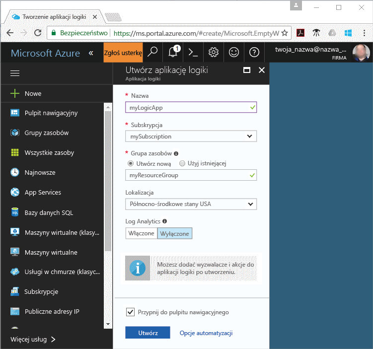

# Otrzymasz powiadomienie, gdy wartość metryki spełnia warunek

Azure Monitor udostępnia metryki dla wielu zasobów platformy Azure. Te metryki przedstawienia wydajności i kondycji tych zasobów. W wielu przypadkach Metryka wartości może wskazywać coś jest problem z zasobem. Można tworzyć alerty metryki monitorować nietypowe zachowanie i otrzymasz powiadomienie, jeśli występuje. Ta procedura Szybki Start do tworzenia aplikacji logiki, tworzenie zadania i wizualizacja metryki aplikacji logiki. Następnie przechodzi do tworzenia alertu i odbieranie powiadomień dla metryki dla zasobu aplikacji logiki.

Aby uzyskać więcej informacji na metryki i metryki alertów, zobacz [Omówienie narzędzia Azure Monitor metryki](./monitoring-overview-metrics.md) i [Przegląd alertów monitora Azure](./monitoring-overview-alerts.md). 

Jeśli nie masz subskrypcji platformy Azure, przed rozpoczęciem utwórz [bezpłatne](https://azure.microsoft.com/free/) konto.

## Logowanie się do witryny Azure Portal

Zaloguj się w witrynie [Azure Portal](https://portal.azure.com/).

## Tworzenie aplikacji logicznej

1. Kliknij przycisk **Nowy** znajdujący się w lewym górnym rogu witryny Azure Portal.

2. Wyszukaj i wybierz **aplikacji logiki**. Utwórz nową grupę zasobów o nazwie **myResourceGroup** użyć lokalizacji domyślnej. Kliknij przycisk **Utwórz**.

3. Wprowadź informacje o aplikacji logiki i sprawdź **Przypnij do pulpitu nawigacyjnego** opcji. Na koniec kliknij pozycję **Utwórz**.

      

4. Aplikację logiki powinien przypięty do pulpitu nawigacyjnego. Przejdź do aplikacji logiki, klikając go.

5. W panelu aplikacji logiki, wybierz **projektanta aplikacji logiki**

       

6. Zdefiniować można wartości, jak pokazano na poniższym diagramie.

    . 

7. W projektancie, wybierz **cyklu** wyzwalacza.

8. Ustaw interwał 20 i częstotliwość sekundy, aby upewnić się, że aplikację logiki wyzwoleniu co 20 sekund.

9. Kliknij przycisk **nowy krok** i wybrać **Dodaj akcję**.

10. Wybierz **HTTP** i wybrać **HTTP HTTP**.

11. Ustaw **— metoda** jako POST i **Uri** adres sieci web wybranych przez użytkownika.

12. Kliknij pozycję **Zapisz**.

## Wyświetlaj metryki aplikacji logiki

1. Kliknij przycisk **Monitor** opcji w okienku nawigacji po lewej stronie.

2. Wybierz **metryki** karcie, wypełnij **subskrypcji**, **grupy zasobów**, **typu zasobu** i **zasobów** informacje dotyczące aplikacji logiki.

3. Z listy metryki, wybierz **uruchomione przebiegi**.

4. Modyfikowanie **zakres czasu** wykresu, aby wyświetlić dane dla ostatniej godziny.

5. Powinien zostać wyświetlony wykres kreślenia łączna liczba uruchamiają aplikację logiki został uruchomiony za pośrednictwem ostatniej godziny.

    

## Utwórz alert metryki aplikacji logiki

1.  W górnej części prawego panelu metryki kliknij **Dodaj alert metryki** przycisku.

2. Nazwa metryki alertu "myLogicAppAlert" i podaj krótki opis alertu.

3. Ustaw **warunku** metryki alertu jako "Większe niż", ustaw **próg** jako "10" i ustaw **okres** jako "w ciągu ostatnich 5 minut".

4. Ponadto w obszarze **email(s) dodatkowe administratora** wprowadź adres e-mail. Ten alert temu otrzymasz wiadomość e-mail w przypadku aplikacji logiki ma więcej niż 10 uruchamia nie powiodło się w ciągu 5 minut.

    

## Odbieranie powiadomień o alertach metryki aplikacji logiki
1. W ciągu kilku minut powinien zostać wyświetlony wiadomość e-mail od "Microsoft Azure alerty", aby poinformować, alert "aktywowaniu".

2. Przejdź z powrotem do aplikacji logiki i zmodyfikuj wyzwalacz cyklu interwału 1 i częstotliwość godzinę.

3. W ciągu kilku minut powinien otrzymać wiadomość e-mail z "Microsoft Azure alerty" informujące o tym, alert został "rozwiązany".

## Oczyszczanie zasobów

Inne Szybkie uruchamianie w tej kolekcji zależą od tego przewodnika Szybki Start. Jeśli planujesz na pracę z kolejnych Szybki Start lub samouczków, nie wyczyścić zasoby utworzone w tym Szybki Start. Jeśli nie planujesz kontynuować pracy, wykonaj następujące czynności, aby usunąć wszystkie zasoby utworzone w witrynie Azure Portal w ramach tego przewodnika Szybki start.

1. Z menu po lewej stronie w portalu Azure kliknij **Monitor**.

2. Wybierz **alerty** , Znajdź alert został utworzony w tym przewodniku Szybki Start i kliknij na nim.

3. W panelu alertu metryki, kliknij przycisk **usunąć**.

4. Z menu po lewej stronie w portalu Azure, wyszukaj **aplikacji logiki** , a następnie kliknij przycisk **Logic apps**.

5. W panelu, kliknij aplikację logiki utworzone w tym szybkiego startu w polu tekstowym, a następnie kliknij **usunąć**.

## Następne kroki

W tym szybkiego startu kiedy znasz już sposób tworzenia metryki alert dla zasobów. Aby uzyskać więcej informacji na temat alertów metryki kliknij, aby zapoznać się z naszym alerty.

> [!div class="nextstepaction"]
> [Alerty dotyczące działania subskrypcji Azure monitora](./monitor-quick-audit-notify-action-in-subscription.md )
