# Rozpoczynanie pracy z usługą Azure Monitor
Usługa Azure Monitor to usługa platformy, która zapewnia jedno źródło monitorowania zasobów systemu Azure. Dzięki usłudze Azure Monitor możesz wykonywać wizualizacje i zapytania, ustalać trasy, archiwizować i podejmować działania dotyczące metryk i dzienników pochodzących z zasobów na platformie Azure. Możesz pracować z tymi danymi przy użyciu bloku portalu Monitor, [poleceń cmdlet programu PowerShell usługi Monitor](insights-powershell-samples.md), [międzyplatformowego interfejsu wiersza polecenia](insights-cli-samples.md) lub [interfejsów API REST usługi Azure Monitor](https://msdn.microsoft.com/library/dn931943.aspx). Ten artykuł zawiera przewodnik po kilku głównych elementach usługi Azure Monitor obejmujący użycie portalu w celach demonstracyjnych.

## Przewodnik
1. W portalu przejdź do obszaru **Więcej usług** i znajdź opcję **Monitor**. Kliknij ikonę gwiazdki, aby dodać tę opcję do listy ulubionych i zapewnić jej dostępność bezpośrednio z lewego paska nawigacyjnego.

    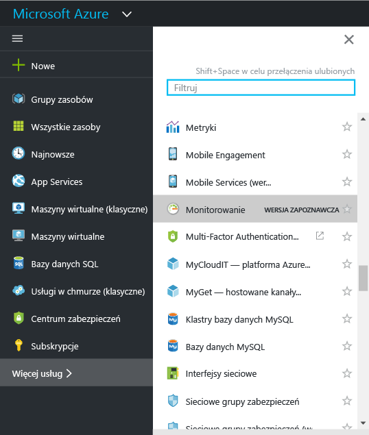
2. Kliknij opcję **Monitor**, aby otworzyć blok **Monitor**. Ten blok gromadzi wszystkie ustawienia monitorowania i dane użytkownika w jednym skonsolidowanym widoku. Na początku widoczna jest sekcja **Dziennik aktywności**.

    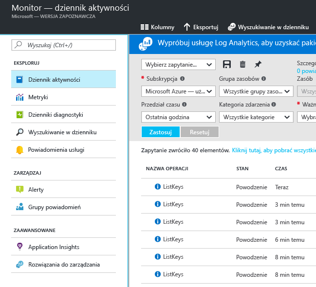

    Usługa Azure Monitor obejmuje trzy podstawowe kategorie danych monitorowania: **dziennik aktywności**, **metryki** i **dzienniki diagnostyczne**.
3. Kliknij opcję **Dziennik aktywności**, aby wyświetlić sekcję dziennika aktywności.

    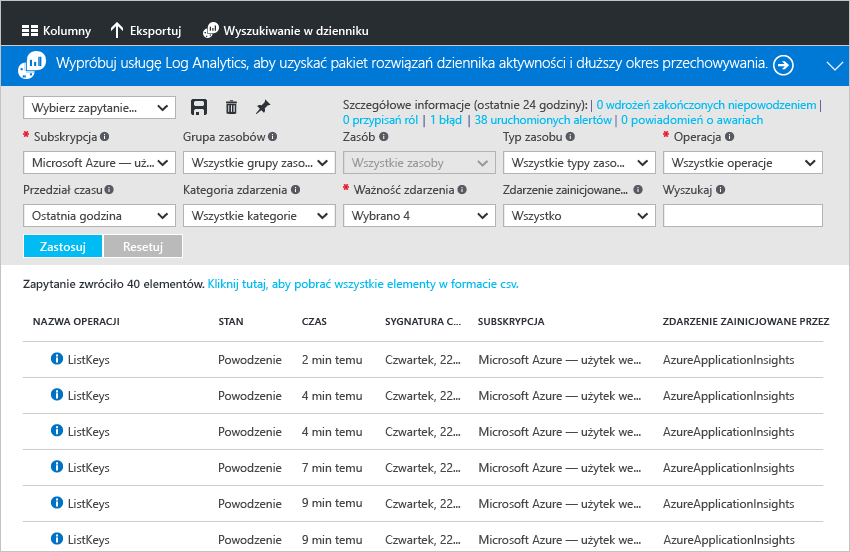

    [**Dziennik aktywności**](monitoring-overview-activity-logs.md) zawiera opis wszystkich operacji wykonywanych na zasobach objętych subskrypcją. Przy użyciu dziennika aktywności można określić zakres działań, autorów i czas dowolnych operacji tworzenia, aktualizowania lub usuwania dotyczących zasobów objętych subskrypcją. Dziennik aktywności zawiera na przykład informacje o tym, kiedy i przez kogo została zatrzymana aplikacja sieci Web. Zdarzenia dziennika aktywności są przechowywane na platformie i dostępne do badania przez 90 dni.

    Można utworzyć i zapisać zapytania dla wspólnych filtrów, a następnie przypiąć najważniejsze zapytania do pulpitu nawigacyjnego portalu, dzięki czemu zawsze będzie wiadomo, czy wystąpiły zdarzenia spełniające kryteria użytkownika.
4. Zastosuj filtr ograniczający widok do określonej grupy zasobów w ostatnim tygodniu, po czym kliknij pozycję **Zapisz**.

    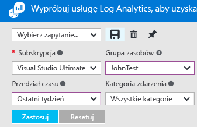
5. Następnie kliknij przycisk **Przypnij**.

    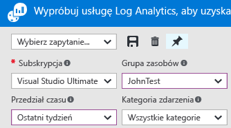

    Większość widoków w tym przewodniku można przypiąć do pulpitu nawigacyjnego. Pozwala to utworzyć pojedyncze źródło informacji dotyczących danych operacyjnych Twoich usług.
6. Wróć do pulpitu nawigacyjnego. Zapytanie (wraz z liczbą wyników) jest teraz wyświetlane na pulpicie nawigacyjnym. Jest to przydatne, jeśli chcesz szybko sprawdzić wszystkie akcje wysokiej jakości, które wystąpiły ostatnio w ramach subskrypcji, na przykład nowa rola została przypisana lub maszyna wirtualna została usunięta.

    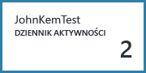
7. Wróć do kafelka **Monitor** i kliknij sekcję **Metryki**. Należy najpierw wybrać zasób filtrowania i wybierając, korzystając z opcji listy rozwijanej w górnej części bloku.

    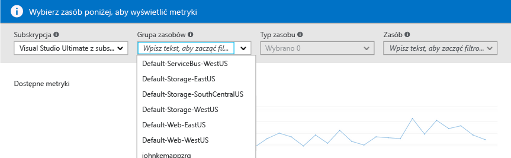

    Wszystkie zasoby platformy Azure tworzą [**metryki**](monitoring-overview-metrics.md). Ten widok gromadzi wszystkie metryki na jednym ekranie, dzięki czemu można łatwo prześledzić działanie zasobów. Ponadto zapoznaj się z naszym marki [Nowa metryka wykresów środowisko](https://aka.ms/azuremonitor/new-metrics-charts) , klikając **metryki (wersja zapoznawcza)** kartę.
8. Po wybraniu zasobu wszystkie dostępne metryki są wyświetlane po lewej stronie bloku. Można jednocześnie prezentować wiele metryk na wykresie, wybierając metryki i modyfikując zakres czasu i typ wykresu. Możesz również wyświetlić wszystkie alerty metryki ustawione dla danego zasobu.

    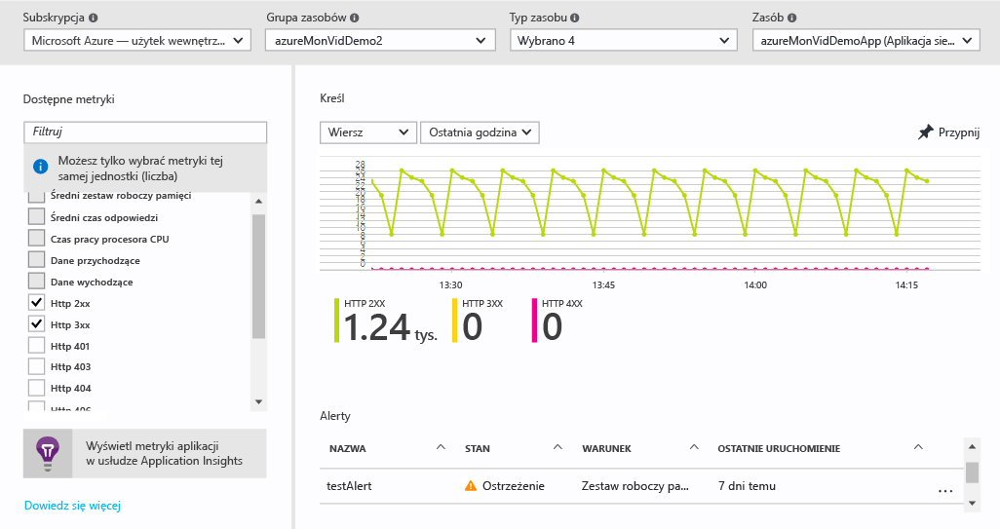

   > [!NOTE]
   > Niektóre metryki są dostępne tylko po włączeniu dla zasobu usługi [Application Insights](../application-insights/app-insights-overview.md) i/lub Diagnostyki Azure dla systemu Windows bądź Linux.
   >
   >
9. Jeśli wykres Ci odpowiada, możesz przypiąć go do pulpitu nawigacyjnego za pomocą przycisku **Przypnij**.
10. Wróć do bloku **Monitor** i kliknij pozycję **Dzienniki diagnostyczne**.

    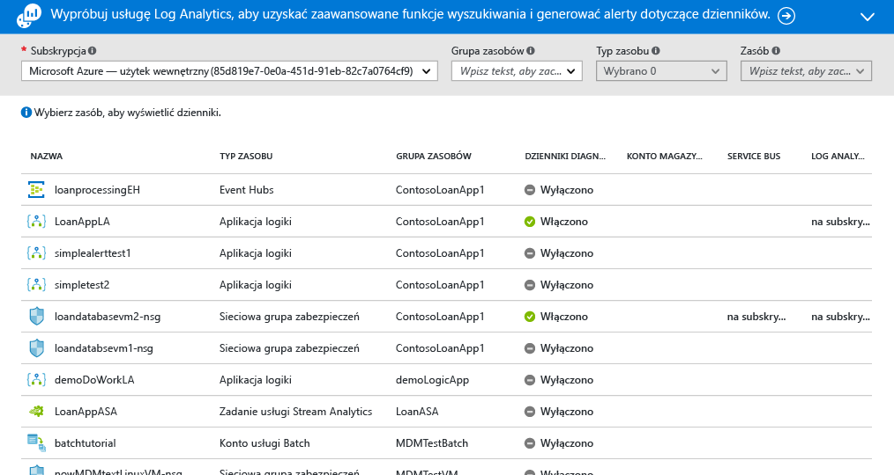

    [**Dzienniki diagnostyczne**](monitoring-overview-of-diagnostic-logs.md) to dzienniki tworzone *przez* zasób, które dostarczają dane o działaniu tego zasobu. Na przykład typami dzienników diagnostycznych są liczniki reguł grup zabezpieczeń sieci oraz dzienniki przepływu pracy aplikacji logiki. Te dzienniki mogą być przechowywane na koncie magazynu, przesyłane strumieniowo do usługi Event Hub i/lub wysyłane do usługi [Log Analytics](../log-analytics/log-analytics-overview.md). Usługa Log Analytics jest produktem firmy Microsoft służącym do analizy operacyjnej, który umożliwia zaawansowane wyszukiwanie oraz generowanie alertów.

    W portalu można wyświetlić i odfiltrować listę wszystkich zasobów objętych subskrypcją, aby ustalić, czy włączono dla nich tworzenie dzienników diagnostycznych.
11. Kliknij zasób w bloku dzienników diagnostycznych. Jeśli dzienniki diagnostyczne są przechowywane na koncie magazynu, zostanie wyświetlona lista tworzonych co godzinę dzienników, które można bezpośrednio pobrać.

    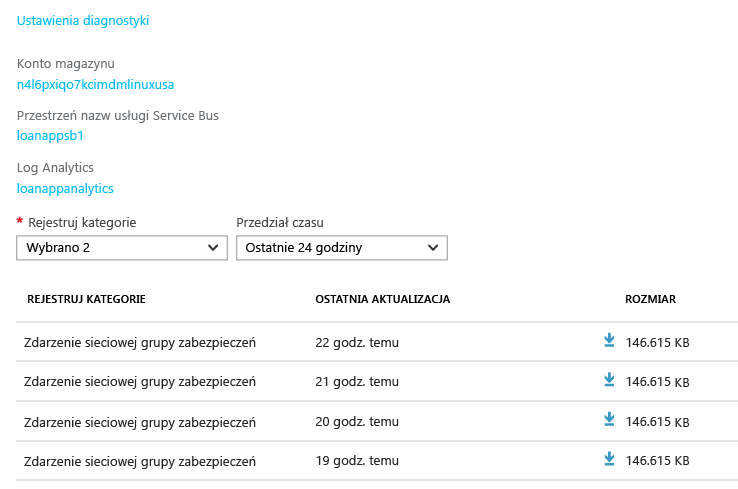

    Możesz również kliknąć opcję **Ustawienia diagnostyczne**, która pozwala skonfigurować lub zmodyfikować ustawienia archiwizacji na koncie magazynu, przesyłania strumieniowego do usługi Event Hubs lub wysyłania do obszaru roboczego usługi Log Analytics.

    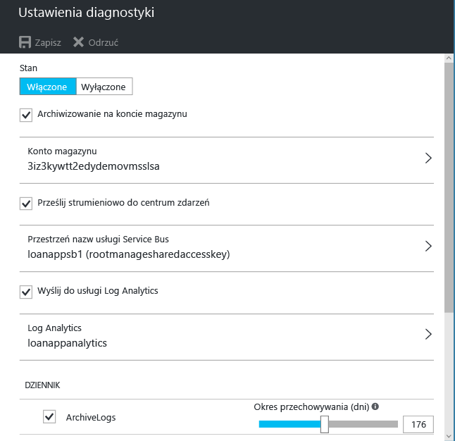

    Jeśli skonfigurowano wysyłanie dzienników diagnostycznych do usługi Log Analytics, można je przeszukiwać w sekcji **Wyszukiwanie w dziennikach** portalu.
12. Przejdź do sekcji **Alerty** bloku Monitor.

    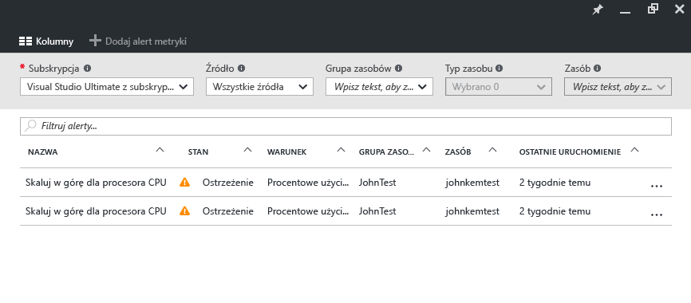

    W tym miejscu można zarządzać wszystkimi [**alertami**](monitoring-overview-alerts.md) dotyczącymi zasobów platformy Azure. Dotyczy to również alerty dotyczące metryk, zdarzenia dziennika aktywności testów sieci web usługi Application Insights (lokalizacja) i proaktywna Diagnostyka usługi Application Insights. Alerty mogą powodować utworzenie wiadomości e-mail do wysłania lub wysłanie żądania POST protokołu HTTP na adres URL elementu webhook.
13. Kliknij pozycję **Dodaj alert dotyczący metryki**, aby utworzyć alert.

    

    Alert można następnie przypiąć do pulpitu nawigacyjnego, aby łatwiej śledzić jego stan w dowolnym momencie.

    Azure Monitor teraz ma również [ **alerty metryki niemal czasie rzeczywistym**](https://aka.ms/azuremonitor/near-real-time-alerts)(wersja zapoznawcza) może zostać oceniony częstotliwością wynoszącymi nawet co minutę!
    
14. Sekcja Monitor zawiera także linki do aplikacji usługi [Application Insights](../application-insights/app-insights-overview.md) oraz rozwiązań zarządzania usługi [Log Analytics](../log-analytics/log-analytics-overview.md). Te produkty firmy Microsoft są silnie zintegrowane z usługą Azure Monitor.
15. Jeśli nie korzystasz z usług Application Insights ani Log Analytics, możliwe jest, że usługa Azure Monitor współpracuje z aktualnie używanymi przez Ciebie produktami do monitorowania, rejestrowania i tworzenia alertów. Zobacz pełną listę produktów oraz instrukcje dotyczące sposobów integracji na naszej [stronie partnerów](monitoring-partners.md).

Wykonując poniższe kroki i przypinając odpowiednie kafelki do pulpitu nawigacyjnego, możesz tworzyć kompleksowe widoki aplikacji i infrastruktury, podobne do widoku poniżej:

## Następne kroki
* Zapoznaj się z tematem [Omówienie usługi Azure Monitor](monitoring-overview.md)
