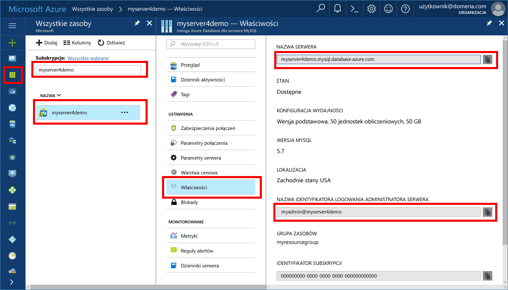

# <a name="azure-database-for-mysql-use-connectorc-to-connect-and-query-data"></a>Usługa Azure Database for MySQL: nawiązywanie połączeń z danymi i wykonywanie na nich zapytań przy użyciu łącznika/języka C++
Ten przewodnik Szybki start przedstawia sposób nawiązywania połączeń z usługą Azure Database for MySQL przy użyciu aplikacji języka C++. Pokazano w nim, jak używać instrukcji języka SQL w celu wysyłania zapytań o dane oraz wstawiania, aktualizowania i usuwania danych w bazie danych. W tym temacie założono, że wiesz już, jak programować w języku C++, i dopiero zaczynasz pracę z usługą Azure Database for MySQL.

## <a name="prerequisites"></a>Wymagania wstępne
Ten przewodnik Szybki start jako punktu wyjścia używa zasobów utworzonych w jednym z następujących przewodników:
- [Tworzenie serwera usługi Azure Database for MySQL za pomocą witryny Azure Portal](./quickstart-create-mysql-server-database-using-azure-portal.md)
- [Tworzenie serwera usługi Azure Database for MySQL za pomocą interfejsu wiersza polecenia platformy Azure](./quickstart-create-mysql-server-database-using-azure-cli.md)

Należy również:
- Zainstalować program [.NET Framework](https://www.microsoft.com/net/download)
- Zainstalować program [Visual Studio](https://www.visualstudio.com/downloads/)
- Zainstalować [łącznik bazy danych MySQL/środowisko C++](https://dev.mysql.com/downloads/connector/cpp/) 
- Zainstalować rozwiązanie [Boost](http://www.boost.org/)

## <a name="install-visual-studio-and-net"></a>Instalowanie programu Visual Studio i technologii .NET
W krokach w tej sekcji założono, że wiesz już, jak programować za pomocą technologii .NET.

### <a name="windows"></a>**Windows**
- Zainstaluj program Visual Studio 2017 Community — wyposażone w pełen zestaw funkcji, rozszerzalne, bezpłatne środowisko IDE do tworzenia nowoczesnych aplikacji przeznaczonych dla systemów Android, iOS, Windows, a także aplikacji internetowych, aplikacji baz danych oraz usług w chmurze. Możesz zainstalować pełne środowisko .NET Framework lub tylko .NET Core: fragmenty kodu zamieszczone w podręczniku działają z obiema opcjami. Jeśli na komputerze masz już zainstalowany program Visual Studio, pomiń dwa następne kroki.
   1. Pobierz [Instalator programu Visual Studio 2017](https://www.visualstudio.com/thank-you-downloading-visual-studio/?sku=Community&rel=15). 
   2. Uruchom instalatora i postępuj zgodnie z wyświetlanymi monitami, aby ukończyć instalację.

### <a name="configure-visual-studio"></a>**Konfigurowanie programu Visual Studio**
1. W programie Visual Studio w lokalizacji Właściwość projektu > Właściwości konfiguracji > C/C++ > Konsolidator > Ogólne > Dodatkowe katalogi biblioteki dodaj katalog lib\opt (tj. C:\Program Files (x86)\MySQL\MySQL Connector C++ 1.1.9\lib\opt) łącznika języka C++.
2. W programie Visual Studio wybierz kolejno pozycje Właściwość projektu > Właściwości konfiguracji > C/C++ > Ogólne > Dodatkowe katalogi dyrektywy include:
   - Dodaj katalog include/ łącznika języka C++ (tj. C:\Program Files (x86) \MySQL\MySQL Connector C++ 1.1.9\include\).
   - Dodaj katalog główny biblioteki Boost (tj. C:\boost_1_64_0\).
3. W programie Visual Studio w lokalizacji Właściwość projektu > Właściwości konfiguracji > C/C++ > Konsolidator > Wejście > Dodatkowe zależności dodaj plik mysqlcppconn.lib w polu tekstowym.
4. Skopiuj plik mysqlcppconn.dll z folderu biblioteki łącznika języka C++ utworzonego w kroku 3 do tego samego katalogu, w którym znajduje się plik wykonywalny aplikacji, albo dodaj go do zmiennej środowiskowej, aby aplikacja mogła go odnaleźć.

## <a name="get-connection-information"></a>Pobieranie informacji o połączeniu
Pobierz informacje o połączeniu potrzebne do nawiązania połączenia z usługą Azure Database for MySQL. Potrzebna jest w pełni kwalifikowana nazwa serwera i poświadczenia logowania.

1. Zaloguj się do witryny [Azure Portal](https://portal.azure.com/).
2. W menu po lewej stronie w witrynie Azure Portal kliknij pozycję **Wszystkie zasoby** i wyszukaj utworzony serwer (taki jak **myserver4demo**).
3. Kliknij nazwę serwera.
4. Wybierz stronę **Właściwości** serwera, a następnie zanotuj **nazwę serwera** i **nazwę logowania administratora serwera**.
 
5. Jeśli nie pamiętasz informacji logowania do serwera, przejdź do strony **Przegląd**, aby wyświetlić nazwę logowania administratora serwera oraz w razie konieczności zresetować hasło.

## <a name="connect-create-table-and-insert-data"></a>Nawiązywanie połączenia, tworzenie tabeli i wstawianie danych
Użyj poniższego kodu, aby nawiązać połączenie i załadować dane przy użyciu instrukcji **CREATE TABLE** i **INSERT INTO** języka SQL. Kod używa klasy sql::Driver z metodą connect() w celu ustanowienia połączenia z programem MySQL. Następnie kod używa metod createStatement() i execute(), aby uruchamiać polecenia bazy danych. 

Zastąp parametry hosta, nazwy bazy danych, użytkownika i hasła wartościami, które zostały określone podczas tworzenia serwera i bazy danych. 

```c++
#include <stdlib.h>
#include <iostream>
#include "stdafx.h"

#include "mysql_connection.h"
#include <cppconn/driver.h>
#include <cppconn/exception.h>
#include <cppconn/prepared_statement.h>
using namespace std;

int main()
{
    sql::Driver *driver;
    sql::Connection *con;
    sql::Statement *stmt;
    sql::PreparedStatement *pstmt;

    try
    {
        driver = get_driver_instance();
        //for demonstration only. never save password in the code!
        con = driver>connect("tcp://myserver4demo.mysql.database.azure.com:3306/quickstartdb", "myadmin@myserver4demo", "server_admin_password");
    }
    catch (sql::SQLException e)
    {
        cout << "Could not connect to database. Error message: " << e.what() << endl;
        system("pause");
        exit(1);
    }

    stmt = con>createStatement();
    stmt>execute("DROP TABLE IF EXISTS inventory");
    cout << "Finished dropping table (if existed)" << endl;
    stmt>execute("CREATE TABLE inventory (id serial PRIMARY KEY, name VARCHAR(50), quantity INTEGER);");
    cout << "Finished creating table" << endl;
    delete stmt;

    pstmt = con>prepareStatement("INSERT INTO inventory(name, quantity) VALUES(?,?)");
    pstmt>setString(1, "banana");
    pstmt>setInt(2, 150);
    pstmt>execute();
    cout << "One row inserted." << endl;

    pstmt>setString(1, "orange");
    pstmt>setInt(2, 154);
    pstmt>execute();
    cout << "One row inserted." << endl;

    pstmt>setString(1, "apple");
    pstmt>setInt(2, 100);
    pstmt>execute();
    cout << "One row inserted." << endl;
    
    delete pstmt;   
    delete con;
    system("pause");
    return 0;

```

## <a name="read-data"></a>Odczyt danych

Użyj poniższego kodu, aby nawiązać połączenie i odczytać dane za pomocą instrukcji **SELECT** języka SQL. Kod używa klasy sql::Driver z metodą connect() w celu ustanowienia połączenia z programem MySQL. Następnie kod używa metod prepareStatement() i executeQuery(), aby uruchamiać polecenia select. Następnie kod używa metody next() w celu przechodzenia do rekordów w wynikach. Na końcu kod używa metod getInt() i getString() w celu przeanalizowania wartości w rekordzie.

Zastąp parametry hosta, nazwy bazy danych, użytkownika i hasła wartościami, które zostały określone podczas tworzenia serwera i bazy danych. 

```csharp
#include <stdlib.h>
#include <iostream>
#include "stdafx.h"

#include "mysql_connection.h"
#include <cppconn/driver.h>
#include <cppconn/exception.h>
#include <cppconn/resultset.h>
#include <cppconn/prepared_statement.h>
using namespace std;

int main()
{
    sql::Driver *driver;
    sql::Connection *con;
    sql::PreparedStatement *pstmt;
    sql::ResultSet *result;

    try
    {
        driver = get_driver_instance();
        //for demonstration only. never save password in the code!
        con = driver>connect("tcp://myserver4demo.mysql.database.azure.com:3306/quickstartdb", "myadmin@myserver4demo", "server_admin_password");
    }
    catch (sql::SQLException e)
    {
        cout << "Could not connect to database. Error message: " << e.what() << endl;
        system("pause");
        exit(1);
    }   

//  select  
    pstmt = con>prepareStatement("SELECT * FROM inventory;");
    result = pstmt>executeQuery();  
    
    while (result>next())
        printf("Reading from table=(%d, %s, %d)\n", result>getInt(1), result>getString(2).c_str(), result>getInt(3));   
    
    delete result;
    delete pstmt;   
    delete con;
    system("pause");
    return 0;
}
```

## <a name="update-data"></a>Aktualizowanie danych
Użyj poniższego kodu, aby nawiązać połączenie i odczytać dane za pomocą instrukcji **UPDATE** języka SQL. Kod używa klasy sql::Driver z metodą connect() w celu ustanowienia połączenia z programem MySQL. Następnie kod używa metod prepareStatement() i executeQuery(), aby uruchamiać polecenia update. 

Zastąp parametry hosta, nazwy bazy danych, użytkownika i hasła wartościami, które zostały określone podczas tworzenia serwera i bazy danych. 

```csharp
#include <stdlib.h>
#include <iostream>
#include "stdafx.h"

#include "mysql_connection.h"
#include <cppconn/driver.h>
#include <cppconn/exception.h>
#include <cppconn/prepared_statement.h>
using namespace std;

int main()
{
    sql::Driver *driver;
    sql::Connection *con;
    sql::PreparedStatement *pstmt;

    try
    {
        driver = get_driver_instance();
        //for demonstration only. never save password in the code!
        con = driver>connect("tcp://myserver4demo.mysql.database.azure.com:3306/quickstartdb", "myadmin@myserver4demo", "server_admin_password");
    }
    catch (sql::SQLException e)
    {
        cout << "Could not connect to database. Error message: " << e.what() << endl;
        system("pause");
        exit(1);
    }   

    //update
    pstmt = con>prepareStatement("UPDATE inventory SET quantity = ? WHERE name = ?");
    pstmt>setInt(1, 200);
    pstmt>setString(2, "banana");
    pstmt>executeQuery();
    printf("Row updated\n");
    
    delete con;
    delete pstmt;
    system("pause");
    return 0;
}
```


## <a name="delete-data"></a>Usuwanie danych
Użyj poniższego kodu, aby nawiązać połączenie i odczytać dane za pomocą instrukcji **DELETE** języka SQL. Kod używa klasy sql::Driver z metodą connect() w celu ustanowienia połączenia z programem MySQL. Następnie kod używa metod prepareStatement() i executeQuery(), aby uruchamiać polecenia delete.

Zastąp parametry hosta, nazwy bazy danych, użytkownika i hasła wartościami, które zostały określone podczas tworzenia serwera i bazy danych. 

```csharp
#include <stdlib.h>
#include <iostream>
#include "stdafx.h"

#include "mysql_connection.h"
#include <cppconn/driver.h>
#include <cppconn/exception.h>
#include <cppconn/resultset.h>
#include <cppconn/prepared_statement.h>
using namespace std;

int main()
{
    sql::Driver *driver;
    sql::Connection *con;
    sql::PreparedStatement *pstmt;
    sql::ResultSet *result;

    try
    {
        driver = get_driver_instance();
        //for demonstration only. never save password in the code!
        con = driver>connect("tcp://myserver4demo.mysql.database.azure.com:3306/quickstartdb", "myadmin@myserver4demo", "server_admin_password");
    }
    catch (sql::SQLException e)
    {
        cout << "Could not connect to database. Error message: " << e.what() << endl;
        system("pause");
        exit(1);
    }
        
    //delete
    pstmt = con>prepareStatement("DELETE FROM inventory WHERE name = ?");
    pstmt>setString(1, "orange");
    result = pstmt>executeQuery();
    printf("Row deleted\n");    
    
    delete pstmt;
    delete con;
    delete result;
    system("pause");
    return 0;
}
```

## <a name="next-steps"></a>Następne kroki
> [!div class="nextstepaction"]
> [Migrowanie bazy danych MySQL do usługi Azure Database for MySQL przy użyciu zrzutu i przywracania](concepts-migrate-dump-restore.md)
