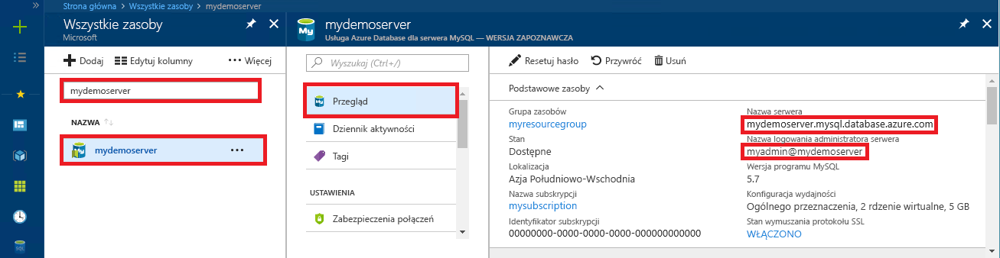

# <a name="azure-database-for-mysql-use-net-c-to-connect-and-query-data"></a>Usługa Azure Database for MySQL: nawiązywanie połączeń z danymi i wykonywanie na nich zapytań przy użyciu platformy .NET (języka C#)
Ten przewodnik Szybki start przedstawia sposób nawiązywania połączeń z usługą Azure Database for MySQL przy użyciu aplikacji języka C#. Pokazano w nim, jak używać instrukcji języka SQL w celu wysyłania zapytań o dane oraz wstawiania, aktualizowania i usuwania danych w bazie danych. W tym temacie założono, że wiesz już, jak opracowywać zawartość za pomocą języka C#, i dopiero zaczynasz pracę z usługą Azure Database for MySQL.

## <a name="prerequisites"></a>Wymagania wstępne
Ten przewodnik Szybki start jako punktu wyjścia używa zasobów utworzonych w jednym z tych przewodników:
- [Tworzenie serwera usługi Azure Database for MySQL za pomocą witryny Azure Portal](./quickstart-create-mysql-server-database-using-azure-portal.md)
- [Tworzenie serwera usługi Azure Database for MySQL za pomocą interfejsu wiersza polecenia platformy Azure](./quickstart-create-mysql-server-database-using-azure-cli.md)

Należy również:
- Zainstalować program [.NET](https://www.microsoft.com/net/download). Postępuj zgodnie z instrukcjami z połączonego artykułu, aby zainstalować program .NET dla danej platformy (Windows, Ubuntu Linux lub macOS). 
- Zainstalować program [Visual Studio](https://www.visualstudio.com/downloads/).

## <a name="create-a-c-project"></a>Tworzenie projektu języka C#
W wierszu polecenia uruchom następujące polecenie:

```
mkdir AzureMySqlExample
cd AzureMySqlExample
dotnet new console
dotnet add package MySqlConnector
```

## <a name="get-connection-information"></a>Pobieranie informacji o połączeniu
Pobierz informacje o połączeniu potrzebne do nawiązania połączenia z usługą Azure Database for MySQL. Potrzebna jest w pełni kwalifikowana nazwa serwera i poświadczenia logowania.

1. Zaloguj się do witryny [Azure Portal](https://portal.azure.com/).
2. W menu po lewej stronie w witrynie Azure Portal kliknij pozycję **Wszystkie zasoby** i wyszukaj utworzony serwer, taki jak **mydemoserver**.
3. Kliknij nazwę serwera.
4. Po przejściu do panelu **Przegląd** serwera zanotuj **nazwę serwera** i **nazwę logowania administratora serwera**. Jeśli zapomnisz hasła, możesz również je zresetować z poziomu tego panelu.
 

## <a name="connect-create-table-and-insert-data"></a>Nawiązywanie połączenia, tworzenie tabeli i wstawianie danych
Użyj następującego kodu, aby nawiązać połączenie i załadować dane za pomocą instrukcji języka SQL `CREATE TABLE` i `INSERT INTO`. Kod używa klasy `MySqlConnection` w metodzie [OpenAsync()](https://docs.microsoft.com/en-us/dotnet/api/system.data.common.dbconnection.openasync#System_Data_Common_DbConnection_OpenAsync) w celu nawiązania połączenia z usługą MySQL. Następnie kod używa metody [CreateCommand()](https://docs.microsoft.com/en-us/dotnet/api/system.data.common.dbconnection.createcommand), ustawia właściwość CommandText i wywołuje metodę [ExecuteNonQueryAsync()](https://docs.microsoft.com/en-us/dotnet/api/system.data.common.dbcommand.executenonqueryasync), aby uruchomić polecenia bazy danych. 

Zastąp parametry `Server`, `Database`, `UserID` i `Password` wartościami określonymi podczas tworzenia serwera i bazy danych. 

```csharp
using System;
using System.Threading.Tasks;
using MySql.Data.MySqlClient;

namespace AzureMySqlExample
{
    class MySqlCreate
    {
        static async Task Main(string[] args)
        {
            var builder = new MySqlConnectionStringBuilder
            {
                Server = "YOUR-SERVER.mysql.database.azure.com",
                Database = "YOUR-DATABASE",
                UserID = "USER@YOUR-SERVER",
                Password = "PASSWORD",
                SslMode = MySqlSslMode.Required,
            };

            using (var conn = new MySqlConnection(builder.ConnectionString))
            {
                Console.WriteLine("Opening connection");
                await conn.OpenAsync();

                using (var command = conn.CreateCommand())
                {
                    command.CommandText = "DROP TABLE IF EXISTS inventory;";
                    await command.ExecuteNonQueryAsync();
                    Console.WriteLine("Finished dropping table (if existed)");

                    command.CommandText = "CREATE TABLE inventory (id serial PRIMARY KEY, name VARCHAR(50), quantity INTEGER);";
                    await command.ExecuteNonQueryAsync();
                    Console.WriteLine("Finished creating table");

                    command.CommandText = @"INSERT INTO inventory (name, quantity) VALUES (@name1, @quantity1),
                        (@name2, @quantity2), (@name3, @quantity3);";
                    command.Parameters.AddWithValue("@name1", "banana");
                    command.Parameters.AddWithValue("@quantity1", 150);
                    command.Parameters.AddWithValue("@name2", "orange");
                    command.Parameters.AddWithValue("@quantity2", 154);
                    command.Parameters.AddWithValue("@name3", "apple");
                    command.Parameters.AddWithValue("@quantity3", 100);

                    int rowCount = await command.ExecuteNonQueryAsync();
                    Console.WriteLine(String.Format("Number of rows inserted={0}", rowCount));
                }

                // connection will be closed by the 'using' block
                Console.WriteLine("Closing connection");
            }

            Console.WriteLine("Press RETURN to exit");
            Console.ReadLine();
        }
    }
}
```

## <a name="read-data"></a>Odczyt danych

Przy użyciu następującego kodu nawiąż połączenie i odczytaj dane za pomocą instrukcji `SELECT` języka SQL. Kod używa klasy `MySqlConnection` w metodzie [OpenAsync()](https://docs.microsoft.com/en-us/dotnet/api/system.data.common.dbconnection.openasync#System_Data_Common_DbConnection_OpenAsync) w celu nawiązania połączenia z usługą MySQL. Następnie kod używa metody [CreateCommand()](https://docs.microsoft.com/en-us/dotnet/api/system.data.common.dbconnection.createcommand) i metody [ExecuteReaderAsync()](https://docs.microsoft.com/en-us/dotnet/api/system.data.common.dbcommand.executereaderasync), aby uruchomić polecenia bazy danych. W kolejnym kroku kod używa metody [ReadAsync()](https://docs.microsoft.com/en-us/dotnet/api/system.data.common.dbdatareader.readasync#System_Data_Common_DbDataReader_ReadAsync) w celu przechodzenia do rekordów w wynikach. Następnie kod używa metod GetInt32() i GetString() w celu przeanalizowania wartości w rekordzie.

Zastąp parametry `Server`, `Database`, `UserID` i `Password` wartościami określonymi podczas tworzenia serwera i bazy danych. 

```csharp
using System;
using System.Threading.Tasks;
using MySql.Data.MySqlClient;

namespace AzureMySqlExample
{
    class MySqlRead
    {
        static async Task Main(string[] args)
        {
            var builder = new MySqlConnectionStringBuilder
            {
                Server = "YOUR-SERVER.mysql.database.azure.com",
                Database = "YOUR-DATABASE",
                UserID = "USER@YOUR-SERVER",
                Password = "PASSWORD",
                SslMode = MySqlSslMode.Required,
            };

            using (var conn = new MySqlConnection(builder.ConnectionString))
            {
                Console.WriteLine("Opening connection");
                await conn.OpenAsync();

                using (var command = conn.CreateCommand())
                {
                    command.CommandText = "SELECT * FROM inventory;";

                    using (var reader = await command.ExecuteReaderAsync())
                    {
                        while (await reader.ReadAsync())
                        {
                            Console.WriteLine(string.Format(
                                "Reading from table=({0}, {1}, {2})",
                                reader.GetInt32(0),
                                reader.GetString(1),
                                reader.GetInt32(2)));
                        }
                    }
                }

                Console.WriteLine("Closing connection");
            }

            Console.WriteLine("Press RETURN to exit");
            Console.ReadLine();
        }
    }
}
```

## <a name="update-data"></a>Aktualizowanie danych
Przy użyciu następującego kodu nawiąż połączenie i odczytaj dane za pomocą instrukcji `UPDATE` języka SQL. Kod używa klasy `MySqlConnection` w metodzie [OpenAsync()](https://docs.microsoft.com/en-us/dotnet/api/system.data.common.dbconnection.openasync#System_Data_Common_DbConnection_OpenAsync) w celu nawiązania połączenia z usługą MySQL. Następnie kod używa metody [CreateCommand()](https://docs.microsoft.com/en-us/dotnet/api/system.data.common.dbconnection.createcommand), ustawia właściwość CommandText i wywołuje metodę [ExecuteNonQueryAsync()](https://docs.microsoft.com/en-us/dotnet/api/system.data.common.dbcommand.executenonqueryasync), aby uruchomić polecenia bazy danych. 

Zastąp parametry `Server`, `Database`, `UserID` i `Password` wartościami określonymi podczas tworzenia serwera i bazy danych. 

```csharp
using System;
using System.Threading.Tasks;
using MySql.Data.MySqlClient;

namespace AzureMySqlExample
{
    class MySqlUpdate
    {
        static async Task Main(string[] args)
        {
            var builder = new MySqlConnectionStringBuilder
            {
                Server = "YOUR-SERVER.mysql.database.azure.com",
                Database = "YOUR-DATABASE",
                UserID = "USER@YOUR-SERVER",
                Password = "PASSWORD",
                SslMode = MySqlSslMode.Required,
            };

            using (var conn = new MySqlConnection(builder.ConnectionString))
            {
                Console.WriteLine("Opening connection");
                await conn.OpenAsync();

                using (var command = conn.CreateCommand())
                {
                    command.CommandText = "UPDATE inventory SET quantity = @quantity WHERE name = @name;";
                    command.Parameters.AddWithValue("@quantity", 200);
                    command.Parameters.AddWithValue("@name", "banana");

                    int rowCount = await command.ExecuteNonQueryAsync();
                    Console.WriteLine(String.Format("Number of rows updated={0}", rowCount));
                }

                Console.WriteLine("Closing connection");
            }

            Console.WriteLine("Press RETURN to exit");
            Console.ReadLine();
        }
    }
}
```

## <a name="delete-data"></a>Usuwanie danych
Przy użyciu następującego kodu nawiąż połączenie i usuń dane za pomocą instrukcji `DELETE` języka SQL. 

Kod używa klasy `MySqlConnection` w metodzie [OpenAsync()](https://docs.microsoft.com/en-us/dotnet/api/system.data.common.dbconnection.openasync#System_Data_Common_DbConnection_OpenAsync) w celu nawiązania połączenia z usługą MySQL. Następnie kod używa metody [CreateCommand()](https://docs.microsoft.com/en-us/dotnet/api/system.data.common.dbconnection.createcommand), ustawia właściwość CommandText i wywołuje metodę [ExecuteNonQueryAsync()](https://docs.microsoft.com/en-us/dotnet/api/system.data.common.dbcommand.executenonqueryasync), aby uruchomić polecenia bazy danych. 

Zastąp parametry `Server`, `Database`, `UserID` i `Password` wartościami określonymi podczas tworzenia serwera i bazy danych. 

```csharp
using System;
using System.Threading.Tasks;
using MySql.Data.MySqlClient;

namespace AzureMySqlExample
{
    class MySqlDelete
    {
        static async Task Main(string[] args)
        {
            var builder = new MySqlConnectionStringBuilder
            {
                Server = "YOUR-SERVER.mysql.database.azure.com",
                Database = "YOUR-DATABASE",
                UserID = "USER@YOUR-SERVER",
                Password = "PASSWORD",
                SslMode = MySqlSslMode.Required,
            };

            using (var conn = new MySqlConnection(builder.ConnectionString))
            {
                Console.WriteLine("Opening connection");
                await conn.OpenAsync();

                using (var command = conn.CreateCommand())
                {
                    command.CommandText = "DELETE FROM inventory WHERE name = @name;";
                    command.Parameters.AddWithValue("@name", "orange");

                    int rowCount = await command.ExecuteNonQueryAsync();
                    Console.WriteLine(String.Format("Number of rows deleted={0}", rowCount));
                }

                Console.WriteLine("Closing connection");
            }

            Console.WriteLine("Press RETURN to exit");
            Console.ReadLine();
        }
    }
}
```

## <a name="next-steps"></a>Następne kroki
> [!div class="nextstepaction"]
> [Migrowanie bazy danych MySQL do usługi Azure Database for MySQL przy użyciu zrzutu i przywracania](concepts-migrate-dump-restore.md)
