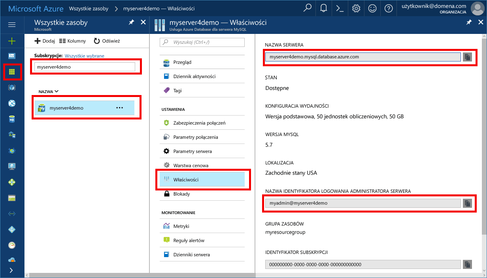

# <a name="azure-database-for-mysql-use-java-to-connect-and-query-data"></a>Usługa Azure Database for MySQL: nawiązywanie połączeń z danymi i wykonywanie na nich zapytań za pomocą języka Java
Ten przewodnik Szybki start przedstawia sposób nawiązywania połączeń z usługą Azure Database for MySQL przy użyciu aplikacji języka Java. Pokazano w nim, jak używać instrukcji języka SQL w celu wysyłania zapytań o dane oraz wstawiania, aktualizowania i usuwania danych w bazie danych. W krokach w tym artykule założono, że wiesz już, jak programować za pomocą języka Java, i dopiero zaczynasz pracę z usługą Azure Database for MySQL.

## <a name="prerequisites"></a>Wymagania wstępne
Ten przewodnik Szybki start jako punktu wyjścia używa zasobów utworzonych w jednym z tych przewodników:
- [Tworzenie serwera usługi Azure Database for MySQL za pomocą witryny Azure Portal](./quickstart-create-mysql-server-database-using-azure-portal.md)
- [Tworzenie serwera usługi Azure Database for MySQL za pomocą interfejsu wiersza polecenia platformy Azure](./quickstart-create-mysql-server-database-using-azure-cli.md)

Należy również:
- Pobrać sterownik JDBC [MySQL Connector/J](https://dev.mysql.com/downloads/connector/j/)
- Uwzględnić plik jar JDBC (na przykład example mysql-connector-java-5.1.42-bin.jar) w ścieżce klas aplikacji.
- Upewnić się, że zabezpieczenia połączeń usługi Azure Database for MySQL zostały skonfigurowane z otwartą zaporą i ustawieniami protokołu SSL dostosowanymi na potrzeby pomyślnego łączenia aplikacji.

## <a name="get-connection-information"></a>Pobieranie informacji o połączeniu
Pobierz informacje o połączeniu potrzebne do nawiązania połączenia z usługą Azure Database for MySQL. Potrzebna jest w pełni kwalifikowana nazwa serwera i poświadczenia logowania.

1. Zaloguj się do witryny [Azure Portal](https://portal.azure.com/).
2. W lewym okienku kliknij pozycję **Wszystkie zasoby**, a następnie wyszukaj utworzony serwer (na przykład **myserver4demo**).
3. Kliknij nazwę serwera.
4. Wybierz stronę **Właściwości** serwera. Zanotuj wartości **Nazwa serwera** i **Identyfikator logowania administratora serwera**.
 
5. Jeśli nie pamiętasz informacji logowania do serwera, przejdź do strony **Przegląd**, aby wyświetlić nazwę logowania administratora serwera oraz w razie konieczności zresetować hasło.

## <a name="connect-create-table-and-insert-data"></a>Nawiązywanie połączenia, tworzenie tabeli i wstawianie danych
Użyj poniższego kodu, aby nawiązać połączenie i załadować dane przy użyciu funkcji z instrukcją **INSERT** języka SQL. Metoda [GetConnection()](https://dev.mysql.com/doc/connector-j/5.1/en/connector-j-usagenotes-connect-drivermanager.html) jest używana do nawiązania połączenia z usługą MySQL. Metody [createStatement()](https://dev.mysql.com/doc/connector-j/5.1/en/connector-j-usagenotes-statements.html) i execute() są używane do przenoszenia i tworzenia tabeli. Obiekt prepareStatement jest używany do tworzenia poleceń insert, z metodami setString() i setInt() do powiązania wartości parametrów. Metoda executeUpdate() uruchamia polecenie dla każdego zestawu parametrów w celu wstawienia wartości. 

Zastąp parametry hosta, bazy danych, użytkownika i hasła wartościami, które zostały określone podczas tworzenia własnego serwera i bazy danych.

```java
import java.sql.*;
import java.util.Properties;

public class CreateTableInsertRows {

    public static void main (String[] args)  throws Exception
    {
        // Initialize connection variables. 
        String host = "myserver4demo.mysql.database.azure.com";
        String database = "quickstartdb";
        String user = "myadmin@myserver4demo";
        String password = "<server_admin_password>";

        // check that the driver is installed
        try
        {
            Class.forName("com.mysql.jdbc.Driver");
        }
        catch (ClassNotFoundException e)
        {
            throw new ClassNotFoundException("MySQL JDBC driver NOT detected in library path.", e);
        }

        System.out.println("MySQL JDBC driver detected in library path.");

        Connection connection = null;

        // Initialize connection object
        try
        {
            String url = String.format("jdbc:mysql://%s/%s", host, database);

            // Set connection properties.
            Properties properties = new Properties();
            properties.setProperty("user", user);
            properties.setProperty("password", password);
            properties.setProperty("useSSL", "true");
            properties.setProperty("verifyServerCertificate", "true");
            properties.setProperty("requireSSL", "false");

            // get connection
            connection = DriverManager.getConnection(url, properties);
        }
        catch (SQLException e)
        {
            throw new SQLException("Failed to create connection to database.", e);
        }
        if (connection != null) 
        { 
            System.out.println("Successfully created connection to database.");
        
            // Perform some SQL queries over the connection.
            try
            {
                // Drop previous table of same name if one exists.
                Statement statement = connection.createStatement();
                statement.execute("DROP TABLE IF EXISTS inventory;");
                System.out.println("Finished dropping table (if existed).");
    
                // Create table.
                statement.execute("CREATE TABLE inventory (id serial PRIMARY KEY, name VARCHAR(50), quantity INTEGER);");
                System.out.println("Created table.");
                
                // Insert some data into table.
                int nRowsInserted = 0;
                PreparedStatement preparedStatement = connection.prepareStatement("INSERT INTO inventory (name, quantity) VALUES (?, ?);");
                preparedStatement.setString(1, "banana");
                preparedStatement.setInt(2, 150);
                nRowsInserted += preparedStatement.executeUpdate();

                preparedStatement.setString(1, "orange");
                preparedStatement.setInt(2, 154);
                nRowsInserted += preparedStatement.executeUpdate();

                preparedStatement.setString(1, "apple");
                preparedStatement.setInt(2, 100);
                nRowsInserted += preparedStatement.executeUpdate();
                System.out.println(String.format("Inserted %d row(s) of data.", nRowsInserted));
    
                // NOTE No need to commit all changes to database, as auto-commit is enabled by default.
    
            }
            catch (SQLException e)
            {
                throw new SQLException("Encountered an error when executing given sql statement.", e);
            }       
        }
        else {
            System.out.println("Failed to create connection to database.");
        }
        System.out.println("Execution finished.");
    }
}

```

## <a name="read-data"></a>Odczyt danych
Użyj poniższego kodu, aby odczytać dane za pomocą instrukcji **SELECT** języka SQL. Metoda [GetConnection()](https://dev.mysql.com/doc/connector-j/5.1/en/connector-j-usagenotes-connect-drivermanager.html) jest używana do nawiązania połączenia z usługą MySQL. Metody [createStatement()](https://dev.mysql.com/doc/connector-j/5.1/en/connector-j-usagenotes-statements.html) and executeQuery() są używane do nawiązywania połączenia i uruchamiania instrukcji select. Wyniki są przetwarzane przy użyciu obiektu [ResultSet](https://docs.oracle.com/javase/tutorial/jdbc/basics/retrieving.html). 

Zastąp parametry hosta, bazy danych, użytkownika i hasła wartościami, które zostały określone podczas tworzenia własnego serwera i bazy danych.

```java
import java.sql.*;
import java.util.Properties;

public class ReadTable {

    public static void main (String[] args)  throws Exception
    {
        // Initialize connection variables.
        String host = "myserver4demo.mysql.database.azure.com";
        String database = "quickstartdb";
        String user = "myadmin@myserver4demo";
        String password = "<server_admin_password>";

        // check that the driver is installed
        try
        {
            Class.forName("com.mysql.jdbc.Driver");
        }
        catch (ClassNotFoundException e)
        {
            throw new ClassNotFoundException("MySQL JDBC driver NOT detected in library path.", e);
        }

        System.out.println("MySQL JDBC driver detected in library path.");

        Connection connection = null;

        // Initialize connection object
        try
        {
            String url = String.format("jdbc:mysql://%s/%s", host, database);

            // Set connection properties.
            Properties properties = new Properties();
            properties.setProperty("user", user);
            properties.setProperty("password", password);
            properties.setProperty("useSSL", "true");
            properties.setProperty("verifyServerCertificate", "true");
            properties.setProperty("requireSSL", "false");
            
            // get connection
            connection = DriverManager.getConnection(url, properties);
        }
        catch (SQLException e)
        {
            throw new SQLException("Failed to create connection to database", e);
        }
        if (connection != null) 
        { 
            System.out.println("Successfully created connection to database.");
        
            // Perform some SQL queries over the connection.
            try
            {
    
                Statement statement = connection.createStatement();
                ResultSet results = statement.executeQuery("SELECT * from inventory;");
                while (results.next())
                {
                    String outputString = 
                        String.format(
                            "Data row = (%s, %s, %s)",
                            results.getString(1),
                            results.getString(2),
                            results.getString(3));
                    System.out.println(outputString);
                }
            }
            catch (SQLException e)
            {
                throw new SQLException("Encountered an error when executing given sql statement", e);
            }       
        }
        else {
            System.out.println("Failed to create connection to database."); 
        }
        System.out.println("Execution finished.");
    }
}
```

## <a name="update-data"></a>Aktualizowanie danych
Użyj poniższego kodu, aby zmienić dane za pomocą instrukcji **UPDATE** języka SQL. Metoda [GetConnection()](https://dev.mysql.com/doc/connector-j/5.1/en/connector-j-usagenotes-connect-drivermanager.html) jest używana do nawiązania połączenia z usługą MySQL. Metody [prepareStatement()](http://docs.oracle.com/javase/tutorial/jdbc/basics/prepared.html) i executeUpdate() są używane do przygotowywania i uruchamiania instrukcji update. 

Zastąp parametry hosta, bazy danych, użytkownika i hasła wartościami, które zostały określone podczas tworzenia własnego serwera i bazy danych.

```java
import java.sql.*;
import java.util.Properties;

public class UpdateTable {
    public static void main (String[] args)  throws Exception
    {
        // Initialize connection variables. 
        String host = "myserver4demo.mysql.database.azure.com";
        String database = "quickstartdb";
        String user = "myadmin@myserver4demo";
        String password = "<server_admin_password>";

        // check that the driver is installed
        try
        {
            Class.forName("com.mysql.jdbc.Driver");
        }
        catch (ClassNotFoundException e)
        {
            throw new ClassNotFoundException("MySQL JDBC driver NOT detected in library path.", e);
        }
        System.out.println("MySQL JDBC driver detected in library path.");

        Connection connection = null;

        // Initialize connection object
        try
        {
            String url = String.format("jdbc:mysql://%s/%s", host, database);
            
            // set up the connection properties
            Properties properties = new Properties();
            properties.setProperty("user", user);
            properties.setProperty("password", password);
            properties.setProperty("useSSL", "true");
            properties.setProperty("verifyServerCertificate", "true");
            properties.setProperty("requireSSL", "false");

            // get connection
            connection = DriverManager.getConnection(url, properties);
        }
        catch (SQLException e)
        {
            throw new SQLException("Failed to create connection to database.", e);
        }
        if (connection != null) 
        { 
            System.out.println("Successfully created connection to database.");
        
            // Perform some SQL queries over the connection.
            try
            {
                // Modify some data in table.
                int nRowsUpdated = 0;
                PreparedStatement preparedStatement = connection.prepareStatement("UPDATE inventory SET quantity = ? WHERE name = ?;");
                preparedStatement.setInt(1, 200);
                preparedStatement.setString(2, "banana");
                nRowsUpdated += preparedStatement.executeUpdate();
                System.out.println(String.format("Updated %d row(s) of data.", nRowsUpdated));
    
                // NOTE No need to commit all changes to database, as auto-commit is enabled by default.
            }
            catch (SQLException e)
            {
                throw new SQLException("Encountered an error when executing given sql statement.", e);
            }       
        }
        else {
            System.out.println("Failed to create connection to database.");
        }
        System.out.println("Execution finished.");
    }
}
```

## <a name="delete-data"></a>Usuwanie danych
Użyj poniższego kodu, aby usunąć dane za pomocą instrukcji **DELETE** języka SQL. Metoda [GetConnection()](https://dev.mysql.com/doc/connector-j/5.1/en/connector-j-usagenotes-connect-drivermanager.html) jest używana do nawiązania połączenia z usługą MySQL.  Metody [prepareStatement()](http://docs.oracle.com/javase/tutorial/jdbc/basics/prepared.html) i executeUpdate() są używane do przygotowywania i uruchamiania instrukcji update. 

Zastąp parametry hosta, bazy danych, użytkownika i hasła wartościami, które zostały określone podczas tworzenia własnego serwera i bazy danych.

```java
import java.sql.*;
import java.util.Properties;

public class DeleteTable {
    public static void main (String[] args)  throws Exception
    {
        // Initialize connection variables.
        String host = "myserver4demo.mysql.database.azure.com";
        String database = "quickstartdb";
        String user = "myadmin@myserver4demo";
        String password = "<server_admin_password>";
        
        // check that the driver is installed
        try
        {
            Class.forName("com.mysql.jdbc.Driver");
        }
        catch (ClassNotFoundException e)
        {
            throw new ClassNotFoundException("MySQL JDBC driver NOT detected in library path.", e);
        }

        System.out.println("MySQL JDBC driver detected in library path.");

        Connection connection = null;

        // Initialize connection object
        try
        {
            String url = String.format("jdbc:mysql://%s/%s", host, database);
            
            // set up the connection properties
            Properties properties = new Properties();
            properties.setProperty("user", user);
            properties.setProperty("password", password);
            properties.setProperty("useSSL", "true");
            properties.setProperty("verifyServerCertificate", "true");
            properties.setProperty("requireSSL", "false");
            
            // get connection
            connection = DriverManager.getConnection(url, properties);
        }
        catch (SQLException e)
        {
            throw new SQLException("Failed to create connection to database", e);
        }
        if (connection != null) 
        { 
            System.out.println("Successfully created connection to database.");
        
            // Perform some SQL queries over the connection.
            try
            {
                // Delete some data from table.
                int nRowsDeleted = 0;
                PreparedStatement preparedStatement = connection.prepareStatement("DELETE FROM inventory WHERE name = ?;");
                preparedStatement.setString(1, "orange");
                nRowsDeleted += preparedStatement.executeUpdate();
                System.out.println(String.format("Deleted %d row(s) of data.", nRowsDeleted));
    
                // NOTE No need to commit all changes to database, as auto-commit is enabled by default.
            }
            catch (SQLException e)
            {
                throw new SQLException("Encountered an error when executing given sql statement.", e);
            }       
        }
        else {
            System.out.println("Failed to create connection to database.");
        }
        System.out.println("Execution finished.");
    }
}
```

## <a name="next-steps"></a>Następne kroki
> [!div class="nextstepaction"]
> [Migrowanie bazy danych MySQL do usługi Azure Database for MySQL przy użyciu zrzutu i przywracania](concepts-migrate-dump-restore.md)

