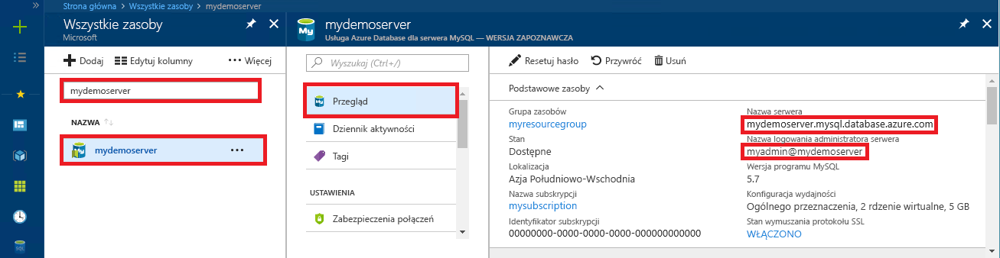

# <a name="azure-database-for-mysql-use-python-to-connect-and-query-data"></a>Usługa Azure Database for MySQL: nawiązywanie połączeń z danymi i wykonywanie na nich zapytań za pomocą języka Python
Ten przewodnik Szybki start przedstawia sposób nawiązywania połączeń z usługą Azure Database for MySQL za pomocą języka [Python](https://python.org). Pokazano w nim, jak używać instrukcji języka SQL w celu wysyłania zapytań o dane oraz wstawiania, aktualizowania i usuwania danych w bazie danych na platformach Mac OS, Ubuntu Linux i Windows. W tym temacie założono, że wiesz już, jak opracowywać zawartość za pomocą języka Python, i dopiero zaczynasz pracę z usługą Azure Database for MySQL.

## <a name="prerequisites"></a>Wymagania wstępne
Ten przewodnik Szybki start jako punktu wyjścia używa zasobów utworzonych w jednym z tych przewodników:
- [Tworzenie serwera usługi Azure Database for MySQL za pomocą witryny Azure Portal](./quickstart-create-mysql-server-database-using-azure-portal.md)
- [Tworzenie serwera usługi Azure Database for MySQL za pomocą interfejsu wiersza polecenia platformy Azure](./quickstart-create-mysql-server-database-using-azure-cli.md)

## <a name="install-python-and-the-mysql-connector"></a>Instalowanie języka Python i łącznika programu MySQL
Zainstaluj język [Python](https://www.python.org/downloads/) i [łącznik programu MySQL dla języka Python](https://dev.mysql.com/downloads/connector/python/) na swojej maszynie. W zależności od używanej platformy wykonaj kroki w odpowiedniej sekcji:

### <a name="windows"></a>Windows
1. Pobierz i zainstaluj język Python w wersji 2.7 z witryny [python.org](https://www.python.org/downloads/windows/). 
2. Sprawdź instalację języka Python, uruchamiając wiersz polecenia. Uruchom polecenie `C:\python27\python.exe -V`, używając przełącznika V, aby wyświetlić numer wersji.
3. Zainstaluj łącznik języka Python dla programu MySQL z witryny [mysql.com](https://dev.mysql.com/downloads/connector/python/) odpowiadający danej wersji języka Python.

### <a name="linux-ubuntu"></a>Linux (Ubuntu)
1. W systemie Linux (Ubuntu) język Python jest zwykle instalowany w ramach instalacji domyślnej.
2. Sprawdź instalację języka Python, uruchamiając powłokę bash. Uruchom polecenie `python -V`, używając przełącznika V, aby wyświetlić numer wersji.
3. Sprawdź instalację narzędzia PIP, uruchamiając `pip show pip -V` polecenie, aby sprawdzić numer wersji. 
4. Narzędzie PIP może być dołączone w niektórych wersjach środowiska Python. Jeśli nie zainstalowano narzędzia PIP, możesz zainstalować pakiet [PIP] (https://pip.pypa.io/en/stable/installing/), uruchamiając polecenie `sudo apt-get install python-pip`.
5. Zaktualizuj narzędzie PIP do najnowszej wersji, uruchamiając polecenie `pip install -U pip`.
6. Zainstaluj łącznik programu MySQL dla języka Python oraz jego zależności za pomocą polecenia PIP:

   ```bash
   sudo pip install mysql-connector-python-rf
   ```
 
### <a name="macos"></a>MacOS
1. W systemie Mac OS język Python jest zwykle instalowany w ramach domyślnej instalacji systemu operacyjnego.
2. Sprawdź instalację języka Python, uruchamiając powłokę bash. Uruchom polecenie `python -V`, używając przełącznika V, aby wyświetlić numer wersji.
3. Sprawdź instalację narzędzia PIP, uruchamiając `pip show pip -V` polecenie, aby sprawdzić numer wersji.
4. Narzędzie PIP może być dołączone w niektórych wersjach środowiska Python. Jeśli nie zainstalowano narzędzia PIP, możesz zainstalować pakiet [PIP](https://pip.pypa.io/en/stable/installing/).
5. Zaktualizuj narzędzie PIP do najnowszej wersji, uruchamiając polecenie `pip install -U pip`.
6. Zainstaluj łącznik programu MySQL dla języka Python oraz jego zależności za pomocą polecenia PIP:

   ```bash
   pip install mysql-connector-python-rf
   ```

## <a name="get-connection-information"></a>Pobieranie informacji o połączeniu
Pobierz informacje o połączeniu potrzebne do nawiązania połączenia z usługą Azure Database for MySQL. Potrzebna jest w pełni kwalifikowana nazwa serwera i poświadczenia logowania.

1. Zaloguj się do witryny [Azure Portal](https://portal.azure.com/).
2. W menu po lewej stronie w witrynie Azure Portal kliknij pozycję **Wszystkie zasoby** i wyszukaj utworzony serwer, taki jak **mydemoserver**.
3. Kliknij nazwę serwera.
4. Po przejściu do panelu **Przegląd** serwera zanotuj **nazwę serwera** i **nazwę logowania administratora serwera**. Jeśli zapomnisz hasła, możesz również je zresetować z poziomu tego panelu.
 
   

## <a name="run-python-code"></a>Uruchamianie kodu języka Python
- Wklej kod do pliku tekstowego, a następnie zapisz plik w folderze projektu z rozszerzeniem py, takim jak C:\pythonmysql\createtable.py lub /home/username/pythonmysql/createtable.py.
- Aby uruchomić kod, uruchom wiersz polecenia lub powłokę Bash. Zmień katalog na folder projektu `cd pythonmysql`. Następnie wpisz polecenie python, a po nim nazwę pliku `python createtable.py`, aby uruchomić aplikację. W systemie operacyjnym Windows, jeśli plik python.exe nie zostanie znaleziony, może być konieczne podanie pełnej ścieżki do pliku wykonywalnego lub dodanie ścieżki języka Python do zmiennej środowiskowej path. `C:\python27\python.exe createtable.py`

## <a name="connect-create-table-and-insert-data"></a>Nawiązywanie połączenia, tworzenie tabeli i wstawianie danych
Użyj poniższego kodu, aby nawiązać połączenie z serwerem, utworzyć tabelę i załadować dane przy użyciu instrukcji **INSERT** języka SQL. 

W kodzie importowana jest biblioteka mysql.connector. Funkcja [connect()](https://dev.mysql.com/doc/connector-python/en/connector-python-api-mysql-connector-connect.html) jest używana do nawiązania połączenia z usługą Azure Database for MySQL przy użyciu [argumentów połączenia](https://dev.mysql.com/doc/connector-python/en/connector-python-connectargs.html) w kolekcji config. Kod używa kursora w połączeniu, a metoda [cursor.execute()](https://dev.mysql.com/doc/connector-python/en/connector-python-api-mysqlcursor-execute.html) wykonuje zapytanie SQL w bazie danych MySQL. 

Zastąp parametry `host`, `user`, `password` i `database` wartościami określonymi podczas tworzenia serwera i bazy danych.

```Python
import mysql.connector
from mysql.connector import errorcode

# Obtain connection string information from the portal
config = {
  'host':'mydemoserver.mysql.database.azure.com',
  'user':'myadmin@mydemoserver',
  'password':'yourpassword',
  'database':'quickstartdb'
}

# Construct connection string
try:
   conn = mysql.connector.connect(**config)
   print("Connection established")
except mysql.connector.Error as err:
  if err.errno == errorcode.ER_ACCESS_DENIED_ERROR:
    print("Something is wrong with the user name or password")
  elif err.errno == errorcode.ER_BAD_DB_ERROR:
    print("Database does not exist")
  else:
    print(err)
else:
  cursor = conn.cursor()

  # Drop previous table of same name if one exists
  cursor.execute("DROP TABLE IF EXISTS inventory;")
  print("Finished dropping table (if existed).")

  # Create table
  cursor.execute("CREATE TABLE inventory (id serial PRIMARY KEY, name VARCHAR(50), quantity INTEGER);")
  print("Finished creating table.")

  # Insert some data into table
  cursor.execute("INSERT INTO inventory (name, quantity) VALUES (%s, %s);", ("banana", 150))
  print("Inserted",cursor.rowcount,"row(s) of data.")
  cursor.execute("INSERT INTO inventory (name, quantity) VALUES (%s, %s);", ("orange", 154))
  print("Inserted",cursor.rowcount,"row(s) of data.")
  cursor.execute("INSERT INTO inventory (name, quantity) VALUES (%s, %s);", ("apple", 100))
  print("Inserted",cursor.rowcount,"row(s) of data.")

  # Cleanup
  conn.commit()
  cursor.close()
  conn.close()
  print("Done.")
```

## <a name="read-data"></a>Odczyt danych
Użyj poniższego kodu, aby nawiązać połączenie i odczytać dane za pomocą instrukcji **SELECT** języka SQL. 

W kodzie importowana jest biblioteka mysql.connector. Funkcja [connect()](https://dev.mysql.com/doc/connector-python/en/connector-python-api-mysql-connector-connect.html) jest używana do nawiązania połączenia z usługą Azure Database for MySQL przy użyciu [argumentów połączenia](https://dev.mysql.com/doc/connector-python/en/connector-python-connectargs.html) w kolekcji config. Kod używa kursora w połączeniu, a metoda [cursor.execute()](https://dev.mysql.com/doc/connector-python/en/connector-python-api-mysqlcursor-execute.html) wykonuje instrukcję SQL w bazie danych MySQL. Wiersze danych są odczytywane przy użyciu metody [fetchall()](https://dev.mysql.com/doc/connector-python/en/connector-python-api-mysqlcursor-fetchall.html). Zestaw wyników jest przechowywany w wierszu kolekcji, a iterator for jest używany do wykonywania operacji dla wierszy w pętli.

Zastąp parametry `host`, `user`, `password` i `database` wartościami określonymi podczas tworzenia serwera i bazy danych.

```Python
import mysql.connector
from mysql.connector import errorcode

# Obtain connection string information from the portal
config = {
  'host':'mydemoserver.mysql.database.azure.com',
  'user':'myadmin@mydemoserver',
  'password':'yourpassword',
  'database':'quickstartdb'
}

# Construct connection string
try:
   conn = mysql.connector.connect(**config)
   print("Connection established")
except mysql.connector.Error as err:
  if err.errno == errorcode.ER_ACCESS_DENIED_ERROR:
    print("Something is wrong with the user name or password")
  elif err.errno == errorcode.ER_BAD_DB_ERROR:
    print("Database does not exist")
  else:
    print(err)
else:
  cursor = conn.cursor()

  # Read data
  cursor.execute("SELECT * FROM inventory;")
  rows = cursor.fetchall()
  print("Read",cursor.rowcount,"row(s) of data.")

  # Print all rows
  for row in rows:
    print("Data row = (%s, %s, %s)" %(str(row[0]), str(row[1]), str(row[2])))

  # Cleanup
  conn.commit()
  cursor.close()
  conn.close()
  print("Done.")
```

## <a name="update-data"></a>Aktualizowanie danych
Użyj poniższego kodu, aby nawiązać połączenie i zaktualizować dane za pomocą instrukcji **UPDATE** języka SQL. 

W kodzie importowana jest biblioteka mysql.connector.  Funkcja [connect()](https://dev.mysql.com/doc/connector-python/en/connector-python-api-mysql-connector-connect.html) jest używana do nawiązania połączenia z usługą Azure Database for MySQL przy użyciu [argumentów połączenia](https://dev.mysql.com/doc/connector-python/en/connector-python-connectargs.html) w kolekcji config. Kod używa kursora w połączeniu, a metoda [cursor.execute()](https://dev.mysql.com/doc/connector-python/en/connector-python-api-mysqlcursor-execute.html) wykonuje instrukcję SQL w bazie danych MySQL. 

Zastąp parametry `host`, `user`, `password` i `database` wartościami określonymi podczas tworzenia serwera i bazy danych.

```Python
import mysql.connector
from mysql.connector import errorcode

# Obtain connection string information from the portal
config = {
  'host':'mydemoserver.mysql.database.azure.com',
  'user':'myadmin@mydemoserver',
  'password':'yourpassword',
  'database':'quickstartdb'
}

# Construct connection string
try:
   conn = mysql.connector.connect(**config)
   print("Connection established")
except mysql.connector.Error as err:
  if err.errno == errorcode.ER_ACCESS_DENIED_ERROR:
    print("Something is wrong with the user name or password")
  elif err.errno == errorcode.ER_BAD_DB_ERROR:
    print("Database does not exist")
  else:
    print(err)
else:
  cursor = conn.cursor()

  # Update a data row in the table
  cursor.execute("UPDATE inventory SET quantity = %s WHERE name = %s;", (200, "banana"))
  print("Updated",cursor.rowcount,"row(s) of data.")

  # Cleanup
  conn.commit()
  cursor.close()
  conn.close()
  print("Done.")
```

## <a name="delete-data"></a>Usuwanie danych
Użyj poniższego kodu, aby nawiązać połączenie i usunąć dane za pomocą instrukcji **DELETE** języka SQL. 

W kodzie importowana jest biblioteka mysql.connector.  Funkcja [connect()](https://dev.mysql.com/doc/connector-python/en/connector-python-api-mysql-connector-connect.html) jest używana do nawiązania połączenia z usługą Azure Database for MySQL przy użyciu [argumentów połączenia](https://dev.mysql.com/doc/connector-python/en/connector-python-connectargs.html) w kolekcji config. Kod używa kursora w połączeniu, a metoda [cursor.execute()](https://dev.mysql.com/doc/connector-python/en/connector-python-api-mysqlcursor-execute.html) wykonuje zapytanie SQL w bazie danych MySQL. 

Zastąp parametry `host`, `user`, `password` i `database` wartościami określonymi podczas tworzenia serwera i bazy danych.

```Python
import mysql.connector
from mysql.connector import errorcode

# Obtain connection string information from the portal
config = {
  'host':'mydemoserver.mysql.database.azure.com',
  'user':'myadmin@mydemoserver',
  'password':'yourpassword',
  'database':'quickstartdb'
}

# Construct connection string
try:
   conn = mysql.connector.connect(**config)
   print("Connection established.")
except mysql.connector.Error as err:
  if err.errno == errorcode.ER_ACCESS_DENIED_ERROR:
    print("Something is wrong with the user name or password.")
  elif err.errno == errorcode.ER_BAD_DB_ERROR:
    print("Database does not exist.")
  else:
    print(err)
else:
  cursor = conn.cursor()

  # Delete a data row in the table
  cursor.execute("DELETE FROM inventory WHERE name=%(param1)s;", {'param1':"orange"})
  print("Deleted",cursor.rowcount,"row(s) of data.")

  # Cleanup
  conn.commit()
  cursor.close()
  conn.close()
  print("Done.")
```

## <a name="next-steps"></a>Następne kroki
> [!div class="nextstepaction"]
> [Migrowanie bazy danych przy użyciu funkcji eksportowania i importowania](./concepts-migrate-import-export.md)
