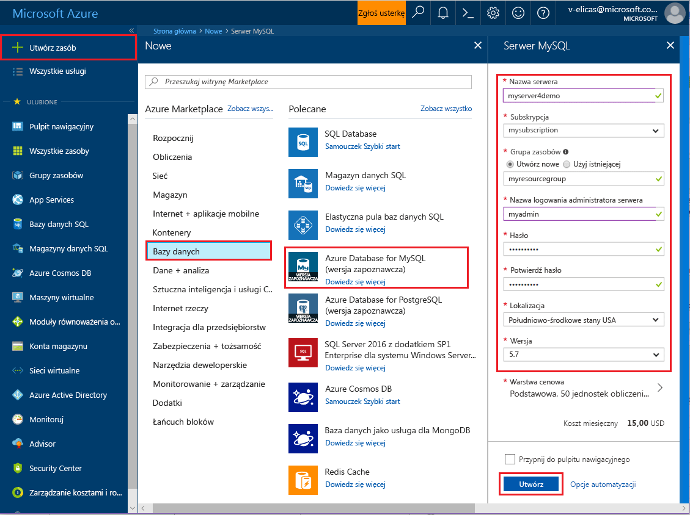
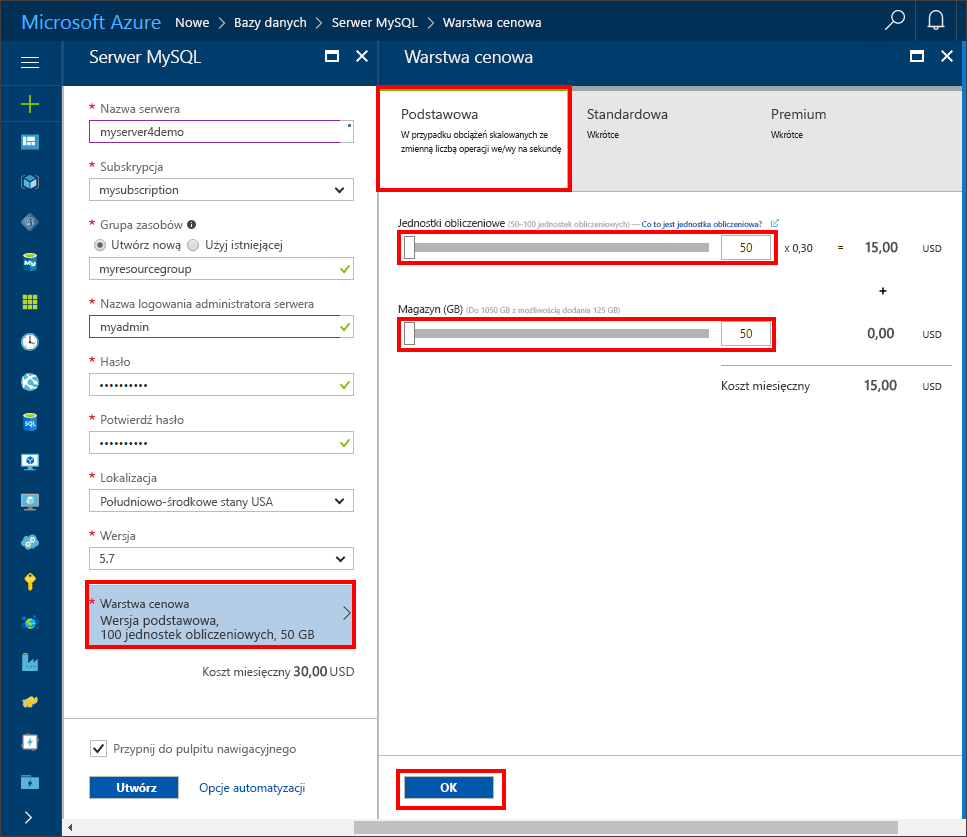
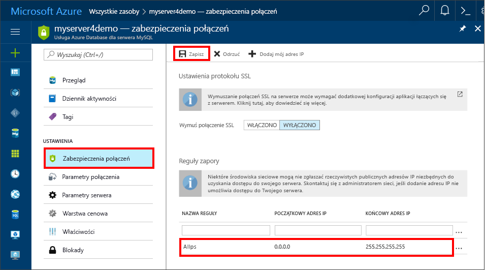
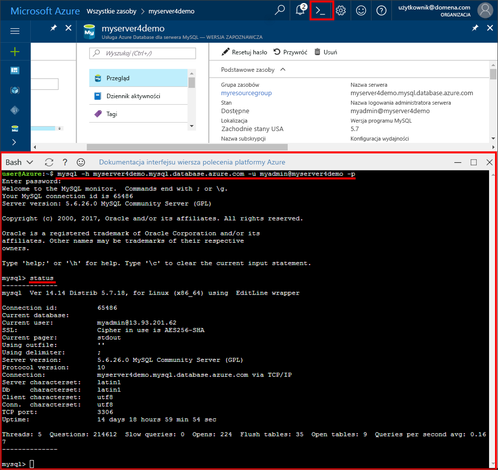
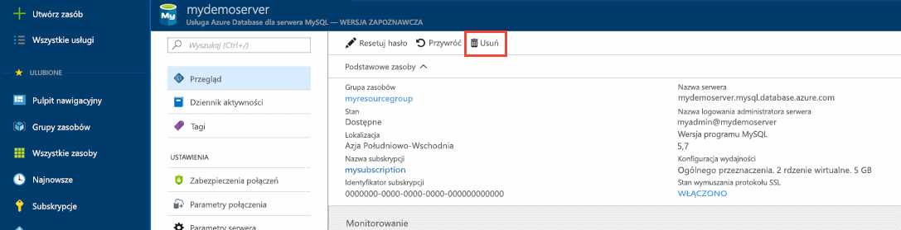

# <a name="create-an-azure-database-for-mysql-server-using-azure-portal"></a>Tworzenie serwera usługi Azure Database for MySQL za pomocą witryny Azure Portal
W tym artykule podano instrukcje pozwalające utworzyć serwer usługi Azure Database for MySQL za pomocą witryny Azure Portal w czasie około pięciu minut. 

Jeśli nie masz subskrypcji platformy Azure, przed rozpoczęciem utwórz [bezpłatne](https://azure.microsoft.com/free/) konto.

## <a name="log-in-to-azure"></a>Zaloguj się do platformy Azure.
Otwórz ulubioną przeglądarkę internetową i przejdź do witryny [Microsoft Azure Portal](https://portal.azure.com/). Wprowadź swoje poświadczenia, aby zalogować się do portalu. Widok domyślny to pulpit nawigacyjny usług.

## <a name="create-azure-database-for-mysql-server"></a>Tworzenie serwera usługi Azure Database for MySQL
1. Kliknij przycisk **Nowy** znajdujący się w lewym górnym rogu witryny Azure Portal.

2. Na stronie **Nowy** wybierz pozycję **Bazy danych**, a następnie na stronie **Bazy danych** wybierz pozycję **Azure Database for MySQL**. Aby znaleźć tę usługę, możesz również wpisać hasło **MySQL** w polu wyszukiwania na stronie Nowy.


3. Wypełnij formularz informacjami o szczegółach nowego serwera w sposób pokazany na wcześniejszej ilustracji, używając następujących informacji:

| **Ustawienie** | **Sugerowana wartość** | **Opis pola** |
|---|---|---|
| *Nazwa serwera* | myserver4demo  | Nazwa serwera musi być unikatowa w skali globalnej. |
| *Subskrypcja* | mysubscription | Wybierz subskrypcję z listy rozwijanej. |
| *Grupa zasobów* | myresourcegroup | Utwórz grupę zasobów lub wybierz istniejącą. |
| *Identyfikator logowania administratora serwera* | myadmin | Podaj nazwę konta administratora aparatu MySQL. |
| *Hasło* |  | Ustaw silne hasło do konta administratora. |
| *Potwierdź hasło* |  | Potwierdź hasło do konta administratora. |
| *Lokalizacja* |  | Wybierz dostępny region. |
| *Wersja* | 5.7 | Wybierz najnowszą wersję. |
| *Warstwa cenowa* | Podstawowa, 50 jednostek obliczeniowych, 50 GB magazynu  | Wybierz pozycje **Warstwa cenowa**, **Jednostki obliczeniowe** i **Magazyn (GB)**, a następnie kliknij przycisk **OK**. |
| *Przypnij do pulpitu nawigacyjnego* | Zaznacz | Zaleca się zaznaczenie tego pola w celu ułatwienia znajdowania serwera. |

   Kliknij pozycję **Warstwa cenowa**, aby określić warstwę cenową i poziom wydajności dla nowej bazy danych. W tym przewodniku Szybki start wybierz warstwę Podstawowa, 50 jednostek obliczeniowych i 50 GB dołączonej pamięci. Następnie kliknij przycisk **OK**, aby zapisać warstwę cenową.
   
   

   Następnie kliknij pozycję **Utwórz**. Po około dwóch minutach nowy serwer usługi Azure Database for MySQL będzie działać w chmurze. Aby monitorować proces wdrażania, kliknij przycisk **Powiadomienia** (z ikoną dzwonka) na pasku narzędzi.

## <a name="configure-the-firewall"></a>Konfigurowanie zapory
Przed nawiązaniem pierwszego połączenia z usługą Azure Database for MySQL musisz skonfigurować zaporę i dodać publiczny adres IP sieci klienta (lub zakres adresów IP) do listy dozwolonych adresów.

1. Po zakończeniu wdrożenia kliknij pozycję **Wszystkie zasoby** w menu po lewej stronie i wpisz nazwę **myserver4demo**, aby wyszukać nowo utworzony serwer. Kliknij nazwę serwera wyświetlaną w wynikach wyszukiwania. Zostanie otwarta strona Przegląd, która zawiera dodatkowe opcje konfiguracji.

2. W bloku serwera wybierz opcję **Zabezpieczenia połączeń**.

3. Kliknij pozycję **Dodaj mój adres IP**, aby dodać adres IP komputera lokalnego lub skonfigurować zakres adresów IP. Pamiętaj, aby po utworzeniu reguł kliknąć przycisk **Zapisz**.
  

## <a name="get-connection-information"></a>Pobieranie informacji o połączeniu
Uzyskaj w pełni kwalifikowaną nazwę domeny Twojego serwera Azure MySQL w witrynie Azure Portal. W pełni kwalifikowana nazwa domeny służy do nawiązywania połączeń z serwerem za pomocą narzędzia wiersza polecenia**mysql.exe**.

1.  W witrynie [Azure Portal](https://portal.azure.com/) kliknij pozycję **Wszystkie zasoby** w menu po lewej stronie, a następnie kliknij Twój serwer usługi Azure Database for MySQL.

2.  Kliknij pozycję **Właściwości**. Zanotuj wartości **NAZWA SERWERA** i **IDENTYFIKATOR LOGOWANIA ADMINISTRATORA SERWERA**.
W tym przykładzie nazwa serwera to *myserver4demo.mysql.database.azure.com*, a identyfikator logowania administratora serwera to *myadmin@myserver4demo*.

## <a name="connect-to-the-server-using-mysqlexe-command-line-tool"></a>Nawiązywanie połączenia z serwerem za pomocą narzędzia wiersza polecenia mysql.exe
Nawiąż połączenie z serwerem usługi Azure Database for MySQL za pomocą [narzędzia wiersza polecenia mysql](https://dev.mysql.com/doc/refman/5.7/en/mysql.html). Narzędzie wiersza polecenia mysql możesz uruchomić w przeglądarce za pomocą usługi Azure Cloud Shell. Możesz też uruchomić je na swojej maszynie, korzystając z zainstalowanych lokalnie narzędzi mysql. Aby uruchomić usługę Azure Cloud Shell, kliknij przycisk `Try It` w bloku kodu w tym artykule lub przejdź do witryny [Azure Portal](https://portal.azure.com) i kliknij ikonę `>_` na pasku narzędzi w prawym górnym rogu. 

1. Aby nawiązać połączenie, wpisz poniższe polecenie:
```azurecli-interactive
mysql -h myserver4demo.mysql.database.azure.com -u myadmin@myserver4demo -p
```

2. Upewnij się, że połączenie nawiązano poprawnie, wyświetlając stan serwera. Po nawiązaniu połączenia wpisz `status` w wierszu polecenia mysql>.
```sql
status
```

   

   > [!TIP]
   > Aby zapoznać się z dodatkowymi poleceniami, zobacz [MySQL 5.7 Reference Manual - Chapter 4.5.1 (Podręcznik programu MySQL 5.7 — Rozdział 4.5.1)](https://dev.mysql.com/doc/refman/5.7/en/mysql.html).

3. Utwórz pustą bazę danych, wpisując polecenie `CREATE DATABASE` w wierszu polecenia mysql>.

   ```sql
   CREATE DATABASE quickstartdb;
   ```

   Na serwerze usługi Azure Database for MySQL może znajdować się jedna lub wiele baz danych. Można wybrać opcję utworzenia jednej bazy danych na serwer w celu wykorzystania wszystkich zasobów. Można też utworzyć wiele baz danych, współdzielących zasoby. Nie istnieje limit dotyczący maksymalnej liczby baz danych, które można utworzyć, ale w przypadku wielu baz danych są współdzielone te same zasoby serwera.  

4. Aby wyświetlić listę baz danych, wpisz polecenie `SHOW DATABASES` w wierszu polecenia mysql>.

   ```sql
   SHOW DATABASES;
   ```

## <a name="connect-to-the-server-using-the-mysql-workbench-gui-tool"></a>Nawiązywanie połączenia z serwerem za pomocą narzędzia z graficznym interfejsem użytkownika MySQL Workbench
1.  Uruchom aplikację MySQL Workbench na swoim komputerze klienckim. Aplikację MySQL Workbench możesz pobrać i zainstalować [stąd](https://dev.mysql.com/downloads/workbench/).

2.  W oknie dialogowym **Konfigurowanie nowego połączenia** wprowadź poniższe informacje na karcie **Parametry**:

   

| **Ustawienie** | **Sugerowana wartość** | **Opis pola** |
|---|---|---|
|   *Nazwa połączenia* | Połączenie demonstracyjne| Podaj etykietę dla tego połączenia. |
| *Metoda połączenia* | Standardowa (TCP/IP) | Metoda Standardowa (TCP/IP) jest wystarczająca. |
| *Nazwa hosta* | myserver4demo.mysql.database.azure.com | Użyj w pełni kwalifikowanej nazwy serwera. |
| *Port* | 3306 | Użyj domyślnego portu 3306. |
| *Nazwa użytkownika* | myadmin@myserver4demo  | Użyj wcześniej podanego identyfikatora logowania administratora serwera ze znakiem @ i nazwą serwera. |
| *Hasło* | Twoje hasło | Aby zapisać hasło, kliknij przycisk Store in Vault... (Zapisz w magazynie...). |

Kliknij przycisk **Testuj połączenie**, aby sprawdzić, czy wszystkie parametry zostały prawidłowo skonfigurowane. Kliknij przycisk OK, aby zapisać połączenie. 

> [!NOTE]
> Na serwerze domyślnie jest wymuszane używanie protokołu SSL. W związku z tym do pomyślnego nawiązania połączenia jest wymagana dodatkowa konfiguracja. Zobacz [Konfigurowanie łączności SSL w aplikacji w celu bezpiecznego nawiązywania połączeń z usługą Azure Database for MySQL](./howto-configure-ssl.md).  Jeśli chcesz wyłączyć protokół SSL na czas wykonywania instrukcji w tym przewodniku Szybki start, przejdź do witryny Azure Portal, kliknij stronę Zabezpieczenia połączeń i kliknij przycisk przełączania Wymuszaj połączenie SSL.

## <a name="clean-up-resources"></a>Oczyszczanie zasobów
Wyczyść wszystkie zasoby utworzone w tym przewodniku Szybki start, usuwając [grupę zasobów platformy Azure](../azure-resource-manager/resource-group-overview.md).

> [!TIP]
> Inne przewodniki Szybki start w tej kolekcji bazują na tym przewodniku. Jeśli planujesz kontynuować pracę z kolejnymi przewodnikami Szybki start, nie usuwaj zasobów utworzonych w tym przewodniku Szybki start. Jeśli nie planujesz kontynuować pracy, wykonaj następujące czynności, aby usunąć wszystkie zasoby utworzone w witrynie Azure Portal w ramach tego przewodnika Szybki start.

1.  W menu znajdującym się po lewej stronie w witrynie Azure Portal kliknij pozycję **Grupy zasobów**, a następnie kliknij pozycję **myresourcegroup**.
2.  Na stronie grupy zasobów kliknij pozycję **Usuń**, wpisz w polu tekstowym nazwę **myresourcegroup**, a następnie kliknij pozycję Usuń.

Jeśli chcesz usunąć nowo utworzony serwer:
1.  Z menu po lewej stronie w witrynie Azure Portal, kliknij pozycję serwerów PostgreSQL i wyszukaj właśnie utworzony serwer
2.  Na stronie Przegląd kliknij przycisk Usuń w górnym okienku 
3.  Potwierdź nazwę serwera, który chcesz usunąć, i wyświetl znajdujące się pod nim bazy danych. W polu tekstowym wpisz **myserver4demo**, a następnie kliknij przycisk Usuń.


## <a name="next-steps"></a>Następne kroki

> [!div class="nextstepaction"]
> [Projektowanie pierwszej bazy danych usługi Azure Database for MySQL](./tutorial-design-database-using-portal.md)


