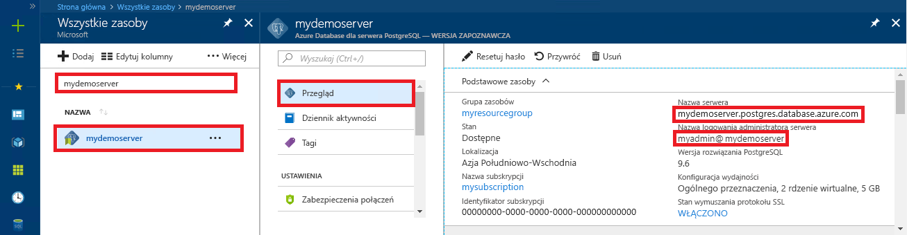

<a id="azure-database-for-postgresql-use-net-c-to-connect-and-query-data" class="xliff"></a>

# Usługa Azure Database for PostgreSQL: nawiązywanie połączeń z danymi i wykonywanie na nich zapytań za pomocą języka .NET (C#)
Ten przewodnik Szybki start przedstawia sposób nawiązywania połączeń z usługą Azure Database for PostgreSQL przy użyciu aplikacji języka C#. Pokazano w nim, jak używać instrukcji języka SQL w celu wysyłania zapytań o dane oraz wstawiania, aktualizowania i usuwania danych w bazie danych. W krokach w tym artykule założono, że wiesz już, jak programować za pomocą języka C#, i dopiero zaczynasz pracę z usługą Azure Database for PostgreSQL.

<a id="prerequisites" class="xliff"></a>

## Wymagania wstępne
Ten przewodnik Szybki start jako punktu wyjścia używa zasobów utworzonych w jednym z tych przewodników:
- [Tworzenie bazy danych — portal](quickstart-create-server-database-portal.md)
- [Tworzenie bazy danych — interfejs wiersza polecenia](quickstart-create-server-database-azure-cli.md)

Należy również:
- Zainstalować program [.NET Framework](https://www.microsoft.com/net/download)
- Zainstalować program [Visual Studio](https://www.visualstudio.com/downloads/)
- Zainstalować rozwiązanie [Npgsql](http://www.npgsql.org/doc/index.html) 

<a id="install-visual-studio-and-net" class="xliff"></a>

## Instalowanie programu Visual Studio i technologii .NET
W krokach w tej sekcji założono, że wiesz już, jak programować za pomocą technologii .NET.

<a id="windows-net-framework-and-net-core" class="xliff"></a>

### **Programy Windows .NET Framework i .NET Core**
Program Visual Studio 2017 Community to wyposażone w pełen zestaw funkcji, rozszerzalne, bezpłatne środowisko IDE do tworzenia nowoczesnych aplikacji przeznaczonych dla systemów Android, iOS, Windows, a także aplikacji baz danych i sieci Web oraz usług w chmurze. Można zainstalować pełny program .NET Framework lub tylko program .NET Core. Fragmenty kodu w tym przewodniku Szybki start działają z oboma tymi programami. Jeśli na maszynie zainstalowano już program Visual Studio, pomiń kilka następnych kroków.

1. Pobierz [Instalator programu Visual Studio 2017](https://www.visualstudio.com/thank-you-downloading-visual-studio/?sku=Community&rel=15). 
2. Uruchom instalatora i postępuj zgodnie z wyświetlanymi monitami, aby ukończyć instalację.

<a id="mac-os" class="xliff"></a>

### **Mac OS**
Otwórz terminal i przejdź do katalogu, w którym planujesz utworzyć projekt .NET Core. Wprowadź następujące polecenia, aby zainstalować rozwiązania **brew**, **OpenSSL** i **.NET Core**. 

```bash
ruby -e "$(curl -fsSL https://raw.githubusercontent.com/Homebrew/install/master/install)"
brew update
brew install openssl
mkdir -p /usr/local/lib
ln -s /usr/local/opt/openssl/lib/libcrypto.1.0.0.dylib /usr/local/lib/
ln -s /usr/local/opt/openssl/lib/libssl.1.0.0.dylib /usr/local/lib/
```

Zainstaluj program .NET Core w systemie macOS. Pobierz [oficjalnego instalatora](https://go.microsoft.com/fwlink/?linkid=843444). Instalator instaluje narzędzia i ścieżki do nich umieszcza w zmiennej PATH, aby można było uruchomić program dotnet z poziomu konsoli

<a id="linux-ubuntu" class="xliff"></a>

### **Linux (Ubuntu)**
Otwórz terminal i przejdź do katalogu, w którym planujesz utworzyć projekt .NET Core. Użyj następujących poleceń, aby zainstalować program **.NET Core**.

```bash
sudo sh -c 'echo "deb [arch=amd64] https://apt-mo.trafficmanager.net/repos/dotnet-release/ xenial main" > /etc/apt/sources.list.d/dotnetdev.list'
sudo apt-key adv --keyserver hkp://keyserver.ubuntu.com:80 --recv-keys 417A0893
sudo apt-get update
sudo apt-get install dotnet-dev-1.0.1
```

<a id="install-npgsql-references-into-your-visual-studio-solution" class="xliff"></a>

## Instalowanie odwołań Npgsql do rozwiązania programu Visual Studio
Aby połączyć się z aplikacją C# do języka PostgreSQL, użyj biblioteki ADO.Net typu open source o nazwie Npgsql. NuGet ułatwia pobieranie odwołań i zarządzanie nimi.

1. Utwórz nowe rozwiązanie języka C# lub otwórz istniejące: 
   - W programie Visual Studio utwórz rozwiązanie, klikając menu Plik **Nowy** > **Projekt**.
   - W oknie dialogowym Nowy projekt rozwiń węzeł **Szablony** > **Visual C#**. 
   - Wybierz odpowiedni szablon, taki jak **Aplikacja konsoli (.NET Core)**.

2. Aby zainstalować dostawcę Npgsql, użyj menedżera pakietów Nuget:
   - W menu **Narzędzia** kliknij kolejno pozycje **Menedżer pakietów NuGet** > **Konsola menedżera pakietów**.
   - W obszarze **Konsola menedżera pakietów** wpisz `Install-Package Npgsql`.
   - Polecenie INSTALL powoduje pobranie pliku Npgsql.dll i powiązanych zestawów oraz dodaje je jako zależności w rozwiązaniu.

<a id="get-connection-information" class="xliff"></a>

## Pobieranie informacji o połączeniu
Uzyskaj parametry połączenia potrzebne do nawiązania połączenia z usługą Azure Database for PostgreSQL. Potrzebna jest w pełni kwalifikowana nazwa serwera i poświadczenia logowania.

1. Zaloguj się do witryny [Azure Portal](https://portal.azure.com/).
2. W menu po lewej stronie w witrynie Azure Portal kliknij pozycję **Wszystkie zasoby** i wyszukaj utworzony serwer, taki jak **mypgserver-20170401**.
3. Kliknij nazwę serwera **mypgserver 20170401**.
4. Wybierz stronę serwera **Przegląd**. Zanotuj wartości **Nazwa serwera** i **Identyfikator logowania administratora serwera**.
 
5. Jeśli nie pamiętasz informacji logowania do serwera, przejdź do strony **Przegląd**, aby wyświetlić nazwę logowania administratora serwera oraz w razie konieczności zresetować hasło.

<a id="connect-create-table-and-insert-data" class="xliff"></a>

## Nawiązywanie połączenia, tworzenie tabeli i wstawianie danych
Użyj poniższego kodu, aby nawiązać połączenie i załadować dane przy użyciu instrukcji **CREATE TABLE** i **INSERT INTO** języka SQL. Kod używa klasy NpgsqlCommand z metodą [Open()](http://www.npgsql.org/api/Npgsql.NpgsqlConnection.html#Npgsql_NpgsqlConnection_Open) w celu ustanowienia połączenia z językiem PostgreSQL. Następnie kod używa metody [CreateCommand()](http://www.npgsql.org/api/Npgsql.NpgsqlConnection.html#Npgsql_NpgsqlConnection_CreateCommand), ustawia właściwość CommandText i wywołuje metodę [ExecuteNonQuery()](http://www.npgsql.org/api/Npgsql.NpgsqlCommand.html#Npgsql_NpgsqlCommand_ExecuteNonQuery), aby uruchamiać polecenia bazy danych. 

Zastąp parametry hosta, nazwy bazy danych, użytkownika i hasła wartościami, które zostały określone podczas tworzenia serwera i bazy danych. 

```csharp
using System;
using System.Collections.Generic;
using System.Linq;
using System.Text;
using System.Threading.Tasks;
using Npgsql;

namespace Driver
{
    public class AzurePostgresCreate
    {
        // Obtain connection string information from the portal
        //
        private static string Host = "mypgserver-20170401.postgres.database.azure.com";
        private static string User = "mylogin@mypgserver-20170401";
        private static string DBname = "mypgsqldb";
        private static string Password = "<server_admin_password>";
        private static string Port = "5432";

        static void Main(string[] args)
        {
            // Build connection string using parameters from portal
            //
            string connString =
                String.Format(
                    "Server={0}; User Id={1}; Database={2}; Port={3}; Password={4};",
                    Host,
                    User,
                    DBname,
                    Port,
                    Password);

            var conn = new NpgsqlConnection(connString);

            Console.Out.WriteLine("Opening connection");
            conn.Open();

            var command = conn.CreateCommand();
            command.CommandText = "DROP TABLE IF EXISTS inventory;";
            command.ExecuteNonQuery();
            Console.Out.WriteLine("Finished dropping table (if existed)");

            command.CommandText = "CREATE TABLE inventory (id serial PRIMARY KEY, name VARCHAR(50), quantity INTEGER);";
            command.ExecuteNonQuery();
            Console.Out.WriteLine("Finished creating table");

            command.CommandText =
                String.Format(
                    @"
                                INSERT INTO inventory (name, quantity) VALUES ({0}, {1});
                                INSERT INTO inventory (name, quantity) VALUES ({2}, {3});
                                INSERT INTO inventory (name, quantity) VALUES ({4}, {5});
                            ",
                    "\'banana\'", 150,
                    "\'orange\'", 154,
                    "\'apple\'", 100
                    );

            int nRows = command.ExecuteNonQuery();
            Console.Out.WriteLine(String.Format("Number of rows inserted={0}", nRows));

            Console.Out.WriteLine("Closing connection");
            conn.Close();

            Console.WriteLine("Press RETURN to exit");
            Console.ReadLine();
        }
    }
}
```

<a id="read-data" class="xliff"></a>

## Odczyt danych
Użyj poniższego kodu, aby nawiązać połączenie i odczytać dane za pomocą instrukcji **SELECT** języka SQL. Kod używa klasy NpgsqlCommand z metodą [Open()](http://www.npgsql.org/api/Npgsql.NpgsqlConnection.html#Npgsql_NpgsqlConnection_Open) w celu ustanowienia połączenia z językiem PostgreSQL. Następnie kod używa metody [CreateCommand()](http://www.npgsql.org/api/Npgsql.NpgsqlConnection.html#Npgsql_NpgsqlConnection_CreateCommand) i metody [Executereader()](http://www.npgsql.org/api/Npgsql.NpgsqlCommand.html#Npgsql_NpgsqlCommand_ExecuteReader), aby uruchamiać polecenia bazy danych. W kolejnym kroku kod używa metody [Read()](http://www.npgsql.org/api/Npgsql.NpgsqlDataReader.html#Npgsql_NpgsqlDataReader_Read) w celu przechodzenia do rekordów w wynikach. Następnie kod używa metod [GetInt32()](http://www.npgsql.org/api/Npgsql.NpgsqlDataReader.html#Npgsql_NpgsqlDataReader_GetInt32_System_Int32_) i [GetString()](http://www.npgsql.org/api/Npgsql.NpgsqlDataReader.html#Npgsql_NpgsqlDataReader_GetString_System_Int32_) w celu przeanalizowania wartości w rekordzie.

Zastąp parametry hosta, nazwy bazy danych, użytkownika i hasła wartościami, które zostały określone podczas tworzenia serwera i bazy danych. 

```csharp
using System;
using System.Collections.Generic;
using System.Linq;
using System.Text;
using System.Threading.Tasks;
using Npgsql;

namespace Driver
{
    public class AzurePostgresRead
    {
        // Obtain connection string information from the portal
        //
        private static string Host = "mypgserver-20170401.postgres.database.azure.com";
        private static string User = "mylogin@mypgserver-20170401";
        private static string DBname = "mypgsqldb";
        private static string Password = "<server_admin_password>";
        private static string Port = "5432";

        static void Main(string[] args)
        {
            // Build connection string using parameters from portal
            //
            string connString =
                String.Format(
                    "Server={0}; User Id={1}; Database={2}; Port={3}; Password={4};",
                    Host,
                    User,
                    DBname,
                    Port,
                    Password);

            var conn = new NpgsqlConnection(connString);

            Console.Out.WriteLine("Opening connection");
            conn.Open();

            var command = conn.CreateCommand();
            command.CommandText = "SELECT * FROM inventory;";

            var reader = command.ExecuteReader();
            while (reader.Read())
            {
                Console.WriteLine(
                    string.Format(
                        "Reading from table=({0}, {1}, {2})",
                        reader.GetInt32(0).ToString(),
                        reader.GetString(1),
                        reader.GetInt32(2).ToString()
                        )
                    );
            }

            Console.Out.WriteLine("Closing connection");
            conn.Close();

            Console.WriteLine("Press RETURN to exit");
            Console.ReadLine();
        }
    }
}
```


<a id="update-data" class="xliff"></a>

## Aktualizowanie danych
Użyj poniższego kodu, aby nawiązać połączenie i odczytać dane za pomocą instrukcji **UPDATE** języka SQL. Kod używa klasy NpgsqlCommand z metodą [Open()](http://www.npgsql.org/api/Npgsql.NpgsqlConnection.html#Npgsql_NpgsqlConnection_Open) w celu ustanowienia połączenia z językiem PostgreSQL. Następnie kod używa metody [CreateCommand()](http://www.npgsql.org/api/Npgsql.NpgsqlConnection.html#Npgsql_NpgsqlConnection_CreateCommand), ustawia właściwość CommandText i wywołuje metodę [ExecuteNonQuery()](http://www.npgsql.org/api/Npgsql.NpgsqlCommand.html#Npgsql_NpgsqlCommand_ExecuteNonQuery), aby uruchamiać polecenia bazy danych.

Zastąp parametry hosta, nazwy bazy danych, użytkownika i hasła wartościami, które zostały określone podczas tworzenia serwera i bazy danych. 

```csharp
using System;
using System.Collections.Generic;
using System.Linq;
using System.Text;
using System.Threading.Tasks;
using Npgsql;

namespace Driver
{
    public class AzurePostgresUpdate
    {
        // Obtain connection string information from the portal
        //
        private static string Host = "mypgserver-20170401.postgres.database.azure.com";
        private static string User = "mylogin@mypgserver-20170401";
        private static string DBname = "mypgsqldb";
        private static string Password = "<server_admin_password>";
        private static string Port = "5432";

        static void Main(string[] args)
        {
            // Build connection string using parameters from portal
            //
            string connString =
                String.Format(
                    "Server={0}; User Id={1}; Database={2}; Port={3}; Password={4};",
                    Host,
                    User,
                    DBname,
                    Port,
                    Password);

            var conn = new NpgsqlConnection(connString);

            Console.Out.WriteLine("Opening connection");
            conn.Open();

            var command = conn.CreateCommand();
            command.CommandText =
            String.Format("UPDATE inventory SET quantity = {0} WHERE name = {1};",
                200,
                "\'banana\'"
                );

            int nRows = command.ExecuteNonQuery();
            Console.Out.WriteLine(String.Format("Number of rows updated={0}", nRows));

            Console.Out.WriteLine("Closing connection");
            conn.Close();

            Console.WriteLine("Press RETURN to exit");
            Console.ReadLine();
        }
    }
}
```


<a id="delete-data" class="xliff"></a>

## Usuwanie danych
Użyj poniższego kodu, aby nawiązać połączenie i odczytać dane za pomocą instrukcji **DELETE** języka SQL. 

 Kod używa klasy NpgsqlCommand z metodą [Open()](http://www.npgsql.org/api/Npgsql.NpgsqlConnection.html#Npgsql_NpgsqlConnection_Open) w celu ustanowienia połączenia z językiem PostgreSQL. Następnie kod używa metody [CreateCommand()](http://www.npgsql.org/api/Npgsql.NpgsqlConnection.html#Npgsql_NpgsqlConnection_CreateCommand), ustawia właściwość CommandText i wywołuje metodę [ExecuteNonQuery()](http://www.npgsql.org/api/Npgsql.NpgsqlCommand.html#Npgsql_NpgsqlCommand_ExecuteNonQuery), aby uruchamiać polecenia bazy danych.

Zastąp parametry hosta, nazwy bazy danych, użytkownika i hasła wartościami, które zostały określone podczas tworzenia serwera i bazy danych. 

```csharp
using System;
using System.Collections.Generic;
using System.Linq;
using System.Text;
using System.Threading.Tasks;
using Npgsql;

namespace Driver
{
    public class AzurePostgresDelete
    {
        // Obtain connection string information from the portal
        //
        private static string Host = "mypgserver-20170401.postgres.database.azure.com";
        private static string User = "mylogin@mypgserver-20170401";
        private static string DBname = "mypgsqldb";
        private static string Password = "<server_admin_password>";
        private static string Port = "5432";

        static void Main(string[] args)
        {
            // Build connection string using parameters from portal
            //
            string connString =
                String.Format(
                    "Server={0}; User Id={1}; Database={2}; Port={3}; Password={4};",
                    Host,
                    User,
                    DBname,
                    Port,
                    Password);

            var conn = new NpgsqlConnection(connString);

            Console.Out.WriteLine("Opening connection");
            conn.Open();

            var command = conn.CreateCommand();
            command.CommandText =
            String.Format("DELETE FROM inventory WHERE name = {0};",
                "\'orange\'");
            int nRows = command.ExecuteNonQuery();
            Console.Out.WriteLine(String.Format("Number of rows deleted={0}", nRows));

            Console.Out.WriteLine("Closing connection");
            conn.Close();

            Console.WriteLine("Press RETURN to exit");
            Console.ReadLine();
        }
    }
}
```

<a id="next-steps" class="xliff"></a>

## Następne kroki
> [!div class="nextstepaction"]
> [Migrowanie bazy danych przy użyciu funkcji eksportowania i importowania](./howto-migrate-using-export-and-import.md)

