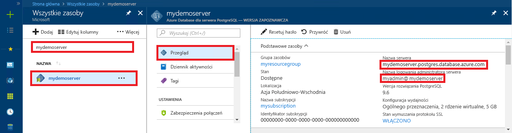

<a id="azure-database-for-postgresql-use-go-language-to-connect-and-query-data" class="xliff"></a>

# Usługa Azure Database for PostgreSQL: nawiązywanie połączeń z danymi i wykonywanie na nich zapytań za pomocą języka Go
Ten przewodnik Szybki start przedstawia sposób nawiązywania połączeń z usługą Azure Database for PostgreSQL przy użyciu kodu napisanego w języku [Go](https://golang.org/). Pokazano w nim, jak używać instrukcji języka SQL w celu wysyłania zapytań o dane oraz wstawiania, aktualizowania i usuwania danych w bazie danych. W tym artykule założono, że wiesz już, jak programować za pomocą języka Go, i dopiero zaczynasz pracę z usługą Azure Database for PostgreSQL.

<a id="prerequisites" class="xliff"></a>

## Wymagania wstępne
Ten przewodnik Szybki start jako punktu wyjścia używa zasobów utworzonych w jednym z tych przewodników:
- [Tworzenie bazy danych — portal](quickstart-create-server-database-portal.md)
- [Tworzenie bazy danych — interfejs wiersza polecenia platformy Azure](quickstart-create-server-database-azure-cli.md)

<a id="install-go-and-pq" class="xliff"></a>

## Instalowanie języków Go i pq
- Pobierz i zainstaluj język Go zgodnie z [instrukcjami dotyczącymi instalacji](https://golang.org/doc/install) odpowiedniej platformy.
- Utwórz folder dla projektu, taki jak C:\Postgresql\. Przy użyciu wiersza polecenia zmień katalog na folder projektu, taki jak `cd C:\Postgres\`.
- Pobierz [sterownik Pure Go Postgres (pq)](https://github.com/lib/pq) do folderu projektu, wpisując polecenie `go get github.com/lib/pq` w tym samym katalogu.

<a id="build-and-run-go-code" class="xliff"></a>

## Kompilowanie i uruchamianie kodu języka Go 
- Zapisz kod w pliku tekstowym z rozszerzeniem *.go i zapisz go w folderze projektu, takim jak `C:\postgres\read.go`.
- Aby uruchomić kod, zmień katalog na folder projektu `cd postgres`, a następnie wpisz polecenie `go run read.go` w celu skompilowania aplikacji i jej uruchomienia.
- Aby skompilować kod w aplikacji natywnej `go build read.go`, uruchom plik read.exe w celu uruchomienia aplikacji.

<a id="get-connection-information" class="xliff"></a>

## Pobieranie informacji o połączeniu
Uzyskaj parametry połączenia potrzebne do nawiązania połączenia z usługą Azure Database for PostgreSQL. Potrzebna jest w pełni kwalifikowana nazwa serwera i poświadczenia logowania.

1. Zaloguj się do witryny [Azure Portal](https://portal.azure.com/).
2. W menu po lewej stronie w witrynie Azure Portal kliknij pozycję **Wszystkie zasoby** i wyszukaj utworzony serwer, taki jak **mypgserver-20170401**.
3. Kliknij nazwę serwera **mypgserver 20170401**.
4. Wybierz stronę serwera **Przegląd**. Zanotuj wartości **Nazwa serwera** i **Identyfikator logowania administratora serwera**.
 
5. Jeśli nie pamiętasz informacji logowania do serwera, przejdź do strony **Przegląd** i wyświetl nazwę logowania administratora serwera. W razie potrzeby zresetuj hasło.

<a id="connect-and-create-a-table" class="xliff"></a>

## Łączenie i tworzenie tabeli
Użyj poniższego kodu w celu nawiązania połączenia i utworzenia tabeli za pomocą instrukcji **CREATE TABLE** języka SQL, a następnie instrukcji **INSERT INTO** języka SQL, aby dodać wiersze do tabeli.

Kod importuje trzy pakiety: [pakiet sql](https://golang.org/pkg/database/sql/), [pakiet pq](http://godoc.org/github.com/lib/pq) jako sterownik do komunikacji z serwerem Postgres i [pakiet fmt](https://golang.org/pkg/fmt/) dla drukowanych danych wejściowych i wyjściowych w wierszu polecenia.

Kod wywołuje metodę [sql.Open()](http://godoc.org/github.com/lib/pq#Open), aby nawiązać połączenie z usługą bazą danych Azure Database for PostgreSQL, i sprawdza połączenie przy użyciu metody [db.Ping()](https://golang.org/pkg/database/sql/#DB.Ping). Używane jest [dojście do bazy danych](https://golang.org/pkg/database/sql/#DB), które utrzymuje pulę połączeń dla serwera bazy danych. Kod wywołuje metodę [Exec()](https://golang.org/pkg/database/sql/#DB.Exec) kilka razy, aby uruchomić kilka poleceń SQL. Za każdym razem jest wywoływana niestandardowa metoda checkError() w celu sprawdzenia, czy wystąpił błąd, i awaryjnego zakończenia pracy w przypadku wystąpienia błędu.


Zastąp parametry `HOST`, `DATABASE`, `USER` i `PASSWORD` własnymi wartościami. 

```go
package main

import (
    "database/sql"
    "fmt"
    _ "github.com/lib/pq"
)

const (
    // Initialize connection constants.
    HOST     = "mypgserver-20170401.postgres.database.azure.com"
    DATABASE = "mypgsqldb"
    USER     = "mylogin@mypgserver-20170401"
    PASSWORD = "<server_admin_password>"
)

func checkError(err error) {
    if err != nil {
        panic(err)
    }
}

func main() {
    // Initialize connection string.
    var connectionString string = fmt.Sprintf("host=%s user=%s password=%s dbname=%s sslmode=require", HOST, USER, PASSWORD, DATABASE)

    // Initialize connection object.
    db, err := sql.Open("postgres", connectionString)
    checkError(err)

    err = db.Ping()
    checkError(err)
    fmt.Println("Successfully created connection to database")

    // Drop previous table of same name if one exists.
    _, err = db.Exec("DROP TABLE IF EXISTS inventory;")
    checkError(err)
    fmt.Println("Finished dropping table (if existed)")

    // Create table.
    _, err = db.Exec("CREATE TABLE inventory (id serial PRIMARY KEY, name VARCHAR(50), quantity INTEGER);")
    checkError(err)
    fmt.Println("Finished creating table")

    // Insert some data into table.
    sql_statement := "INSERT INTO inventory (name, quantity) VALUES ($1, $2);"
    _, err = db.Exec(sql_statement, "banana", 150)
    checkError(err)
    _, err = db.Exec(sql_statement, "orange", 154)
    checkError(err)
    _, err = db.Exec(sql_statement, "apple", 100)
    checkError(err)
    fmt.Println("Inserted 3 rows of data")
}
```

<a id="read-data" class="xliff"></a>

## Odczyt danych
Użyj poniższego kodu, aby nawiązać połączenie i odczytać dane za pomocą instrukcji **SELECT** języka SQL. 

Kod importuje trzy pakiety: [pakiet sql](https://golang.org/pkg/database/sql/), [pakiet pq](http://godoc.org/github.com/lib/pq) jako sterownik do komunikacji z serwerem Postgres i [pakiet fmt](https://golang.org/pkg/fmt/) dla drukowanych danych wejściowych i wyjściowych w wierszu polecenia.

Kod wywołuje metodę [sql.Open()](http://godoc.org/github.com/lib/pq#Open), aby nawiązać połączenie z usługą bazą danych Azure Database for PostgreSQL, i sprawdza połączenie przy użyciu metody [db.Ping()](https://golang.org/pkg/database/sql/#DB.Ping). Używane jest [dojście do bazy danych](https://golang.org/pkg/database/sql/#DB), które utrzymuje pulę połączeń dla serwera bazy danych. Zapytanie dotyczące instrukcji select jest uruchamiane przez wywołanie metody [db.Query()](https://golang.org/pkg/database/sql/#DB.Query), a wiersze wynikowe są przechowywane w zmiennej typu [rows](https://golang.org/pkg/database/sql/#Rows) (wiersze). Kod odczytuje wartości danych kolumny danych w bieżącym wierszu przy użyciu metody [rows.Scan()](https://golang.org/pkg/database/sql/#Rows.Scan) i wykonuje operacje dla wierszy w pętli, używając iteratora [rows.Next()](https://golang.org/pkg/database/sql/#Rows.Next) do momentu, gdy nie ma już kolejnych wierszy. Wartości kolumn w każdym wierszu są drukowane do konsoli. Za każdym razem jest wywoływana niestandardowa metoda checkError() w celu sprawdzenia, czy wystąpił błąd, i awaryjnego zakończenia pracy w przypadku wystąpienia błędu.

Zastąp parametry `HOST`, `DATABASE`, `USER` i `PASSWORD` własnymi wartościami. 

```go
package main

import (
    "database/sql"
    "fmt"
    _ "github.com/lib/pq"
)

const (
    // Initialize connection constants.
    HOST     = "mypgserver-20170401.postgres.database.azure.com"
    DATABASE = "mypgsqldb"
    USER     = "mylogin@mypgserver-20170401"
    PASSWORD = "<server_admin_password>"
)

func checkError(err error) {
    if err != nil {
        panic(err)
    }
}

func main() {

    // Initialize connection string.
    var connectionString string = fmt.Sprintf("host=%s user=%s password=%s dbname=%s sslmode=require", HOST, USER, PASSWORD, DATABASE)

    // Initialize connection object.
    db, err := sql.Open("postgres", connectionString)
    checkError(err)

    err = db.Ping()
    checkError(err)
    fmt.Println("Successfully created connection to database")

    // Read rows from table.
    var id int
    var name string
    var quantity int

    sql_statement := "SELECT * from inventory;"
    rows, err := db.Query(sql_statement)
    checkError(err)

    for rows.Next() {
        switch err := rows.Scan(&id, &name, &quantity); err {
        case sql.ErrNoRows:
            fmt.Println("No rows were returned")
        case nil:
            fmt.Printf("Data row = (%d, %s, %d)\n", id, name, quantity)
        default:
            checkError(err)
        }
    }
}
```

<a id="update-data" class="xliff"></a>

## Aktualizowanie danych
Użyj poniższego kodu, aby nawiązać połączenie i zaktualizować dane za pomocą instrukcji **UPDATE** języka SQL.

Kod importuje trzy pakiety: [pakiet sql](https://golang.org/pkg/database/sql/), [pakiet pq](http://godoc.org/github.com/lib/pq) jako sterownik do komunikacji z serwerem Postgres i [pakiet fmt](https://golang.org/pkg/fmt/) dla drukowanych danych wejściowych i wyjściowych w wierszu polecenia.

Kod wywołuje metodę [sql.Open()](http://godoc.org/github.com/lib/pq#Open), aby nawiązać połączenie z usługą bazą danych Azure Database for PostgreSQL, i sprawdza połączenie przy użyciu metody [db.Ping()](https://golang.org/pkg/database/sql/#DB.Ping). Używane jest [dojście do bazy danych](https://golang.org/pkg/database/sql/#DB), które utrzymuje pulę połączeń dla serwera bazy danych. Kod wywołuje metodę [Exec()](https://golang.org/pkg/database/sql/#DB.Exec) w celu uruchomienia instrukcji SQL służącej do aktualizowania tabeli. Niestandardowa metoda checkError() służy do sprawdzania, czy wystąpił błąd, i awaryjnego kończenia pracy w przypadku wystąpienia błędu.

Zastąp parametry `HOST`, `DATABASE`, `USER` i `PASSWORD` własnymi wartościami. 
```go
package main

import (
  "database/sql"
  _ "github.com/lib/pq"
  "fmt"
)

const (
    // Initialize connection constants.
    HOST     = "mypgserver-20170401.postgres.database.azure.com"
    DATABASE = "mypgsqldb"
    USER     = "mylogin@mypgserver-20170401"
    PASSWORD = "<server_admin_password>"
)

func checkError(err error) {
    if err != nil {
        panic(err)
    }
}

func main() {
    
    // Initialize connection string.
    var connectionString string = 
        fmt.Sprintf("host=%s user=%s password=%s dbname=%s sslmode=require", HOST, USER, PASSWORD, DATABASE)

    // Initialize connection object.
    db, err := sql.Open("postgres", connectionString)
    checkError(err)

    err = db.Ping()
    checkError(err)
    fmt.Println("Successfully created connection to database")

    // Modify some data in table.
    sql_statement := "UPDATE inventory SET quantity = $2 WHERE name = $1;"
    _, err = db.Exec(sql_statement, "banana", 200)
    checkError(err)
    fmt.Println("Updated 1 row of data")
}
```

<a id="delete-data" class="xliff"></a>

## Usuwanie danych
Użyj poniższego kodu, aby nawiązać połączenie i odczytać dane za pomocą instrukcji **DELETE** języka SQL. 

Kod importuje trzy pakiety: [pakiet sql](https://golang.org/pkg/database/sql/), [pakiet pq](http://godoc.org/github.com/lib/pq) jako sterownik do komunikacji z serwerem Postgres i [pakiet fmt](https://golang.org/pkg/fmt/) dla drukowanych danych wejściowych i wyjściowych w wierszu polecenia.

Kod wywołuje metodę [sql.Open()](http://godoc.org/github.com/lib/pq#Open), aby nawiązać połączenie z usługą bazą danych Azure Database for PostgreSQL, i sprawdza połączenie przy użyciu metody [db.Ping()](https://golang.org/pkg/database/sql/#DB.Ping). Używane jest [dojście do bazy danych](https://golang.org/pkg/database/sql/#DB), które utrzymuje pulę połączeń dla serwera bazy danych. Kod wywołuje metodę [Exec()](https://golang.org/pkg/database/sql/#DB.Exec) w celu uruchomienia instrukcji SQL służącej do aktualizowania tabeli. Niestandardowa metoda checkError() służy do sprawdzania, czy wystąpił błąd, i awaryjnego kończenia pracy w przypadku wystąpienia błędu.

Zastąp parametry `HOST`, `DATABASE`, `USER` i `PASSWORD` własnymi wartościami. 
```go
package main

import (
  "database/sql"
  _ "github.com/lib/pq"
  "fmt"
)

const (
    // Initialize connection constants.
    HOST     = "mypgserver-20170401.postgres.database.azure.com"
    DATABASE = "mypgsqldb"
    USER     = "mylogin@mypgserver-20170401"
    PASSWORD = "<server_admin_password>"
)

func checkError(err error) {
    if err != nil {
        panic(err)
    }
}

func main() {
    
    // Initialize connection string.
    var connectionString string = 
        fmt.Sprintf("host=%s user=%s password=%s dbname=%s sslmode=require", HOST, USER, PASSWORD, DATABASE)

    // Initialize connection object.
    db, err := sql.Open("postgres", connectionString)
    checkError(err)

    err = db.Ping()
    checkError(err)
    fmt.Println("Successfully created connection to database")

    // Delete some data from table.
    sql_statement := "DELETE FROM inventory WHERE name = $1;"
    _, err = db.Exec(sql_statement, "orange")
    checkError(err)
    fmt.Println("Deleted 1 row of data")
}
```

<a id="next-steps" class="xliff"></a>

## Następne kroki
> [!div class="nextstepaction"]
> [Migrowanie bazy danych przy użyciu funkcji eksportowania i importowania](./howto-migrate-using-export-and-import.md)

