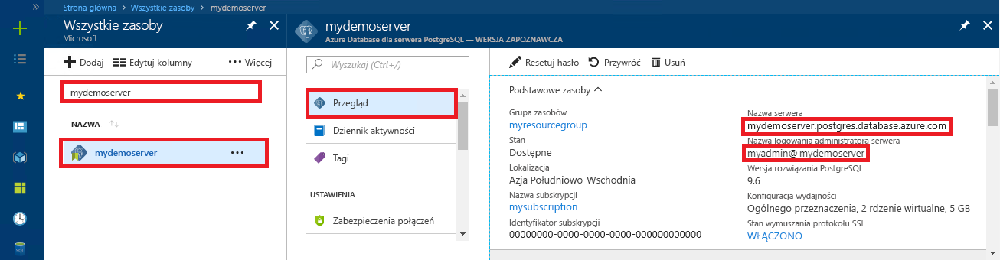

<a id="azure-database-for-postgresql-use-java-to-connect-and-query-data" class="xliff"></a>

# Usługa Azure Database for PostgreSQL: nawiązywanie połączeń z danymi i wykonywanie na nich zapytań za pomocą języka Java
Ten przewodnik Szybki start przedstawia sposób nawiązywania połączeń z usługą Azure Database for PostgreSQL przy użyciu aplikacji Java. Pokazano w nim, jak używać instrukcji języka SQL w celu wysyłania zapytań o dane oraz wstawiania, aktualizowania i usuwania danych w bazie danych. W krokach w tym artykule założono, że wiesz już, jak programować za pomocą języka Java, i dopiero zaczynasz pracę z usługą Azure Database for PostgreSQL.

<a id="prerequisites" class="xliff"></a>

## Wymagania wstępne
Ten przewodnik Szybki start jako punktu wyjścia używa zasobów utworzonych w jednym z tych przewodników:
- [Tworzenie bazy danych — portal](quickstart-create-server-database-portal.md)
- [Tworzenie bazy danych — interfejs wiersza polecenia platformy Azure](quickstart-create-server-database-azure-cli.md)

Należy również:
- Pobrać [sterownik JDBC programu PostgreSQL](https://jdbc.postgresql.org/download.html) zgodny z używaną wersją języka Java i zestawu Java Development Kit.
- Uwzględnić plik jar JDBC programu PostgreSQL (na przykład postgresql-42.1.1.jar) w ścieżce klasy aplikacji. Aby uzyskać więcej informacji, zobacz [szczegóły ścieżki klasy](https://jdbc.postgresql.org/documentation/head/classpath.html).

<a id="get-connection-information" class="xliff"></a>

## Pobieranie informacji o połączeniu
Uzyskaj parametry połączenia potrzebne do nawiązania połączenia z usługą Azure Database for PostgreSQL. Potrzebna jest w pełni kwalifikowana nazwa serwera i poświadczenia logowania.

1. Zaloguj się do witryny [Azure Portal](https://portal.azure.com/).
2. W menu po lewej stronie w witrynie Azure Portal kliknij pozycję **Wszystkie zasoby** i wyszukaj utworzony serwer, taki jak **mypgserver-20170401**.
3. Kliknij nazwę serwera **mypgserver 20170401**.
4. Wybierz stronę serwera **Przegląd**. Zanotuj wartości **Nazwa serwera** i **Identyfikator logowania administratora serwera**.
 
5. Jeśli nie pamiętasz informacji logowania do serwera, przejdź do strony **Przegląd**, aby wyświetlić nazwę logowania administratora serwera oraz w razie konieczności zresetować hasło.

<a id="connect-create-table-and-insert-data" class="xliff"></a>

## Nawiązywanie połączenia, tworzenie tabeli i wstawianie danych
Użyj poniższego kodu, aby nawiązać połączenie i załadować dane przy użyciu funkcji z instrukcją **INSERT** języka SQL. Metody [getConnection()](https://www.postgresql.org/docs/7.4/static/jdbc-use.html), [createStatement()](https://jdbc.postgresql.org/documentation/head/query.html) i [executeQuery()](https://jdbc.postgresql.org/documentation/head/query.html) są używane do nawiązywania połączenia, usuwania i tworzenia tabeli. Obiekt [prepareStatement](https://jdbc.postgresql.org/documentation/head/query.html) jest używany do tworzenia poleceń insert, z metodami setString() i setInt() do powiązania wartości parametrów. Metoda [executeUpdate()](https://jdbc.postgresql.org/documentation/head/update.html) uruchamia polecenie dla każdego zestawu parametrów. 

Zastąp parametry hosta, bazy danych, użytkownika i hasła wartościami, które zostały określone podczas tworzenia własnego serwera i bazy danych.

```java
import java.sql.*;
import java.util.Properties;

public class CreateTableInsertRows {

    public static void main (String[] args)  throws Exception
    {

        // Initialize connection variables.
        String host = "mypgserver-20170401.postgres.database.azure.com";
        String database = "mypgsqldb";
        String user = "mylogin@mypgserver-20170401";
        String password = "<server_admin_password>";

        // check that the driver is installed
        try
        {
            Class.forName("org.postgresql.Driver");
        }
        catch (ClassNotFoundException e)
        {
            throw new ClassNotFoundException("PostgreSQL JDBC driver NOT detected in library path.", e);
        }

        System.out.println("PostgreSQL JDBC driver detected in library path.");

        Connection connection = null;

        // Initialize connection object
        try
        {
            String url = String.format("jdbc:postgresql://%s/%s", host, database);
            
            // set up the connection properties
            Properties properties = new Properties();
            properties.setProperty("user", user);
            properties.setProperty("password", password);
            properties.setProperty("ssl", "true");

            // get connection
            connection = DriverManager.getConnection(url, properties);
        }
        catch (SQLException e)
        {
            throw new SQLException("Failed to create connection to database.", e);
        }
        if (connection != null) 
        { 
            System.out.println("Successfully created connection to database.");
        
            // Perform some SQL queries over the connection.
            try
            {
                // Drop previous table of same name if one exists.
                Statement statement = connection.createStatement();
                statement.execute("DROP TABLE IF EXISTS inventory;");
                System.out.println("Finished dropping table (if existed).");
    
                // Create table.
                statement.execute("CREATE TABLE inventory (id serial PRIMARY KEY, name VARCHAR(50), quantity INTEGER);");
                System.out.println("Created table.");
    
                // Insert some data into table.
                int nRowsInserted = 0;
                PreparedStatement preparedStatement = connection.prepareStatement("INSERT INTO inventory (name, quantity) VALUES (?, ?);");
                preparedStatement.setString(1, "banana");
                preparedStatement.setInt(2, 150);
                nRowsInserted += preparedStatement.executeUpdate();

                preparedStatement.setString(1, "orange");
                preparedStatement.setInt(2, 154);
                nRowsInserted += preparedStatement.executeUpdate();

                preparedStatement.setString(1, "apple");
                preparedStatement.setInt(2, 100);
                nRowsInserted += preparedStatement.executeUpdate();
                System.out.println(String.format("Inserted %d row(s) of data.", nRowsInserted));
    
                // NOTE No need to commit all changes to database, as auto-commit is enabled by default.
    
            }
            catch (SQLException e)
            {
                throw new SQLException("Encountered an error when executing given sql statement.", e);
            }       
        }
        else {
            System.out.println("Failed to create connection to database.");
        }
        System.out.println("Execution finished.");
    }
}
```

<a id="read-data" class="xliff"></a>

## Odczyt danych
Użyj poniższego kodu, aby odczytać dane za pomocą instrukcji **SELECT** języka SQL. Metody [getConnection()](https://www.postgresql.org/docs/7.4/static/jdbc-use.html), [createStatement()](https://jdbc.postgresql.org/documentation/head/query.html) i [executeQuery()](https://jdbc.postgresql.org/documentation/head/query.html) są używane do nawiązywania połączenia, tworzenia i uruchamiania instrukcji SELECT. Wyniki są przetwarzane przy użyciu obiektu [ResultSet](https://www.postgresql.org/docs/7.4/static/jdbc-query.html). 

Zastąp parametry hosta, bazy danych, użytkownika i hasła wartościami, które zostały określone podczas tworzenia własnego serwera i bazy danych.

```java
import java.sql.*;
import java.util.Properties;

public class ReadTable {

    public static void main (String[] args)  throws Exception
    {

        // Initialize connection variables.
        String host = "mypgserver-20170401.postgres.database.azure.com";
        String database = "mypgsqldb";
        String user = "mylogin@mypgserver-20170401";
        String password = "<server_admin_password>";

        // check that the driver is installed
        try
        {
            Class.forName("org.postgresql.Driver");
        }
        catch (ClassNotFoundException e)
        {
            throw new ClassNotFoundException("PostgreSQL JDBC driver NOT detected in library path.", e);
        }

        System.out.println("PostgreSQL JDBC driver detected in library path.");

        Connection connection = null;

        // Initialize connection object
        try
        {
            String url = String.format("jdbc:postgresql://%s/%s", host, database);
            
            // set up the connection properties
            Properties properties = new Properties();
            properties.setProperty("user", user);
            properties.setProperty("password", password);
            properties.setProperty("ssl", "true");

            // get connection
            connection = DriverManager.getConnection(url, properties);
        }
        catch (SQLException e)
        {
            throw new SQLException("Failed to create connection to database.", e);
        }
        if (connection != null) 
        { 
            System.out.println("Successfully created connection to database.");
        
            // Perform some SQL queries over the connection.
            try
            {
    
                Statement statement = connection.createStatement();
                ResultSet results = statement.executeQuery("SELECT * from inventory;");
                while (results.next())
                {
                    String outputString = 
                        String.format(
                            "Data row = (%s, %s, %s)",
                            results.getString(1),
                            results.getString(2),
                            results.getString(3));
                    System.out.println(outputString);
                }
            }
            catch (SQLException e)
            {
                throw new SQLException("Encountered an error when executing given sql statement.", e);
            }       
        }
        else {
            System.out.println("Failed to create connection to database.");
        }
        System.out.println("Execution finished.");
    }
}

```

<a id="update-data" class="xliff"></a>

## Aktualizowanie danych
Użyj poniższego kodu, aby zmienić dane za pomocą instrukcji **UPDATE** języka SQL. Metody [getConnection()](https://www.postgresql.org/docs/7.4/static/jdbc-use.html), [prepareStatement()](https://jdbc.postgresql.org/documentation/head/query.html) i [executeUpdate()](https://jdbc.postgresql.org/documentation/head/update.html) są używane do nawiązywania połączenia, przygotowywania i uruchamiania instrukcji UPDATE. 

Zastąp parametry hosta, bazy danych, użytkownika i hasła wartościami, które zostały określone podczas tworzenia własnego serwera i bazy danych.

```java
import java.sql.*;
import java.util.Properties;

public class UpdateTable {
    public static void main (String[] args)  throws Exception
    {

        // Initialize connection variables.
        String host = "mypgserver-20170401.postgres.database.azure.com";
        String database = "mypgsqldb";
        String user = "mylogin@mypgserver-20170401";
        String password = "<server_admin_password>";

        // check that the driver is installed
        try
        {
            Class.forName("org.postgresql.Driver");
        }
        catch (ClassNotFoundException e)
        {
            throw new ClassNotFoundException("PostgreSQL JDBC driver NOT detected in library path.", e);
        }

        System.out.println("PostgreSQL JDBC driver detected in library path.");

        Connection connection = null;

        // Initialize connection object
        try
        {
            String url = String.format("jdbc:postgresql://%s/%s", host, database);
            
            // set up the connection properties
            Properties properties = new Properties();
            properties.setProperty("user", user);
            properties.setProperty("password", password);
            properties.setProperty("ssl", "true");

            // get connection
            connection = DriverManager.getConnection(url, properties);
        }
        catch (SQLException e)
        {
            throw new SQLException("Failed to create connection to database.", e);
        }
        if (connection != null) 
        { 
            System.out.println("Successfully created connection to database.");
        
            // Perform some SQL queries over the connection.
            try
            {
                // Modify some data in table.
                int nRowsUpdated = 0;
                PreparedStatement preparedStatement = connection.prepareStatement("UPDATE inventory SET quantity = ? WHERE name = ?;");
                preparedStatement.setInt(1, 200);
                preparedStatement.setString(2, "banana");
                nRowsUpdated += preparedStatement.executeUpdate();
                System.out.println(String.format("Updated %d row(s) of data.", nRowsUpdated));
    
                // NOTE No need to commit all changes to database, as auto-commit is enabled by default.
            }
            catch (SQLException e)
            {
                throw new SQLException("Encountered an error when executing given sql statement.", e);
            }       
        }
        else {
            System.out.println("Failed to create connection to database.");
        }
        System.out.println("Execution finished.");
    }
}
```
<a id="delete-data" class="xliff"></a>

## Usuwanie danych
Użyj poniższego kodu, aby usunąć dane za pomocą instrukcji **DELETE** języka SQL. Metody [getConnection()](https://www.postgresql.org/docs/7.4/static/jdbc-use.html), [prepareStatement()](https://jdbc.postgresql.org/documentation/head/query.html) i [executeUpdate()](https://jdbc.postgresql.org/documentation/head/update.html) są używane do nawiązywania połączenia, przygotowywania i uruchamiania instrukcji DELETE. 

Zastąp parametry hosta, bazy danych, użytkownika i hasła wartościami, które zostały określone podczas tworzenia własnego serwera i bazy danych.

```java
import java.sql.*;
import java.util.Properties;

public class DeleteTable {
    public static void main (String[] args)  throws Exception
    {

        // Initialize connection variables.
        String host = "mypgserver-20170401.postgres.database.azure.com";
        String database = "mypgsqldb";
        String user = "mylogin@mypgserver-20170401";
        String password = "<server_admin_password>";

        // check that the driver is installed
        try
        {
            Class.forName("org.postgresql.Driver");
        }
        catch (ClassNotFoundException e)
        {
            throw new ClassNotFoundException("PostgreSQL JDBC driver NOT detected in library path.", e);
        }

        System.out.println("PostgreSQL JDBC driver detected in library path.");

        Connection connection = null;

        // Initialize connection object
        try
        {
            String url = String.format("jdbc:postgresql://%s/%s", host, database);
            
            // set up the connection properties
            Properties properties = new Properties();
            properties.setProperty("user", user);
            properties.setProperty("password", password);
            properties.setProperty("ssl", "true");

            // get connection
            connection = DriverManager.getConnection(url, properties);
        }
        catch (SQLException e)
        {
            throw new SQLException("Failed to create connection to database.", e);
        }
        if (connection != null) 
        { 
            System.out.println("Successfully created connection to database.");
        
            // Perform some SQL queries over the connection.
            try
            {
                // Delete some data from table.
                int nRowsDeleted = 0;
                PreparedStatement preparedStatement = connection.prepareStatement("DELETE FROM inventory WHERE name = ?;");
                preparedStatement.setString(1, "orange");
                nRowsDeleted += preparedStatement.executeUpdate();
                System.out.println(String.format("Deleted %d row(s) of data.", nRowsDeleted));
    
                // NOTE No need to commit all changes to database, as auto-commit is enabled by default.
            }
            catch (SQLException e)
            {
                throw new SQLException("Encountered an error when executing given sql statement.", e);
            }       
        }
        else {
            System.out.println("Failed to create connection to database.");
        }
        System.out.println("Execution finished.");
    }
}
```

<a id="next-steps" class="xliff"></a>

## Następne kroki
> [!div class="nextstepaction"]
> [Migrowanie bazy danych przy użyciu funkcji eksportowania i importowania](./howto-migrate-using-export-and-import.md)

