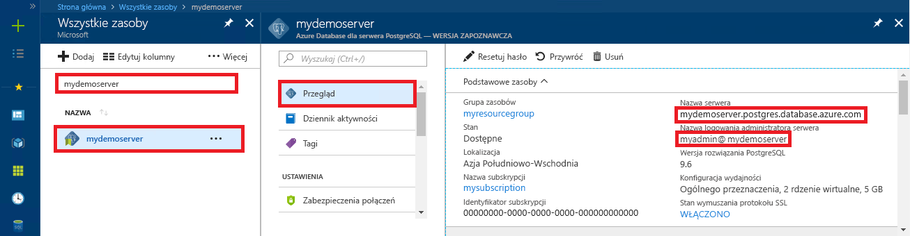

# <a name="azure-database-for-postgresql-use-nodejs-to-connect-and-query-data"></a>Usługa Azure Database for PostgreSQL: nawiązywanie połączeń z danymi i wykonywanie na nich zapytań za pomocą środowiska Node.js
Ten przewodnik Szybki start przedstawia sposób nawiązywania połączeń z usługą Azure Database for PostgreSQL przy użyciu języka [Node.js](https://nodejs.org/) z platform Windows, Ubuntu Linux i Mac. Pokazano w nim, jak używać instrukcji języka SQL w celu wysyłania zapytań o dane oraz wstawiania, aktualizowania i usuwania danych w bazie danych. W krokach w tym artykule założono, że wiesz już, jak programować za pomocą języka Node.js, i dopiero zaczynasz pracę z usługą Azure Database for PostgreSQL.

## <a name="prerequisites"></a>Wymagania wstępne
Ten przewodnik Szybki start jako punktu wyjścia używa zasobów utworzonych w jednym z tych przewodników:
- [Tworzenie bazy danych — portal](quickstart-create-server-database-portal.md)
- [Tworzenie bazy danych — interfejs wiersza polecenia](quickstart-create-server-database-azure-cli.md)

Należy również:
- Zainstalować środowisko [Node.js](https://nodejs.org).

## <a name="install-pg-client"></a>Instalowanie klienta pg
Zainstaluj program [pg](https://www.npmjs.com/package/pg) będący niepowodującym blokowania klientem w czystym języku JavaScript dla środowiska Node.js, przydatnym do nawiązywania połączeń z programem PostgreSQL i wykonywania w nim zapytań.

W tym celu uruchom narzędzie Node Package Manager (npm) dla języka JavaScript z poziomu wiersza polecenia, aby zainstalować klienta pg.
```bash
npm install pg
```

Zweryfikuj instalację, wyświetlając listę zainstalowanych pakietów.
```bash
npm list
```
Dane wyjściowe polecenia listy potwierdzają wersję każdego składnika. 
```
`-- pg@6.2.3
  +-- buffer-writer@1.0.1
  +-- packet-reader@0.3.1
etc...
```

## <a name="get-connection-information"></a>Pobieranie informacji o połączeniu
Uzyskaj parametry połączenia potrzebne do nawiązania połączenia z usługą Azure Database for PostgreSQL. Potrzebna jest w pełni kwalifikowana nazwa serwera i poświadczenia logowania.

1. Zaloguj się do witryny [Azure Portal](https://portal.azure.com/).
2. W menu po lewej stronie w witrynie Azure Portal kliknij pozycję **Wszystkie zasoby** i wyszukaj właśnie utworzony serwer **mypgserver 20170401**.
3. Kliknij nazwę serwera **mypgserver 20170401**.
4. Wybierz stronę serwera **Przegląd**. Zanotuj wartości **Nazwa serwera** i **Identyfikator logowania administratora serwera**.
 
5. Jeśli nie pamiętasz informacji logowania do serwera, przejdź do strony **Przegląd**, aby wyświetlić nazwę logowania administratora serwera oraz w razie konieczności zresetować hasło.

## <a name="running-the-javascript-code-in-nodejs"></a>Uruchamianie kodu JavaScript w środowisku Node.js
Środowisko Node.js można uruchomić w wierszu polecenia powłoki bash lub systemu Windows, wpisując polecenie `node`, a następnie uruchomić przykładowy kod JavaScript przez skopiowanie i wklejenie go w wierszu polecenia. Alternatywnie można zapisać kod JavaScript w pliku tekstowym, a następnie uruchomić polecenie `node filename.js` z nazwą pliku jako parametrem uruchamiania.

## <a name="connect-create-table-and-insert-data"></a>Nawiązywanie połączenia, tworzenie tabeli i wstawianie danych
Użyj poniższego kodu, aby nawiązać połączenie i załadować dane przy użyciu instrukcji **CREATE TABLE** i **INSERT INTO** języka SQL.
Obiekt [pg.Client](https://github.com/brianc/node-postgres/wiki/Client) służy do połączenia interfejsem z serwerem programu PostgreSQL. Funkcja [pg.Client.connect()](https://github.com/brianc/node-postgres/wiki/Client#method-connect) służy do nawiązywania połączenia z serwerem. Funkcja [pg.Client.query()](https://github.com/brianc/node-postgres/wiki/Query) służy do wykonywania zapytania SQL względem bazy danych PostgreSQL. 

Zastąp parametry hosta, nazwy bazy danych, użytkownika i hasła wartościami, które zostały określone podczas tworzenia serwera i bazy danych.

```javascript
const pg = require('pg');

const config = {
    host: 'mypgserver-20170401.postgres.database.azure.com',
    user: 'mylogin@mypgserver-20170401',
    password: '<server_admin_password>',
    database: '<name_of_database>',
    port: 5432,
    ssl: true
};

const client = new pg.Client(config);

client.connect(err => {
    if (err) throw err;
    else {
        queryDatabase();
    }
});

function queryDatabase() {
    const query = `
        DROP TABLE IF EXISTS inventory;
        CREATE TABLE inventory (id serial PRIMARY KEY, name VARCHAR(50), quantity INTEGER);
        INSERT INTO inventory (name, quantity) VALUES ('banana', 150);
        INSERT INTO inventory (name, quantity) VALUES ('orange', 154);
        INSERT INTO inventory (name, quantity) VALUES ('apple', 100);
    `;

    client
        .query(query)
        .then(() => {
            console.log('Table created successfully!');
            client.end(console.log('Closed client connection'));
        })
        .catch(err => console.log(err))
        .then(() => {
            console.log('Finished execution, exiting now');
            process.exit();
        });
}
```

## <a name="read-data"></a>Odczyt danych
Użyj poniższego kodu, aby nawiązać połączenie i odczytać dane za pomocą instrukcji **SELECT** języka SQL. Obiekt [pg.Client](https://github.com/brianc/node-postgres/wiki/Client) służy do połączenia interfejsem z serwerem programu PostgreSQL. Funkcja [pg.Client.connect()](https://github.com/brianc/node-postgres/wiki/Client#method-connect) służy do nawiązywania połączenia z serwerem. Funkcja [pg.Client.query()](https://github.com/brianc/node-postgres/wiki/Query) służy do wykonywania zapytania SQL względem bazy danych PostgreSQL. 

Zastąp parametry hosta, nazwy bazy danych, użytkownika i hasła wartościami, które zostały określone podczas tworzenia serwera i bazy danych. 

```javascript
const pg = require('pg');

const config = {
    host: 'mypgserver-20170401.postgres.database.azure.com',
    user: 'mylogin@mypgserver-20170401',
    password: '<server_admin_password>',
    database: '<name_of_database>',
    port: 5432,
    ssl: true
};

const client = new pg.Client(config);

client.connect(err => {
    if (err) throw err;
    else { queryDatabase(); }
});

function queryDatabase() {
  
    console.log(`Running query to PostgreSQL server: ${config.host}`);

    const query = 'SELECT * FROM inventory;';

    client.query(query)
        .then(res => {
            const rows = res.rows;

            rows.map(row => {
                console.log(`Read: ${JSON.stringify(row)}`);
            });

            process.exit();
        })
        .catch(err => {
            console.log(err);
        });
}
```

## <a name="update-data"></a>Aktualizowanie danych
Użyj poniższego kodu, aby nawiązać połączenie i odczytać dane za pomocą instrukcji **UPDATE** języka SQL. Obiekt [pg.Client](https://github.com/brianc/node-postgres/wiki/Client) służy do połączenia interfejsem z serwerem programu PostgreSQL. Funkcja [pg.Client.connect()](https://github.com/brianc/node-postgres/wiki/Client#method-connect) służy do nawiązywania połączenia z serwerem. Funkcja [pg.Client.query()](https://github.com/brianc/node-postgres/wiki/Query) służy do wykonywania zapytania SQL względem bazy danych PostgreSQL. 

Zastąp parametry hosta, nazwy bazy danych, użytkownika i hasła wartościami, które zostały określone podczas tworzenia serwera i bazy danych. 

```javascript
const pg = require('pg');

const config = {
    host: 'mypgserver-20170401.postgres.database.azure.com',
    user: 'mylogin@mypgserver-20170401',
    password: '<server_admin_password>',
    database: '<name_of_database>',
    port: 5432,
    ssl: true
};

const client = new pg.Client(config);

client.connect(err => {
    if (err) throw err;
    else {
        queryDatabase();
    }
});

function queryDatabase() {
    const query = `UPDATE inventory 
                   SET quantity= 1000 WHERE name='banana';`;

    client
        .query(query)
        .then(() => {
            console.log('Update completed succesfully!');
            client.end(console.log('Closed client connection'));
        })
        .catch(err => console.log(err))
        .then(() => {
            console.log('Finished execution, exiting now');
            process.exit();
        });
}
```

## <a name="delete-data"></a>Usuwanie danych
Użyj poniższego kodu, aby nawiązać połączenie i odczytać dane za pomocą instrukcji **DELETE** języka SQL. Obiekt [pg.Client](https://github.com/brianc/node-postgres/wiki/Client) służy do połączenia interfejsem z serwerem programu PostgreSQL. Funkcja [pg.Client.connect()](https://github.com/brianc/node-postgres/wiki/Client#method-connect) służy do nawiązywania połączenia z serwerem. Funkcja [pg.Client.query()](https://github.com/brianc/node-postgres/wiki/Query) służy do wykonywania zapytania SQL względem bazy danych PostgreSQL. 

Zastąp parametry hosta, nazwy bazy danych, użytkownika i hasła wartościami, które zostały określone podczas tworzenia serwera i bazy danych. 

```javascript
const pg = require('pg');

var config =
{
    host: 'mypgserver-20170401.postgres.database.azure.com',
    user: 'mylogin@mypgserver-20170401',
    password: '<server_admin_password>',
    database: 'mypgsqldb',
    port: 5432,
    ssl: true
};

const client = new pg.Client(config);

client.connect(function (err)
{
    if (err)
        throw err;
    else
    {
        queryDatabase();
    }   
});

function queryDatabase()
{
    client.query('DELETE FROM inventory WHERE name=\'apple\';', function (err, result)
    {
        console.log("Connection established");
        
        if (err)
            throw err;
        else
        {
            client.end(function (err)
            {
                if (err)
                    throw err;
                
                // Else closing connection finished without error
                console.log("Closed client connection");
            });

            console.log("Finished execution, exiting now");
            process.exit()          
        }
    }); 
}
```

## <a name="next-steps"></a>Następne kroki
> [!div class="nextstepaction"]
> [Migrowanie bazy danych przy użyciu funkcji eksportowania i importowania](./howto-migrate-using-export-and-import.md)

