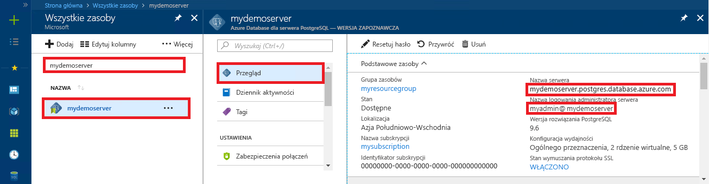

<a id="azure-database-for-postgresql-use-php-to-connect-and-query-data" class="xliff"></a>

# Usługa Azure Database for PostgreSQL: nawiązywanie połączeń z danymi i wykonywanie na nich zapytań za pomocą języka PHP
Ten przewodnik Szybki start przedstawia sposób nawiązywania połączeń z usługą Azure Database for PostgreSQL przy użyciu aplikacji języka [PHP](http://php.net/manual/intro-whatis.php). Pokazano w nim, jak używać instrukcji języka SQL w celu wysyłania zapytań o dane oraz wstawiania, aktualizowania i usuwania danych w bazie danych. W tym artykule założono, że wiesz już, jak programować za pomocą języka PHP, i dopiero zaczynasz pracę z usługą Azure Database for PostgreSQL.

<a id="prerequisites" class="xliff"></a>

## Wymagania wstępne
Ten przewodnik Szybki start jako punktu wyjścia używa zasobów utworzonych w jednym z tych przewodników:
- [Tworzenie bazy danych — portal](quickstart-create-server-database-portal.md)
- [Tworzenie bazy danych — interfejs wiersza polecenia platformy Azure](quickstart-create-server-database-azure-cli.md)

<a id="install-php" class="xliff"></a>

## Instalowanie języka PHP
Zainstaluj język PHP na własnym serwerze lub utwórz [aplikację internetową](https://docs.microsoft.com/en-us/azure/app-service-web/app-service-web-overview), która zawiera język PHP.

<a id="windows" class="xliff"></a>

### Windows
- Pobierz [bezpieczny, niestanowiący zagrożenia język PHP w wersji 7.1.4 (x64)](http://windows.php.net/download#php-7.1).
- Zainstaluj język PHP i zapoznaj się z [podręcznikiem języka PHP](http://php.net/manual/install.windows.php) w celu przeprowadzenia dalszej konfiguracji.
- Kod używa klasy **pgsql** (ext/php_pgsql.dll) uwzględnionej w instalacji języka PHP. 
- Włącz rozszerzenie **pgsql**, edytując plik konfiguracji php.ini, który zazwyczaj znajduje się w folderze `C:\Program Files\PHP\v7.1\php.ini`. Plik konfiguracji powinien zawierać wiersz z tekstem `extension=php_pgsql.so`. Jeśli nie jest wyświetlany, dodaj tekst i zapisz plik. Jeśli tekst jest wyświetlany, ale zawiera komentarz z prefiksem ze średnikiem, usuń komentarz z tekstu, usuwając średnik.

<a id="linux-ubuntu" class="xliff"></a>

### Linux (Ubuntu)
- Pobierz [bezpieczny, niestanowiący zagrożenia język PHP w wersji 7.1.4 (x64)](http://php.net/downloads.php). 
- Zainstaluj język PHP i zapoznaj się z [podręcznikiem języka PHP](http://php.net/manual/install.unix.php) w celu przeprowadzenia dalszej konfiguracji.
- Kod używa klasy **pgsql** (php_pgsql.so). Zainstaluj ją, uruchamiając element `sudo apt-get install php-pgsql`.
- Włącz rozszerzenie **pgsql**, edytując plik konfiguracji `/etc/php/7.0/mods-available/pgsql.ini`. Plik konfiguracji powinien zawierać wiersz z tekstem `extension=php_pgsql.so`. Jeśli nie jest wyświetlany, dodaj tekst i zapisz plik. Jeśli tekst jest wyświetlany, ale zawiera komentarz z prefiksem ze średnikiem, usuń komentarz z tekstu, usuwając średnik.

<a id="macos" class="xliff"></a>

### MacOS
- Pobierz [język PHP w wersji 7.1.4](http://php.net/downloads.php).
- Zainstaluj język PHP i zapoznaj się z [podręcznikiem języka PHP](http://php.net/manual/install.macosx.php) w celu przeprowadzenia dalszej konfiguracji.

<a id="get-connection-information" class="xliff"></a>

## Pobieranie informacji o połączeniu
Uzyskaj parametry połączenia potrzebne do nawiązania połączenia z usługą Azure Database for PostgreSQL. Potrzebna jest w pełni kwalifikowana nazwa serwera i poświadczenia logowania.

1. Zaloguj się do witryny [Azure Portal](https://portal.azure.com/).
2. W menu po lewej stronie w witrynie Azure Portal kliknij pozycję **Wszystkie zasoby** i wyszukaj utworzony serwer, taki jak **mypgserver-20170401**.
3. Kliknij nazwę serwera **mypgserver 20170401**.
4. Wybierz stronę serwera **Przegląd**. Zanotuj wartości **Nazwa serwera** i **Identyfikator logowania administratora serwera**.
 
5. Jeśli nie pamiętasz informacji logowania do serwera, przejdź do strony **Przegląd**, aby wyświetlić nazwę logowania administratora serwera oraz w razie konieczności zresetować hasło.

<a id="connect-and-create-a-table" class="xliff"></a>

## Łączenie i tworzenie tabeli
Użyj poniższego kodu w celu nawiązania połączenia i utworzenia tabeli za pomocą instrukcji **CREATE TABLE** języka SQL, a następnie instrukcji **INSERT INTO** języka SQL, aby dodać wiersze do tabeli.

Kod wywołuje metodę [pg_connect()](http://php.net/manual/en/function.pg-connect.php), aby nawiązać połączenie z usługą Azure for PostgreSQL. Następnie kod wywołuje metodę [pg_query()](http://php.net/manual/en/function.pg-query.php) kilka razy w celu uruchomienia wielu poleceń i metodę [pg_last_error()](http://php.net/manual/en/function.pg-last-error.php) w celu sprawdzenia szczegółów, jeśli za każdym razem występuje błąd. W kolejnym kroku kod wywołuje metodę [pg_close()](http://php.net/manual/en/function.pg-close.php) w celu zamknięcia połączenia.

Zastąp parametry `$host`, `$database`, `$user` i `$password` własnymi wartościami. 

```php
<?php
    // Initialize connection variables.
    $host = "mypgserver-20170401.postgres.database.azure.com";
    $database = "mypgsqldb";
    $user = "mylogin@mypgserver-20170401";
    $password = "<server_admin_password>";

    // Initialize connection object.
    $connection = pg_connect("host=$host dbname=$database user=$user password=$password") 
        or die("Failed to create connection to database: ". pg_last_error(). "<br/>");
    print "Successfully created connection to database.<br/>";

    // Drop previous table of same name if one exists.
    $query = "DROP TABLE IF EXISTS inventory;";
    pg_query($connection, $query) 
        or die("Encountered an error when executing given sql statement: ". pg_last_error(). "<br/>");
    print "Finished dropping table (if existed).<br/>";

    // Create table.
    $query = "CREATE TABLE inventory (id serial PRIMARY KEY, name VARCHAR(50), quantity INTEGER);";
    pg_query($connection, $query) 
        or die("Encountered an error when executing given sql statement: ". pg_last_error(). "<br/>");
    print "Finished creating table.<br/>";

    // Insert some data into table.
    $name = '\'banana\'';
    $quantity = 150;
    $query = "INSERT INTO inventory (name, quantity) VALUES ($1, $2);";
    pg_query($connection, $query) 
        or die("Encountered an error when executing given sql statement: ". pg_last_error(). "<br/>");

    $name = '\'orange\'';
    $quantity = 154;
    $query = "INSERT INTO inventory (name, quantity) VALUES ($name, $quantity);";
    pg_query($connection, $query) 
        or die("Encountered an error when executing given sql statement: ". pg_last_error(). "<br/>");

    $name = '\'apple\'';
    $quantity = 100;
    $query = "INSERT INTO inventory (name, quantity) VALUES ($name, $quantity);";
    pg_query($connection, $query) 
        or die("Encountered an error when executing given sql statement: ". pg_last_error()). "<br/>";

    print "Inserted 3 rows of data.<br/>";

    // Closing connection
    pg_close($connection);
?>
```

<a id="read-data" class="xliff"></a>

## Odczyt danych
Użyj poniższego kodu, aby nawiązać połączenie i odczytać dane za pomocą instrukcji **SELECT** języka SQL. 

 Kod wywołuje metodę [pg_connect()](http://php.net/manual/en/function.pg-connect.php), aby nawiązać połączenie z usługą Azure for PostgreSQL. Następnie kod wywołuje metodę [pg_query()](http://php.net/manual/en/function.pg-query.php) w celu uruchomienia polecenia SELECT, zachowując wyniki w zestawie wyników, i metodę [pg_last_error()](http://php.net/manual/en/function.pg-last-error.php) w celu sprawdzenia błędów, jeśli wystąpił błąd.  Aby odczytać zestaw wyników, metoda [pg_fetch_row()](http://php.net/manual/en/function.pg-fetch-row.php) jest wywoływana w postaci pętli, jeden raz dla każdego wiersza, a dane są pobierane w tablicy `$row`, z jedną wartością danych na kolumnę w każdej pozycji tablicy.  Aby zwolnić zestaw wyników, należy wywołać metodę [pg_free_result()](http://php.net/manual/en/function.pg-free-result.php). W kolejnym kroku kod wywołuje metodę [pg_close()](http://php.net/manual/en/function.pg-close.php) w celu zamknięcia połączenia.

Zastąp parametry `$host`, `$database`, `$user` i `$password` własnymi wartościami. 

```php
<?php
    // Initialize connection variables.
    $host = "mypgserver-20170401.postgres.database.azure.com";
    $database = "mypgsqldb";
    $user = "mylogin@mypgserver-20170401";
    $password = "<server_admin_password>";
    
    // Initialize connection object.
    $connection = pg_connect("host=$host dbname=$database user=$user password=$password")
                or die("Failed to create connection to database: ". pg_last_error(). "<br/>");

    print "Successfully created connection to database. <br/>";

    // Perform some SQL queries over the connection.
    $query = "SELECT * from inventory";
    $result_set = pg_query($connection, $query) 
        or die("Encountered an error when executing given sql statement: ". pg_last_error(). "<br/>");
    while ($row = pg_fetch_row($result_set))
    {
        print "Data row = ($row[0], $row[1], $row[2]). <br/>";
    }

    // Free result_set
    pg_free_result($result_set);

    // Closing connection
    pg_close($connection);
?>
```

<a id="update-data" class="xliff"></a>

## Aktualizowanie danych
Użyj poniższego kodu, aby nawiązać połączenie i zaktualizować dane za pomocą instrukcji **UPDATE** języka SQL.

Kod wywołuje metodę [pg_connect()](http://php.net/manual/en/function.pg-connect.php), aby nawiązać połączenie z usługą Azure for PostgreSQL. Następnie kod wywołuje metodę [pg_query()](http://php.net/manual/en/function.pg-query.php) w celu uruchomienia polecenia i metodę [pg_last_error()](http://php.net/manual/en/function.pg-last-error.php) w celu sprawdzenia szczegółów, jeśli wystąpił błąd. W kolejnym kroku kod wywołuje metodę [pg_close()](http://php.net/manual/en/function.pg-close.php) w celu zamknięcia połączenia.

Zastąp parametry `$host`, `$database`, `$user` i `$password` własnymi wartościami. 

```php
<?php
    // Initialize connection variables.
    $host = "mypgserver-20170401.postgres.database.azure.com";
    $database = "mypgsqldb";
    $user = "mylogin@mypgserver-20170401";
    $password = "<server_admin_password>";

    // Initialize connection object.
    $connection = pg_connect("host=$host dbname=$database user=$user password=$password")
                or die("Failed to create connection to database: ". pg_last_error(). ".<br/>");

    print "Successfully created connection to database. <br/>";

    // Modify some data in table.
    $new_quantity = 200;
    $name = '\'banana\'';
    $query = "UPDATE inventory SET quantity = $new_quantity WHERE name = $name;";
    pg_query($connection, $query) 
        or die("Encountered an error when executing given sql statement: ". pg_last_error(). ".<br/>");
    print "Updated 1 row of data. </br>";

    // Closing connection
    pg_close($connection);
?>
```


<a id="delete-data" class="xliff"></a>

## Usuwanie danych
Użyj poniższego kodu, aby nawiązać połączenie i odczytać dane za pomocą instrukcji **DELETE** języka SQL. 

 Kod wywołuje metodę [pg_connect()](http://php.net/manual/en/function.pg-connect.php), aby nawiązać połączenie z usługą Azure for PostgreSQL. Następnie kod wywołuje metodę [pg_query()](http://php.net/manual/en/function.pg-query.php) w celu uruchomienia polecenia i metodę [pg_last_error()](http://php.net/manual/en/function.pg-last-error.php) w celu sprawdzenia szczegółów, jeśli wystąpił błąd. W kolejnym kroku kod wywołuje metodę [pg_close()](http://php.net/manual/en/function.pg-close.php) w celu zamknięcia połączenia.

Zastąp parametry `$host`, `$database`, `$user` i `$password` własnymi wartościami. 

```php
<?php
    // Initialize connection variables.
    $host = "mypgserver-20170401.postgres.database.azure.com";
    $database = "mypgsqldb";
    $user = "mylogin@mypgserver-20170401";
    $password = "<server_admin_password>";

    // Initialize connection object.
    $connection = pg_connect("host=$host dbname=$database user=$user password=$password")
            or die("Failed to create connection to database: ". pg_last_error(). ". </br>");

    print "Successfully created connection to database. <br/>";

    // Delete some data from table.
    $name = '\'orange\'';
    $query = "DELETE FROM inventory WHERE name = $name;";
    pg_query($connection, $query) 
        or die("Encountered an error when executing given sql statement: ". pg_last_error(). ". <br/>");
    print "Deleted 1 row of data. <br/>";

    // Closing connection
    pg_close($connection);
?>
```

<a id="next-steps" class="xliff"></a>

## Następne kroki
> [!div class="nextstepaction"]
> [Migrowanie bazy danych przy użyciu funkcji eksportowania i importowania](./howto-migrate-using-export-and-import.md)

