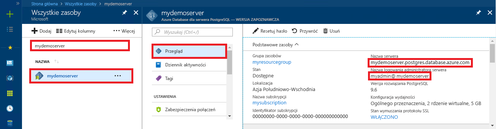

# <a name="azure-database-for-postgresql-use-python-to-connect-and-query-data"></a>Usługa Azure Database for PostgreSQL: nawiązywanie połączeń z danymi i wykonywanie na nich zapytań za pomocą języka Python
Ten przewodnik Szybki start przedstawia sposób nawiązywania połączeń z usługą Azure Database for PostgreSQL za pomocą języka [Python](https://python.org). Demonstruje on także, jak używać instrukcji języka SQL na potrzeby wysyłania zapytań o dane oraz wstawiania, aktualizowania i usuwania danych w bazie danych na platformach macOS, Ubuntu Linux i Windows. W krokach w tym artykule założono, że wiesz już, jak programować za pomocą języka Python, i dopiero zaczynasz pracę z usługą Azure Database for PostgreSQL.

## <a name="prerequisites"></a>Wymagania wstępne
Ten przewodnik Szybki start jako punktu wyjścia używa zasobów utworzonych w jednym z tych przewodników:
- [Tworzenie bazy danych — portal](quickstart-create-server-database-portal.md)
- [Tworzenie bazy danych — interfejs wiersza polecenia](quickstart-create-server-database-azure-cli.md)

Wymagane są również:
- Zainstalowany język [python](https://www.python.org/downloads/)
- Zainstalowany pakiet [pip](https://pip.pypa.io/en/stable/installing/) (pakiet pip jest już zainstalowany, jeśli używasz plików binarnych języka Python 2 w wersji 2.7.9 lub nowszej albo Python 3 w wersji 3.4 lub nowszej pobranych z witryny [python.org](https://python.org)).

## <a name="install-the-python-connection-libraries-for-postgresql"></a>Instalowanie bibliotek połączeń języka Python dla PostgreSQL
Zainstaluj pakiet [psycopg2](http://initd.org/psycopg/docs/install.html), który umożliwia nawiązywanie połączeń z bazą danych i wykonywanie zapytań względem niej. Pakiet psycopg2 jest [dostępny w witrynie PyPI](https://pypi.python.org/pypi/psycopg2/) w postaci pakietów [wheel](http://pythonwheels.com/) dla najbardziej popularnych platform (Linux, OSX, Windows). Użyj polecenia pip install, aby pobrać wersję binarną modułu razem ze wszystkimi zależnościami.

1. Na komputerze uruchom interfejs wiersza polecenia:
    - W systemie Linux uruchom powłokę Bash.
    - W systemie macOS uruchom program Terminal.
    - W systemie Windows uruchom wiersz polecenia z menu Start.
2. Upewnij się, że używasz najnowszej wersji narzędzia pip, uruchamiając na przykład polecenie:
    ```cmd
    pip install -U pip
    ```

3. Uruchom następujące polecenie, aby zainstalować pakiet psycopg2:
    ```cmd
    pip install psycopg2
    ```

## <a name="get-connection-information"></a>Pobieranie informacji o połączeniu
Uzyskaj parametry połączenia potrzebne do nawiązania połączenia z usługą Azure Database for PostgreSQL. Potrzebna jest w pełni kwalifikowana nazwa serwera i poświadczenia logowania.

1. Zaloguj się do witryny [Azure Portal](https://portal.azure.com/).
2. W menu po lewej stronie w witrynie Azure Portal kliknij pozycję **Wszystkie zasoby** i wyszukaj utworzony serwer, taki jak **mydemoserver**.
3. Kliknij nazwę serwera.
4. Po przejściu do panelu **Przegląd** serwera zanotuj **nazwę serwera** i **nazwę logowania administratora serwera**. Jeśli zapomnisz hasła, możesz również je zresetować z poziomu tego panelu.
 

## <a name="how-to-run-python-code"></a>Jak uruchomić kod języka Python
Ten artykuł zawiera łącznie cztery przykłady kodu, z których każdy wykonuje konkretną funkcję. Następujące instrukcje określają, jak należy utworzyć plik tekstowy, wstawić blok kodu, a następnie zapisać plik, aby można było uruchomić go później. Pamiętaj, aby utworzyć cztery oddzielne pliki — po jednym dla każdego bloku kodu.

- W swoim ulubionym edytorze tekstów utwórz nowy plik.
- Skopiuj i wklej jeden z przykładów kodu w poniższych sekcjach do pliku tekstowego. Zastąp parametry **host**, **dbname**, **user** i **password** wartościami, które zostały określone podczas tworzenia serwera i bazy danych.
- Zapisz plik z rozszerzeniem py (na przykład postgres.py) w folderze projektu. Jeśli używasz systemu Windows, upewnij się, że wybrano kodowanie UTF-8 podczas zapisywania pliku. 
- Uruchom wiersz polecenia, program Terminal lub powłokę Bash, a następnie zmień katalog na folder projektu, na przykład `cd postgres`.
-  Aby uruchomić kod, wpisz polecenie Python, a po nim nazwę pliku, na przykład `Python postgres.py`.

> [!NOTE]
> Od wersji 3 języka Python może zostać wyświetlony błąd `SyntaxError: Missing parentheses in call to 'print'` podczas uruchamiania poniższych bloków kodu. Jeśli tak się stanie, zastąp każde wywołanie polecenia `print "string"` wywołaniem funkcji, używając nawiasów, na przykład `print("string")`.

## <a name="connect-create-table-and-insert-data"></a>Nawiązywanie połączenia, tworzenie tabeli i wstawianie danych
Użyj poniższego kodu, aby nawiązać połączenie i załadować dane przy użyciu funkcji [psycopg2.connect](http://initd.org/psycopg/docs/connection.html) z instrukcją **INSERT** języka SQL. Funkcja [cursor.execute](http://initd.org/psycopg/docs/cursor.html#execute) jest używana do wykonywania zapytania SQL względem bazy danych PostgreSQL. Zastąp parametry hosta, nazwy bazy danych, użytkownika i hasła wartościami, które zostały określone podczas tworzenia serwera i bazy danych.

```Python
import psycopg2

# Update connection string information obtained from the portal
host = "mydemoserver.postgres.database.azure.com"
user = "mylogin@mydemoserver"
dbname = "mypgsqldb"
password = "<server_admin_password>"
sslmode = "require"

# Construct connection string
conn_string = "host={0} user={1} dbname={2} password={3} sslmode={4}".format(host, user, dbname, password, sslmode)
conn = psycopg2.connect(conn_string) 
print "Connection established"

cursor = conn.cursor()

# Drop previous table of same name if one exists
cursor.execute("DROP TABLE IF EXISTS inventory;")
print "Finished dropping table (if existed)"

# Create table
cursor.execute("CREATE TABLE inventory (id serial PRIMARY KEY, name VARCHAR(50), quantity INTEGER);")
print "Finished creating table"

# Insert some data into table
cursor.execute("INSERT INTO inventory (name, quantity) VALUES (%s, %s);", ("banana", 150))
cursor.execute("INSERT INTO inventory (name, quantity) VALUES (%s, %s);", ("orange", 154))
cursor.execute("INSERT INTO inventory (name, quantity) VALUES (%s, %s);", ("apple", 100))
print "Inserted 3 rows of data"

# Cleanup
conn.commit()
cursor.close()
conn.close()
```

Po pomyślnym uruchomieniu kodu dane wyjściowe wyglądają następująco:


## <a name="read-data"></a>Odczyt danych
Użyj poniższego kodu, aby odczytać wstawione dane przy użyciu funkcji [cursor.execute](http://initd.org/psycopg/docs/cursor.html#execute) z instrukcją **SELECT** języka SQL. Ta funkcja akceptuje zapytanie i zwraca zestaw wyników, względem którego można przeprowadzić iterację przy użyciu funkcji [cursor.fetchall()](http://initd.org/psycopg/docs/cursor.html#cursor.fetchall). Zastąp parametry hosta, nazwy bazy danych, użytkownika i hasła wartościami, które zostały określone podczas tworzenia serwera i bazy danych.

```Python
import psycopg2

# Update connection string information obtained from the portal
host = "mydemoserver.postgres.database.azure.com"
user = "mylogin@mydemoserver"
dbname = "mypgsqldb"
password = "<server_admin_password>"
sslmode = "require"

# Construct connection string
conn_string = "host={0} user={1} dbname={2} password={3} sslmode={4}".format(host, user, dbname, password, sslmode)
conn = psycopg2.connect(conn_string) 
print "Connection established"

cursor = conn.cursor()

# Fetch all rows from table
cursor.execute("SELECT * FROM inventory;")
rows = cursor.fetchall()

# Print all rows
for row in rows:
    print "Data row = (%s, %s, %s)" %(str(row[0]), str(row[1]), str(row[2]))

# Cleanup
conn.commit()
cursor.close()
conn.close()
```

## <a name="update-data"></a>Aktualizowanie danych
Użyj poniższego kodu, aby zaktualizować poprzednio wstawiony wiersz spisu przy użyciu funkcji [cursor.execute](http://initd.org/psycopg/docs/cursor.html#execute) z instrukcją **UPDATE** języka SQL. Zastąp parametry hosta, nazwy bazy danych, użytkownika i hasła wartościami, które zostały określone podczas tworzenia serwera i bazy danych.

```Python
import psycopg2

# Update connection string information obtained from the portal
host = "mydemoserver.postgres.database.azure.com"
user = "mylogin@mydemoserver"
dbname = "mypgsqldb"
password = "<server_admin_password>"
sslmode = "require"

# Construct connection string
conn_string = "host={0} user={1} dbname={2} password={3} sslmode={4}".format(host, user, dbname, password, sslmode)
conn = psycopg2.connect(conn_string) 
print "Connection established"

cursor = conn.cursor()

# Update a data row in the table
cursor.execute("UPDATE inventory SET quantity = %s WHERE name = %s;", (200, "banana"))
print "Updated 1 row of data"

# Cleanup
conn.commit()
cursor.close()
conn.close()
```

## <a name="delete-data"></a>Usuwanie danych
Użyj poniższego kodu, aby usunąć poprzednio wstawiony element spisu przy użyciu funkcji [cursor.execute](http://initd.org/psycopg/docs/cursor.html#execute) z instrukcją **DELETE** języka SQL. Zastąp parametry hosta, nazwy bazy danych, użytkownika i hasła wartościami, które zostały określone podczas tworzenia serwera i bazy danych.

```Python
import psycopg2

# Update connection string information obtained from the portal
host = "mydemoserver.postgres.database.azure.com"
user = "mylogin@mydemoserver"
dbname = "mypgsqldb"
password = "<server_admin_password>"
sslmode = "require"

# Construct connection string
conn_string = "host={0} user={1} dbname={2} password={3} sslmode={4}".format(host, user, dbname, password, sslmode)
conn = psycopg2.connect(conn_string) 
print "Connection established"

cursor = conn.cursor()

# Delete data row from table
cursor.execute("DELETE FROM inventory WHERE name = %s;", ("orange",))
print "Deleted 1 row of data"

# Cleanup
conn.commit()
cursor.close()
conn.close()
```

## <a name="next-steps"></a>Następne kroki
> [!div class="nextstepaction"]
> [Migrowanie bazy danych przy użyciu funkcji eksportowania i importowania](./howto-migrate-using-export-and-import.md)
