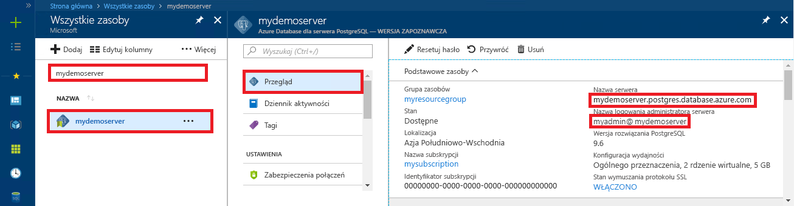

# <a name="azure-database-for-postgresql-use-ruby-to-connect-and-query-data"></a>Usługa Azure Database for PostgreSQL: nawiązywanie połączeń z danymi i wykonywanie na nich zapytań za pomocą języka Ruby
Ten przewodnik Szybki start przedstawia sposób nawiązywania połączeń z usługą Azure Database for PostgreSQL przy użyciu aplikacji języka [Ruby](https://www.ruby-lang.org). Pokazano w nim, jak używać instrukcji języka SQL w celu wysyłania zapytań o dane oraz wstawiania, aktualizowania i usuwania danych w bazie danych. W krokach w tym artykule założono, że wiesz już, jak programować za pomocą języka Ruby, i dopiero zaczynasz pracę z usługą Azure Database for PostgreSQL.

## <a name="prerequisites"></a>Wymagania wstępne
Ten przewodnik Szybki start jako punktu wyjścia używa zasobów utworzonych w jednym z tych przewodników:
- [Tworzenie bazy danych — portal](quickstart-create-server-database-portal.md)
- [Tworzenie bazy danych — interfejs wiersza polecenia platformy Azure](quickstart-create-server-database-azure-cli.md)

## <a name="install-ruby"></a>Instalowanie języka Ruby
Zainstaluj język Ruby na swojej maszynie. 

### <a name="windows"></a>Windows
- Pobierz i zainstaluj najnowszą wersję języka [Ruby](http://rubyinstaller.org/downloads/).
- Na ekranie kończenia pracy z instalatorem MSI zaznacz pole „Run 'ridk install' to install MSYS2 and development toolchain” (Uruchom „ridk install” w celu zainstalowania rozwiązania MSYS2 i łańcucha narzędzi do programowania). Następnie kliknij pozycję **Zakończ**, aby uruchomić kolejnego instalatora.
- Zostanie uruchomiony instalator RubyInstaller2 dla systemu Windows. Wpisz wartość 2, aby zainstalować aktualizację repozytorium MSYS2. Po zakończeniu i powrocie do monitu dotyczącego instalacji zamknij okno wiersza polecenia.
- Uruchom nowy wiersz polecenia (cmd) z menu Start.
- Przetestuj instalację języka Ruby `ruby -v`, aby sprawdzić zainstalowaną wersję.
- Przetestuj instalację rozwiązania Gem `gem -v`, aby sprawdzić zainstalowaną wersję.
- Skompiluj moduł PostgreSQL dla języka Ruby przy użyciu rozwiązania Gem, uruchamiając polecenie `gem install pg`.

### <a name="macos"></a>MacOS
- Zainstaluj język Ruby przy użyciu programu Homebrew, uruchamiając polecenie `brew install ruby`. Informacje na temat kolejnych opcji instalacji można znaleźć w [dokumentacji instalacji](https://www.ruby-lang.org/en/documentation/installation/#homebrew) języka Ruby
- Przetestuj instalację języka Ruby `ruby -v`, aby sprawdzić zainstalowaną wersję.
- Przetestuj instalację rozwiązania Gem `gem -v`, aby sprawdzić zainstalowaną wersję.
- Skompiluj moduł PostgreSQL dla języka Ruby przy użyciu rozwiązania Gem, uruchamiając polecenie `gem install pg`.

### <a name="linux-ubuntu"></a>Linux (Ubuntu)
- Zainstaluj język Ruby, uruchamiając polecenie `sudo apt-get install ruby-full`. Informacje na temat kolejnych opcji instalacji można znaleźć w [dokumentacji instalacji](https://www.ruby-lang.org/en/documentation/installation/) języka Ruby.
- Przetestuj instalację języka Ruby `ruby -v`, aby sprawdzić zainstalowaną wersję.
- Zainstaluj najnowsze aktualizacje rozwiązania Gem, uruchamiając polecenie `sudo gem update --system`.
- Przetestuj instalację rozwiązania Gem `gem -v`, aby sprawdzić zainstalowaną wersję.
- Zainstaluj narzędzia gcc, make i inne narzędzia do kompilacji, uruchamiając polecenie `sudo apt-get install build-essential`.
- Zainstaluj biblioteki PostgreSQL, uruchamiając polecenie `sudo apt-get install libpq-dev`.
- Skompiluj moduł pg języka Ruby przy użyciu rozwiązania Gem, uruchamiając polecenie `sudo gem install pg`.

## <a name="run-ruby-code"></a>Uruchamianie kodu w języku Ruby 
- Zapisz kod w pliku tekstowym z rozszerzeniem RB, a następnie zapisz plik w folderze projektu, takim jak `C:\rubypostgres\read.rb` lub `/home/username/rubypostgres/read.rb`.
- Aby uruchomić kod, uruchom wiersz polecenia lub powłokę bash. Zmień katalog na folder projektu `cd rubypostgres`, a następnie wpisz polecenie `ruby read.rb` w celu uruchomienia aplikacji.

## <a name="get-connection-information"></a>Pobieranie informacji o połączeniu
Uzyskaj parametry połączenia potrzebne do nawiązania połączenia z usługą Azure Database for PostgreSQL. Potrzebna jest w pełni kwalifikowana nazwa serwera i poświadczenia logowania.

1. Zaloguj się do witryny [Azure Portal](https://portal.azure.com/).
2. W menu po lewej stronie w witrynie Azure Portal kliknij pozycję **Wszystkie zasoby** i wyszukaj utworzony serwer, taki jak **mydemoserver**.
3. Kliknij nazwę serwera.
4. Po przejściu do panelu **Przegląd** serwera zanotuj **nazwę serwera** i **nazwę logowania administratora serwera**. Jeśli zapomnisz hasła, możesz również je zresetować z poziomu tego panelu.
 

## <a name="connect-and-create-a-table"></a>Łączenie i tworzenie tabeli
Użyj poniższego kodu w celu nawiązania połączenia i utworzenia tabeli za pomocą instrukcji **CREATE TABLE** języka SQL, a następnie instrukcji **INSERT INTO** języka SQL, aby dodać wiersze do tabeli.

Kod używa obiektu [PG::Connection](http://www.rubydoc.info/gems/pg/PG/Connection) z konstruktorem [new()](http://www.rubydoc.info/gems/pg/PG%2FConnection:initialize) w celu nawiązania połączenia z usługą Azure Database for PostgreSQL. Następnie kod wywołuje metodę [exec()](http://www.rubydoc.info/gems/pg/PG/Connection#exec-instance_method) w celu uruchomienia poleceń DROP, CREATE TABLE i INSERT INTO. Kod wyszukuje błędy za pomocą klasy [PG::Error](http://www.rubydoc.info/gems/pg/PG/Error). W kolejnym kroku kod wywołuje metodę [close()](http://www.rubydoc.info/gems/pg/PG/Connection#lo_close-instance_method) w celu zamknięcia połączenia przed zakończeniem.

Zastąp ciągi `host`, `database`, `user` i `password` własnymi wartościami. 
```ruby
require 'pg'

begin
    # Initialize connection variables.
    host = String('mydemoserver.postgres.database.azure.com')
    database = String('postgres')
    user = String('mylogin@mydemoserver')
    password = String('<server_admin_password>')

    # Initialize connection object.
    connection = PG::Connection.new(:host => host, :user => user, :dbname => database, :port => '5432', :password => password)
    puts 'Successfully created connection to database'

    # Drop previous table of same name if one exists
    connection.exec('DROP TABLE IF EXISTS inventory;')
    puts 'Finished dropping table (if existed).'

    # Drop previous table of same name if one exists.
    connection.exec('CREATE TABLE inventory (id serial PRIMARY KEY, name VARCHAR(50), quantity INTEGER);')
    puts 'Finished creating table.'

    # Insert some data into table.
    connection.exec("INSERT INTO inventory VALUES(1, 'banana', 150)")
    connection.exec("INSERT INTO inventory VALUES(2, 'orange', 154)")
    connection.exec("INSERT INTO inventory VALUES(3, 'apple', 100)")
    puts 'Inserted 3 rows of data.'

rescue PG::Error => e
    puts e.message 
    
ensure
    connection.close if connection
end
```

## <a name="read-data"></a>Odczyt danych
Użyj poniższego kodu, aby nawiązać połączenie i odczytać dane za pomocą instrukcji **SELECT** języka SQL. 

Kod używa obiektu [PG::Connection](http://www.rubydoc.info/gems/pg/PG/Connection) z konstruktorem [new()](http://www.rubydoc.info/gems/pg/PG%2FConnection:initialize) w celu nawiązania połączenia z usługą Azure Database for PostgreSQL. Następnie kod wywołuje metodę [exec()](http://www.rubydoc.info/gems/pg/PG/Connection#exec-instance_method) w celu uruchomienia polecenia SELECT z zachowaniem wyników w zestawie wyników. Kolekcja zestawów wyników jest iterowana przy użyciu pętli `resultSet.each do` z zachowaniem bieżących wartości wierszy w zmiennej `row`. Kod wyszukuje błędy za pomocą klasy [PG::Error](http://www.rubydoc.info/gems/pg/PG/Error). W kolejnym kroku kod wywołuje metodę [close()](http://www.rubydoc.info/gems/pg/PG/Connection#lo_close-instance_method) w celu zamknięcia połączenia przed zakończeniem.

Zastąp ciągi `host`, `database`, `user` i `password` własnymi wartościami. 

```ruby
require 'pg'

begin
    # Initialize connection variables.
    host = String('mydemoserver.postgres.database.azure.com')
    database = String('postgres')
    user = String('mylogin@mydemoserver')
    password = String('<server_admin_password>')

    # Initialize connection object.
    connection = PG::Connection.new(:host => host, :user => user, :database => dbname, :port => '5432', :password => password)
    puts 'Successfully created connection to database.'

    resultSet = connection.exec('SELECT * from inventory;')
    resultSet.each do |row|
        puts 'Data row = (%s, %s, %s)' % [row['id'], row['name'], row['quantity']]
    end

rescue PG::Error => e
    puts e.message 
    
ensure
    connection.close if connection
end
```

## <a name="update-data"></a>Aktualizowanie danych
Użyj poniższego kodu, aby nawiązać połączenie i zaktualizować dane za pomocą instrukcji **UPDATE** języka SQL.

Kod używa obiektu [PG::Connection](http://www.rubydoc.info/gems/pg/PG/Connection) z konstruktorem [new()](http://www.rubydoc.info/gems/pg/PG%2FConnection:initialize) w celu nawiązania połączenia z usługą Azure Database for PostgreSQL. Następnie kod wywołuje metodę [exec()](http://www.rubydoc.info/gems/pg/PG/Connection#exec-instance_method) w celu uruchomienia polecenia UPDATE. Kod wyszukuje błędy za pomocą klasy [PG::Error](http://www.rubydoc.info/gems/pg/PG/Error). W kolejnym kroku kod wywołuje metodę [close()](http://www.rubydoc.info/gems/pg/PG/Connection#lo_close-instance_method) w celu zamknięcia połączenia przed zakończeniem.

Zastąp ciągi `host`, `database`, `user` i `password` własnymi wartościami. 

```ruby
require 'pg'

begin
    # Initialize connection variables.
    host = String('mydemoserver.postgres.database.azure.com')
    database = String('postgres')
    user = String('mylogin@mydemoserver')
    password = String('<server_admin_password>')

    # Initialize connection object.
    connection = PG::Connection.new(:host => host, :user => user, :dbname => database, :port => '5432', :password => password)
    puts 'Successfully created connection to database.'

    # Modify some data in table.
    connection.exec('UPDATE inventory SET quantity = %d WHERE name = %s;' % [200, '\'banana\''])
    puts 'Updated 1 row of data.'

rescue PG::Error => e
    puts e.message 
    
ensure
    connection.close if connection
end
```


## <a name="delete-data"></a>Usuwanie danych
Użyj poniższego kodu, aby nawiązać połączenie i odczytać dane za pomocą instrukcji **DELETE** języka SQL. 

Kod używa obiektu [PG::Connection](http://www.rubydoc.info/gems/pg/PG/Connection) z konstruktorem [new()](http://www.rubydoc.info/gems/pg/PG%2FConnection:initialize) w celu nawiązania połączenia z usługą Azure Database for PostgreSQL. Następnie kod wywołuje metodę [exec()](http://www.rubydoc.info/gems/pg/PG/Connection#exec-instance_method) w celu uruchomienia polecenia UPDATE. Kod wyszukuje błędy za pomocą klasy [PG::Error](http://www.rubydoc.info/gems/pg/PG/Error). W kolejnym kroku kod wywołuje metodę [close()](http://www.rubydoc.info/gems/pg/PG/Connection#lo_close-instance_method) w celu zamknięcia połączenia przed zakończeniem.

Zastąp ciągi `host`, `database`, `user` i `password` własnymi wartościami. 

```ruby
require 'pg'

begin
    # Initialize connection variables.
    host = String('mydemoserver.postgres.database.azure.com')
    database = String('postgres')
    user = String('mylogin@mydemoserver')
    password = String('<server_admin_password>')

    # Initialize connection object.
    connection = PG::Connection.new(:host => host, :user => user, :dbname => database, :port => '5432', :password => password)
    puts 'Successfully created connection to database.'

    # Modify some data in table.
    connection.exec('DELETE FROM inventory WHERE name = %s;' % ['\'orange\''])
    puts 'Deleted 1 row of data.'

rescue PG::Error => e
    puts e.message 
    
ensure
    connection.close if connection
end
```

## <a name="next-steps"></a>Następne kroki
> [!div class="nextstepaction"]
> [Migrowanie bazy danych przy użyciu funkcji eksportowania i importowania](./howto-migrate-using-export-and-import.md)
