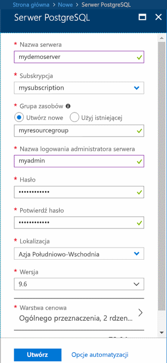

# <a name="quickstart-create-an-azure-database-for-postgresql-server-in-the-azure-portal"></a>Szybki start: tworzenie serwera usługi Azure Database for PostgreSQL w witrynie Azure Portal

Azure Database for PostgreSQL to usługa zarządzana, która służy do uruchamiania i skalowania w chmurze baz danych PostgreSQL o wysokiej dostępności, a także zarządzania nimi. W tym przewodniku Szybki start przedstawiono, jak utworzyć serwer usługi Azure Database for PostgreSQL w ciągu okołu pięciu minut za pomocą witryny Azure Portal.

Jeśli nie masz subskrypcji platformy Azure, przed rozpoczęciem utwórz [bezpłatne konto platformy Azure](https://azure.microsoft.com/free/).

## <a name="sign-in-to-the-azure-portal"></a>Logowanie się do witryny Azure Portal
Otwórz przeglądarkę internetową i przejdź do [portalu](https://portal.azure.com/). Wprowadź swoje poświadczenia, aby zalogować się do portalu. Widok domyślny to pulpit nawigacyjny usług.

## <a name="create-an-azure-database-for-postgresql-server"></a>Tworzenie serwera usługi Azure Database for PostgreSQL

Serwer usługi Azure Database for PostgreSQL jest tworzony ze skonfigurowanym zestawem [zasobów obliczeniowych i przestrzeni dyskowej](./concepts-pricing-tiers.md). Serwer jest tworzony w ramach [grupy zasobów Azure](../azure-resource-manager/resource-group-overview.md).

Aby utworzyć serwer usługi Azure Database for PostgreSQL, wykonaj następujące kroki:
1. Wybierz przycisk **Utwórz zasób** (+) w lewym górnym rogu portalu.

2. Wybierz pozycję **Bazy danych** > **Azure Database for PostgreSQL**.

    

3. Wypełnij formularz szczegółów nowego serwera, używając następujących informacji:

    

    Ustawienie|Sugerowana wartość|Opis
    ---|---|---
    Nazwa serwera |*mydemoserver*|Unikatowa nazwę, która identyfikuje serwer usługi Azure Database for PostgreSQL. Nazwa domeny *postgres.database.azure.com* jest dołączana do podawanej nazwy serwera. Serwer może zawierać tylko małe litery, cyfry i znaki łącznika (-). Musi zawierać od 3 do 63 znaków.
    Subskrypcja|Nazwa subskrypcji użytkownika|Subskrypcja platformy Azure, która ma być używana dla serwera. Jeśli masz wiele subskrypcji, wybierz tę, w ramach której są naliczane opłaty za ten zasób.
    Grupa zasobów|*myresourcegroup*| Nowa nazwa grupy zasobów lub istniejąca nazwa z subskrypcji.
    Wybierz źródło | *Puste* | Wybierz opcję *Puste*, aby utworzyć nowy serwer od początku. (Opcję *Kopia zapasowa* należy wybrać w przypadku tworzenia serwera z geograficznej kopii zapasowej istniejącego serwera usługi Azure Database for PostgreSQL).
    Identyfikator logowania administratora serwera |*myadmin*| Własne konto logowania do użycia podczas łączenia z serwerem. Nazwą logowania administratora nie może być **azure_superuser**, **azure_pg_admin**, **admin**, **administrator**, **root**, **guest** ani **public**. Nie może ona zaczynać się od **pg_**.
    Hasło |Twoje hasło| Nowe hasło do konta administratora serwera. Musi zawierać od 8 do 128 znaków. Hasło musi zawierać znaki z trzech z następujących kategorii: wielkie litery angielskie, małe litery angielskie, cyfry (od 0 do 9) i znaki inne niż alfanumeryczne (!, $, #, % itp.).
    Lokalizacja|Region najbliżej Twoich użytkowników| Lokalizacja znajdująca się najbliżej użytkowników.
    Wersja|Najnowsza wersja| Najnowsza wersja usługi PostgreSQL, chyba że masz inne określone wymagania.
    Warstwa cenowa | **Ogólnego przeznaczenia**, **generacja 4**, **2 rdzenie wirtualne**, **5 GB**, **7 dni**, **Geograficznie nadmiarowa** | Konfiguracje obliczania, magazynu i kopii zapasowej dla nowego serwera. Wybierz **warstwę cenową**. Następnie wybierz kartę **Ogólnego przeznaczenia**. *Generacja 4*, *2 rdzenie wirtualne*, *5 GB* oraz *7 dni* to wartości domyślne opcji **Generowanie obliczeń**, **Rdzeń wirtualny**, **Magazyn** oraz **Okres przechowywania kopii zapasowej**. Te suwaki możesz zostawić bez zmian. Aby włączyć kopie zapasowe serwera w magazynie geograficznie nadmiarowym, wybierz opcję **Geograficznie nadmiarowy** w pozycji **Opcje nadmiarowości kopii zapasowej**. Aby zapisać tę wybraną warstwę cenową, wybierz przycisk **OK**. Następny zrzut ekranu przedstawia te wybory.

    > [!IMPORTANT]
    > Nazwa logowania i hasło administratora serwera określone w tym miejscu będą wymagane do logowania do serwera i jego baz danych w późniejszej części tego przewodnika Szybki start. Zapamiętaj lub zapisz te informacje do wykorzystania w przyszłości.

    

4. Wybierz pozycję **Utwórz**, aby aprowizować serwer. Ta operacja może potrwać kilka minut.

5. Na pasku narzędzi wybierz ikonę **Powiadomienia** (dzwonek), aby monitorować proces wdrażania. Po zakończeniu wdrażania możesz wybrać opcję **Przypnij do pulpitu nawigacyjnego**, która tworzy kafelek dla tego serwera na pulpicie nawigacyjnym witryny Azure Portal jako skrót do strony **Przegląd** serwera. Wybranie opcji **Przejdź do zasobu** spowoduje otworzenie strony **Przegląd** serwera.

    
   
  Domyślnie baza danych **postgres** zostanie utworzona na Twoim serwerze. Baza danych [postgres](https://www.postgresql.org/docs/9.6/static/app-initdb.html) to domyślna baza danych, która jest przeznaczona do użycia dla użytkowników oraz na potrzeby narzędzi i aplikacji innych firm. 

## <a name="configure-a-server-level-firewall-rule"></a>Konfigurowanie reguły zapory na poziomie serwera

Usługa Azure Database for PostgreSQL tworzy zaporę na poziomie serwera. Uniemożliwia ona zewnętrznym aplikacjom i narzędziom łączenie się z serwerem i wszelkimi bazami danych na tym serwerze, chyba że utworzysz regułę otwierającą zaporę dla konkretnych adresów IP. 

1. Po zakończeniu wdrażania odszukaj serwer. W razie potrzeby wyszukaj go. Na przykład z menu po lewej stronie wybierz pozycję **Wszystkie zasoby**. Wpisz nazwę serwera, np. nazwę przykładowego serwera **mydemoserver**, aby wyszukać nowo utworzony serwer. Wybierz nazwę serwera z listy wyników wyszukiwania. Zostanie otwarta strona **Przegląd**, która zawiera dalsze opcje konfiguracji.
 
    

2. Na stronie serwera wybierz pozycję **Zabezpieczenia połączeń**.

3. W obszarze **Reguły zapory** w kolumnie **Nazwa reguły** wybierz puste pole tekstowe, aby rozpocząć tworzenie reguły zapory. 

    Dla tego przewodnika Szybki start zezwólmy na korzystanie ze wszystkich adresów IP na serwerze. Wypełnij pola tekstowe w poszczególnych kolumnach następującymi wartościami:

    Nazwa reguły | Początkowy adres IP | Końcowy adres IP 
    ---|---|---
    AllowAllIps | 0.0.0.0 | 255.255.255.255

     

4. Na górnym pasku narzędzi strony **Zabezpieczenia połączeń** wybierz pozycję **Zapisz**. Przed kontynuowaniem zaczekaj, aż pojawi się powiadomienie, że aktualizacja zabezpieczeń połączeń została zakończona pomyślnie.

    > [!NOTE]
    > Połączenia z serwerem usługi Azure Database for PostgreSQL używają portu 5432. Kiedy próbujesz nawiązać połączenie z sieci firmowej, ruch wychodzący na porcie 5432 może być blokowany przez zaporę sieciową. W takim przypadku nie można nawiązać połączenia z serwerem, chyba że dział informatyczny otworzy port 5432.
    >

## <a name="get-the-connection-information"></a>Pobieranie informacji o połączeniu

Podczas tworzenia serwera usługi Azure Database for PostgreSQL jest także tworzona domyślna baza danych o nazwie **postgres**. Aby nawiązać połączenie z serwerem bazy danych, potrzebujesz pełnej nazwy serwera i poświadczeń logowania administratora. Być może te wartości zostały zanotowane wcześniej podczas pracy z artykułem Szybki start. W przeciwnym razie możesz łatwo odnaleźć nazwę serwera i informacje dotyczące logowania na stronie **Przegląd** serwera w portalu.

Otwórz stronę **Przegląd** serwera. Zanotuj wartości **Nazwa serwera** i **Nazwa logowania administratora serwera**. Umieszczaj kursor nad poszczególnymi polami, a po prawej stronie tekstu pojawi się symbol kopiowania. Wybierz symbol kopiowania, aby w razie potrzeby skopiować wartości.

 

## <a name="connect-to-the-postgresql-database-by-using-psql-in-cloud-shell"></a>Nawiązywanie połączenia z bazą danych PostgreSQL w powłoce Cloud Shell za pomocą narzędzia psql

Istnieje wiele aplikacji, za pomocą których można nawiązać połączenie z serwerem usługi Azure Database for PostgreSQL. Użyjmy teraz narzędzia wiersza polecenia psql, aby zilustrować procedurę nawiązywania połączenia z serwerem. Możesz użyć przeglądarki internetowej i usługi Azure Cloud Shell w opisany sposób bez konieczności instalowania jakiegokolwiek dodatkowego oprogramowania. Jeśli masz narzędzie psql zainstalowane lokalnie na własnym komputerze, możesz również nawiązać połączenie w ten sposób.

1. W górnym okienku nawigacji wybierz symbol terminalu, aby otworzyć usługę Cloud Shell.

   

2. Usługa Cloud Shell zostanie otwarta w przeglądarce, umożliwiając wpisywanie poleceń powłoki Bash.

   

3. W wierszu polecenia usługi Cloud Shell nawiąż połączenie z bazą danych na serwerze usługi Azure Database for PostgreSQL, wpisując polecenie psql w wierszu polecenia.

    Aby nawiązać połączenie z serwerem usługi Azure Database for PostgreSQL przy użyciu narzędzia [psql](https://www.postgresql.org/docs/9.6/static/app-psql.html), użyj następującego formatu:
    ```bash
    psql --host=<yourserver> --port=<port> --username=<server admin login> --dbname=<database name>
    ```

    Na przykład następujące polecenie powoduje połączenie z przykładowym serwerem:

    ```bash
    psql --host=mydemoserver.postgres.database.azure.com --port=5432 --username=myadmin@mydemoserver --dbname=postgres
    ```

    Parametr psql |Wartość|Opis
    ---|---|---
    --host | Nazwa serwera | Wartość nazwy serwera, która została użyta wcześniej podczas tworzenia serwera usługi Azure Database for PostgreSQL. Pokazany przykładowy serwer to **mydemoserver.postgres.database.azure.com**. Użyj w pełni kwalifikowanej nazwy domeny (**\*.postgres.database.azure.com**), jak pokazano w przykładzie. Jeśli nie pamiętasz nazwy serwera, postępuj zgodnie z instrukcjami w poprzedniej sekcji, aby uzyskać informacje dotyczące połączenia. 
    --port | 5432 | Port używany podczas łączenia z serwerem usługi Azure Database for PostgreSQL. 
    --username | Nazwa logowania administratora serwera |Nazwa logowania administratora serwera, którą podano wcześniej podczas tworzenia serwera usługi Azure Database for PostgreSQL. Jeśli nie pamiętasz swojej nazwy użytkownika, postępuj zgodnie z instrukcjami w poprzedniej sekcji, aby uzyskać informacje dotyczące połączenia. Format to *username@servername*.
    --dbname | *postgres* | Domyślna, wygenerowana przez system nazwa bazy danych, która została utworzona dla pierwszego połączenia. Później możesz utworzyć własną bazę danych.

    Po uruchomieniu polecenia psql przy użyciu własnych wartości parametrów zostanie wyświetlony monit o wprowadzenie hasła administratora serwera. Jest to hasło podane podczas tworzenia serwera. 

    Parametr psql |Sugerowana wartość|Opis
    ---|---|---
    hasło | Hasło administratora | Wpisane znaki hasła nie są wyświetlane w wierszu polecenia powłoki Bash. Po wpisaniu wszystkich znaków naciśnij klawisz Enter w celu uwierzytelnienia i nawiązania połączenia.

    Po nawiązaniu połączenia narzędzie psql wyświetli wiersz polecenia postgres, w którym można wpisywać polecenia sql. W początkowych danych wyjściowych połączenia może być wyświetlane ostrzeżenie, ponieważ wersja narzędzia psql w usłudze Cloud Shell może być inna niż wersja na serwerze usługi Azure Database for PostgreSQL. 
    
    Przykład danych wyjściowych narzędzia psql:
    ```bash
    psql (9.5.7, server 9.6.2)
    WARNING: psql major version 9.5, server major version 9.6.
        Some psql features might not work.
    SSL connection (protocol: TLSv1.2, cipher: ECDHE-RSA-AES256-SHA384, bits: 256, compression: off)
    Type "help" for help.
   
    postgres=> 
    ```

    > [!TIP]
    > Jeśli konfiguracja zapory nie umożliwia dostępu do adresu IP usługi Cloud Shell, wystąpi następujący błąd:
    > 
    > psql: BŁĄD KRYTYCZNY: brak pliku pg_hba.conf dla hosta „0.0.0.0”, użytkownik „myadmin”, baza danych „postgres”, BŁĄD KRYTYCZNY dla SSL: wymagane połączenie SSL. Określ opcje protokołu SSL i spróbuj ponownie.
    > 
    > Aby naprawić błąd, upewnij się, że konfiguracja serwera jest zgodna z krokami opisanymi w sekcji „Konfigurowanie reguły zapory na poziomie serwera” tego artykułu.

4. Utwórz pustą bazę danych o nazwie „mypgsqldb”, wpisując następujące polecenie w wierszu polecenia:
    ```bash
    CREATE DATABASE mypgsqldb;
    ```
    Wykonanie polecenia może potrwać kilka minut. 

5. W wierszu polecenia wykonaj następujące polecenie, aby przełączyć połączenia na nowo utworzoną bazę danych **mypgsqldb**:
    ```bash
    \c mypgsqldb
    ```

6. Wpisz polecenie `\q`, a następnie naciśnij klawisz Enter, aby zamknąć narzędzie psql. Po zakończeniu możesz zamknąć usługę Cloud Shell.

Nawiązano połączenie z serwerem usługi Azure Database for PostgreSQL za pośrednictwem usługi Cloud Shell i utworzono pustą bazę danych użytkownika. Przejdź do następnej sekcji, aby nawiązać połączenie przy użyciu innego popularnego narzędzia — pgAdmin.

## <a name="connect-to-the-postgresql-server-using-pgadmin"></a>Nawiązywanie połączenia z serwerem PostgreSQL za pomocą narzędzia pgAdmin

pgAdmin to narzędzie open source używane z rozwiązaniami PostgreSQL. Aplikację pgAdmin można zainstalować z [witryny internetowej pgAdmin](http://www.pgadmin.org/). Wersja narzędzia pgAdmin, której używasz, może różnić się od narzędzia używanego w tym poradniku Szybki start. Przeczytaj dokumentację narzędzia pgAdmin, jeśli potrzebujesz dodatkowych wskazówek.

1. Otwórz aplikację pgAdmin na swoim komputerze klienckim.

2. Na pasku narzędzi wybierz pozycję **Object** (Obiekt), umieść wskaźnik myszy nad opcją **Create** (Utwórz) i wybierz opcję **Server** (Serwer).

3. W oknie dialogowym **Create — Server** (Tworzenie — Serwer) na karcie **General** (Ogólne) wprowadź unikatową przyjazną nazwę serwera, np. **mydemoserver**.

    

4. W oknie dialogowym **Create - Server** (Tworzenie — Serwer) na karcie **Connection** (Połączenie) uzupełnij tabelę ustawień.

   

    Parametr narzędzia pgAdmin |Wartość|Opis
    ---|---|---
    Nazwa lub adres hosta | Nazwa serwera | Wartość nazwy serwera, która została użyta wcześniej podczas tworzenia serwera usługi Azure Database for PostgreSQL. Przykładowy serwer to **mydemoserver.postgres.database.azure.com**. Użyj w pełni kwalifikowanej nazwy domeny (**\*.postgres.database.azure.com**), jak pokazano w przykładzie. Jeśli nie pamiętasz nazwy serwera, postępuj zgodnie z instrukcjami w poprzedniej sekcji, aby uzyskać informacje dotyczące połączenia. 
    Port | 5432 | Port używany podczas łączenia z serwerem usługi Azure Database for PostgreSQL. 
    Baza danych konserwacji | *postgres* | Domyślna nazwa bazy danych wygenerowana przez system.
    Nazwa użytkownika | Nazwa logowania administratora serwera | Nazwa logowania administratora serwera, którą podano wcześniej podczas tworzenia serwera usługi Azure Database for PostgreSQL. Jeśli nie pamiętasz nazwy użytkownika, postępuj zgodnie z instrukcjami w poprzedniej sekcji, aby uzyskać informacje dotyczące połączenia. Format to *username@servername*.
    Hasło | Hasło administratora | Hasło wybrane podczas tworzenia serwera wcześniej w tym przewodniku Szybki start.
    Rola | Pozostaw puste | Nie trzeba podawać nazwy roli w tym momencie. Pozostaw pole puste.
    Tryb SSL | *Wymagane* | Tryb SSL możesz ustawić na karcie SSL narzędzia pgAdmin. Domyślnie wszystkie serwery usługi Azure Database for PostgreSQL są tworzone z włączonym wymuszaniem protokołu SSL. Aby wyłączyć wymuszanie protokołu SSL, zobacz [Wymuszanie protokołu SSL](./concepts-ssl-connection-security.md).
    
5. Wybierz pozycję **Zapisz**.

6. W okienku **Przeglądarka** z lewej strony rozwiń węzeł **Serwery**. Wybierz serwer, np. **mydemoserver**. Kliknij, aby się z nim połączyć.

7. Rozwiń węzeł serwera, a następnie rozwiń jego podrzędny element **Bazy danych**. Lista powinna obejmować istniejącą bazę danych *postgres* oraz wszelkie inne utworzone bazy danych. Za pomocą usługi Azure Database for PostgreSQL można utworzyć wiele baz danych na jednym serwerze.

8. Kliknij prawym przyciskiem myszy pozycję **Bazy danych**, wybierz menu **Utwórz**, a następnie wybierz pozycję **Baza danych**.

9. W polu **Baza danych** wpisz nazwę bazy danych, np. **mypgsqldb2**.

10. Z listy rozwijanej wybierz pozycję **Właściciel** dla bazy danych. Wybierz nazwę logowania administratora serwera, np. przykładową nazwę **my admin**.

   

11. Wybierz pozycję **Zapisz**, aby utworzyć nową pustą bazę danych.

12. W okienku **Przeglądarka** na liście baz danych utworzona baza danych zostanie wyświetlona w ramach pozycji nazwy serwera.


## <a name="clean-up-resources"></a>Oczyszczanie zasobów
Zasoby, które zostały utworzone w ramach tego przewodnika Szybki start, możesz wyczyścić w jeden z dwóch sposobów. Możesz usunąć [grupę zasobów platformy Azure](../azure-resource-manager/resource-group-overview.md) zawierającą wszystkie zasoby w tej grupie. Jeśli chcesz zachować inne zasoby bez zmian, usuń tylko zasób serwera.

> [!TIP]
> Inne przewodniki Szybki start w tej kolekcji bazują na tym przewodniku. Jeśli chcesz kontynuować pracę z przewodnikami Szybki start, nie usuwaj zasobów utworzonych w tym przewodniku Szybki start. Jeśli nie planujesz kontynuować pracy, wykonaj poniższe czynności, aby usunąć zasoby, które zostały utworzone w portalu w ramach tego przewodnika Szybki start.

Aby usunąć całą grupę zasobów łącznie z nowo utworzonym serwerem:
1. Znajdź grupę zasobów w portalu. W menu po lewej stronie wybierz pozycję **Grupy zasobów**. Następnie wybierz nazwę grupy zasobów, na przykład **myresourcegroup**.

2. Na stronie grupy zasobów wybierz pozycję **Usuń**. W polu tekstowym wpisz nazwę grupy zasobów, np. przykładowej grupy **myresourcegroup**, aby potwierdzić usunięcie. Wybierz pozycję **Usuń**.

Aby usunąć tylko nowo utworzony serwer:
1. Znajdź serwer w portalu, jeśli nie jest otwarty. W menu po lewej stronie wybierz pozycję **Wszystkie zasoby**. Następnie wyszukaj utworzony serwer.

2. Na stronie **Przegląd** wybierz pozycję **Usuń**.

    

3. Potwierdź nazwę serwera do usunięcia i wyświetl jego bazy danych, których dotyczy ta operacja. W polu tekstowym wpisz nazwę serwera, np. przykładowego serwera **mydemoserver**. Wybierz pozycję **Usuń**.

## <a name="next-steps"></a>Następne kroki
> [!div class="nextstepaction"]
> [Migrowanie bazy danych przy użyciu funkcji eksportowania i importowania](./howto-migrate-using-export-and-import.md)
