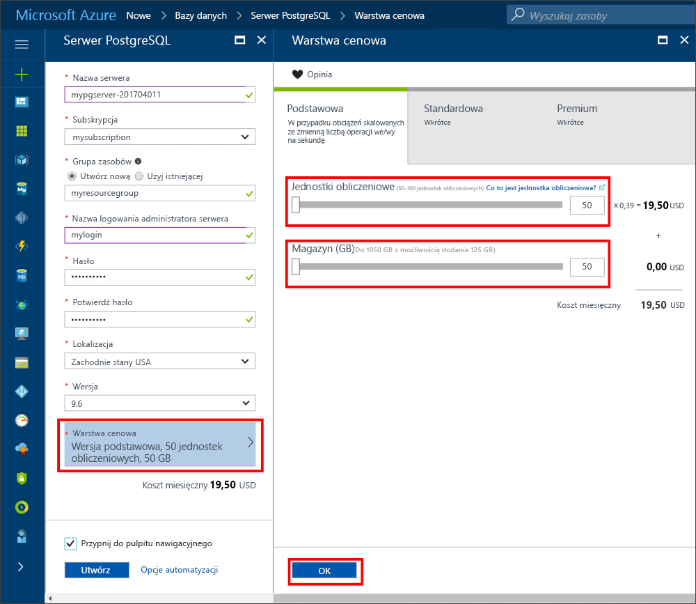
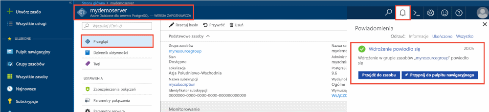
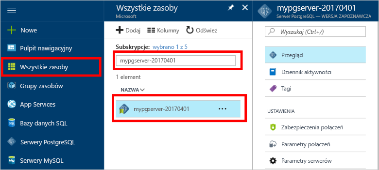
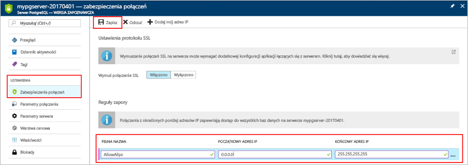
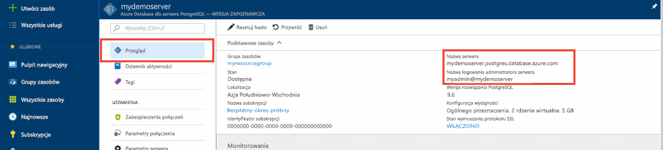
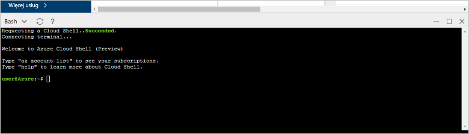
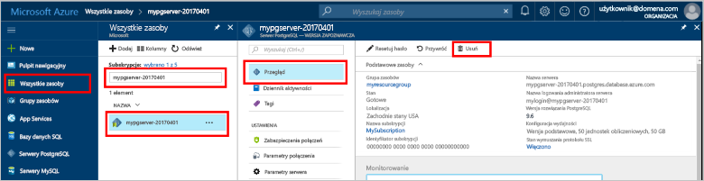

# <a name="create-an-azure-database-for-postgresql-server-in-the-azure-portal"></a>Tworzenie bazy danych Azure PostgreSQL serwera w portalu Azure

Bazy danych platformy Azure dla PostgreSQL jest zarządzanych usług, którego używasz do uruchamiania, zarządzanie i skalowania wysokiej dostępności PostgreSQL baz danych w chmurze. Ta opcja szybkiego startu pokazano, jak utworzyć PostgreSQL serwera bazy danych Azure w ciągu około pięciu minut przy użyciu portalu Azure.

Jeśli nie masz subskrypcji platformy Azure, przed rozpoczęciem utwórz [bezpłatne konto platformy Azure](https://azure.microsoft.com/free/).

## <a name="sign-in-to-the-azure-portal"></a>Logowanie się do witryny Azure Portal
Otwórz przeglądarkę sieci web i przejdź do [portal](https://portal.azure.com/). Wprowadź swoje poświadczenia, aby zalogować się do portalu. Widok domyślny to pulpit nawigacyjny usług.

## <a name="create-an-azure-database-for-postgresql-server"></a>Tworzenie serwera usługi Azure Database for PostgreSQL

Serwer usługi Azure Database for PostgreSQL jest tworzony ze zdefiniowanym zestawem [zasobów obliczeniowych i przestrzeni dyskowej](./concepts-compute-unit-and-storage.md). Serwer jest tworzony w ramach [grupy zasobów Azure](../azure-resource-manager/resource-group-overview.md).

Aby utworzyć bazę danych Azure PostgreSQL serwera, należy wykonać następujące czynności:
1. Wybierz przycisk **Nowy** (+) w lewym górnym rogu portalu.

2. Wybierz **baz danych** > **bazy danych platformy Azure dla PostgreSQL**.

    

3. Wypełnij formularz informacjami o szczegółach nowego serwera w sposób pokazany na wcześniejszej ilustracji, używając następujących informacji:

    Ustawienie|Sugerowana wartość|Opis
    ---|---|---
    Nazwa serwera |*mypgserver-20170401*|Unikatowa nazwa identyfikuje PostgreSQL serwera bazy danych Azure. Nazwa domeny *postgres.database.azure.com* jest dołączany do należy podać nazwę serwera. Serwer może zawierać tylko małe litery, cyfry i znaki łącznika (-). Musi zawierać co najmniej 3 do 63 znaków.
    Subskrypcja|Twoja subskrypcja|Subskrypcja platformy Azure, którego chcesz używać dla serwera. Jeśli masz wiele subskrypcji, wybierz subskrypcję, w którym są rozliczane dla zasobu.
    Grupa zasobów|*myresourcegroup*| Nazwa nowej grupy zasobów lub istniejącego z subskrypcji.
    Identyfikator logowania administratora serwera |*mylogin*| Własne konto logowania używane podczas łączenia się z serwerem. Nazwa logowania administratora nie może być **azure_superuser,** **azure_pg_admin,** **administratora** **administratora,** **głównego,** **gościa,** lub **publicznych.** Nie można uruchomić z **pg_**.
    Hasło |Wartość wybrana przez użytkownika | Nowe hasło do konta administratora serwera. Musi zawierać od 8 do 128 znaków. Hasło musi zawierać znaki z trzech z następujących kategorii: wielkie litery angielskie małe litery, cyfry (od 0 do 9) i znaków innych niż alfanumeryczne (!, $, #, % itp.).
    Lokalizacja|Region znajdujący się najbliżej użytkowników| Lokalizacja zbliżony do użytkowników.
    Wersja PostgreSQL|Najnowsza wersja| Najnowszą wersję, jeśli nie ma określonych wymagań.
    Warstwa cenowa | **Podstawowa**, **50 jednostek obliczeniowych**, **50 GB** | Warstwa usługi i poziom wydajności nowej bazy danych. Wybierz **warstwa cenowa**. Następnie wybierz pozycję **podstawowe** kartę. Następnie wybierz lewego końca **obliczeniowe jednostki** suwakiem, możesz dostosować wartość najmniejszą dostępne dla tego przewodnika Szybki Start. Aby zapisać wybór warstwy cenowej, zaznacz **OK**. Aby uzyskać więcej informacji, zobacz poniższy zrzut ekranu. 
    Przypnij do pulpitu nawigacyjnego | Zaznacz | Umożliwia łatwe monitorowanie serwera na stronie front pulpitu nawigacyjnego portalu sieci.

    > [!IMPORTANT]
    > Identyfikator logowania administratora serwera i hasło określone w tym miejscu są wymagane do logowania się na serwerze i jej baz danych w dalszej części tego przewodnika Szybki Start. Zapamiętaj lub zapisz te informacje do wykorzystania w przyszłości.

    

4. Wybierz pozycję **Utwórz**, aby aprowizować serwer. Aprowizowanie może zająć do 20 minut.

5. Na pasku narzędzi wybierz **powiadomienia** symbol do monitorowania procesu wdrażania.

    
   
  Domyślnie **postgres** baza danych została utworzona w obszarze serwera. [Postgres](https://www.postgresql.org/docs/9.6/static/app-initdb.html) baza danych jest domyślna baza danych, które jest przeznaczone do użytku przez użytkowników, narzędzia i aplikacje innych producentów. 

## <a name="configure-a-server-level-firewall-rule"></a>Konfigurowanie reguły zapory na poziomie serwera

Bazy danych platformy Azure dla PostgreSQL tworzy zapory na poziomie serwera. Uniemożliwia aplikacji zewnętrznych i narzędzia nawiązywania połączenia z serwerem i żadnych baz danych na serwerze, chyba że należy utworzyć regułę, aby otworzyć zapory dla określonych adresów IP. 

1. Po zakończeniu wdrażania odszukaj serwer. W razie potrzeby wyszukaj go. Na przykład w menu po lewej stronie wybierz **wszystkie zasoby**. Wpisz nazwę serwera, takie jak na przykład, **mypgserver 20170401**, aby wyszukać nowo utworzonego serwera. Wybierz nazwę serwera na liście wyników wyszukiwania. Zostanie otwarta strona **Przegląd**, która zawiera dalsze opcje konfiguracji.
 
    

2. Na stronie serwera wybierz pozycję **Zabezpieczenia połączeń**.

    

3. W obszarze **reguły zapory** pozycji w **Nazwa reguły** kolumny, zaznacz pole tekstowe puste, aby rozpocząć tworzenie reguły zapory. 

    Dla tego przewodnika Szybki Start umożliwia Zezwalaj na wszystkie adresy IP do serwera. Wypełnij pole tekstowe w każdej kolumnie z następującymi wartościami:

    Nazwa reguły | Początkowy adres IP | Końcowy adres IP 
    ---|---|---
    AllowAllIps | 0.0.0.0 | 255.255.255.255

4. Na górnym pasku narzędzi strony **Zabezpieczenia połączeń** wybierz pozycję **Zapisz**. Zaczekaj, aż pojawi się powiadomienie, że aktualizacja zabezpieczeń połączenia zakończyło się pomyślnie przed kontynuowaniem.

    > [!NOTE]
    > Połączenia z serwerem usługi Azure Database for PostgreSQL używają portu 5432. Jeśli użytkownik próbuje połączyć się z sieci firmowej, ruch wychodzący przez port 5432 nie mogą przez zaporę w sieci. Jeśli tak, chyba że dział IT otwiera port 5432 nie może połączyć się z serwerem.
    >

## <a name="get-the-connection-information"></a>Pobieranie informacji o połączeniu

Podczas tworzenia bazy danych Azure, aby serwer PostgreSQL domyślna baza danych o nazwie **postgres** jest tworzony. Aby połączyć się z serwerem bazy danych, należy pełny serwer administrator i nazwę poświadczenia logowania. Być może te wartości zostały zanotowane wcześniej podczas pracy z artykułem Szybki start. Jeśli nie, łatwo informacje można znaleźć serwer nazw i nazwy logowania na serwerze **omówienie** w portalu.

Otwórz stronę **Przegląd** serwera. Zanotuj **nazwy serwera** i **nazwę logowania administratora serwera**. Umieść kursor nad każdego pola i symbol kopiowania wydaje się po prawej stronie tekstu. Wybierz symbol kopiowania, w razie potrzeby można skopiować wartości.

 

## <a name="connect-to-the-postgresql-database-by-using-psql-in-cloud-shell"></a>Połączenia z bazą danych PostgreSQL przy użyciu psql w powłoce chmury

Istnieje wiele aplikacji, za pomocą których można nawiązać połączenie z serwerem usługi Azure Database for PostgreSQL. Użyjmy teraz narzędzia wiersza polecenia psql, aby zilustrować procedurę nawiązywania połączenia z serwerem. Służy przeglądarki sieci web i powłoki chmury Azure zgodnie z opisem w tym miejscu, bez konieczności instalowania dodatkowego oprogramowania. Jeśli masz narzędzie psql zainstalowane lokalnie na własnym komputerze, możesz również nawiązać połączenie w ten sposób.

1. W okienku nawigacji w górnym wybierz terminali symbolu, aby otworzyć powłokę chmury.

   

2. Chmura powłoki otwiera w przeglądarce, można wpisać poleceń powłoki Bash.

   

3. W wierszu polecenia powłoki chmury, wpisując w wierszu polecenia psql połączyć z bazą danych programu PostgreSQL serwera bazy danych Azure.

    Do połączenia z bazą danych Azure dla serwera PostgreSQL z [psql](https://www.postgresql.org/docs/9.6/static/app-psql.html) narzędzie, użyj następującego formatu:
    ```bash
    psql --host=<yourserver> --port=<port> --username=<server admin login> --dbname=<database name>
    ```

    Na przykład następujące polecenie powoduje połączenie z przykładowym serwerem:

    ```bash
    psql --host=mypgserver-20170401.postgres.database.azure.com --port=5432 --username=mylogin@mypgserver-20170401 --dbname=postgres
    ```

    Parametr psql |Sugerowana wartość|Opis
    ---|---|---
    --host | Nazwa serwera | Wartość nazwy serwera używane podczas tworzenia bazy danych Azure wcześniej PostgreSQL serwera. Serwer przykładzie pokazano jest **mypgserver 20170401.postgres.database.azure.com.** Użyj w pełni kwalifikowaną nazwę domeny (**\*. postgres.database.azure.com**) jak pokazano w przykładzie. Jeśli nie pamiętasz nazwy serwera, postępuj zgodnie z instrukcjami w poprzedniej sekcji, aby uzyskać informacje dotyczące połączenia. 
    --port | 5432 | Port używany podczas łączenia z bazą danych Azure PostgreSQL serwera. 
    --username | Nazwa logowania administratora serwera |Serwer logowania nazwa użytkownika podane przez użytkownika podczas tworzenia bazy danych Azure wcześniej PostgreSQL serwera. Jeśli nie pamiętasz nazwy użytkownika, wykonaj kroki opisane w poprzedniej sekcji, aby uzyskać informacje o połączeniu. Format to *username@servername*.
    --dbname | *postgres* | Wartość domyślna generowanych przez system Nazwa bazy danych utworzone dla pierwszego połączenia. Później należy utworzyć własne bazy danych.

    Po uruchomieniu polecenia psql z wartości parametru zostanie wyświetlony monit o wprowadzenie hasła administratora serwera. To hasło jest taka sama jak podane podczas tworzenia serwera. 

    Parametr psql |Sugerowana wartość|Opis
    ---|---|---
    hasło | Hasło administratora | Znaki typu hasła nie są wyświetlane na wiersz bash. Po wpisaniu wszystkie znaki wybierz **Enter** klucza do uwierzytelnienia i połączenia.

    Po nawiązaniu połączenia narzędzia psql wyświetla monit o postgres należy wpisać poleceń sql. W danych wyjściowych połączenia początkowego może być wyświetlone ostrzeżenie, ponieważ psql w powłoce chmury mogą być innej wersji niż baza danych Azure w wersji server PostgreSQL. 
    
    Przykład danych wyjściowych narzędzia psql:
    ```bash
    psql (9.5.7, server 9.6.2)
    WARNING: psql major version 9.5, server major version 9.6.
        Some psql features might not work.
    SSL connection (protocol: TLSv1.2, cipher: ECDHE-RSA-AES256-SHA384, bits: 256, compression: off)
    Type "help" for help.
   
    postgres=> 
    ```

    > [!TIP]
    > Jeśli Zapora nie jest skonfigurowana do zezwalania adres IP powłoki chmury, wystąpił następujący błąd:
    > 
    > "psql: błąd krytyczny: nie pg_hba.conf wpis dla hosta"138.91.195.82"użytkownika"mylogin", baza danych"postgres"protokołu SSL na błąd krytyczny: połączenia SSL jest wymagany. Określ opcje protokołu SSL, a następnie spróbuj ponownie.
    > 
    > Aby rozwiązać problem, upewnij się, że konfiguracja serwera jest zgodna kroki opisane w sekcji "Konfigurowanie reguły zapory poziomu serwera" tego artykułu.

4. Utwórz pustą bazę danych, wpisując następujące polecenie w wierszu polecenia:
    ```bash
    CREATE DATABASE mypgsqldb;
    ```
    Polecenie może potrwać kilka minut, aby zakończyć. 

5. W wierszu polecenia Uruchom następujące polecenie, aby przełączyć połączenia do nowo utworzonej bazy danych **mypgsqldb**:
    ```bash
    \c mypgsqldb
    ```

6. Typ `\q`, a następnie wybierz **Enter** klawisz, aby zakończyć psql. Po zakończeniu można zamknąć powłoki chmury.

Teraz nawiązano połączenie z bazą danych Azure PostgreSQL serwera i utworzyć bazę danych użytkownika. Nadal następnej sekcji, aby połączyć przy użyciu innego narzędzia wspólnej pgAdmin.

## <a name="connect-to-the-postgresql-database-by-using-pgadmin"></a>Połączenia z bazą danych PostgreSQL przy użyciu pgAdmin

Aby połączyć się z serwerem Azure PostgreSQL przy użyciu pgAdmin narzędzia graficznego interfejsu użytkownika:
1. Otwórz aplikację pgAdmin na komputerze klienckim. Można zainstalować pgAdmin z [pgAdmin witryny sieci Web](http://www.pgadmin.org/).

2. Na stronie pulpitu nawigacyjnego w obszarze **szybkie linki** zaznacz **dodać nowy serwer** symbolu.

3. W **Utwórz — serwer** na okna dialogowego **ogólne** wprowadź unikatową przyjazną nazwę dla serwera, takich jak **serwera PostgreSQL Azure**.

    

4. W **Utwórz — serwer** na okna dialogowego **połączenia** , użyj ustawienia określone, a następnie wybierz **zapisać**.

   

    Parametr narzędzia pgAdmin |Sugerowana wartość|Opis
    ---|---|---
    Nazwa lub adres hosta | Nazwa serwera | Wartość nazwy serwera używane podczas tworzenia bazy danych Azure wcześniej PostgreSQL serwera. Naszym przykładzie serwer jest **mypgserver 20170401.postgres.database.azure.com.** Użyj w pełni kwalifikowaną nazwę domeny (**\*. postgres.database.azure.com**) jak pokazano w przykładzie. Jeśli nie pamiętasz nazwy serwera, postępuj zgodnie z instrukcjami w poprzedniej sekcji, aby uzyskać informacje dotyczące połączenia. 
    Port | 5432 | Port używany podczas łączenia z bazą danych Azure PostgreSQL serwera. 
    Konserwacji bazy danych | *postgres* | Domyślna nazwa wygenerowana przez system bazy danych.
    Nazwa użytkownika | Nazwa logowania administratora serwera | Serwer logowania nazwa użytkownika podane przez użytkownika podczas tworzenia bazy danych Azure wcześniej PostgreSQL serwera. Jeśli nie pamiętasz nazwy użytkownika, postępuj zgodnie z instrukcjami w poprzedniej sekcji, aby uzyskać informacje dotyczące połączenia. Format to *username@servername*.
    Hasło | Hasło administratora | Hasło została wybrana opcja utworzenia serwera we wcześniejszej części tego przewodnika Szybki Start.
    Rola | Pozostaw puste | Nie istnieje potrzeba aby podać nazwę roli w tym momencie. Pozostaw pole puste.
    Tryb SSL | Wymagane | Domyślnie wszystkie serwery Azure PostgreSQL są tworzone przy użyciu protokołu SSL wymuszania włączona. Aby wyłączyć Wymuszanie protokołu SSL, zobacz [wymusić SSL](./concepts-ssl-connection-security.md).
    
5. Wybierz pozycję **Zapisz**.

6. W **przeglądarki** w okienku po lewej stronie rozwiń **serwerów** węzła. Wybierz serwer, na przykład **serwera PostgreSQL Azure**. Kliknij, aby się z nim połączyć.

7. Rozwiń węzeł serwera, a następnie rozwiń jego podrzędny element **Bazy danych**. Lista powinna zawierać istniejące *postgres* bazy danych i wszystkie nowo utworzonego użytkownika bazy danych, takich jak **mypgsqldb**, który został utworzony w poprzedniej sekcji. Zwróć uwagę, że można utworzyć wiele baz danych na serwerze z bazą danych Azure dla PostgreSQL.

8. Kliknij prawym przyciskiem myszy **baz danych**, wybierz **Utwórz** menu, a następnie wybierz **bazy danych**.

9. Wpisz nazwę bazy danych w wybranym **bazy danych** pola, takie jak **mypgsqldb**, jak pokazano w przykładzie.

10. Wybierz **właściciela** dla bazy danych w polu listy. Wybierz nazwę logowania administratora, takich jak na przykład serwer **mylogin**.

11. Wybierz **zapisać** do utworzenia nowej bazy danych puste.

12. W **przeglądarki** okienku, zobacz bazy danych utworzonej w listy baz danych w obszarze nazwy serwera.

    


## <a name="clean-up-resources"></a>Oczyszczanie zasobów
Możesz wyczyścić zasoby, które zostały utworzone z opcją szybkiego startu w jeden z dwóch sposobów. Możesz usunąć [grupę zasobów platformy Azure](../azure-resource-manager/resource-group-overview.md) zawierającą wszystkie zasoby w tej grupie. Jeśli chcesz inne zasoby powinny pozostać bez zmian, należy usunąć tylko zasób pojedynczego serwera.

> [!TIP]
> Inne przewodniki Szybki start w tej kolekcji bazują na tym przewodniku. Jeśli chcesz kontynuować pracę z przewodnikami Szybki start, nie usuwaj zasobów utworzonych w tym przewodniku Szybki start. Jeśli nie planujesz, wykonaj następujące kroki, aby usunąć zasoby, które zostały utworzone przez tego szybkiego startu w portalu.

Aby usunąć grupę zasobów całej, łącznie z nowo utworzonego serwera:
1. Zlokalizuj grupie zasobów w portalu. W menu po lewej stronie wybierz **grup zasobów**. Następnie wybierz nazwę grupy zasobów, takich jak na przykład, **myresourcegroup**.

2. Na stronie grupy zasobów wybierz pozycję **Usuń**. Wpisz nazwę grupy zasobów, takich jak na przykład, **myresourcegroup**, w polu tekstowym, aby potwierdzić usunięcie. Wybierz pozycję **Usuń**.

Aby usunąć tylko nowo utworzonego serwera:
1. Zlokalizuj serwera w portalu, jeśli nie jest otwarty. W menu po lewej stronie wybierz **wszystkie zasoby**. Następnie wyszukaj utworzony serwer.

2. Na stronie **Przegląd** wybierz pozycję **Usuń**.

    

3. Potwierdź nazwę serwera, który chcesz usunąć, a następnie wyświetlić baz danych w nim, których dotyczy problem. Wpisz nazwę serwera w polu tekstowym, takich jak na przykład, **mypgserver 20170401**. Wybierz pozycję **Usuń**.

## <a name="next-steps"></a>Następne kroki
> [!div class="nextstepaction"]
> [Migrowanie bazy danych przy użyciu funkcji eksportowania i importowania](./howto-migrate-using-export-and-import.md)
