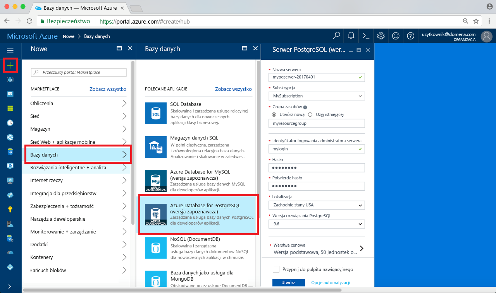
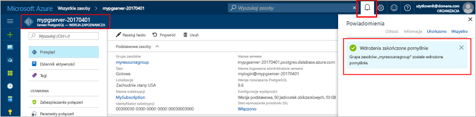
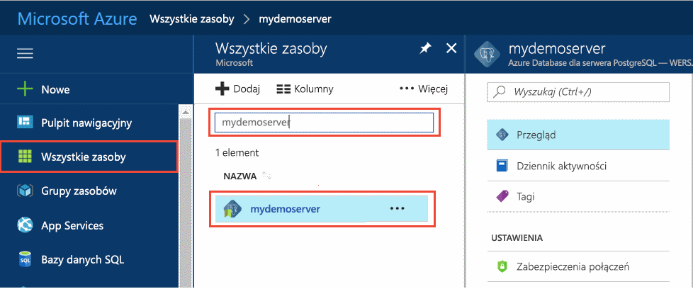
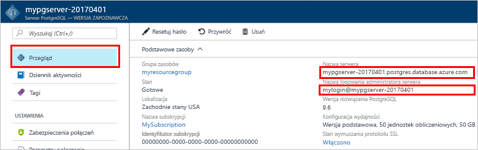

# <a name="design-your-first-azure-database-for-postgresql-using-the-azure-portal"></a>Projektowanie pierwszą bazę danych Azure do PostgreSQL przy użyciu portalu Azure

Azure Database for PostgreSQL to usługa zarządzana, która umożliwia uruchamianie i skalowanie w chmurze baz danych PostgreSQL o wysokiej dostępności, a także zarządzanie nimi. Przy użyciu portalu Azure, można łatwo zarządzać serwerem i projektowanie bazy danych.

W tym samouczku, użyj portalu Azure Aby dowiedzieć się, jak:
> [!div class="checklist"]
> * Tworzenie serwera usługi Azure Database for PostgreSQL
> * Konfigurowanie zapory serwera
> * Użyj [ **psql** ](https://www.postgresql.org/docs/9.6/static/app-psql.html) narzędzie do tworzenia bazy danych
> * Ładuj dane przykładowe
> * Zapytania o dane
> * Aktualizowanie danych
> * Przywracanie danych

## <a name="prerequisites"></a>Wymagania wstępne
Jeśli nie masz subskrypcji platformy Azure, przed rozpoczęciem utwórz [bezpłatne](https://azure.microsoft.com/free/) konto.

## <a name="log-in-to-the-azure-portal"></a>Logowanie do witryny Azure Portal
Zaloguj się do witryny [Azure Portal](https://portal.azure.com).

## <a name="create-an-azure-database-for-postgresql"></a>Tworzenie serwera usługi Azure Database for PostgreSQL

Serwer usługi Azure Database for PostgreSQL jest tworzony ze zdefiniowanym zestawem [zasobów obliczeniowych i przestrzeni dyskowej](./concepts-compute-unit-and-storage.md). Serwer jest tworzony w ramach [grupy zasobów Azure](../azure-resource-manager/resource-group-overview.md).

Wykonaj następujące kroki, aby utworzyć serwer usługi Azure Database for PostgreSQL:
1.  Kliknij przycisk **+ nowy** znaleziono przycisku w lewym górnym rogu portalu Azure.
2.  Na stronie **Nowy** wybierz pozycję **Bazy danych**, a następnie na stronie **Bazy danych** wybierz pozycję **Azure Database for PostgreSQL**.
 

3.  Wypełnij formularz informacjami o szczegółach nowego serwera w sposób pokazany na wcześniejszej ilustracji, używając następujących informacji:
    - Nazwa serwera: **mypgserver-20170401** (nazwa serwera jest mapowana na nazwę DNS i dlatego musi być globalnie unikatowa) 
    - Subskrypcja: jeśli masz wiele subskrypcji, wybierz odpowiednią subskrypcję, w ramach której istnieje zasób lub będą za niego naliczane opłaty.
    - Grupa zasobów: **myresourcegroup**
    - Wybrane przez Ciebie login i hasło administratora serwera
    - Lokalizacja
    - Wersja PostgreSQL

  > [!IMPORTANT]
  > Identyfikator logowania administratora serwera i hasło określone w tym miejscu są wymagane do logowania do serwera i jego baz danych w dalszej części tego przewodnika Szybki Start. Zapamiętaj lub zapisz te informacje do wykorzystania w przyszłości.

4.  Kliknij pozycję **Warstwa cenowa**, aby określić warstwę usługi i poziom wydajności dla nowej bazy danych. Dla tego przewodnika Szybki Start, wybierz **podstawowe** warstwy, **50 jednostek obliczeniowe** i **50 GB** dołączone magazynu.
 
5.  Kliknij przycisk **OK**.
6.  Kliknij przycisk **Utwórz**, aby aprowizować serwer. Aprowizacja zajmuje kilka minut.

  > [!TIP]
  > Zaznacz opcję **Przypnij do pulpitu nawigacyjnego**, aby łatwo śledzić wdrożenia.

7.  Na pasku narzędzi kliknij pozycję **Powiadomienia**, aby monitorować proces wdrażania.
 
   
  Domyślnie baza danych **postgres** zostanie utworzona na Twoim serwerze. Baza danych [postgres](https://www.postgresql.org/docs/9.6/static/app-initdb.html) to domyślna baza danych przeznaczona do użycia dla użytkowników oraz na potrzeby narzędzi i aplikacji innych firm. 

## <a name="configure-a-server-level-firewall-rule"></a>Konfigurowanie reguły zapory na poziomie serwera

Bazy danych Azure dla usługi PostgreSQL używa zapory na poziomie serwera. Domyślnie Zapora uniemożliwia wszystkich narzędzi i aplikacji zewnętrznych łączenia z serwera i żadnych baz danych na serwerze, jeśli nie można otworzyć zapory konkretny zakres adresów IP jest tworzona reguła zapory. 

1.  Po zakończeniu wdrożenia kliknij pozycję **Wszystkie zasoby** w menu po lewej stronie i wpisz nazwę **mypgserver-20170401**, aby wyszukać nowo utworzony serwer. Kliknij nazwę serwera wyświetlaną w wynikach wyszukiwania. Zostanie otwarta strona **Przegląd**, która zawiera dalsze opcje konfiguracji.
 
 

2.  Na stronie serwera wybierz pozycję **Zabezpieczenia połączeń**. 
3.  Kliknij w polu tekstowym w obszarze **Nazwa reguły** i dodaj nową regułę zapory, aby na liście dozwolonych umieścić zakres adresów IP służących do łączności. W tym samouczku umożliwia Zezwalaj na wszystkie adresy IP, wpisując w **Rule Name = AllowAllIps**, **Start IP = 0.0.0.0** i **końcowemu adresowi IP = 255.255.255.255** , a następnie kliknij przycisk **Zapisz** . Można ustawić określoną regułę zapory, która obejmuje mniejszy zakres IP, aby móc połączyć się z sieci.
 
 

4.  Kliknij przycisk **zapisać** , a następnie kliknij przycisk **X** zamknąć **zabezpieczenia połączeń** strony.

  > [!NOTE]
  > Serwer Azure PostgreSQL komunikuje się przez port 5432. Jeśli próbujesz nawiązać połączenie z sieci firmowej, ruch wychodzący na porcie 5432 może być zablokowany przez zaporę sieciową. Jeśli tak, chyba że dział IT otwiera port 5432 nie można połączyć z serwerem bazy danych SQL Azure.
  >


## <a name="get-the-connection-information"></a>Pobieranie informacji o połączeniu

Podczas tworzenia bazy danych Azure serwer PostgreSQL, domyślnie **postgres** również została utworzona baza danych. Aby nawiązać połączenie z serwerem bazy danych, musisz podać informacje o hoście i poświadczenia dostępu.

1. Z menu po lewej stronie w portalu Azure kliknij **wszystkie zasoby** i wyszukiwania na serwerze, który został właśnie utworzony **mypgserver 20170401**.

  

3. Kliknij nazwę serwera **mypgserver 20170401**.

4. Wybierz stronę serwera **Przegląd**. Zanotuj wartości **Nazwa serwera** i **Identyfikator logowania administratora serwera**.

 


## <a name="connect-to-postgresql-database-using-psql-in-cloud-shell"></a>Nawiązywanie połączenia z bazą danych PostgreSQL w powłoce Cloud Shell za pomocą narzędzia psql

Teraz można użyć [psql](https://www.postgresql.org/docs/9.6/static/app-psql.html) narzędzie wiersza polecenia do połączenia z bazą danych Azure PostgreSQL serwera. 
1. Uruchom powłokę Azure Cloud Shell za pośrednictwem ikony terminala w górnym okienku nawigacji.

   

2. Powłoka Azure Cloud Shell zostanie otwarta w przeglądarce, umożliwiając wpisywanie poleceń powłoki bash.

   

3. W wierszu polecenia powłoki Cloud Shell nawiąż połączenie z serwerem usługi Azure Database for PostgreSQL za pomocą poleceń psql. Następujący format służy do łączenia z serwerem usługi Azure Database for PostgreSQL przy użyciu narzędzia [psql](https://www.postgresql.org/docs/9.6/static/app-psql.html):
   ```bash
   psql --host=<myserver> --port=<port> --username=<server admin login> --dbname=<database name>
   ```

   Na przykład poniższe polecenie nawiązuje połączenie z domyślną bazą danych o nazwie **postgres** na Twoim serwerze PostgreSQL **mypgserver-20170401.postgres.database.azure.com** za pomocą poświadczeń dostępu. Po wyświetleniu monitu wprowadź hasło administratora serwera.

   ```bash
   psql --host=mypgserver-20170401.postgres.database.azure.com --port=5432 --username=mylogin@mypgserver-20170401 --dbname=postgres
   ```

## <a name="create-a-new-database"></a>Tworzenie nowej bazy danych
Po nawiązaniu połączenia z serwerem utwórz pustą bazę danych za pomocą wiersza polecenia.
```bash
CREATE DATABASE mypgsqldb;
```

W wierszu polecenia wykonaj poniższe polecenie, aby przełączyć połączenie na nowo utworzoną bazę danych **mypgsqldb**.
```bash
\c mypgsqldb
```
## <a name="create-tables-in-the-database"></a>Tworzenie tabel w bazie danych
Teraz, Znając sposób nawiązywania połączenia z bazą danych Azure dla PostgreSQL, można wykonać niektóre podstawowe zadania:

Najpierw utwórz tabelę i załaduj go z niektórych danych. Ta funkcja pozwala utworzyć tabelę, która śledzi informacje spisu przy użyciu tego kodu SQL:
```sql
CREATE TABLE inventory (
    id serial PRIMARY KEY, 
    name VARCHAR(50), 
    quantity INTEGER
);
```

Teraz wyświetlić nowo utworzona tabela listy tabel, wpisując:
```sql
\dt
```

## <a name="load-data-into-the-tables"></a>Ładowanie danych do tabel
Teraz, gdy masz tabeli wstawić dane do niego. W oknie Otwórz okno wiersza polecenia Uruchom następujące zapytanie, aby wstawić niektórych wierszy danych.
```sql
INSERT INTO inventory (id, name, quantity) VALUES (1, 'banana', 150); 
INSERT INTO inventory (id, name, quantity) VALUES (2, 'orange', 154);
```

Masz teraz dwa wiersze przykładowych danych do tabeli spisu utworzony wcześniej.

## <a name="query-and-update-the-data-in-the-tables"></a>Zapytania i zaktualizować dane w tabelach
Wykonaj następujące zapytanie, aby pobrać informacje z tabeli bazy danych magazynu. 
```sql
SELECT * FROM inventory;
```

Należy również zaktualizować danych w tabeli.
```sql
UPDATE inventory SET quantity = 200 WHERE name = 'banana';
```

Podczas pobierania danych, można zobaczyć zaktualizowane wartości.
```sql
SELECT * FROM inventory;
```

## <a name="restore-data-to-a-previous-point-in-time"></a>Przywróć dane z wcześniejszego punktu w czasie
Załóżmy, że zostanie przypadkowo usunięte w tej tabeli. Ta sytuacja jest coś, co nie można łatwo odzyskać z. Bazy danych platformy Azure dla PostgreSQL umożliwia wróć do dowolnego punktu na czas (w ostatnim maksymalnie 7 dni (Basic), a 35 dni (standardowe)) i przywrócić tego punktu w czasie na nowy serwer. Możesz użyć tego nowego serwera, aby odzyskać usunięte dane. Następujące kroki przywracania **mypgserver 20170401** serwera do punktu przed tabeli magazynu został dodany.

1.  W bazie danych Azure dla PostgreSQL **omówienie** serwera kliknij pozycję **przywrócić** na pasku narzędzi. **Przywrócić** zostanie otwarta strona.
  
2.  Wypełnianie **przywrócić** formularza z informacjami wymaganymi:

  
  - **Punkt przywracania**: Wybierz w momencie po serwer został zmieniony
  - **Serwer docelowy**: Podaj nową nazwę serwera mają zostać przywrócone
  - **Lokalizacja**: nie można wybrać region, domyślnie jest taki sam jak serwer źródłowy
  - **Warstwa cenowa**: nie można zmienić tę wartość podczas przywracania serwera. Jest taki sam jak serwer źródłowy. 
3.  Kliknij przycisk **OK** [przywrócić serwer do punktu w czasie](./howto-restore-server-portal.md) przed tabeli został usunięty. Przywracanie serwera do innego punktu w czasie tworzy zduplikowane nowy serwer jako oryginalnego serwera, począwszy od punktu w czasie, możesz określić, pod warunkiem, że w okresie przechowywania dla Twojego [warstwy usług](./concepts-service-tiers.md).

## <a name="next-steps"></a>Następne kroki
W tym samouczku przedstawiono sposób użycia portalu Azure i inne narzędzia do:
> [!div class="checklist"]
> * Tworzenie serwera usługi Azure Database for PostgreSQL
> * Konfigurowanie zapory serwera
> * Użyj [ **psql** ](https://www.postgresql.org/docs/9.6/static/app-psql.html) narzędzie do tworzenia bazy danych
> * Ładuj dane przykładowe
> * Zapytania o dane
> * Aktualizowanie danych
> * Przywracanie danych

Następnie informacje na temat podobne zadania są wykonywane za pomocą interfejsu wiersza polecenia Azure, zobacz, w tym samouczku: [projektowanie pierwszą bazę danych Azure do PostgreSQL przy użyciu wiersza polecenia platformy Azure](tutorial-design-database-using-azure-cli.md)
