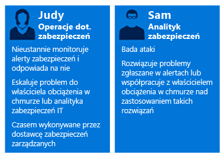
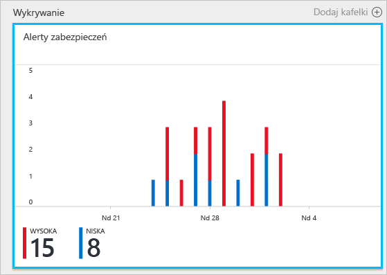
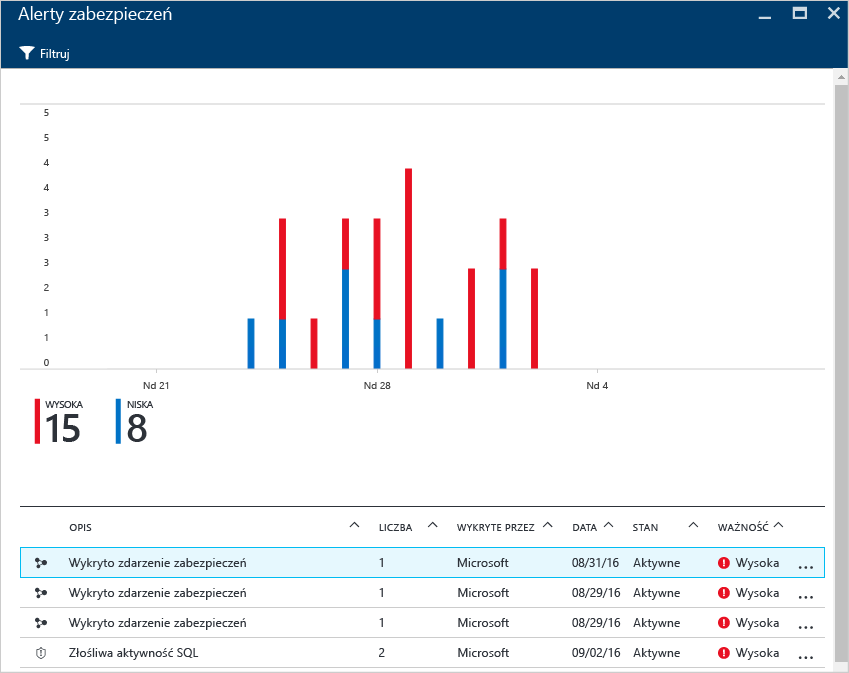
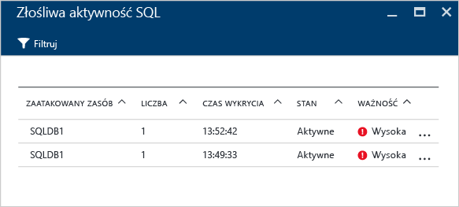
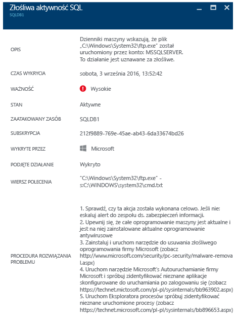

# Używanie usługi Azure Security Center do reagowania na zdarzenia
Wiele organizacji uczy się reagowania na zdarzenia zabezpieczeń dopiero wtedy, gdy zostaną celem ataku. Aby zmniejszyć koszty i straty, ważne jest dysponowanie planem reagowania na takie zdarzenia jeszcze przed wystąpieniem ataku. Usługi Azure Security Center można używać na różnych etapach reagowania na zdarzenia.

## Planowanie reagowania na zdarzenia
Efektywny plan zależy od trzech podstawowych możliwości: ochrony, wykrywania zagrożeń i reagowania na nie. Ochrona oznacza zapobieganie zdarzeniom, wykrywanie polega na ich wczesnej identyfikacji, a reagowanie oznacza udaremnienie próby ataku i przywrócenie systemów w celu zminimalizowania skutków naruszenia zabezpieczeń.

W tym artykule zastosowano etapy reagowania na zdarzenie zabezpieczeń opisane w artykule [Microsoft Azure Security Response in the Cloud](https://gallery.technet.microsoft.com/Azure-Security-Response-in-dd18c678) (Reagowanie na zdarzenia zabezpieczeń platformy Microsoft Azure w chmurze) zgodnie z diagramem poniżej:

Usługa Security Center może być używana na etapie wykrywania, oceniania i diagnozowania. Zostały tu przedstawione przykłady wykorzystania usługi Security Center na każdym z trzech początkowych etapów reagowania na zdarzenie:

* **Wykrywanie**: sprawdź pierwszy sygnał badania zdarzenia.
  * Przykład: sprawdź wstępne potwierdzenie, że na pulpicie nawigacyjnym usługi Security Center został zgłoszony alert zabezpieczeń o wysokim priorytecie.
* **Ocenianie**: wykonaj wstępną ocenę, aby uzyskać więcej informacji na temat podejrzanego działania.
  * Przykład: uzyskaj dodatkowe informacje na temat alertu zabezpieczeń.
* **Diagnozowanie**: przeprowadź badanie techniczne oraz określ strategię ograniczania ataku, łagodzenia jego skutków oraz możliwych obejść.
  * Przykład: wykonanie czynności naprawczych zaproponowanych w usłudze Security Center dla danego alertu zabezpieczeń.

Opisany niżej scenariusz pokazuje, jak korzystać z usługi Security Center na etapach wykrywania, oceniania i diagnozowania/reagowania w przypadku wystąpienia zdarzenia zabezpieczeń. W usłudze Security Center [zdarzenie zabezpieczeń](security-center-incident.md) to agregacja wszystkich alertów dotyczących zasobu, które są zgodne ze wzorcami ataku cybernetycznego typu [kill chain](https://blogs.technet.microsoft.com/office365security/addressing-your-cxos-top-five-cloud-security-concerns/). Zdarzenia są wyświetlane na kafelku i w bloku [Alerty zabezpieczeń](security-center-managing-and-responding-alerts.md). Zdarzenie wyświetla listę powiązanych alertów, co pozwala uzyskać więcej informacji na temat każdego wystąpienia. Usługa Security Center generuje też autonomiczne alerty zabezpieczeń, które ułatwiają śledzenie podejrzanych działań.

## Scenariusz
Firma Contoso dokonała ostatnio migracji niektórych lokalnych zasobów na platformę Azure. Dotyczyło to niektórych obciążeń biznesowych na maszynach wirtualnych i baz danych SQL. Obecnie zespół reagowania na zdarzenia zabezpieczeń firmy Contoso (CSIRT, Computer Security Incident Response Team) ma kłopot ze zbadaniem problemów dotyczących zabezpieczeń. Jest to spowodowane brakiem integracji funkcji analizy zabezpieczeń z ich obecnymi narzędziami do reagowania na zdarzenia. Ten brak integracji powoduje problem na etapach wykrywania (za dużo fałszywych alarmów), oceniania i diagnozowania. W ramach tej migracji zespół postanowił skorzystać z usługi Security Center, aby rozwiązać ten problem.

Pierwsza faza migracji zakończyła się po wprowadzeniu wszystkich zasobów i zastosowaniu się do wszystkich zaleceń dotyczących bezpieczeństwa z usłudze Security Center. Zespół Contoso CSIRT stanowi centralny punkt rozwiązywania problemów związanych ze zdarzeniami bezpieczeństwa komputerowego. Zespół składa się z grupy osób odpowiedzialnych za zajmowanie się wszystkimi zdarzeniami zabezpieczeń. Członkowie zespołu mają jasno określone obowiązki obejmujące wszystkie obszary reagowania.

Na potrzeby tego scenariusza skoncentrujemy się na rolach następujących członków zespołu Contoso CSIRT:

Magda zajmuje się operacjami zabezpieczeń. Jej obowiązki obejmują:

* Stałe monitorowanie zagrożeń bezpieczeństwa i reagowanie na nie.
* W razie potrzeby eskalację problemu do właściciela obciążeń chmurowych lub analityka zabezpieczeń.

Szymon jest analitykiem zabezpieczeń i do jego obowiązków należą:

* Badanie ataków.
* Korygowanie działań na podstawie alertów.
* Współpraca z właścicielami obciążeń w celu określania i stosowania rozwiązań.

Jak widać, Magda i Szymon mają różne obowiązki i muszą współpracować, dzieląc się informacjami z usługi Security Center.

## Zalecane rozwiązanie
Ponieważ Magda i Szymon pełnią różne role, będą korzystać z różnych obszarów usługi Security Center w celu uzyskiwania informacji ważnych dla ich codziennych obowiązków. Magda używa **Alertów zabezpieczeń** w ramach codziennego monitorowania.

Magda używa alertów zabezpieczeń na etapach wykrywania i oceniania. Po zakończeniu początkowej oceny może przekazać sprawę Szymonowi, jeśli wymaga ona dalszego zbadania. Na tym etapie Szymon korzysta z informacji pochodzących z usługi Security Center, a czasem również z innych źródeł danych, aby przejść do etapu diagnozy.

## Sposób implementacji rozwiązania
Aby zobaczyć, jak skorzystać z usługi Azure Security Center w scenariuszu reagowania na zdarzenie, prześledzimy czynności Julii na etapie wykrywania i oceny, a następnie czynności Szymona na etapie diagnostyki.

### Etapy wykrywania i oceniania w ramach reagowania na zdarzenie
Magda zalogowała się w witrynie Azure Portal i otworzyła konsolę usługi Security Center. W ramach codziennego monitorowania zaczęła przeglądać alerty zabezpieczeń o wysokim priorytecie, wykonując następujące czynności:

1. Kliknij kafelek **Alerty zabezpieczeń** i przejdź do bloku **Alerty zabezpieczeń**.
    
   
   > [!NOTE]
   > Na potrzeby tego scenariusza Magda zamierza przeprowadzić ocenę alertu dotyczącego złośliwego działania SQL, jak widać na poprzednim rysunku.
   > 
   > 
2. Kliknij alert **Złośliwe działanie SQL** i przejrzyj zaatakowane zasoby w bloku **Złośliwe działanie SQL**:  
   
    W tym bloku Magda może zanotować zaatakowane zasoby, liczbę ataków i czas ich wykrycia.
3. Kliknij pozycję **Zaatakowany zasób**, aby uzyskać więcej informacji na temat ataku.

Po przeczytaniu opisu Julia jest przekonana, że nie jest to fałszywy alarm, i postanawia eskalować sprawę do Szymona.

### Etap diagnozy w ramach reagowania na zdarzenie
Szymon otrzymuje zgłoszenie od Magdy i zaczyna przeglądanie czynności zaradczych zasugerowanych przez usługę Security Center.

### Dodatkowe zasoby
Zespół reagowania na zdarzenia może również korzystać z możliwości usługi [Security Center Power BI](security-center-powerbi.md) pozwalającej wyświetlać różne typy raportów. Te raporty mogą pomóc im podczas dalszej analizy w celu wizualizacji, analizowania i filtrowania zaleceń i alertów zabezpieczeń. Firmy, które podczas analizy korzystają z rozwiązania do zarządzania informacjami i zdarzeniami dotyczącymi bezpieczeństwa (SIEM), mogą również [zintegrować usługę Security Center z używanym rozwiązaniem](security-center-integrating-alerts-with-log-integration.md). Dzienniki inspekcji platformy Azure i zdarzenia zabezpieczeń dotyczące maszyn wirtualnych można też zintegrować przy użyciu [narzędzia do integracji dziennika Azure](https://blogs.msdn.microsoft.com/azuresecurity/2016/07/21/microsoft-azure-log-integration-preview/). Aby zbadać atak, możesz użyć tych informacji w połączeniu z informacjami dostarczonymi przez usługę Security Center.

## Podsumowanie
Stworzenie zespołu przed wystąpieniem ataku jest bardzo istotne dla organizacji i pozytywnie wpływa na sposób reagowania na zdarzenia dotyczące bezpieczeństwa. Odpowiednie narzędzia do monitorowania zasobów mogą ułatwić zespołowi podjęcie właściwych kroków w celu usunięcia skutków zdarzenia zabezpieczeń. [Funkcje wykrywania](security-center-detection-capabilities.md) usługi Security Center mogą pomóc zespołowi IT szybko reagować na zdarzenia zabezpieczeń i rozwiązywać problemy dotyczące bezpieczeństwa.

<!---HONumber=Nov16_HO2-->

