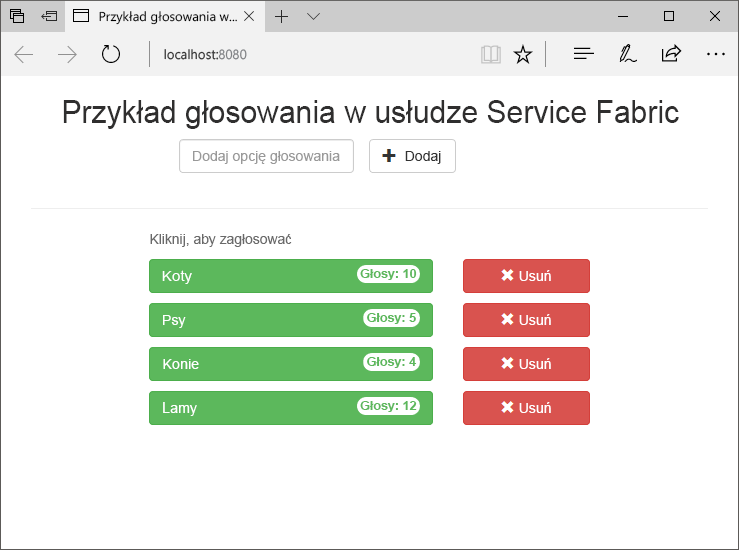
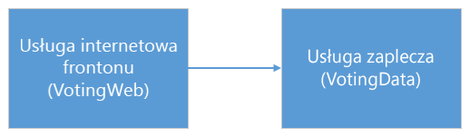
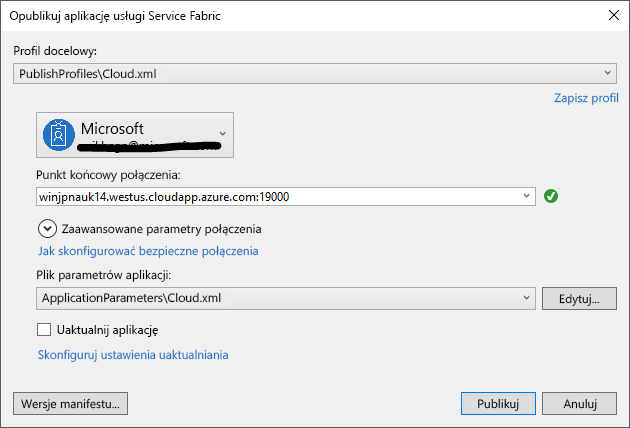
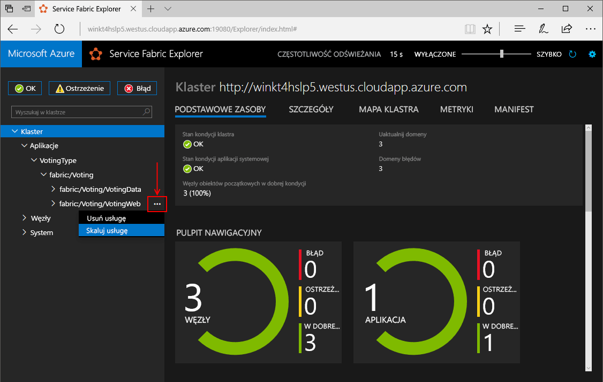
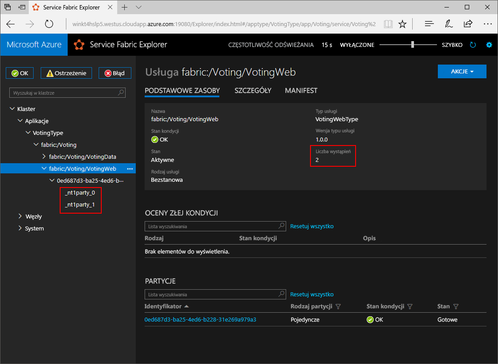
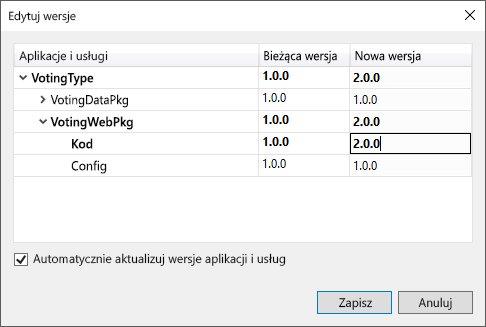
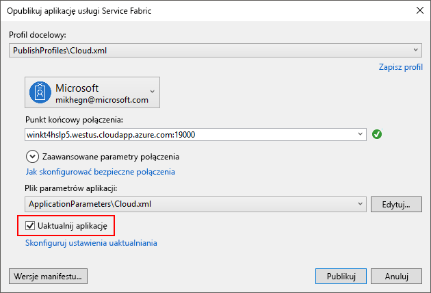
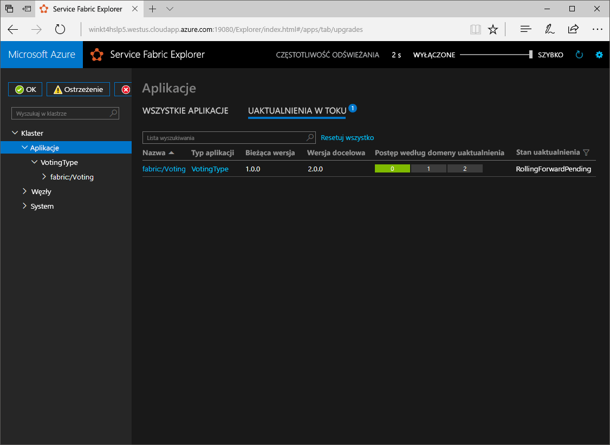

# <a name="quickstart-create-a-net-service-fabric-application-in-azure"></a>Szybki start: tworzenie aplikacji platformy .NET w usłudze Service Fabric na platformie Azure
Usługa Azure Service Fabric to platforma systemów rozproszonych ułatwiająca pakowanie i wdrażanie skalowalnych oraz niezawodnych mikrousług i kontenerów, a także zarządzanie nimi. 

W tym przewodniku Szybki start pokazano, jak wdrożyć pierwszą aplikację platformy .NET w usłudze Service Fabric. Po zakończeniu będziesz mieć aplikację do głosowania z usługą internetową frontonu ASP.NET Core, która zapisuje wyniki głosowania w stanowej usłudze zaplecza w klastrze.



Korzystając z tej aplikacji, nauczysz się wykonywać następujące czynności:
> [!div class="checklist"]
> * Tworzenie aplikacji przy użyciu platformy .NET i usługi Service Fabric
> * Używanie platformy ASP.NET Core jako frontonu sieci Web
> * Przechowywanie danych aplikacji w usłudze stanowej
> * Debugowanie aplikacji lokalnie
> * Wdrażanie aplikacji w klastrze na platformie Azure
> * Skalowanie aplikacji w poziomie na wiele węzłów
> * Przeprowadzanie stopniowego uaktualnienia aplikacji

## <a name="prerequisites"></a>Wymagania wstępne
Aby ukończyć ten przewodnik Szybki start:
1. [Zainstaluj program Visual Studio 2017](https://www.visualstudio.com/) z obciążeniami **Programowanie na platformie Azure** i **Tworzenie aplikacji na platformie ASP.NET i tworzenie aplikacji internetowych**.
2. [Zainstaluj oprogramowanie Git](https://git-scm.com/)
3. [Zainstaluj zestaw SDK usługi Microsoft Azure Service Fabric](http://www.microsoft.com/web/handlers/webpi.ashx?command=getinstallerredirect&appid=MicrosoftAzure-ServiceFabric-CoreSDK)
4. Uruchom następujące polecenie, aby umożliwić programowi Visual Studio wdrażanie w lokalnym klastrze usługi Service Fabric:
    ```powershell
    Set-ExecutionPolicy -ExecutionPolicy Unrestricted -Force -Scope CurrentUser
    ```

>[!NOTE]
> Przykładowa aplikacja w tym przewodniku Szybki start korzysta z funkcji, które nie są dostępne w systemie Windows 7.
>

## <a name="download-the-sample"></a>Pobierz przykład
W oknie polecenia uruchom następujące polecenie, aby sklonować przykładowe repozytorium aplikacji na komputer lokalny.
```
git clone https://github.com/Azure-Samples/service-fabric-dotnet-quickstart
```

## <a name="run-the-application-locally"></a>Uruchamianie aplikacji lokalnie
Kliknij prawym przyciskiem myszy ikonę programu Visual Studio w menu Start i wybierz polecenie **Uruchom jako administrator**. Aby dołączyć debuger do usług, musisz uruchomić program Visual Studio jako administrator.

Otwórz rozwiązanie **Voting.sln** programu Visual Studio ze sklonowanego repozytorium.  

Domyślnie aplikacja do głosowania nasłuchuje na porcie 8080.  Port aplikacji jest ustawiony w pliku */VotingWeb/PackageRoot/ServiceManifest.xml*.  Port aplikacji możesz zmienić, aktualizując atrybut **Port** elementu **Punkt końcowy**.  Aby wdrożyć i uruchomić aplikację lokalnie, port aplikacji musi być otwarty i dostępny na komputerze.  Jeśli zmieniono port aplikacji, podstaw nową wartość portu aplikacji za wartość „8080” w tym artykule.

Aby wdrożyć aplikację, naciśnij klawisz **F5**.

> [!NOTE]
> Przy pierwszym uruchamianiu i wdrażaniu aplikacji program Visual Studio tworzy lokalny klaster na potrzeby debugowania. Ta operacja może trochę potrwać. Stan tworzenia klastra jest wyświetlany w oknie danych wyjściowych programu Visual Studio.  W danych wyjściowych zostanie wyświetlony komunikat „Adres URL aplikacji nie jest ustawiony lub nie jest adresem URL określającym protokół HTTP/HTTPS, więc aplikacja nie zostanie otwarta przez przeglądarkę”.  Ten komunikat nie wskazuje błędu, ale oznacza, że przeglądarka nie zostanie automatyczne uruchomiona.

Po zakończeniu wdrażania uruchom przeglądarkę i otwórz tę stronę: `http://localhost:8080` — fronton internetowy aplikacji.


Teraz możesz dodać zestaw opcji głosowania i rozpocząć obsługę głosów. Aplikacja zostanie uruchomiona i będzie przechować wszystkie dane w klastrze usługi Service Fabric, bez konieczności używania oddzielnej bazy danych.

## <a name="walk-through-the-voting-sample-application"></a>Szczegółowe omówienie przykładowej aplikacji do głosowania
Aplikacja do głosowania składa się z dwóch usług:
- Usługa internetowa frontonu (VotingWeb) — usługa internetowa frontonu platformy ASP.NET Core, obsługująca stronę internetową i ujawniająca interfejsy API sieci Web na potrzeby komunikacji z usługą zaplecza.
- Usługi zaplecza (VotingData) — usługa internetowa platformy ASP.NET Core, która uwidacznia interfejs API do przechowywania wyników głosowania w niezawodnym słowniku utrwalonym na dysku.



Podczas głosowania w aplikacji występują następujące zdarzenia:
1. Plik JavaScript wysyła żądanie głosowania do internetowego interfejsu API w usłudze internetowej frontonu jako żądanie HTTP PUT.

2. Usługa internetowa frontonu używa serwera proxy w celu zlokalizowania i przesłania żądania HTTP PUT do usługi zaplecza.

3. Usługa zaplecza przyjmuje żądanie przychodzące i przechowuje zaktualizowany wynik w niezawodnym słowniku, który jest replikowany do wielu węzłów w klastrze i utrwalany na dysku. Wszystkie dane aplikacji są przechowywane w klastrze, więc baza danych nie jest wymagana.

## <a name="debug-in-visual-studio"></a>Debugowanie w programie Visual Studio
Podczas debugowania aplikacji w programie Visual Studio używany jest lokalny klaster projektowy usługi Service Fabric. Możesz opcjonalnie dostosować środowisko debugowania do danego scenariusza. W tej aplikacji dane są przechowywane w usłudze zaplecza przy użyciu niezawodnego słownika. Program Visual Studio domyślnie usuwa aplikację po zatrzymaniu debugera. Usunięcie aplikacji spowoduje, że dane w usłudze zaplecza także zostaną usunięte. Aby zachować dane między sesjami debugowania, możesz zmienić **Tryb debugowania aplikacji** jako właściwość w projekcie **Voting (Głosowanie)** w programie Visual Studio.

Aby zobaczyć, co się stanie w kodzie, wykonaj następujące kroki:
1. Otwórz plik **/VotingWeb/Controllers/VotesController.cs** i ustaw punkt przerwania w metodzie **Put** internetowego interfejsu API (wiersz 47) — możesz wyszukać ten plik w Eksploratorze rozwiązań w programie Visual Studio.

2. Otwórz plik **/VotingData/Controllers/VoteDataController.cs** i ustaw punkt przerwania w metodzie **Put** tego internetowego interfejsu API (wiersz 50).

3. Wróć do przeglądarki i kliknij opcję głosowania lub dodaj nową opcję głosowania. Zostanie trafiony pierwszy punkt przerwania w kontrolerze interfejsu API frontonu internetowego.
    - Jest to punkt, w którym skrypt JavaScript w przeglądarce wysyła żądanie do kontrolera internetowego interfejsu API w usłudze frontonu.
    
    

    - Najpierw skonstruuj adres URL do elementu ReverseProxy dla naszej usługi zaplecza **(1)**.
    - Następnie wyślij żądanie HTTP PUT do elementu ReverseProxy **(2)**.
    - Na koniec zwróć odpowiedź z usługi zaplecza do klienta **(3)**.

4. Naciśnij klawisz **F5**, aby kontynuować
    - Jesteś teraz w punkcie przerwania w usłudze zaplecza.
    
    

    - W pierwszym wierszu metody**(1)** element `StateManager` pobiera lub dodaje niezawodny słownik o nazwie `counts`.
    - Wszystkie interakcje z wartościami w niezawodnym słowniku wymagają transakcji — ta instrukcja using **(2)** tworzy tę transakcję.
    - W transakcji zaktualizuj wartość odpowiedniego klucza dla opcji głosowania i zatwierdź operację **(3)**. Po powrocie z metody zatwierdzania dane są aktualizowane w słowniku i replikowane do innych węzłów w klastrze. Dane są bezpiecznie przechowywane w klastrze, a usługa zaplecza może zostać przełączona w tryb failover do innych węzłów, które nadal mają dostępne dane.
5. Naciśnij klawisz **F5**, aby kontynuować

Aby zatrzymać sesję debugowania, naciśnij klawisze **Shift+F5**.

## <a name="deploy-the-application-to-azure"></a>Wdrażanie aplikacji na platformie Azure
Aby wdrożyć aplikację na platformie Azure, potrzebny jest klaster usługi Service Fabric używany do uruchamiania aplikacji. 

### <a name="join-a-party-cluster"></a>Dołączanie do klastra testowego
Klastry testowe to bezpłatne, ograniczone czasowo klastry usługi Service Fabric hostowane na platformie Azure i uruchamiane przez zespół usługi Service Fabric, w których każdy może wdrażać aplikacje i poznawać platformę. Klaster używa jednego certyfikatu z podpisem własnym w przypadku zabezpieczeń między węzłami, jak i zabezpieczeń między klientem i węzłem. 

Zaloguj się i [dołącz do klastra z systemem Windows](http://aka.ms/tryservicefabric). Pobierz certyfikat PFX na komputer, klikając link **PFX**. Certyfikat i wartość **Punkt końcowy połączenia** będą używane w kolejnych krokach.


Na maszynie z systemem Windows zainstaluj plik PFX w magazynie certyfikatów *CurrentUser\My*.

```powershell
PS C:\mycertificates> Import-PfxCertificate -FilePath .\party-cluster-873689604-client-cert.pfx -CertStoreLocation Cert:
\CurrentUser\My


   PSParentPath: Microsoft.PowerShell.Security\Certificate::CurrentUser\My

Thumbprint                                Subject
----------                                -------
3B138D84C077C292579BA35E4410634E164075CD  CN=zwin7fh14scd.westus.cloudapp.azure.com
```

Zapamiętaj odcisk palca na potrzeby następnego kroku.

> [!Note]
> Domyślnie usługa internetowa frontonu jest skonfigurowana do nasłuchiwania ruchu przychodzącego na porcie 8080. Port 8080 jest otwarty w klastrze testowym.  Jeśli musisz zmienić port aplikacji, zmień go na jeden z portów, które są otwarte w klastrze testowym.
>

### <a name="deploy-the-application-using-visual-studio"></a>Wdrażanie aplikacji przy użyciu programu Visual Studio
Kiedy aplikacja jest gotowa, można wdrożyć ją w klastrze bezpośrednio z programu Visual Studio.

1. W Eksploratorze rozwiązań kliknij prawym przyciskiem myszy pozycję **Voting (Głosowanie)** i wybierz polecenie **Publikuj**. Zostanie wyświetlone okno dialogowe Publikowanie.


2. Skopiuj **punkt końcowy połączenia** ze strony klastra testowego do pola **Punkt końcowy połączenia**. Na przykład `zwin7fh14scd.westus.cloudapp.azure.com:19000`. Kliknij pozycję **Zaawansowane parametry połączenia** i wprowadź poniższe informacje.  Wartości *FindValue* i *ServerCertThumbprint* muszą być zgodne z odciskiem palca certyfikatu zainstalowanego w poprzednim kroku. 

    

    Każda aplikacja w klastrze musi mieć unikatową nazwę.  Klastry testowe są jednak publicznym, udostępnionym środowiskiem i może wystąpić konflikt z istniejącą aplikacją.  Jeśli występuje konflikt nazw, zmień nazwę projektu programu Visual Studio i wdróż ponownie.

3. Kliknij przycisk **Opublikuj**.

4. Otwórz przeglądarkę i wpisz adres klastra, a po nim ciąg „:8080”, aby uzyskać dostęp do aplikacji w klastrze — na przykład `http://zwin7fh14scd.westus.cloudapp.azure.com:8080`. Aplikacja powinna zostać teraz wyświetlona jako uruchomiona w klastrze na platformie Azure.


## <a name="scale-applications-and-services-in-a-cluster"></a>Skalowanie aplikacji i usług w klastrze
Usługi Service Fabric można łatwo skalować w klastrze w celu dostosowania do zmiany obciążenia w usługach. Skalowanie usługi odbywa się przez zmienianie liczby wystąpień uruchomionych w klastrze. Istnieje wiele sposobów skalowania usług. Można użyć skryptów lub poleceń programu PowerShell lub interfejsu wiersza polecenia usługi Service Fabric (sfctl). W tym przykładzie używane jest narzędzie Service Fabric Explorer.

Narzędzie Service Fabric Explorer działa we wszystkich klastrach usługi Service Fabric i można uzyskać do niego dostęp z przeglądarki, przechodząc do portu HTTP zarządzania klastrami (19080), na przykład `http://zwin7fh14scd.westus.cloudapp.azure.com:19080`. 

W przeglądarce może pojawić się ostrzeżenie informujące, że lokalizacja nie jest zaufana. Dzieje się tak, ponieważ certyfikat ma podpis własny. Można zignorować to ostrzeżenie i kontynuować. Po wyświetleniu monitu w przeglądarce wybierz zainstalowany certyfikat do połączenia. 

Aby skalować usługę internetową frontonu, wykonaj następujące czynności:

1. Otwórz narzędzie Service Fabric Explorer w klastrze — na przykład `http://zwin7fh14scd.westus.cloudapp.azure.com:19080`.
2. Kliknij wielokropek (trzy kropki) obok węzła **fabric:/Voting/VotingWeb** w widoku drzewa i wybierz pozycję **Skaluj usługę**.

    

    Teraz możesz skalować liczbę wystąpień usługi internetowej frontonu.

3. Zmień liczbę na **2** i kliknij pozycję **Skaluj usługę**.
4. Kliknij węzeł **fabric:/Voting/VotingWeb** w widoku drzewa i rozwiń węzeł partycji (reprezentowany przez identyfikator GUID).

    

    Po chwili można zobaczyć, że usługa ma dwa wystąpienia.  W widoku drzewa widać, w których węzłach uruchomiono wystąpienia.

Wykonując to proste zadanie zarządzania, podwoiliśmy zasoby dostępne dla usługi frontonu w celu przetworzenia obciążenia użytkownika. Ważne jest, aby zrozumieć, że nie musisz mieć wielu wystąpień usługi, aby działała ona niezawodnie. W przypadku niepowodzenia usługi usługa Service Fabric zapewnia, że nowe wystąpienie usługi jest uruchamiane w klastrze.

## <a name="perform-a-rolling-application-upgrade"></a>Przeprowadzanie stopniowego uaktualnienia aplikacji
Podczas wdrażania nowych aktualizacji aplikacji usługa Service Fabric wprowadza aktualizację w bezpieczny sposób. Uaktualnienia stopniowe zapewniają brak przestojów podczas uaktualniania, a także automatyczne wycofywanie w razie wystąpienia błędów.

Aby uaktualnić aplikację, wykonaj następujące czynności:

1. Otwórz plik **/VotingWeb/Views/Home/Index.cshtml** w programie Visual Studio.
2. Zmień nagłówek na stronie przez dodanie lub zaktualizowanie tekstu. Na przykład zmień nagłówek na „Service Fabric Voting Sample v2”.
3. Zapisz plik.
4. W Eksploratorze rozwiązań kliknij prawym przyciskiem myszy pozycję **Voting (Głosowanie)** i wybierz polecenie **Publikuj**. Zostanie wyświetlone okno dialogowe Publikowanie.
5. Kliknij przycisk **Wersja manifestu**, aby zmienić wersję usługi i aplikacji.
6. Zmień wersję elementu **Kod** w obszarze **VotingWebPkg** na „2.0.0” (na przykład), a następnie kliknij przycisk **Zapisz**.

    
7. W oknie dialogowym **Publikowanie aplikacji usługi Service Fabric** zaznacz pole wyboru Uaktualnij aplikację, a następnie kliknij przycisk **Publikuj**.

    
8. Otwórz przeglądarkę i przejdź do adresu klastra na porcie 19080, na przykład `http://zwin7fh14scd.westus.cloudapp.azure.com:19080`.
9. W widoku drzewa kliknij węzeł **Aplikacje**, a następnie kliknij pozycję **Uaktualnienia w toku** w okienku po prawej stronie. Możesz zobaczyć, jak uaktualnienie jest wprowadzane w domenach uaktualnienia w klastrze, upewniając się, że każda domena jest w dobrej kondycji przed przejściem do następnej. Domena uaktualnienia na pasku postępu będzie wyświetlana w kolorze zielonym po zweryfikowaniu kondycji domeny.
    

    Usługa Service Fabric zapewnia bezpieczeństwo uaktualnień dzięki oczekiwaniu przez dwie minuty po uaktualnieniu usługi na każdym węźle w klastrze. Całe uaktualnienie zajmuje około ośmiu minut.

10. Podczas uaktualniania można nadal korzystać z aplikacji. Ponieważ masz dwa wystąpienia usługi uruchomione w klastrze, niektóre żądania mogą trafiać do uaktualnionej wersji aplikacji, podczas gdy inne mogą nadal otrzymywać starą wersję.

## <a name="next-steps"></a>Następne kroki
W tym przewodniku Szybki start zawarto informacje na temat wykonywania następujących czynności:

> [!div class="checklist"]
> * Tworzenie aplikacji przy użyciu platformy .NET i usługi Service Fabric
> * Używanie platformy ASP.NET Core jako frontonu sieci Web
> * Przechowywanie danych aplikacji w usłudze stanowej
> * Debugowanie aplikacji lokalnie
> * Wdrażanie aplikacji w klastrze na platformie Azure
> * Skalowanie aplikacji w poziomie na wiele węzłów
> * Przeprowadzanie stopniowego uaktualnienia aplikacji

Aby dowiedzieć się więcej o usłudze Service Fabric i platformie .NET, zapoznaj się z tym samouczkiem:
> [!div class="nextstepaction"]
> [Aplikacja platformy .NET w usłudze Service Fabric](service-fabric-tutorial-create-dotnet-app.md)
