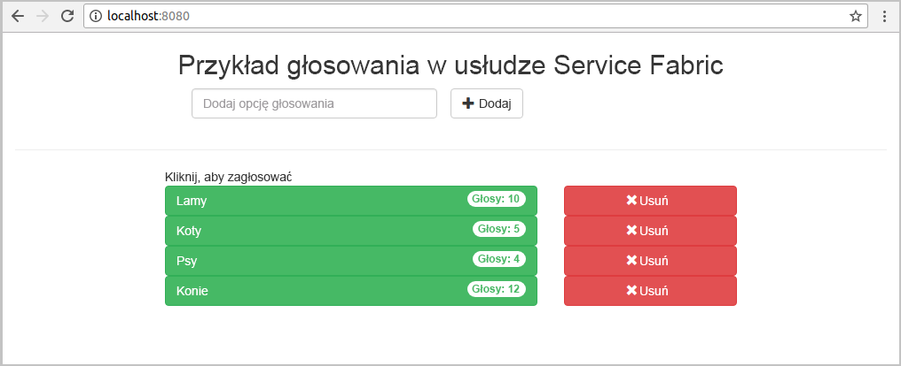
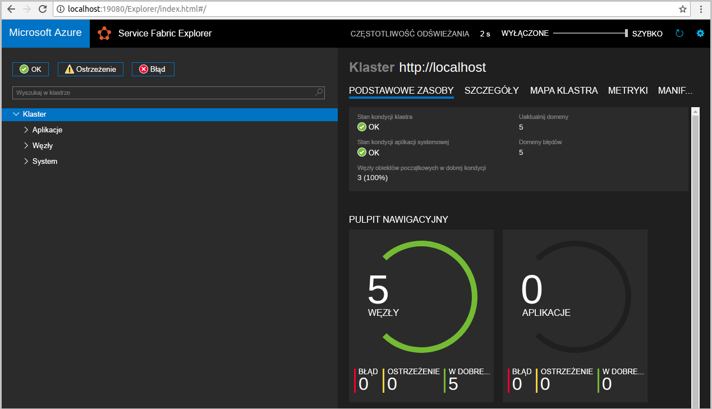
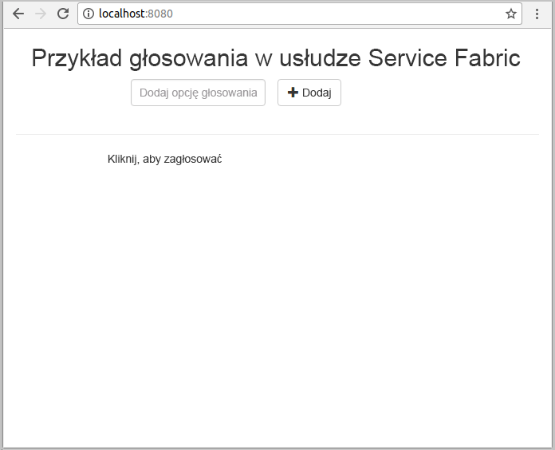
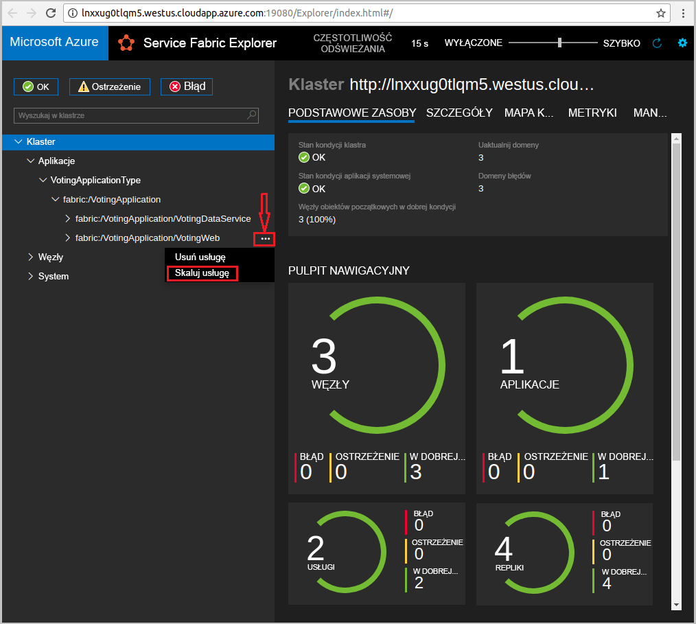
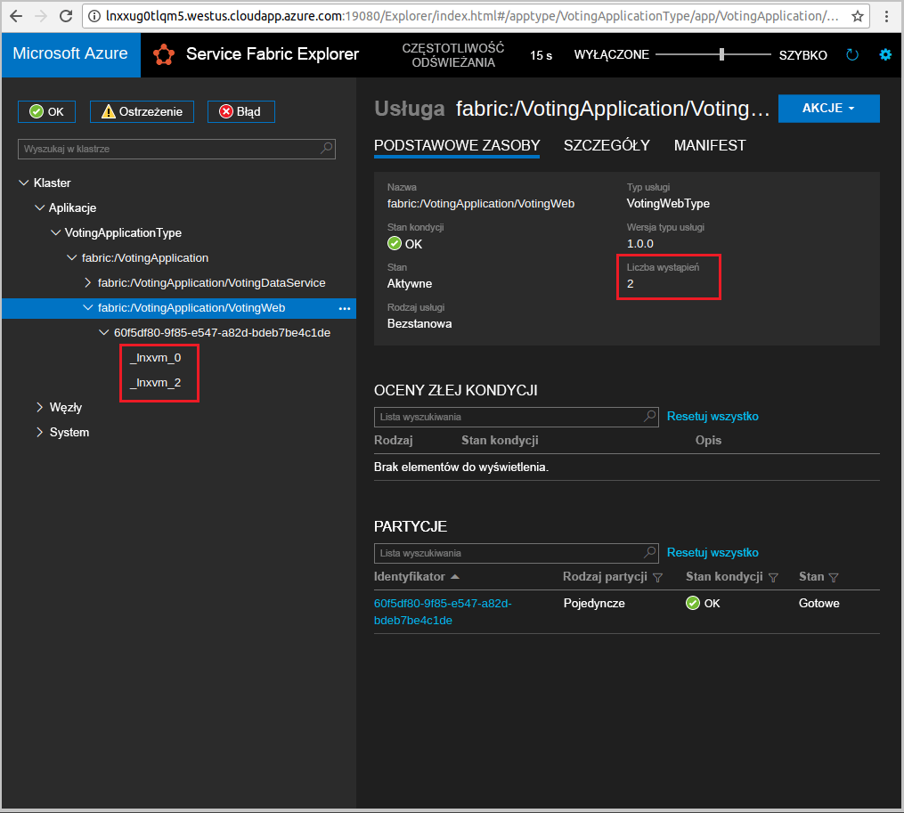

# <a name="create-a-java-application"></a>Tworzenie aplikacji Java
Usługa Azure Service Fabric to platforma systemów rozproszonych umożliwiająca wdrażanie mikrousług i kontenerów, a także zarządzanie nimi. 

W tym przewodniku Szybki start przedstawiono wdrażanie pierwszej aplikacji Java w usłudze Service Fabric za pomocą środowiska Eclipse IDE na komputerze programistycznym z systemem Linux. Po zakończeniu pracy będziesz mieć aplikację do głosowania z frontonem internetowym w języku Java, która zapisuje wyniki głosowania w stanowej usłudze zaplecza w klastrze.



W tym przewodniku Szybki start zawarto informacje na temat wykonywania następujących czynności:

> [!div class="checklist"]
> * Używanie programu Eclipse jako narzędzia dla aplikacji Java usługi Service Fabric
> * Wdrażanie aplikacji w klastrze lokalnym 
> * Wdrażanie aplikacji w klastrze na platformie Azure
> * Skalowanie aplikacji w poziomie na wiele węzłów

## <a name="prerequisites"></a>Wymagania wstępne
Aby ukończyć ten przewodnik Szybki Start:
1. [Zainstaluj zestaw SDK usługi Service Fabric i interfejs wiersza polecenia (CLI) usługi Service Fabric](https://docs.microsoft.com/en-us/azure/service-fabric/service-fabric-get-started-linux#installation-methods)
2. [Zainstaluj oprogramowanie Git](https://git-scm.com/)
3. [Zainstaluj program Eclipse](https://www.eclipse.org/downloads/)
4. [Skonfiguruj środowisko Java](https://docs.microsoft.com/en-us/azure/service-fabric/service-fabric-get-started-linux#set-up-java-development) i wykonaj opcjonalne kroki instalowania wtyczki programu Eclipse 

## <a name="download-the-sample"></a>Pobierz przykład
W oknie polecenia uruchom następujące polecenie, aby sklonować przykładowe repozytorium aplikacji na komputer lokalny.
```
git clone https://github.com/Azure-Samples/service-fabric-java-quickstart.git
```

## <a name="run-the-application-locally"></a>Uruchamianie aplikacji lokalnie
1. Uruchom klaster lokalny, uruchamiając następujące polecenie:

    ```bash
    sudo /opt/microsoft/sdk/servicefabric/common/clustersetup/devclustersetup.sh
    ```
    Uruchamianie klastra lokalnego zajmuje nieco czasu. Aby potwierdzić, że klaster jest w pełni uruchomiony, otwórz narzędzie Service Fabric Explorer dostępne pod adresem **http://localhost:19080**. Pięć węzłów w dobrej kondycji oznacza, że klaster lokalny jest uruchomiony. 
    
    

2. Otwórz program Eclipse.
3. Kliknij pozycję Plik -> Otwórz projekty z systemu plików. 
4. Kliknij pozycję Katalog i wybierz katalog `Voting` z folderu `service-fabric-java-quickstart` sklonowanego z usługi GitHub. Kliknij przycisk Zakończ. 

    
    
5. Teraz projekt `Voting` będzie dostępny w widoku Eksplorator pakietów programu Eclipse. 
6. Kliknij projekt prawym przyciskiem myszy i wybierz polecenie **Publikuj aplikację** z menu rozwijanego **Service Fabric**. Jako profil docelowy wybierz wartość **PublishProfiles/Local.json** i kliknij polecenie Publikuj. 

    
    
7. Uruchom przeglądarkę internetową i uzyskaj dostęp do aplikacji, przechodząc do adresu **http://localhost:8080**. 

    
    
Teraz możesz dodać zestaw opcji głosowania i rozpocząć obsługę głosów. Aplikacja zostanie uruchomiona i będzie zapisywać wszystkie dane w klastrze usługi Service Fabric bez konieczności używania oddzielnej bazy danych.

## <a name="deploy-the-application-to-azure"></a>Wdrażanie aplikacji na platformie Azure

### <a name="set-up-your-azure-service-fabric-cluster"></a>Konfigurowanie klastra usługi Azure Service Fabric
Aby wdrożyć aplikację w klastrze na platformie Azure, utwórz własny klaster lub użyj klastra testowego.

Klastry testowe to bezpłatne, działające przez ograniczony czas klastry usługi Service Fabric hostowane na platformie Azure. Są one obsługiwane przez zespół usługi Service Fabric. Każdy może wdrażać w nich aplikacje i poznawać szczegółowo platformę. Aby uzyskać dostęp do klastra testowego, [postępuj zgodnie z instrukcjami](http://aka.ms/tryservicefabric). 

Aby uzyskać informacje na temat tworzenia własnego klastra, zobacz [Tworzenie klastra usługi Service Fabric na platformie Azure](service-fabric-tutorial-create-vnet-and-linux-cluster.md).

> [!Note]
> Usługa frontonu internetowego została skonfigurowana do nasłuchiwania ruchu przychodzącego na porcie 8080. Upewnij się, że port w klastrze został otwarty. Jeśli używasz klastra testowego, ten port jest otwarty.
>

### <a name="deploy-the-application-using-eclipse"></a>Wdrażanie aplikacji przy użyciu programu Eclipse
Kiedy aplikacja i klaster są gotowe, możesz wdrożyć aplikację w klastrze bezpośrednio z programu Eclipse.

1. Otwórz plik **Cloud.json** w katalogu **PublishProfiles** i wypełnij odpowiednio pola `ConnectionIPOrURL` i `ConnectionPort`. Dostępny jest przykład: 

    ```bash
    {
         "ClusterConnectionParameters": 
         {
            "ConnectionIPOrURL": "lnxxug0tlqm5.westus.cloudapp.azure.com",
            "ConnectionPort": "19080",
            "ClientKey": "",
            "ClientCert": ""
         }
    }
    ```

2. Kliknij projekt prawym przyciskiem myszy i wybierz polecenie **Publikuj aplikację** z menu rozwijanego **Service Fabric**. Jako profil docelowy wybierz wartość **PublishProfiles/Cloud.json** i kliknij polecenie Publikuj. 

    

3. Uruchom przeglądarkę internetową i uzyskaj dostęp do aplikacji, przechodząc do adresu **http://\<URL_lub_IP_połączenia>:8080**. 

    
    
## <a name="scale-applications-and-services-in-a-cluster"></a>Skalowanie aplikacji i usług w klastrze
Usługi można skalować na klaster w celu dostosowania ich do zmiany obciążenia. Skalowanie usługi odbywa się przez zmienianie liczby wystąpień uruchomionych w klastrze. Istnieje wiele sposobów skalowania usług. Można użyć skryptów lub poleceń interfejsu wiersza polecenia usługi Service Fabric (sfctl). W tym przykładzie używamy narzędzia Service Fabric Explorer.

Narzędzie Service Fabric Explorer działa we wszystkich klastrach usługi Service Fabric i można uzyskać do niego dostęp z przeglądarki, przechodząc do portu HTTP zarządzania klastrami (19080), na przykład `http://lnxxug0tlqm5.westus.cloudapp.azure.com:19080`.

Aby skalować usługę internetową frontonu, wykonaj następujące czynności:

1. Otwórz narzędzie Service Fabric Explorer w klastrze — na przykład `http://lnxxug0tlqm5.westus.cloudapp.azure.com:19080`.
2. Kliknij wielokropek (trzy kropki) obok węzła **fabric:/Voting/VotingWeb** w widoku drzewa i wybierz pozycję **Skaluj usługę**.

    

    Teraz możesz skalować liczbę wystąpień usługi internetowej frontonu.

3. Zmień liczbę na **2** i kliknij pozycję **Skaluj usługę**.
4. Kliknij węzeł **fabric:/Voting/VotingWeb** w widoku drzewa i rozwiń węzeł partycji (reprezentowany przez identyfikator GUID).

    

    Teraz widać, że usługa ma dwa wystąpienia, a w widoku drzewa można dostrzec węzły, w których są one uruchomione.

Wykonując to proste zadanie zarządzania, podwoiliśmy zasoby dostępne dla naszej usługi frontonu w celu przetworzenia obciążenia użytkownika. Ważne jest, aby zrozumieć, że nie musisz mieć wielu wystąpień usługi, aby działała ona niezawodnie. W przypadku niepowodzenia usługi usługa Service Fabric zapewnia, że nowe wystąpienie usługi jest uruchamiane w klastrze.

## <a name="next-steps"></a>Następne kroki
W tym przewodniku Szybki start zawarto informacje na temat wykonywania następujących czynności:

> [!div class="checklist"]
> * Używanie programu Eclipse jako narzędzia dla aplikacji Java usługi Service Fabric
> * Wdrażanie aplikacji Java w klastrze lokalnym 
> * Wdrażanie aplikacji Java w klastrze na platformie Azure
> * Skalowanie aplikacji w poziomie na wiele węzłów

* Dowiedz się więcej o [debugowaniu usług w języku Java za pomocą programu Eclipse](service-fabric-debugging-your-application-java.md)
* Dowiedz się o [konfigurowaniu ciągłej integracji i ciągłego wdrażania za pomocą usługi Jenkins](service-fabric-cicd-your-linux-applications-with-jenkins.md)
* Zapoznaj się z innymi [przykładami w języku Java](https://github.com/Azure-Samples/service-fabric-java-getting-started)