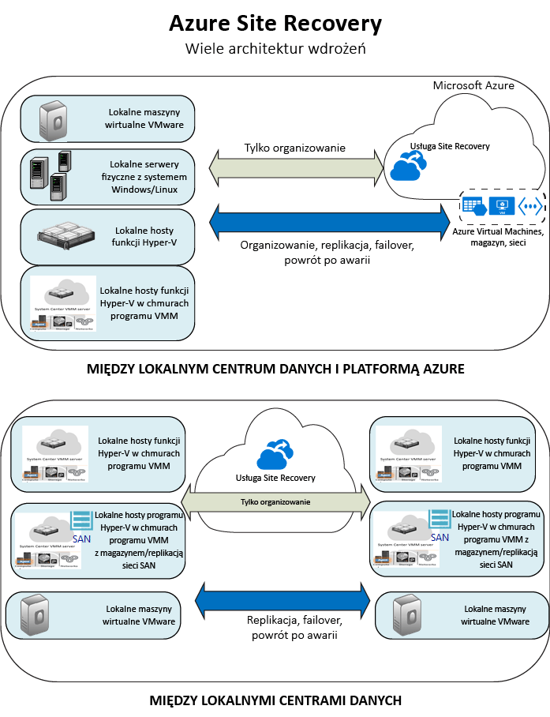

<properties
    pageTitle="Co to jest usługa Site Recovery? | Microsoft Azure" 
    description="Zawiera omówienie usługi Azure Site Recovery i wyjaśnia sposób wdrażania usługi." 
    services="site-recovery" 
    documentationCenter="" 
    authors="rayne-wiselman" 
    manager="jwhit" 
    editor=""/>

<tags 
    ms.service="site-recovery" 
    ms.devlang="na"
    ms.topic="get-started-article"
    ms.tgt_pltfrm="na"
    ms.workload="storage-backup-recovery" 
    ms.date="10/05/2016"
    ms.author="raynew"/>

#  Co to jest usługa Site Recovery?

Azure Site Recovery — Zapraszamy! Rozpocznij od tego artykułu, aby uzyskać szybkie omówienie usługi Site Recovery oraz sposobu, w jaki usługa może wnieść wkład w Twoją strategię dotyczącą ciągłości biznesowej i odzyskiwania po awarii (BCDR).

## Omówienie

Organizacje wymagają strategii BCDR, która określa, w jaki sposób aplikacje, obciążenia i dane pozostają uruchomione i dostępne podczas planowanych lub nieplanowanych przerw w pracy oraz są przywracane do normalnych warunków roboczych z możliwie dużą prędkością. Strategia BCDR powinna utrzymywać dane firmowe z zachowaniem bezpieczeństwa i umożliwiać ich odzyskiwanie, a także zapewniać, że obciążenia pozostają stale dostępne w przypadku awarii. 

Usługa Site Recovery jest usługą platformy Azure, która wspiera strategię BCDR przez organizowanie replikacji lokalnych serwerów fizycznych i maszyn wirtualnych do chmury (Azure) lub dodatkowego centrum danych. W przypadku wystąpienia awarii w lokalizacji głównej następuje przełączenie w trybie failover do lokalizacji dodatkowej, dzięki czemu aplikacje i obciążenia są nadal dostępne. Powrót po awarii może mieć miejsce do lokalizacji głównej, gdy powróci ona do normalnego działania. Dowiedz się więcej w temacie [Co to jest usługa Site Recovery?](site-recovery-overview.md)

## Usługa Site Recovery w portalu Azure

Platforma Azure ma dwa różne [modele wdrażania](../resource-manager-deployment-model.md) związane z tworzeniem zasobów i pracą z nimi: Azure Resource Manager i klasyczny model zarządzania usługami. Platforma Azure ma dwa portale — [klasyczny portal Azure](https://manage.windowsazure.com/), który obsługuje klasyczny model wdrażania, oraz [portal Azure](https://portal.azure.com), który obsługuje oba modele wdrażania.

Usługa Site Recovery jest dostępna zarówno w portalu klasycznym, jak i w portalu Azure. W klasycznym portalu Azure możesz korzystać z usługi Site Recovery przy użyciu klasycznego modelu zarządzania usługami. W portalu Azure możesz korzystać z wdrożeń opartych na modelu klasycznym lub na usłudze Resource Manager. [Dowiedz się więcej](site-recovery-overview.md#site-recovery-in-the-azure-portal) o wdrażaniu przy użyciu portalu Azure.

Informacje przedstawione w tym artykule dotyczą wdrożeń klasycznych i przy użyciu portalu Azure. Różnice są odnotowane wedle potrzeby.

## Dlaczego warto używać usługi Site Recovery? 

Oto, co usługa Site Recovery może zrobić dla Twojej firmy:

- **Uproszczenie strategii BCDR** — usługa Site Recovery ułatwia obsługę replikacji, trybu failover i odzyskiwania wielu firmowych obciążeń i aplikacji z jednej lokalizacji. Usługa Site Recovery organizuje replikację i tryb failover, ale nie przechwytuje danych aplikacji ani nie zbiera żadnych informacji ich dotyczących.
- **Zapewnianie elastycznej replikacji** — przy użyciu usługi Site Recovery możesz replikować obciążenia uruchomione na maszynach wirtualnych funkcji Hyper-V, maszynach wirtualnych VMware oraz serwerach fizycznych systemu Windows/Linux. 
- **Łatwe przechodzenie do trybu failover i odzyskiwanie** — usługa Site Recovery umożliwia skorzystanie z testowych trybów failover, które wspierają testowanie odzyskiwania po awarii bez wywierania wpływu na środowiska produkcyjne. Możesz również uruchomić planowane tryby failover (brak utraty danych) w przypadku przewidywanych przerw w działaniu lub nieplanowane tryby failover (minimalna utrata danych, zależna od częstotliwości replikacji) w przypadku nieoczekiwanych awarii. Po przejściu w tryb failover możesz powrócić do lokacji głównych po awarii. Usługa Site Recovery zapewnia plany odzyskiwania, które mogą uwzględniać skrypty i skoroszyty automatyzacji platformy Azure. Dzięki nim możesz dostosować tryb failover i odzyskiwanie dla aplikacji wielowarstwowych. 
- **Wyeliminowanie dodatkowego centrum danych** — możesz przeprowadzać replikację do dodatkowej lokacji lokalnej lub do platformy Azure. Użycie platformy Azure jako miejsca docelowego dla odzyskiwania po awarii eliminuje koszty i złożone operacje związane z utrzymywaniem lokacji dodatkowej oraz umożliwia przechowywanie replikowanych danych w usłudze Azure Storage, ze wszystkimi opcjami zapewniającymi odporność.
- **Integracja z istniejącymi technologiami BCDR** — usługa Site Recovery współpracuje z innymi funkcjami BCDR aplikacji. Przykładowo możesz użyć usługi Site Recovery, aby ochronić zaplecze programu SQL Server obciążeń firmowych. Usługa obejmuje natywne wsparcie dla funkcji AlwaysOn programu SQL Server, umożliwiając zarządzanie trybem failover dla grup dostępności. 

## Co mogę replikować?

Poniżej przedstawiono podsumowanie elementów, które można replikować przy użyciu usługi Site Recovery.

**REPLIKACJA** | **REPLIKACJA Z (LOKALNIE)** | **REPLIKACJA DO** | **ARTYKUŁ**
---|---|---|---
Maszyny wirtualne VMware | Serwer VMware | Azure | [Dowiedz się więcej](site-recovery-vmware-to-azure-classic.md)
Maszyny wirtualne VMware | Serwer VMware | Lokacja dodatkowa VMware | [Dowiedz się więcej](site-recovery-vmware-to-vmware.md) 
Maszyny wirtualne funkcji Hyper-V | Host funkcji Hyper-V w chmurze VMM | Azure | [Dowiedz się więcej](site-recovery-vmm-to-azure.md) 
Maszyny wirtualne funkcji Hyper-V | Host funkcji Hyper-V w chmurze VMM | Lokacja dodatkowa programu VMM | [Dowiedz się więcej](site-recovery-vmm-to-vmm.md)
Maszyny wirtualne funkcji Hyper-V | Host funkcji Hyper-V w chmurze VMM z magazynem sieci SAN| Lokacja dodatkowa programu VMM z magazynem sieci SAN | [Dowiedz się więcej](site-recovery-vmm-san.md)
Maszyny wirtualne funkcji Hyper-V | Host funkcji Hyper-V (nie VMM) | Azure | [Dowiedz się więcej](site-recovery-hyper-v-site-to-azure.md)
Serwery fizyczne z systemem Windows/Linux | Serwer fizyczny | Azure | [Dowiedz się więcej](site-recovery-vmware-to-azure-classic.md)
Obciążenia uruchomione na serwerach fizycznych systemu Windows/Linux | Serwer fizyczny | Dodatkowe centrum danych | [Dowiedz się więcej](site-recovery-vmware-to-vmware.md) 

## Jakie obciążenia mogę chronić?

Usługa Site Recovery może pomóc w stosowaniu strategii BCDR obejmującej aplikacje, dzięki czemu obciążenia i aplikacje będą nadal działać w spójny sposób w przypadku wystąpienia awarii. Usługa Site Recovery zapewnia: 

- **Migawki spójne z aplikacjami** — replikacja przy użyciu migawek spójnych z aplikacjami dla aplikacji jednej warstwy lub n-warstwowych.
- **Niemal synchroniczna replikacja** — częstotliwość replikacji nawet do 30 sekund w przypadku funkcji Hyper-V i replikacja ciągła w przypadku maszyn VMware.
- **Integracja z funkcją AlwaysOn programu SQL Server** — możesz zarządzać trybem failover grup dostępności w planach odzyskiwania usługi Site Recovery. 
- **Elastyczne plany odzyskiwania** — możesz tworzyć i dostosowywać plany odzyskiwania z wykorzystaniem zewnętrznych skryptów, akcji ręcznych i elementów runbook usługi Azure Automation, które umożliwiają odzyskanie całego stosu aplikacji za pomocą jednego kliknięcia.
- **Biblioteka automatyzacji** — bogata biblioteka automatyzacji zapewnia gotowe do produkcji skrypty dopasowane do danych aplikacji, które można pobrać i zintegrować z usługą Site Recovery.
- **Proste zarządzanie siecią** — zaawansowane zarządzanie siecią w usłudze Site Recovery i na platformie Azure upraszcza wymagania sieciowe aplikacji, w tym rezerwowanie adresów IP, konfigurowanie równoważenia obciążenia i integrowanie usługi Azure Traffic Manager w celu zapewniania efektywnych przełączeń sieci.

## Następne kroki

- Dowiedz się więcej w temacie [Jakie obciążenia może chronić usługa Site Recovery?](site-recovery-workload.md)
- Dowiedz się więcej o architekturze usługi Site Recovery w temacie [W jaki sposób działa usługa Site Recovery?](site-recovery-components.md)
 

<!--HONumber=Oct16_HO1-->

